# iOS 快照测试+黑暗模式支持

> 原文：<https://levelup.gitconnected.com/ios-snapshot-tests-dark-mode-support-30f70cdb4c9f>

照片由[威廉·胡克](https://unsplash.com/@williamtm?utm_source=unsplash&utm_medium=referral&utm_content=creditCopyText)在 [Unsplash](https://unsplash.com/s/photos/ios-app?utm_source=unsplash&utm_medium=referral&utm_content=creditCopyText) 上拍摄

为 UI 视图编写测试与单元测试和集成测试一样重要。这些测试不是强制性的，但是在开发 iOS 应用程序时很有帮助。今天我想和大家分享如何使用`[iOSSnapshotTestCase](https://github.com/uber/ios-snapshot-test-case)`框架添加快照测试，以及如何添加对黑暗模式的支持。

## **什么是快照测试？**

这种测试包括从您的视图中拍摄快照，并与我们项目中存储的参考图像进行比较。当然，为了有一个参考图像，我们首先需要捕捉这个图像。

快照测试应该仅用于验证视图，而不是逻辑(如下载数据、解析信息、日期格式等)。).如果我们需要验证这些东西，你可能需要单元测试。

正如我们将看到的，我们不需要每次都运行应用程序来验证 UI 是否正常。我们将使用快照测试快速获得视图反馈，而不是运行应用程序，导航到该视图并验证视图。

**启动前:**

因此，我们的屏幕需要显示:

*   带有“你好，世界！”的居中标签没有自定义样式的邮件。
*   相同的标签应该能够显示一个成功的消息与`green`字体颜色。
*   相同的标签应该能够显示一个错误信息与`red`字体颜色和文本样式`title1`。

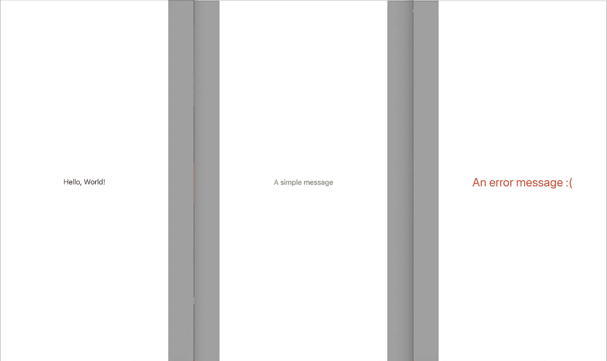

## 设置应用程序以使用 iOSSnapshotTestCase 框架

要将 iOSSnapshotTestCase 框架配置到您的应用程序中，您可以使用依赖管理器作为 [CocoaPods](https://cocoapods.org) 或 [Carthage](https://github.com/Carthage/Carthage) 。不幸的是 [Swift 包管理器](https://swift.org/package-manager/)仍然不被支持。在这种情况下，我们使用 Carthage 将框架添加到我们的应用程序中，但是您可以根据需要随意设置您的应用程序。

如果您想测试框架是如何工作的，您可以创建一个新项目，并确保选中了 *Include Tests* 。

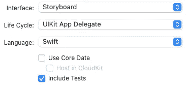

或者您可以从 Github 克隆启动项目:

 [## Alfredo Hernandez/iosnapshottestcasedemo

### 快照测试 iOS 初学者项目。通过创建一个…

github.com](https://github.com/AlfredoHernandez/iOSSnapshotTestCaseDemo/tree/starter) 

如果你想使用迦太基，你可以对`carthage`分支做一个 [*【结账】*](https://git-scm.com/docs/git-checkout) ，该分支包含一个`Cartfile`与被配置项目的依赖关系。然后运行`carthage update — use-xcframeworks`命令下载框架。

您需要将 xcframework 添加到项目中，转到项目中的`Frameworks, Libraries, and Embedded Content`并添加`FBSnapshotTestCase.xcframework`

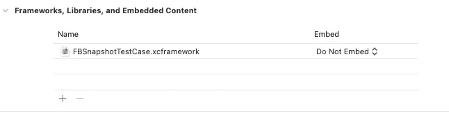

注意:选择“不嵌入”

通过运行应用程序和运行测试，确保一切都配置良好。

如果您正在**使用 GitHub 存储库**，您将看到一个失败的测试，这意味着一切正常。

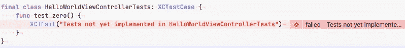

测试零

正如乔恩·里德在他的书《通过例子进行 iOS 单元测试》中所说:

> “测试零有助于将我们的问题分开，以便我们可以一次解决一个问题。当我们创建一个新的测试套件时，我们通常会考虑第一个测试。但是在我们忘记编写测试之前，让我们确保套件运行。否则，基本的基础设施问题会打断我们的思维。”

## 设置测试方案

我们将向我们的方案中添加两个 ENV 变量，因此转到您的方案>测试>参数并添加以下变量:

`FB_REFERENCE_IMAGE_DIR`带值`$(SOURCE_ROOT)/$(PROJECT_NAME)Tests/ReferenceImages`

`IMAGE_DIFF_DIR`带值`$(SOURCE_ROOT)/$(PROJECT_NAME)Tests/FailureDiffs`

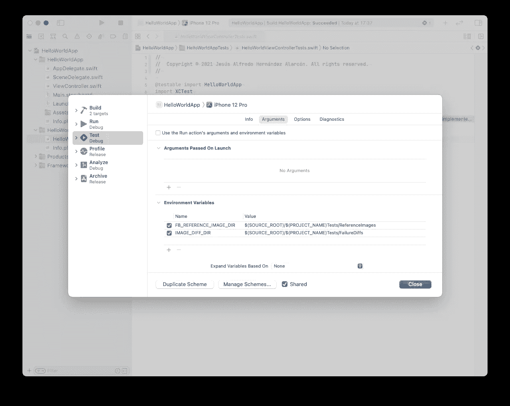

`expand variables based on`你的测试目标，就像这样:

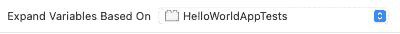

# 配置用户界面视图控制器并运行快照测试

是时候将 UI 元素添加到视图控制器中了，我们将在故事板的 UIViewController 中间添加一个 UI 标签。**请不要添加约束条件。**

然后在您的测试中，导入`FBSnapshotTestCase`并子类化`FBSnapshotTestCase`而不是`XCTestCase`

编写以下测试:

选择您喜欢的苹果手机型号并运行测试。您会看到一个失败的测试(无法加载参考图像)，因为我们还没有参考图像。

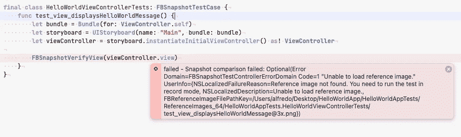

测试失败:无法加载参考图像

在加载包之前添加`recordMode = **true**` 并再次运行测试。您将(再次)看到一个失败的测试，但是这次我们有一个`Test ran in record mode. Reference image is now saved.`错误消息。

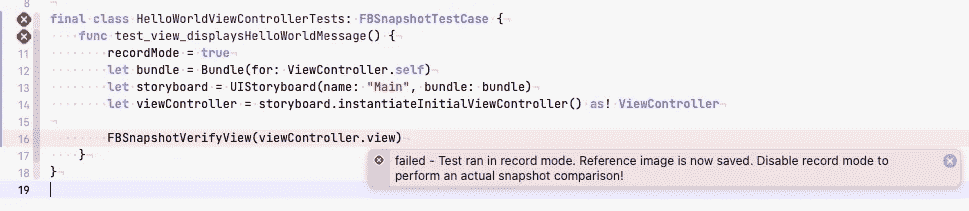

如果你查看你的项目文件夹，你会发现一个名为`ReferenceImages_64`的文件夹，里面有拍摄的快照。

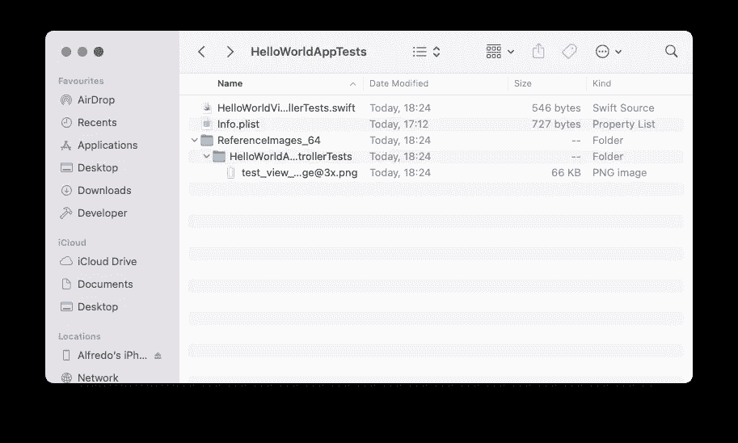

现在删除`recordMode = **true**` 行，再次运行测试。瞧，我们通过了测试。但是等等，如果你仔细看这张快照，我们会发现它不在中间。我们需要解决这个问题。

转到您的故事板，并在屏幕中央添加约束，如下所示:

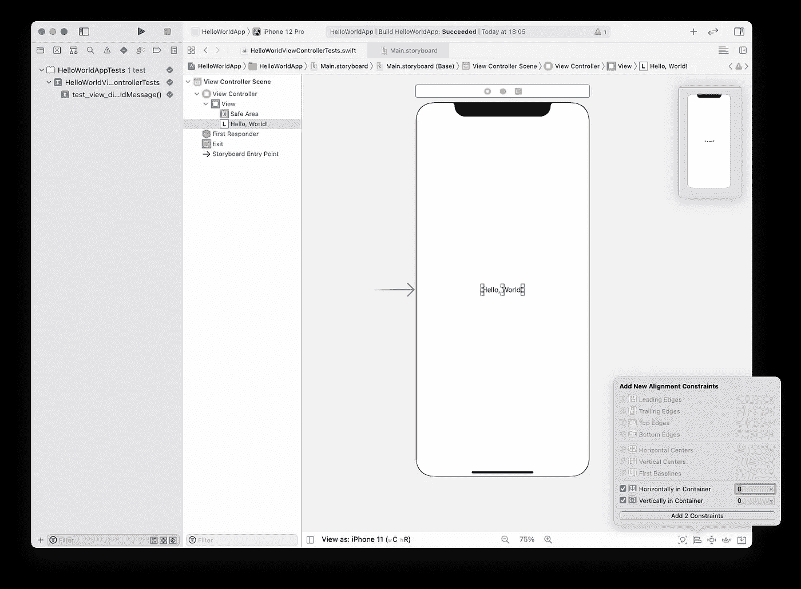

向标签添加约束

回到您的快照测试，并再次运行它们。我们的测试失败了。

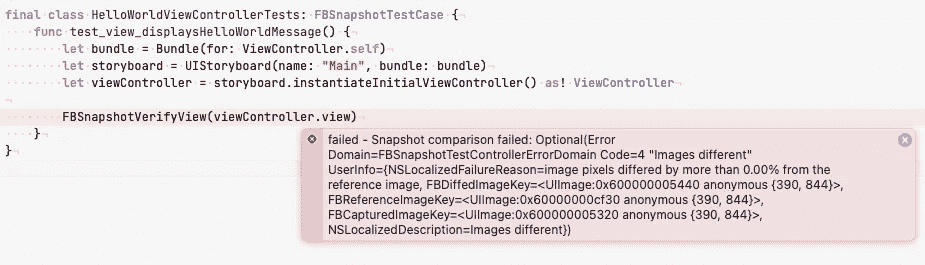

如你所见，这次我们有一条`“Images different"`消息，意思是“我们的观点被修改了”。如果你在你的项目文件中看到，我们有一个名为`FailureDiffs`的新文件夹，里面有三张不同的图片。

*   **参考**图像，即我们之前记录的图像
*   **失败的**图像，显示更改后视图控制器的样子
*   **差异**图像显示参考图像和故障图像之间的差异

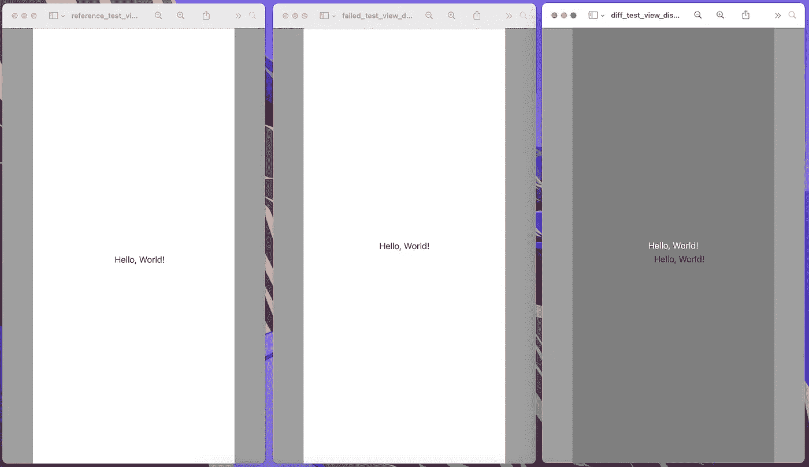

FailureDiffs 目录中的图像

这一次，失败的图像看起来比参考图像更好，以`Hello, World!`消息为中心。因此，再次记录，以存储此图像，并运行您的测试，使其处于绿色状态。

# 添加更多测试并重构测试代码

想象一下，在点击一个按钮或得到服务的响应后，如果出现错误，我们需要将消息更改为成功或失败消息。我们可以使用快照测试来测试这种行为。

记住**这只是针对视图**，逻辑需要通过使用单元或集成测试来测试驱动。

所以让我们写一个测试:

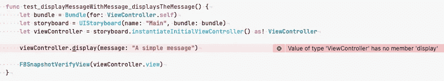

当然我们需要在视图控制器中添加一个显示方法来运行测试，所以请添加它。

在测试中添加记录模式，并运行它来存储图像。如果我们看到的图像，我们发现这是完全相同的最后一个。当然，这不是我们想要的(我们需要一个绿色的消息标签)。因此，让我们在视图控制器内部工作。

*   将您的 UILabel 从故事板连接到视图控制器
*   在显示方法中，通过`.systemGreen`设置接收的信息并改变颜色
*   运行测试以记录快照

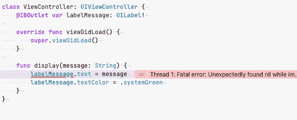

致命错误

显示了一个致命的错误，这是因为当加载视图时，我们需要从视图控制器调用中调用方法，如 viewDidLoad、viewWillAppear 等来配置视图。为此，我们不调用每个方法，而是调用`.loadViewIfNeeded()`。

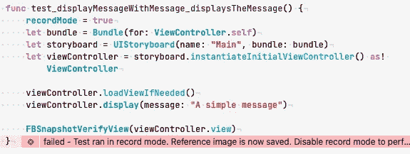

再次运行测试，并验证您的视图是否如您所愿地良好显示。

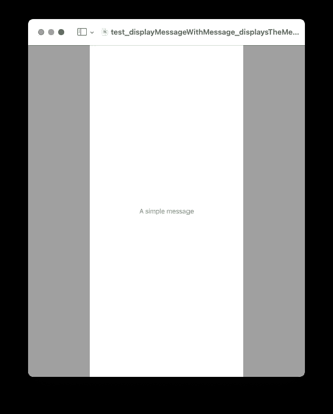

请添加另一个测试来显示带有`.systemRed`颜色和字体大小`.title1`的错误消息，并保存快照。您的快照应该是这样的:

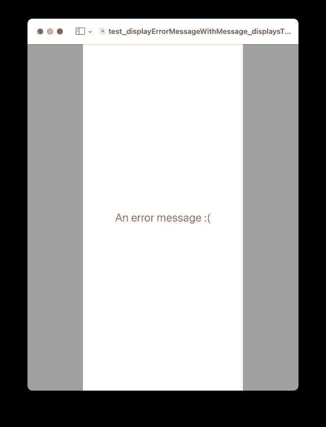

您的测试套件:

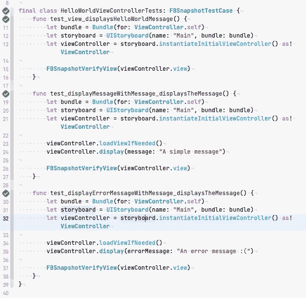

快照测试套件

正如你在我们的测试套件中看到的，我们有可以重构的重复代码。我们可以将 SUT ( *测试下的系统*)创建转移到一个助手方法中，就像这样:

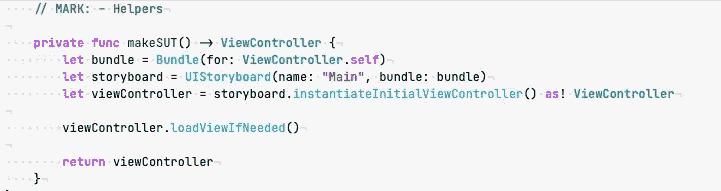

现在我们可以在测试中使用它。通过这样做，我们使我们的测试更加清晰易读。我们还可以看到，我们有三个共同的阶段: **A** rrange、 **A** ct 和 **A** ssert (AAA ),由 Jon Reid 推荐的空行分隔(Jon Reid。“iOS 单元测试示例”)。

现在我们的测试看起来像这样:

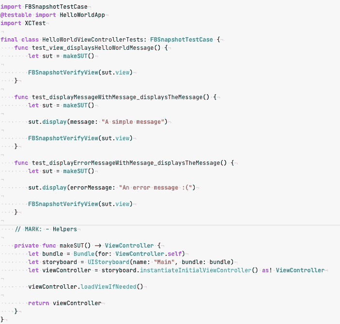

因为你开始在你的代码中添加测试，所以建议保持代码的整洁、简单、易读、有组织以及所有你认为对你的代码有益的东西。

> “测试代码和生产代码一样重要”来自:Jon Reid。“iOS 单元测试示例”。

## 我们可以做得更多

我们可以创建两个助手来简化这项任务，而不是在每次需要更新或记录新的快照时添加记录模式标志来捕获快照。`record()`和`assert()`方法。

为什么不创建一个`SnaphshotTestCase`类来添加这两个助手，而不是子类`FBSnapshotTestCase`呢？我们开始吧。请添加一个名为`SnaphshotTestCase.`的新文件，确保它是在我们的测试目标中创建的，并添加以下代码。

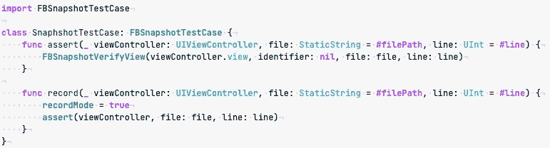

快照测试用例自定义类

现在，在我们的主测试套件中，从`SnapshotTestCase`派生出子类，并用我们定制的`assert()`方法替换`FBSnapshotVerifyView`方法。

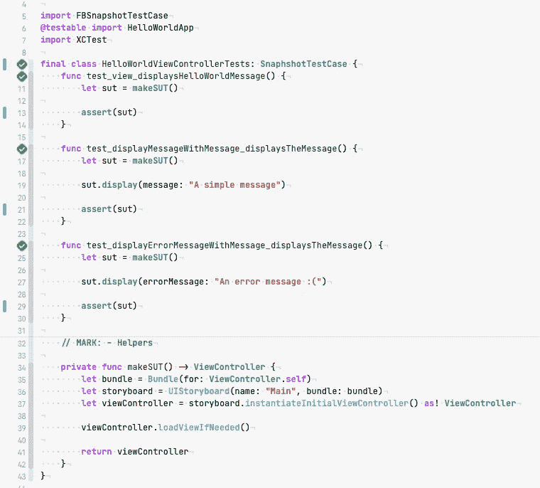

**再次运行你的测试来验证一切正常。如果您需要记录新的快照，只需用`record`替换`assert`，神奇的事情就会发生。**

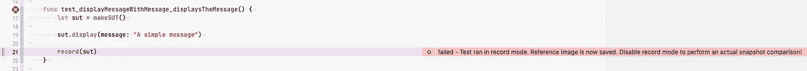

# 通过快照测试增加黑暗模式支持

在 iOS 13.0 和更高版本中，人们可以选择采用一种黑暗的全系统外观，称为黑暗模式。到目前为止，我们只有快照测试来支持光模式，但暗模式呢？让我们添加一些测试代码，使用快照测试开始支持黑暗模式。

要添加黑暗模式支持，我们需要覆盖用户界面风格。所以在我们的帮助器方法中，覆盖用户界面样式:

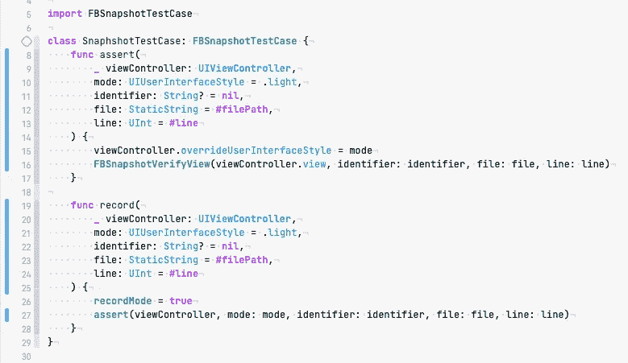

但是这还不够，在我们的测试套件中，我们需要为我们的视图控制器添加一个 UIWindow，并再次记录快照。

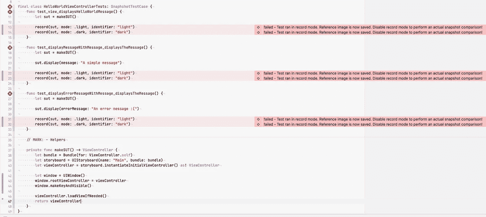

我们为助手添加了两个参数，`mode`指定使用哪种用户风格(亮/暗),而`identifier`为快照名称添加后缀并标识屏幕版本。

从我们的快照文件中，删除旧的快照(没有后缀)并再次运行测试，从`record`更改为`assert`

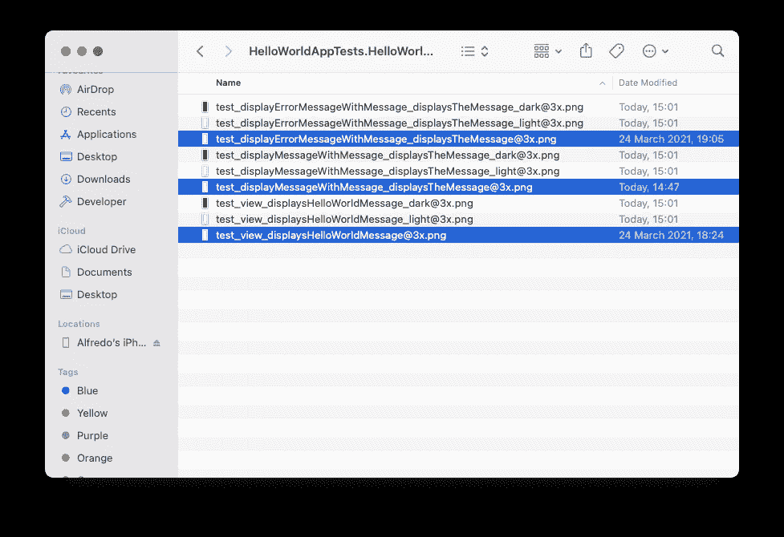

必须删除选定的图像

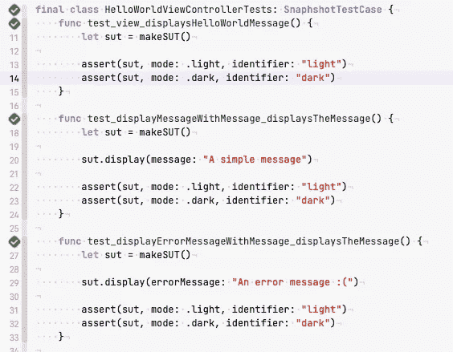

通过测试

看看你新录制的快照，你会发现你的屏幕上有明有暗的变化。

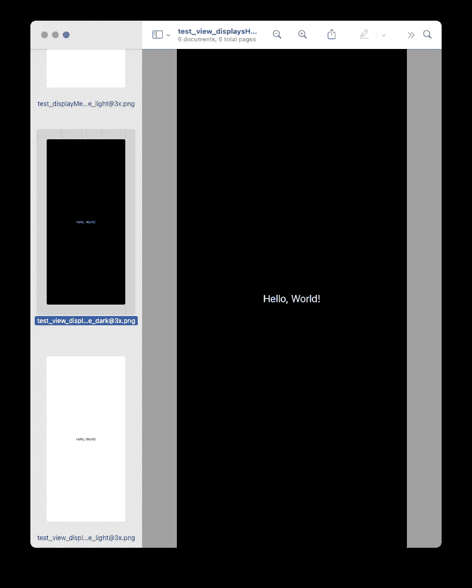

亮暗模式的预览

您可以在此处找到该项目的差异:

 [## 迦太基决赛由 AlfredoHernandez 拉动请求# 1 Alfredo Hernandez/iosnapshottestcasedemo

### 将此建议添加到可以作为单次提交应用的批处理中。此建议无效，因为没有更改…

github.com](https://github.com/AlfredoHernandez/iOSSnapshotTestCaseDemo/pull/1) 

请随意定制您的助手并改进代码。

## 关键注意事项:

1.  使用相同的 iOS 模拟器记录和断言快照，否则测试将失败。
2.  快照名称与相同的测试方法名称存储在一起(加上一个标识符，如果我们添加的话)。
3.  不要忘记在 git 存储库中添加/删除所需的记录快照。
4.  让你的测试代码像你的产品代码一样简洁明了。