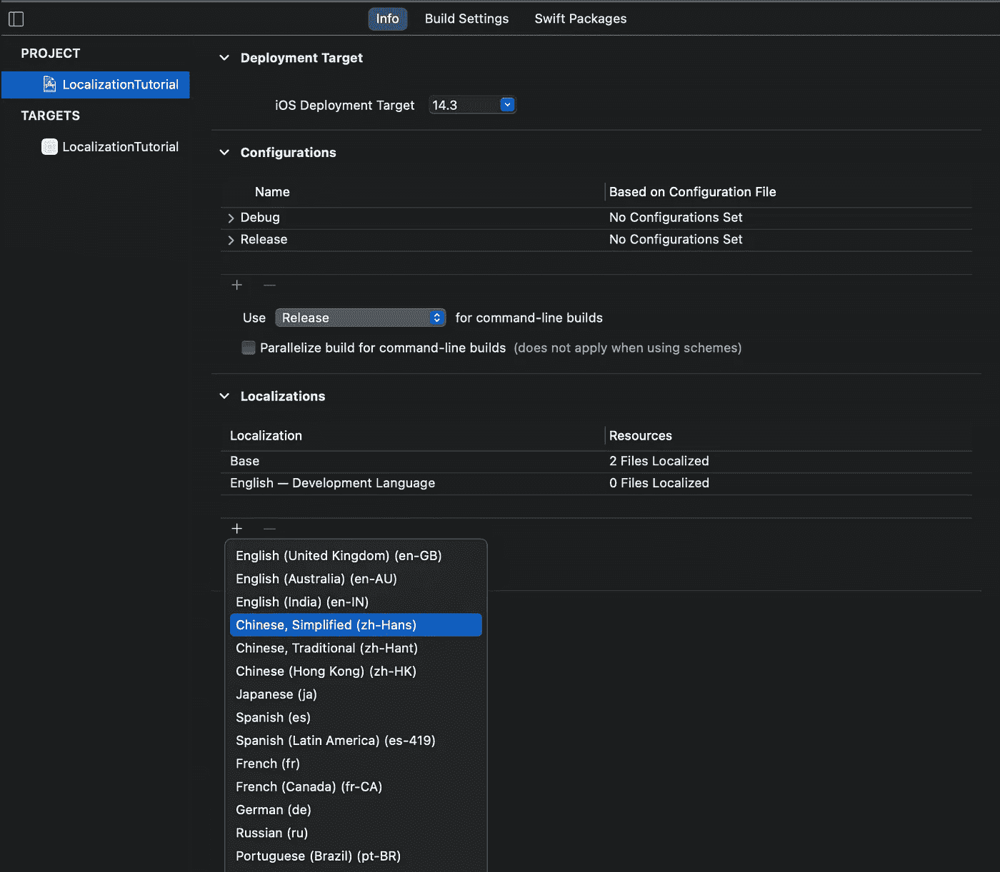
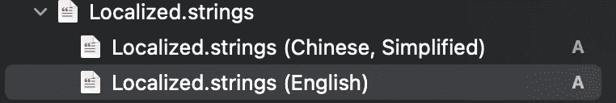
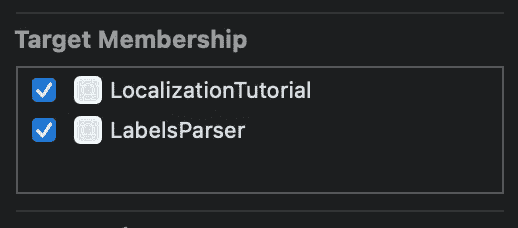

# 使用 Firebase 进行 iOS 内容本地化和版本控制

> 原文：<https://levelup.gitconnected.com/ios-strings-localization-and-versioning-with-firebase-be5c67087ddd>

Firebase 已经成为任何 iOS 开发者添加到项目中的第一个工具。虽然`Analysts`、`Crashlytics`和`Performance`通常是开箱即用的，但有一种工具会引发更多的问题。是`Firebase Database`。

它是如何处理 app 本地化的？

在生产中如何配置？

如何设置合适的环境和版本？

如何使这种集成变得平滑、可维护和可测试？

我们将在应用程序`strings`的背景下讨论这个问题，并简要回顾处理`strings`的不同方法。从没有本地化的最简单设置到具有版本控制的远程本地化数据库环境。

# 第一部分。你有标签文件吗？

从事任何一个 iOS 项目，你迟早都要决定如何组织和存储所有标签、按钮和文本字段的字符串值。现在没有人(希望)直接硬编码字符串:

别告诉我你的项目里还有这个

很可能您的项目中有一个文件`Labels.swift`,它使您的字符串保持结构化并易于访问:

它可以进化成更有组织性的东西:

> 你注意到我们是如何把 Struct 改成 Enum 的了吗？它更有意义，因为我们使用静态属性，我们不想通过提供一种方法来创建一个无用的`Labels`实例来误导我们自己或其他工程师。

现在，您可以像下面这样简单地分配字符串值

这个设置将完成这项工作，并且很有可能您不需要任何其他东西。

然而，有一天你可能会决定支持另一种语言。所以说本地化吧。

# 第二部分。本地化

向项目中添加本地化非常简单。进入**项目- >信息- >本地化- >加号按钮**，选择所需语言:

添加本地化

现在您需要添加一个`Localized.strings`文件，它将保存所有支持语言的字符串:转到**文件- >新建- >文件**，选择**字符串文件**，并将其命名为`Localizable.strings`:

添加本地化字符串

最后，在项目导航器中选择`Localized.strings`文件，在文件检查器中点击`Localize`，并选择语言:

本地化字符串

现在，对于您支持的每种语言，您都应该有这样一个文件:

问题是它如何与我们的标签一起工作？好吧，这就是事情可能会变得一团糟的时候。

首先，您需要将所有支持语言的所有字符串添加到`Localizable.strings`:

Localizable.strings(英语)

现在我们需要使用`Labels`中的本地化字符串:

> `Localized.strings`中的键应该与`NSLocalizedString`中的键匹配。实际的字符串值将根据当前语言从 `Localized.strings`中获取。

如果你给一个字符串添加一个`NSLocalizedString`，我会变得更加易读:

同样，根据项目的复杂性和您当前的目标，这种配置可能是您在应用程序中处理复制和本地化所需的全部。

但是让我们回顾一下这个解决方案，看看这里可能会出现什么问题。

*   我们需要仔细匹配`Localized.strings`和`Labels.swift`之间的按键。如果密钥错误，或者您忘记在`Localized.strings`中提供值，用户将看到密钥本身，而不是实际的本地化值
*   `Localized.strings`容易畸形。如果您有一个很大的`Localized.strings` 文件，并且其中一行末尾缺少了分号——祝您找到正确的位置来修复它。Xcode 对此没有给出任何线索:

某处缺少分号

*   `Localized.strings`是一个纯文本文件，没有办法让它结构化。一旦达到几百行，就变得几乎不可维护了。是的，您可以使用外部工具自动生成它，但是键匹配仍然是一项繁琐且容易出错的工作。
*   更重要的是，有一天你可能想更新一些字符串。比方说，你想把“欢迎使用我的酷 App”改成“早上好！”。使用当前的方法，您需要更新所有`Localized.strings`文件中的值，并发布您的应用程序的新版本。对于简单的字符串更新来说，这听起来不太合适，不是吗？

如果你有上面列出的任何一个问题，是时候使用远程标签了！

# 第三部分。远程标签

我们将使用 Firebase 数据库作为后端，为您的应用程序提供标签。这将消除上面的大部分问题:您不再需要支持客户端上的多种语言，也不需要维护`Localized.strings` *中的键匹配。*最棒的是，你只需点击几下就可以更新标签，而无需发布新的应用版本。然而，它仍然有一些缺点:

*   本地化没有去任何地方，它只是移动到 Firebase。所以我们需要适当的维护它
*   配置应用程序以读取每个区域的正确标签
*   维护 Firebase 上的数据库版本

让我们深入研究一下，看看如何使它工作。

## 什么是 Firebase 数据库，它是如何工作的

我们不会讨论如何将 Firebase 依赖项添加到您的项目中，也不会进行基本的设置。Firebase 为此提供了[良好的分步说明](https://firebase.google.com/docs/ios/setup?authuser=0)。让我们直接跳到 Firebase 数据库，并开始为我们的项目实现它。

Firebase 数据库是一个云托管的 noSQL 数据库。它以普通的 JSON 格式保存数据，Firebase 提供一个 API 以 JSON 格式获取数据:

> 别忘了导入`*FirebaseDatabase*`。

如果您想订阅实时更新，也可以使用`DatabaseReference.observe`方法，但我们不需要这样做。我们想在应用程序启动后下载标签，而`observeSingleEvent`会完成这项工作。如果您在应用中使用任何 web 服务，您应该已经熟悉 JSON 格式。Swift 提供了一种简单的方法，通过`Decodable`协议将 JSON 解析到您的 Swift 模型。

在使用 Firebase 从 JSON 中获取标签并解码之前，我们需要做一些更新:

> 标签将是一个符合`Decodable`协议的结构，而不是保存实际值。注意，它不再是一个枚举，因为我们必须使用 Labels 的实例来访问它的内容。出于同样的原因，我们不再使用`static let`。

综上所述，我们有了一种从 FirebaseDatabase 获取和解码标签的方法:

让我们打开 FirebaseDatabase 并创建我们可以使用的标签 JSON:

简单标签示例

这是以下 JSON 的 Firebase 可视化表示:

如果您运行此代码，您将成功加载标签。恭喜你，你有了简单的远程存储标签！

但是等等，本地化、版本化、生产和开发数据库，以及我们之前讨论过的所有额外津贴呢？

## Firebase 数据库路径

FirebaseDatabase 提供了一个孩子的概念，允许只获取数据库的某一部分。

在上面的例子中，我们可以通过使用带有子`login`的`DatabaseReference`来仅请求`Labels.Login`:

> 请注意，“登录”路径组件应该与数据库中的密钥相匹配。Firebase 将只返回您小时候提供的键的数据。

考虑到这一点，我们可以想出一个简单的方法来添加多个本地化。我们还将使用`Labels`作为标签的顶级关键字:

我们只需要指出 Firebase 数据库的正确路径。我们如何告诉应用程序将孩子`ENG`或`RUS`附加到路径上？我们已经有了这样的机制:`Localized.strings`。我们需要一个单一的值，而不是面向用户的值:

本地化字符串(英语)

现在我们使用这个本地化的字符串来创建一个正确的数据库部分的路径:

现在，您的应用程序将能够根据当前的本地化获取字符串。

但是我们如何将所有本地化的标签添加到 Firebase 数据库中呢？

## 为 Firebase 创建 JSON

我们在您的应用程序中为每个地区创建了一个本地默认的`Labels`实例:

在这种情况下，编译器将确保您不会遗漏任何键，因为手动创建 JSON 时可能会发生这种情况。相反，我们将从标签类的 Swift 实例生成 JSON，并通过 firebase 控制台将其上传到 Firebase。

JSON 标签生成器是一个服务工具，因此在应用程序中创建一个单独的目标是有意义的。姑且称之为`LabelsParser`。现在我们可以将`DefaultLabelsENG`和`DefaultLabelsRUS`移动到这个目标，并添加一个代码片段来生成 JSON 文件并将它们保存到您的计算机:

> 确保您的`Labels`和所有嵌套的结构符合`Codable`协议，这样您就可以将`Labels`编码到 JSON 中。另外，确保`DefaultLabelsENG`和`DefaultLabelsRUS`在目标成员中都有一个`LabelsParser`。

在 Firebase 数据库控制台中，通过单击适当标签的键来导航路径`ENG/labels`，从右侧菜单中选择 Import JSON，找到创建的`LabelsENG.json`，并导入文件。如果导入成功，Firebase 将更新标签。对`RUS/labels`路径和`LabelsRUS.json`文件重复此步骤。

更新标签将分为 3 个步骤:

1.  更新`Labels`结构(添加、删除或重命名关键字或嵌套结构，或更改字符串值)
2.  Xcode 会抛出`DefaultLabelsENG`和`DefaultLabelsRUS`中的错误，所以你需要相应地更新它们
3.  最后，用`LabelsParser`重新生成 JSON 文件并上传到 Firebase

如果您只想更新现有的字符串值，可以直接在 Firebase 中完成，所有用户将在下次应用程序启动时获取更新的标签。还是没有？

如果所有用户都期待现有的 JSON 格式，我们如何更新实时数据库呢？如果我们更改或删除 Firebase 数据库中的一些密钥，`Labels`解码将会失败。

这个问题意味着您已经准备好配置数据库环境和版本。

## 数据库环境

在配置数据库环境之前，我们还需要做一件事来确保标签解析总是成功的。提供默认标签。我们已经有了一个`DefaultLabelsENG`，如果 Firebase 连接或 JSON 解析由于任何原因失败，我们只需要返回这个而不是抛出错误:

> 您还可以在上面的截图中添加本地化检查，以根据当前应用程序的区域设置返回正确的默认标签。

让我们回到我们的环境和版本问题。任何远程数据库都应该至少有两个环境:`Development`和`Production`(您可以添加`Staging`、`Beta`，并根据您的项目需要添加任意多个)。你的应用程序的所有真实用户都应该连接到`Production`环境，而开发人员和测试人员应该使用`Development` one。

为了用 Firebase 实现这一点，我们将采用与本地化相同的方法:数据库路径。在数据库的根目录中，我们创建了两个键，`Development`和`Production`，它们中的每一个都有当前数据库的副本:

开发和生产

为了将应用指向正确的数据库路径，我们在创建 Firebase 数据库引用时使用了`#if DEBUG`检查:

> 除了使用`#if DEBUG`标志，[您还可以使用](https://nshipster.com/xcconfig/) `[.xcconfig](https://nshipster.com/xcconfig/)` [文件](https://nshipster.com/xcconfig/)在 Xcode 的开发和生产环境之间进行选择。这种方法提供了更多的灵活性和清晰度。对于这个例子，我们将坚持使用`*#if DEBUG*` *标志*

拥有开发和生产数据库固然很好，但是支持多个应用版本又如何呢？例如，您的版本`1.0.0`在生产中有一个数据库。后来你发布了一个新的`1.1.0`版本，在`Labels`中有一些变化。如果您更新您的`Production`数据库以匹配新版本，所有使用先前应用版本的用户将无法下载标签。现在我们讨论数据库版本。

> 我们所说的数据库版本化是指数据库必须支持应用程序上的所有版本。所以我们需要为版本`1.0.0`、`1.1.0`等有一个单独的数据库路径。

为了处理这个问题，我们将创建一个`Environment`枚举:

> 正如您所注意到的，对于生产环境，我们提供了一个字符串形式的应用程序版本。稍后我们会将它与当前的 iOS 应用程序版本进行匹配。`stringValue`为给定环境创建一个数据库路径。

将我们在应用数据库配置中的所有内容打包，让我们创建一个新的`Endpoint`类，它将负责为您的所有环境、应用版本和区域设置构建正确的路径:

有了`Endpoint`，我们可以创建出`WebService`，我们将使用它来获取`labels`:

最后，我们初始化`WebService`:

> 也可以使用`CFBundleShortVersionString`获取当前 app 版本，而不是硬编码。只要确保 Firebase 数据库有一个适合这个应用程序版本的密钥，并且版本格式是相同的。

Firebase 数据库的最终版本

通过这种设置，您可以使用 Firebase 数据库来支持任意数量的本地化、应用程序环境和版本。

# 第四部分。还有一点

为你的数据库添加测试 URL 路径会很棒。在本例中，您可以测试`Endpoint.labelsReference`是否与给定的`Endpoint`匹配。

完整的 URL 字符串在顶部

让我知道你对这个数据库设置的想法，我随时欢迎你的反馈。

我刚刚在我最新的[自行车追踪器应用](https://bikemeter.app.link/medium)中创建了同样的`WebService`。如果你像喜欢编码一样喜欢骑自行车，那就去试试吧。如果你想要免费应用程序订阅的促销代码，请在 LinkedIn 上 ping 我。