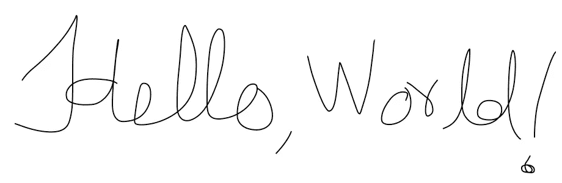
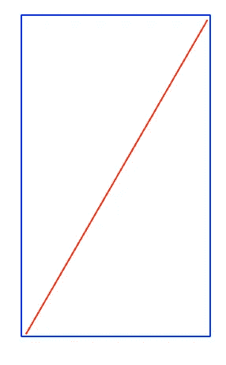
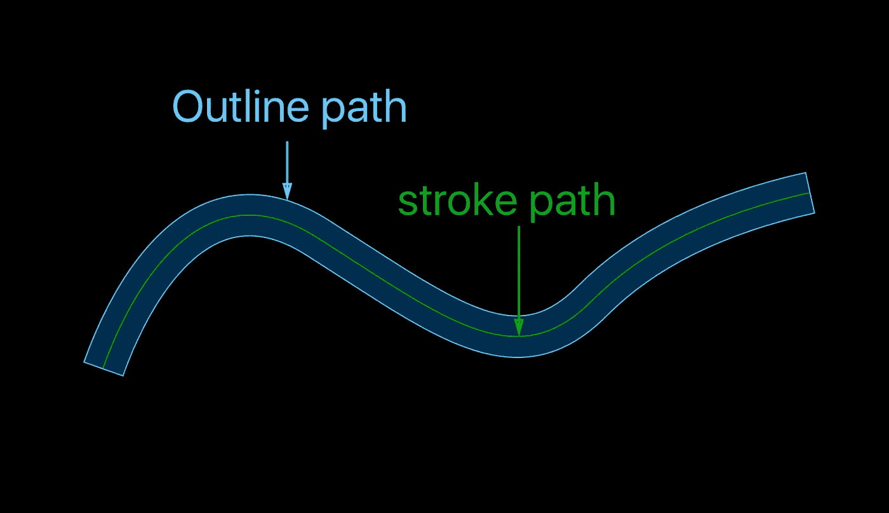
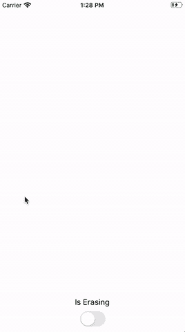

# iOS 触摸绘画

> 原文：<https://levelup.gitconnected.com/ios-touch-drawing-4d5b715d2d35>

图片摘自[https://code . tuts plus . com/tutorials/IOs-SDK-advanced-freehand-drawing-techniques-mobile-15602](https://code.tutsplus.com/tutorials/ios-sdk-advanced-freehand-drawing-techniques--mobile-15602)

在我最近参与的一个项目中，我们需要为用户提供一种通过触摸屏幕在照片上绘画的方式。用户将能够在图像上自由绘制，并且他们还能够简单地通过触摸擦除按钮然后触摸图形来**擦除**他们之前的任何图形。

事实证明，最难的部分并不是绘画本身，因为快速的互联网搜索在 Ray Wenderlich 网站上抛出了一个奇妙的绘画教程，对我们来说最难的是擦除一幅特定的绘画。

# UIGraphicsContext

Ray Wenderlich 教程有三个主要函数，它们构成了大部分绘图逻辑。

其中`lastPoint`用于保存要绘制的线的*最后已知点*(在这种情况下，最后已知点也是初始点)。

然后`touchesMoved`:

正如您所看到的，绘制一条线实际上非常简单，您只需创建一个自定义 UIView 并粘贴这些代码，该视图就可以作为用户的绘图画布了。

我们用这种方法的问题是，`UIGraphicsGetImageFromCurrentImageContext`返回一个大小为`view.frame.size`的`UIImage?`，所有生成的图像将具有相同的大小和位置，这使得几乎不可能区分彼此，进一步使单个绘图的擦除变得复杂。

这让我们想到了第二个选择:

# 卡沙皮勒

使用与之前相同的`touchesBegan/Moved/Ended`函数，我们可以创建`CGPaths`，它描述了用户移动手指的所有点，然后我们将这个路径添加到一个`CAShapeLayer`，并将这个新层添加为“画布”视图的子层，这样我们就可以为每个单独的绘图获取图像(层)。

现在让我们来看看使用`CGPath`与使用`UIGraphicContext`相比有什么不同。

给我看看代码！

首先，我们创建了一个名为`DrawingView`的自定义视图，并用这个视图替换了`touchesBegan`函数:

`touchesMoved`函数与之前的示例保持一致，而`drawLine`被改为:

使用 CGPath 和 CAShapeLayer apis 的新 drawLine 函数

> 比较以前的实现(CGContext)和现在的实现(CALayer ),你会发现它们非常相似。它们都进行几乎相同的函数调用，但是在不同的上下文中。我们用`currentPath.move(to: fromPoint)`代替`context.move(to: fromPoint)`，我们现在用`currentLayer.lineCap = .round`代替`context.setLineCap(.round)`。

最后，`touchesEnded`函数变成这样，因为我们需要渲染添加的子层:

此时，用户可以通过在屏幕上移动手指来绘画，每幅画都是独立的，并且与一个`CAShapeLayer`链接。

现在我们如何擦除特定的绘图？这是我们一开始就想解决的问题，所以让我们开始吧！

# 清除

首先，我们将创建一个函数来帮助我们找到包含接触点的层:

现在，如果你以前使用过`CAShapeLayers`，你可能使用过`hitTest`功能来检查该层是否包含一个`CGPoint`。

在我们的具体例子中，这不起作用，因为对于`hitTest`函数来说，要求`layer`有一个`frame`，而我们没有给它分配一个，因为如果用户在屏幕上画一条长对角线，包含整个图形的框架将是一个非常大的矩形，即使手指远离实际画出的线，它也会检测到触摸。

红线是用户绘制的路径，蓝线是包含路径的图层的框架

其中红线是用户画的线，蓝色矩形是框架。

在前面的代码中弹出的另一件事是，我们正在创建一个`shapeLayer.path`的*轮廓*，然后在上面调用`contains(point)`函数，为什么不直接在路径上调用**包含**函数，为什么我们需要创建一个轮廓？

原来`contains(point)`函数只在封闭路径上有效，所以如果用户画一条直线，这个函数将总是返回`false`。

大纲大概是这样的:

正如你看到的轮廓**是**一个闭合的形状，所以当通过点击删除形状时，它给了我们想要的精度。

此处[大解说](https://stackoverflow.com/questions/45532330/cashapelayer-does-the-line-pass-through-the-point)。

好了，让我们继续，`findLayer`函数返回被触动的`layer`，所以现在我们需要删除它:

有了这两个新函数，我们需要一种在绘制和擦除之间切换的方法，所以我们添加了一个控件属性，并用它来限制`touchesBegan`中的绘制能力:

和`touchesMoved`:

在`touchesEnded`我们称`findLayer`为`isDrawing == false`

结果是这样的:

看起来挺不错的！这是在 iOS 中绘画的基础，代码可以在这里找到。

这是一个非常简单的例子，说明了绘制和擦除是如何工作的，这个代码可以进一步扩展和重构，为用户提供更多的绘制选项，比如绘制正方形或圆形，或者显示两条线之间的角度。这些选项将在下一篇文章中讨论。

我希望你喜欢它！感谢阅读！