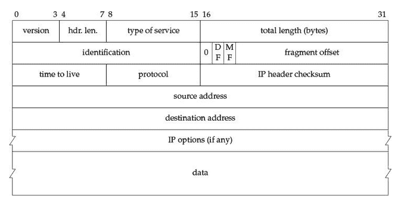
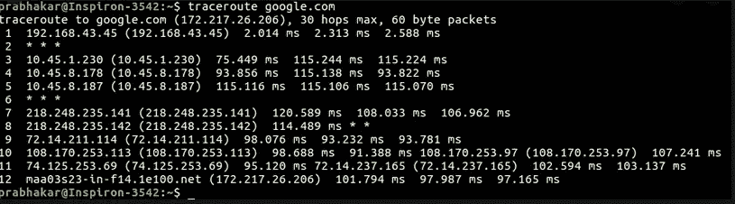
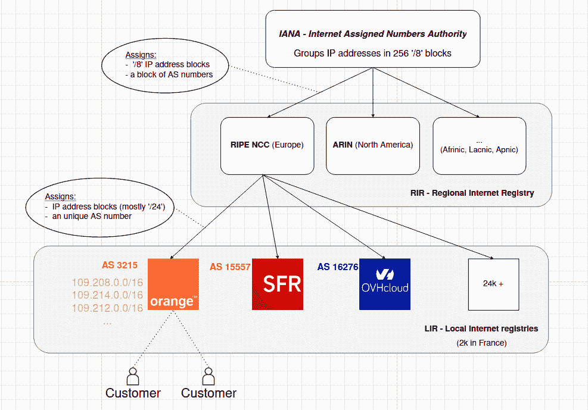
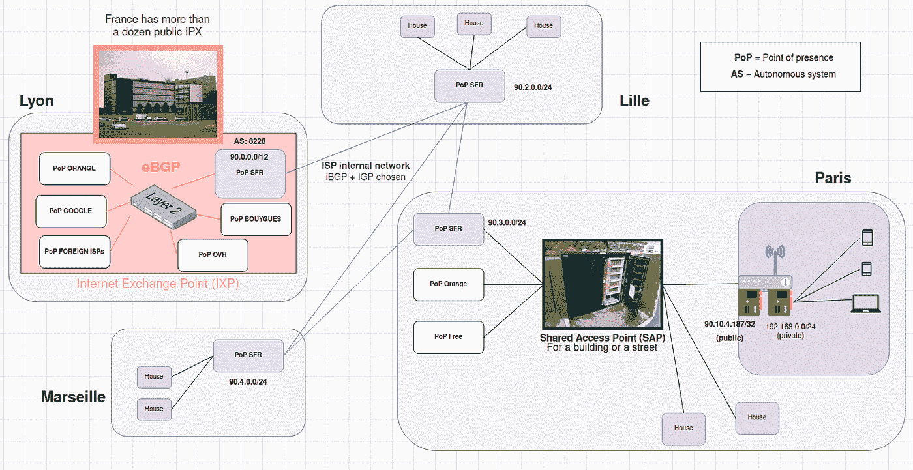
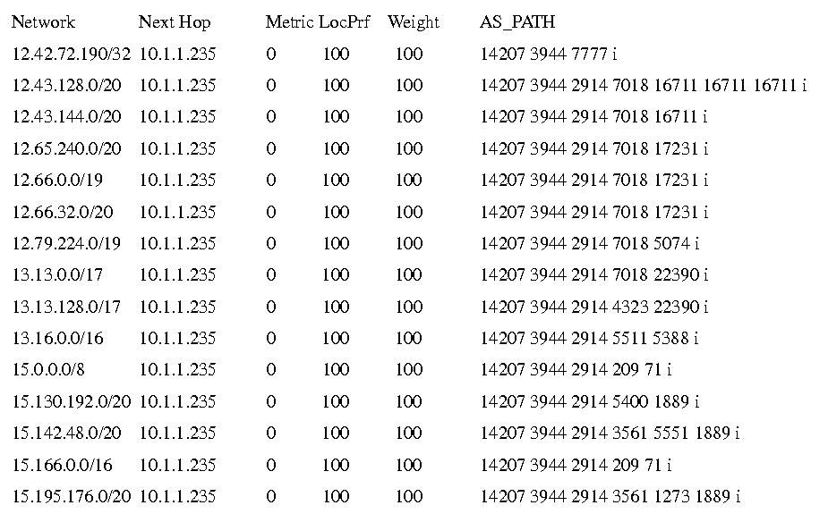
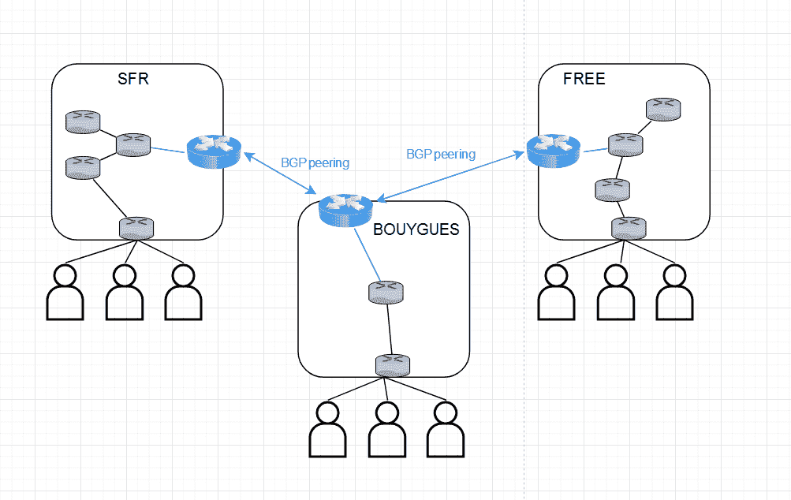
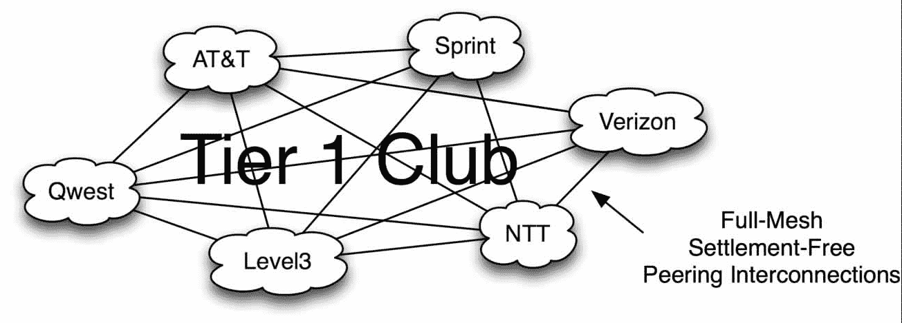
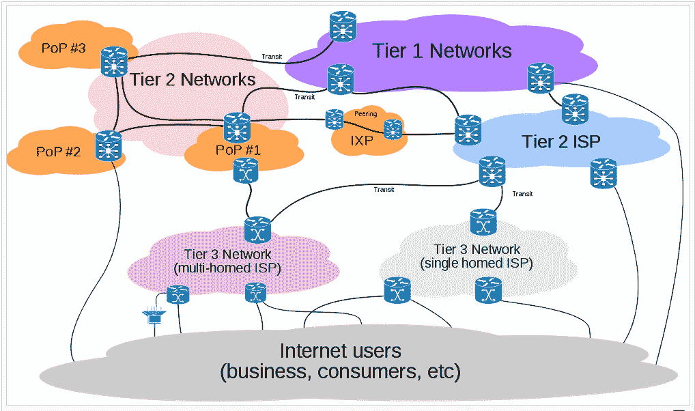

# IP 和互联网基础设施:大图

> 原文：<https://levelup.gitconnected.com/ip-internet-infrastructure-a-big-picture-a34cc25fe41b>

这篇博客文章旨在创建一个互联网协议(IP)和允许 IP 包传输的互联网络基础设施的大图。

# **计划**

*   主要 IP 传输原理
*   IP 数据包剖析
*   路由器
*   IP 地址是如何归属于 lir(本地互联网注册中心)的？
*   在 LIR 内部路由？
*   lir 之间的路由:BGP、对等、中转
*   互联网骨干网(一级互联网服务提供商)

# 主要 IP 传输原理

Internet 协议允许两台物理上相距遥远的主机通过由路由器组成的网络交换(发送和接收)数据。

交换的数据被封装在“IP 包”中，在报头字段中添加元数据。

IP 是一种无连接(包之间没有状态)和不可靠(包的传递和潜在传递的顺序都没有保证)的协议。

> *可能的例子:如果主机 1 按以下顺序发送 4 个数据包:“P1 — P2 — P3 — P4”给主机 2，后者可能收到:“P3 — P1 — P2”。*

正如您在上面的例子中看到的，数据包的接收顺序不正确，P4 甚至已经丢失。

IP 是一种简单的协议，可以在多种介质上运行(以太网、wifi、蜂窝连接等)。

IP 甚至可以和[鸽子](https://en.wikipedia.org/wiki/IP_over_Avian_Carriers)一起用！

# IP 数据包剖析

以下是 IP 数据包(IPv4)的不同字段。

图 1—IP 数据包的剖析

**服务类型:**该字段帮助路由器对数据包传输的“重要性”进行分类(例如由 VoIP 使用)。

**总长度:**该字段是数据包(报头+数据)的长度(以字节为单位)。该字段的最大值为 65.535 字节。由于以太网 MTU(最大传输单位)为 1500 字节，因此必须将大数据包分成较小的数据包。

**分片偏移量:**该字段用于管理数据包的分片；事实上，如果需要的话，中间路由器可以把一个包分成更小的包。

**TTL(生存时间):**该字段用于避免 IP 数据报无限循环(在路由环路的情况下)。TTL 值通常为 32 或 64，并由每台路由器递减。如果 TTL 值为 0，路由器将向源主机响应一个 ICMP 数据包(特殊 IP 数据包),以供参考。

**协议:**该字段用于指定路由器的 IP 协议号(IP 协议≠端口号！)例如:ICMP = 1，TCP = 6，UDP = 17，IPv6 = 41，…

**IP 报头校验和:**该字段由创建/发送数据包的源主机计算并添加，以避免数据损坏。实际上，每个路由器在接收新分组时将首先通过计算/比较报头校验和来验证内容的完整性。

# 路由器

路由器是专门的(通常基于 linux)网络计算机(性能/能耗更好)，它至少有 2 个网络接口(见我的博客文章“[从 NIC 到 socket](https://medium.com/gregs-tech-blog/from-sockets-to-nic-a-big-picture-7494356cfcd4) ”)，以便连接 2 个(或更多)网络。

路由器将数据包发送到邻居路由器的正确网络接口，以便数据包最终到达正确的主机。数据包可以通过数量不定的路由器到达正确的主机。

Linux 命令 *traceroute* (或者 windows 上的 *tracert* )显示了一个数据包为了到达正确的主机可以从一个路由器到另一个路由器的不同“跳”:

图 2 —从一台主机到 Google 服务器的数据包路径

## **traceroute*如何工作？***

> Traceroute 按顺序发送 IP 数据包(Linux 上的 UDP 或 Windows 上的 ICMP“echo”)。
> 
> 发送的第一个数据包的 TTL 为 1，并且对于每个后续数据包，该 TTL 值递增 1。
> 
> 如果 TTL 为 0，遇到的路由器将递减 TTL，并向源返回 ICMP“超时”响应(每台路由器只发生一次)。

因此，源主机将收到所有路由器的 ICMP 响应，并将在控制台中显示不同的跳数。

有些“跳”的结果中有一个“*”，这意味着主机在某个时间窗口内没有收到 ICMP 响应，因为其中一个中间路由器可能被配置为不响应。

## **路由算法**

路由器在内存中存储路由表。这些路由表会频繁更新，以便根据 IPs / CIDR 知道传入的数据包应该发送到哪里。

路由算法是一个广泛的领域，它提出了许多问题(效率、速度、路径创建等等)。

这不是本文的范围，但是如果你感兴趣的话，你可以看一下这个维基百科页面。

# IP 地址是如何归属于 lir(本地互联网注册中心)的？

图 3 — IP 和自治系统层次结构

*免责声明:*在这篇文章中，我将重点介绍 ISP(互联网服务提供商)，因此“AS”(自治系统)、“LIR”(本地互联网注册中心)、“ISP”这些词都可以互换使用。

图 4 —全局和简化的 LIR 方案(数值不正确)

在这个方案中(图 4)，我代表了一家法国 LIR (SFR)以及它如何将客户连接在一起并连接到互联网。

一旦 LIR 从其 RIR(区域互联网注册中心)购买了一些 IP 地址块，他就可以将它们用于不同的存在点(PoP 和客户)。

我们将在这篇博文的剩余部分讨论关于这个方案的信息(BGP，IXP…)。

# 在 LIR 内部路由？

LIR (Local Internet Registry)是一个联网系统的集合，这些系统运行共同的路由协议(T1、T2、T3、T4、T5、T6 ),并受单一管理机构(T7，维基百科)的控制。

LIR 可以为其内部网络选择他想要的算法。

单个路由域的一些路由算法(也称为内部网关协议— IGP)包括:

*   [OSPF](https://en.wikipedia.org/wiki/Open_Shortest_Path_First)
*   [是-是](https://en.wikipedia.org/wiki/IS-IS)
*   加强型内部网关路由协议
*   [撕裂](https://en.wikipedia.org/wiki/Routing_Information_Protocol)

一旦选择并配置了 IGP 算法，LIR 的客户就能够在他们之间发送和接收 IP 数据包。但是，该 LIR 的客户将无法与其他 lir 的客户通信(在此阶段)。

# **lir 之间的路由:BGP、对等、中转**

互联网是由本地互联网注册机构(LIRs)创建的。这些 lir 都有一个唯一的 AS 号(以唯一地识别彼此)和多组从 RIR 购买/租用的 IP 地址。

lir 必须找到相互连接的方法和交换路由信息的算法。

所有 lir 使用的路由算法是 BGP(边界网关协议)算法。

lir 可以通过两种方式与 BGP 通信(我们将在后面详细介绍):

*   IP 传输
*   凝视

大多数 lir 会同时使用这两种方法，并且有冗余。

## BGP —边界网关协议

BGP 将地址块与自治系统号相关联。

从技术上讲，BGP 是运行在 TCP 端口 179 上的“第 4 层”路由协议。

非常简单，由于组成 BGP 网络的 AS 路由器进行定期更新，连接到该网络的每个自治系统(LIR)都有一个 IP 表，其中每个现有的 IP 地址块都与正确的自治系统号相关联。该表还包含到达特定地址块必须采用的 AS 路径(路径)。

图 5—BGP 路由表的一小部分

互联网是一个巨大的 BGP 网络，每个连接的 lir 由它的 AS 号标识。因此，这个 BGP 网络的每个成员可以在它们之间发送和接收更新，以便知道应该采用哪条路径到达每个 AS。

此时，BGP 路由表(称为 RIB)中大约有 80 万个条目。

BGP 的完整解释[点击此处](https://learn.nsrc.org/bgp/)

## **BGP 连接的类型:对等或转接**

与其他 ISP 共享地址块的第一种方法是使用 BGP 对等。

如果我们仍然考虑图 3 / 4 的例子，SFR 可以通过在一些边界路由器上配置 BGP 来对等其他法国 lir，例如“Bouygues”和“Free”。一旦对等，这些 lir 将共享它们的地址块，并作为号码一起发送或接收来自其他 lir 的流量。

图 6 — BGP 对等

重要说明:对等不是在任何 LIR 之间进行的。对等通常在相同规模的 ISP 之间进行。两家 ISP 都不会向对方支付对等连接的使用费，因为流量是双向的。这是 LIRs 之间的“双赢”交易。

对等连接可以在互联网交换点(IXP)进行。

同一地区(国家或地区)的许多 lir 将通过 IXP 相互连接。

一般来说，每个国家都有一些 ixp。

通过与其他 LIR 的多个对等连接，LIR 将能够接收其他 lir 的所有路由并传播其自己的路由。

你可能会问:

> 在这种“对等丛林”中，一个 ISP 如何确定他能够联系到所有现有的其他 ISPs)？

→这一点之所以成为可能，要归功于不同 ISP 之间存在的层级结构，这使得互联网主干网的出现成为可能。

# 互联网骨干网(一级互联网服务提供商)

一些 ISP 处于互联网的核心，这些 ISP 被称为“一级”网络。

第 1 层网络是只与其他第 1 层 ISP 建立对等关系的网络。

图 7 —第 1 层 ISP 全网状对等

第 1 层网络可以免费访问整个互联网，因为它与所有其他第 1 层网络对等，因此可以与所有其他第 1 层网络交换 BGP 更新。

世界上大约有 18 家一级 ISP。在法国，只有 *Orange* 是一级网络。

这意味着每个非一级互联网服务提供商都不能仅通过对等网络访问整个互联网。
非 1 级 ISP 必须与 1 级网络建立所谓的“IP 转接”链路(或者与已经与 1 级网络建立了“IP 转接”链路的非 1 级网络建立链路)。

一旦建立了 IP 转接链路，转接提供商 ISP 的客户 ISP 就能够将其部分流量发送到转接提供商 ISP，然后 ISP 就能够将数据包路由到正确的目的地。
有了 IP 转接链路，客户 ISP 也能够通过转接提供商 ISP 将其所有地址块推广到整个互联网。
要创建和使用 IP 转接链路，客户 ISP 必须根据其使用的数据量向转接提供商 ISP 付费。

IP Transit 提供了完整的互联网接入。

同时具有对等和 IP 转接连接的 ISP(称为二级 ISP)也可以向其他 ISP 出售 IP 转接链路。

由于对等和转接 IP，二级 ISP 将创建自己的内部连接网络。

被称为“第三层”的小型 ISP 甚至不会与任何其他 ISP 对等，只会向中转提供商 ISP 付费，以发送/接收互联网上的流量。

图 8 —不同类型的 ISPs 级、2 级、3 级)

# **结束了！**

这篇文章花了我一些时间来写，因为为了得到一个简短的和大的互联网的图片，需要总结的复杂性。我希望你喜欢它，如果你看到任何错误，不要犹豫让我知道。

如果你想更深入地了解这个主题，你也可以在 twitter 上关注我，并查看下面的参考资料。

# **参考文献**

[https://en.wikipedia.org/wiki/Internet_transit](https://en.wikipedia.org/wiki/Internet_transit)
[https://en.wikipedia.org/wiki/Internet_exchange_point](https://en.wikipedia.org/wiki/Internet_exchange_point)
[https://en.wikipedia.org/wiki/Tier_1_network](https://en.wikipedia.org/wiki/Tier_1_network)
**完整网站上的 BGP(太棒了)**
[https://learn.nsrc.org/bgp/](https://learn.nsrc.org/bgp/)
**BGP**
[https://www.noction.com/blog/routage-bgp-attribut-as-path](https://www.noction.com/blog/routage-bgp-attribut-as-path)
**BGP for IP transit**
[https://FTP . registro . br/pub/gter/gter 30/TutorialBGP](https://ftp.registro.br/pub/gter/gter30/TutorialBGP/7%20-%20Transit.pdf)

# 形象

**图 1**
VPN 图说:隧道、VPN、IPsec，Jon C. Snader
**图 2**
[https://www . geeks forgeeks . org/traceroute-command-in-Linux-with-examples/](https://www.geeksforgeeks.org/traceroute-command-in-linux-with-examples/)
**图 5**
[https://www . semantic scholar . org/paper/Data-Structure-Optimization-of-AS _ PATH-in-BGP-Jiang/f](https://www.semanticscholar.org/paper/Data-Structure-Optimization-of-AS_PATH-in-BGP-Jiang/f41e9622e634823c6506bf0f5f543174e900d298)