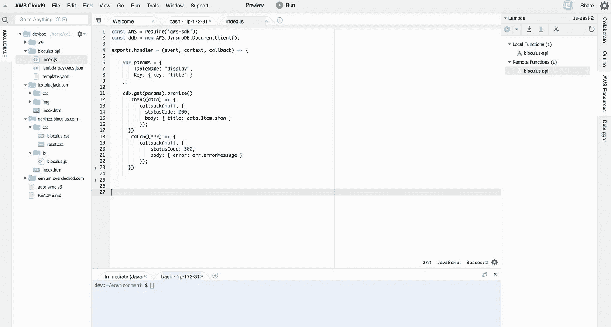
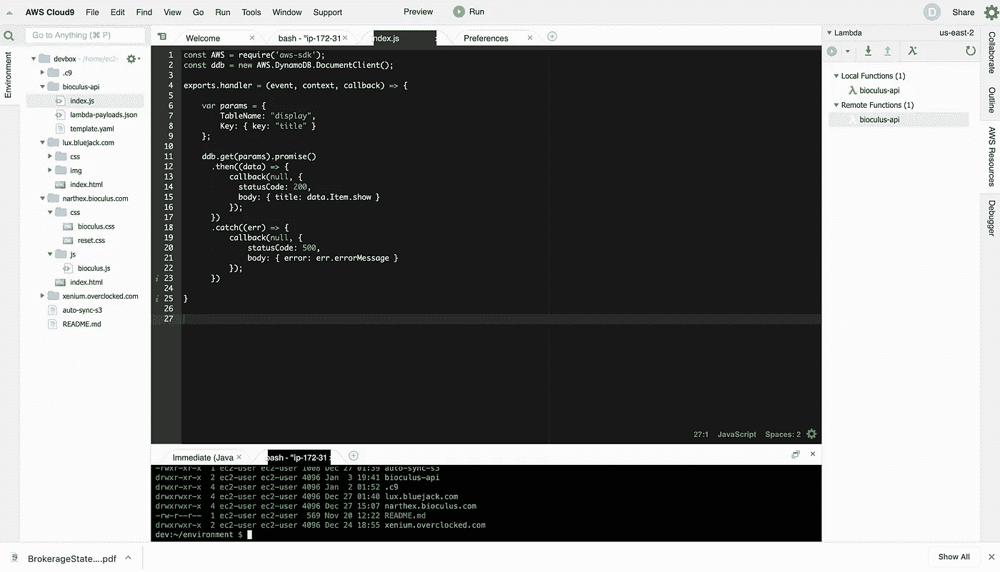
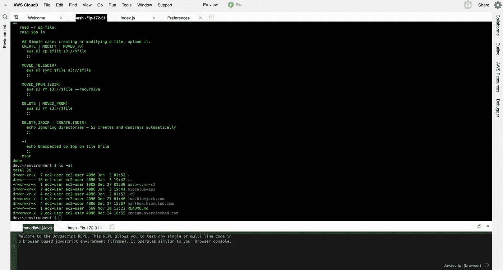
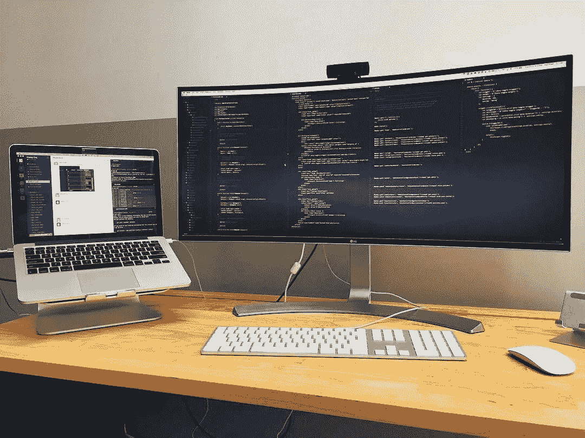

# 用 iPad 进行网络开发

> 原文：<https://levelup.gitconnected.com/ipad-for-web-webapp-developers-a63b454327a8>

## AWS 游牧民#5:现在可以从你的 IPad 上构建复杂的网站和应用程序。

我们回到了酒吧。但是让我们用 ipad 做些比看报纸更有趣的事情吧…

大约在 2002 年左右，当第一批笔记本电脑开始出现 360 度触摸屏时，我第一次有了用平板电脑作为我的主要电脑设备的梦想。但是它们昂贵、笨重、基于 Windows 既不是好的笔记本电脑，也不是好的平板电脑。从那以后，故事就一直如此。

在过去的五六年里，我用我的 IPad 完成了各种各样的创意和管理任务，但直到现在才可能用它来进行软件开发。

本文中的解决方案都是关于基于浏览器的网络解决方案。有一些非网络开发和为 iPad 构建的 IDE 的尝试，但是在我的工作领域，这些解决方案仍然是笨拙的，比我描述的基于云的开发要差。

AWS 生态系统使这不仅成为可能，甚至是可取的。

但是首先…

## WhyPad？

当你旅行时，更轻、更轻、更小的体积和更少的设备都增加了灵活性。以下情景对我来说是定期发生的，也许其中一个会引起你的共鸣。

1.  iPad 在某些方面比笔记本电脑更好，所以我需要随身携带，我宁愿两者都不带。
2.  我经常在公共场合工作，不知何故，iPad 感觉没有笔记本电脑那么令人讨厌。
3.  我经常使用 iPad 来完成一些任务，以至于当我回到笔记本电脑时，它的界面让我头脑混乱。我要戳屏幕多少次才记得它不起作用？

几年来，我的大部分网页浏览、阅读和娱乐都是在 IPad 上进行的。我在我的 iPad 上写作(但不是中型文章，中型应用程序在 iOS 上完全是垃圾。你听到了吗，灵媒？？？)说到数字艺术，iPad plus pencil 是无与伦比的。其他东西，比如软件开发和播客，在 IPad 上表现不佳。

对于某些类别的软件开发来说，这种情况正在改变，但有一个非常重要的例外:移动应用程序开发。iPad 不能用于构建 iPad 或 iPhone 应用程序。(我没有调查过 Android，但我的预期是:否定的。)

然而，对于网站和动态 web 应用程序，是的。也适用于移动应用程序的服务器端组件。

这就是方法。

## **IDE:cloud 9**

如果你像大多数开发者一样，对你的工具非常挑剔，你可能会也可能不会喜欢 Cloud9。无论你目前最喜欢的是什么，Cloud9 都可能会有所欠缺。但不是蹩脚的二等公民。对于一个基于浏览器的应用程序来说，它非常流畅，反应灵敏，而且非常复杂。此外，当使用 AWS 环境时，它为编写代码提供了优雅的集成，这是其他 AWS 控制台界面无法提供的良好体验，例如创作 lambdas。

它还有一个功能完善的 bash shell，所以如果你是一个 vim 或 emacs 爱好者，你可以完全跳过 Cloud9，直接使用终端。

以下是几张截图。

*默认配置:*

文件树在左边打开，代码窗口在中间，终端在底部，AWS 资源在右边打开。

*这里有一个黑暗的主题:*

显然，窗户是黑色的，但支撑板是白色的，这有点令人不满意。Cloud9 支持编辑它自己的样式表，但是我还没有使用它来确定我们是否也能控制它。

*终端不限于底部波段:*

注意您也可以折叠侧面板，并将终端加载到主窗口中。是的，您可以在该窗口中运行 vim、emacs 或任何其他终端应用程序。一切都很完美。

这不仅仅是一个简单的代码编辑器/ IDE，即使它并没有像 Sublime、Atom、IntelliJ、Eclipse、RubyMine 等那样让你高兴。等等。可能吧。AWS 集成*虽然*很可爱。

## 开发箱:EC2

Cloud9 没有在你的 iPad 上编辑代码。它正在 EC2 Linux 实例上编辑代码。

好处:你所有的代码都在云中。把你的 iPad 扔进水池，你就失去了一个 Pad。没有代码。

坏处:在默认(也是最便宜的)选项中，EC2 实例在不使用时被折叠起来放好。这意味着你早上的第一次装载需要一两分钟。这也意味着糟糕的网络连接会导致更令人沮丧的体验。也意味着没有网络连接就意味着完全没有开发经验。

## 浏览器内开发工具

一个令人惊讶的问题是，iPad 的标准浏览器并没有公开开发者工具的功能:

Safari 提供了一个疯狂而愚蠢的集成，需要使用你的笔记本电脑来访问连接的 iPad 的调试工具。从技术上来说，我们可以把它放在可能的一栏中，但这不是一个可以接受的开发体验。还不如用笔记本电脑。据说同样的方法也适用于 Firefox。

*Chrome* 通过添加一个以`chrome://inspect`为 URL 的标签，给你有限的访问 JavaScript 日志(所有标签)的权限。这对检查 dom 没有帮助。

然而，还有另一个浏览器选项: *Inspect* 。 [$6.99 来自 App Store](https://apps.apple.com/us/app/inspect-browser/id1203594958) 。这为您提供了所有您期望的浏览器内开发工具:DOM 检查、CSS 修改、JavaScript 控制台、网络流量观察。如果你打算在 iPad 上进行任何类型的网络开发，这笔钱花得值……至少在其他浏览器赶上来之前是如此。(为什么他们没有，对我来说是一个极大的谜。)

# 自由职业者协会

## 1 —如果我没有使用/不想使用 AWS，该怎么办？

显然，这个解决方案与 AWS 开发紧密相关。对于某些其他类型的网络开发来说， *Inspect* 浏览器仍然是一项有用的投资。某些类型的 web 开发不需要严格的软件开发环境:例如 wordpress。你可以在你的 iPad 上轻松地编辑你的图像，访问 iPad 文件系统来上传图像和文件等等，并且使用 Inspect 来调整你的 CSS。

## 2 —有没有比 Cloud9 终端更好的终端 app？

也许你正在采取一种不同于我的 AWS 生态系统方法的方法，或者也许你只是想要一个更好的终端。老实说，我对 Cloud9 终端印象非常深刻，目前正在使用它从我的 EC2 实例 SSH 到我可能需要管理的任何其他主机。

也就是说，有些人对 Blink 赞不绝口——除了它的售价是 19.99 美元！我赞成为开发人员的辛勤工作支付报酬，但这有点过分，因为 Termius 很好地完成了工作。有各种各样的选择，所以如果有你喜欢的，请在这里随意评论。

## 3 —如果我不能通过网络工作怎么办？

你在伯利兹城的海滩酒吧研究一个粗略的无线信号？你是通过安第斯山一个不靠谱的网吧联系的？网络只是对你不起作用？Cloud9 不是答案。

还有一个模型要考虑。

有各种各样的代码编辑器可以得到不错的分数，并处理本地文件，你可以将这些文件复制到 S3，或者远程服务器，或者 github:

*   Koder 代码编辑器(免费)
*   Kodex(免费)
*   文本代码编辑器(9.99 美元)
*   GoCoEdit(8.99 美元)

一个发展中的进步是 iPad 上的 Python。我自己没有深入研究过这个，但是很明显，在 iPad 上运行和测试你的 Python 代码，并使用强烈推荐的 *Pythonista* 应用程序进行开发是可能的。

当然……如果你在本地开发，你需要找到一种方法，这种方法不会让你因为将代码同步到需要同步的地方而抓狂。

我明白了。一些开发者永远不会放弃这一点。你的损失。