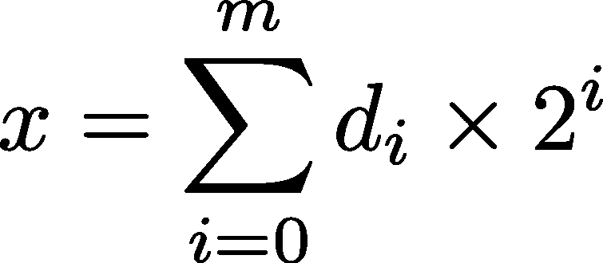

# 1000 万乘以 7 等于 7000 万吗？

> 原文：<https://levelup.gitconnected.com/is-10-million-times-7-equal-to-70-million-1fac941af828>

## 数值计算会导致细微的舍入误差。优秀的程序员必须知道如何避免它们。

考虑以下用 C 编写的程序:

```
#include <stdio.h>int main() {
 float x = 7;
 float S = 0;
 int i;
 for (i = 0; i < 10000000; i++) {
   S += x;
 }
 printf(“%f\n”, S);
}
```

程序将变量 S 加 7 一千万次。因此，预期结果是 7000 万。事实上，编译(没有优化)和运行程序给出了

```
77603248.000000
```

这比以前大了 10%以上。惊讶吗？嗯，这是舍入误差的影响，它是由计算机中的数字只能用有限的位数来表示这一事实引起的。事实上，700 万和 1000 万在计算机内存中都是完全可以表示的。那么，为什么结果会如此糟糕呢？

# 代表计算机内存中的数字

计算机中的数字是用二进制表示的。

在这个系统中，任何数都以 2 为基数表示在位置系统中，因此由 *m* 位数字(0 和 1)组成的任何整数都表示数 *x* 为



其中 *d* ᵢ是第 *i* 位的值(0 或 1)。例如，在 8 位计算机中，整数 5 表示为 00000101，即 1⨉2 +0⨉2 +1⨉2⁰=4+0+1=5.当然，前导零并不重要。

为了表示非整数，例如 3.14，原则上可以使用相同的符号，唯一的区别是 *i* 的起始值是负的，并且等于小数点后的位数。比如 3.14 对应二进制的 11.00100011110101110001。事实上，


值得注意的是，上述计算得出的精确数字实际上是 3.1400003433。一个基数中的有理数不一定是另一个基数中的有理数(例如，1/10 在基数 2 中是无理数)。这种表示法对计算机来说是不切实际的，因为它需要大量的数字来以足够的精度表示在十进制记数法中只有有限位数的数字。相反，计算机使用 IEEE754 标准符号。在这个符号中，*浮点数*，如他们所称，占用 32 位。然后用一种以 2 为基数的**科学符号**来表示数字。在科学记数法中，一个数 *x* 被写成 *x* =y×10ⁿ，其中，通常*y*∈【1，10】和 *n* 被相应地选择。例如，地球到太阳的平均距离是 149 597 870 700 米，可以写成标准形式的 1.49 597 870 700⨉10 米。同理，3.1400003433，以 2 为基数，可以写成 1.100100011110101110001⨉2，即写成 y×2ⁿ，*y*∈【1，2】， *n* =1。使用这种约定，小数点前面的数字总是 1，可以去掉。乘以二的幂的数(1.100100011110101110001)称为**尾数**，可以表示为 100100011110101110001，省略了前导 1。后者被称为**范式**。

在 IEEEE754 记数法中，使用第一个比特来表示数字的符号(0 表示正)，使用 8 个比特来表示 2 的指数(在示例中为 *n=* 1 )(即，作为整数，使得*n = m127；m=* 在我们的例子中是 128)和 23 位来表示其标准形式的尾数。因此，表示我们的数字所需的比特序列如下:0 10000000**10010001 11101011 1000100。**

# **对问题的剖析**

**将 *x* 声明为浮点数(float)，编译器将其表示为 0 100000001 11000000 00000000000，即(1+1×2⁻ +1×2⁻ )×2 =7。事实上，前导 0 代表+号。接下来的 8 位组代表 129，而 129 又对应于 2 的指数 129–127 = 2。其余 23 位中，只有前两位不为空，对应于功率*1 和*2。加到这些能力上的 1 隐含在范式中，没有明确表示出来。****

****问题出现在程序做加法的时候。要做到这一点，CPU 必须考虑用 2 的相同幂来表示和中的两项，因为这样，它可以利用乘法的分配特性。****

****当 S=16 777 222 时，它在计算机内存中的表示是 0 10010111 000000000 000000000000011。指数是 10010111，对应整数 151。因此，科学记数法中 2 的指数是 151–127 = 24。那么，s 被表示为 y×2 ⁴.为了对其求和 *x* =7，我们需要将 *x* 表示为 *z* ×2 ⁴，这样 CPU 就可以对 *y* 和 *z* 求和，以获得 s 的新值。 *x* 的原始表示为 1.11 后跟 21 个零乘以 2。为了将其表示为 *z* ×2 ⁴，我们需要将尾数的位向右平移 22 位。结果是一个由 21 个零后跟数字 111 组成的数字。在一个 32 位的数中，没有最后一个 1 的位置，这就丢失了，事实上， *x* =6，S=16 777 228。****

****为了减轻舍入的影响，求和在 FPU(浮点单元)中执行，FPU 使用 80 位来表示浮点。16 777 228 加 7 等于 16 777 235。不幸的是，当将这个数复制回内存时，FPU 会在尾数上加 1，以恢复之前的错误，结果是 S=16 777 236，即 16 777 228 + 8。事实上，加到实际总和上的值是 8 而不是 7。每次连续迭代都会发生同样的情况，并且会多次添加 8 而不是 7。在一种情况下，加到实际总和 S 上的值确实是 11！****

# ****教训****

****用计算机对两个值 *S* 和 *x* 求和时，必须注意它们的相对值。如果 log₂(S)−log₂(x) ≪ p，其中 *p* 是用于尾数的位数，那么你不会有任何麻烦。另一方面，如果 log₂(S)−log₂(x) ≃ p 或更大，那么，很有可能，你会遇到舍入误差，事实上，这可能是严重的。不要盲目地将相差太多的数字相加。同样的，你要时刻注意非常相似的数字的区别。如果这两个数字太接近，它们的差值可能很难表示，甚至可能是零，即使这两个数字是不同的。****