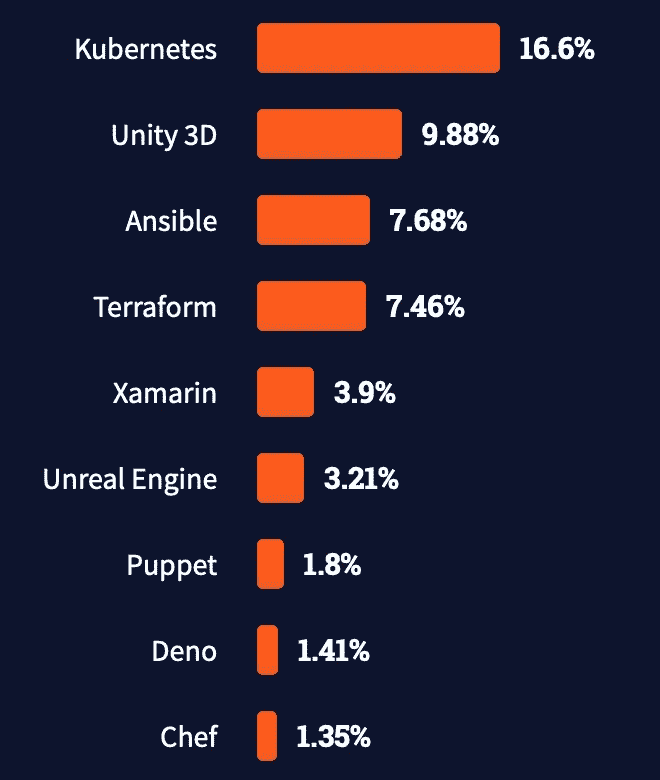
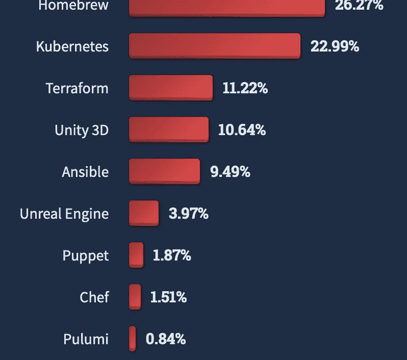
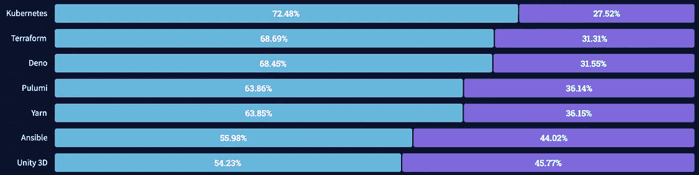
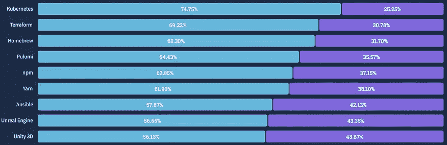
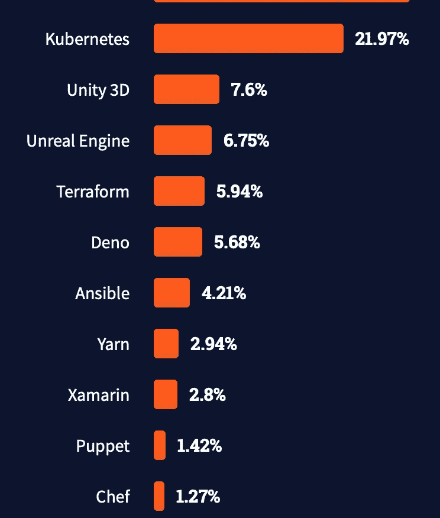
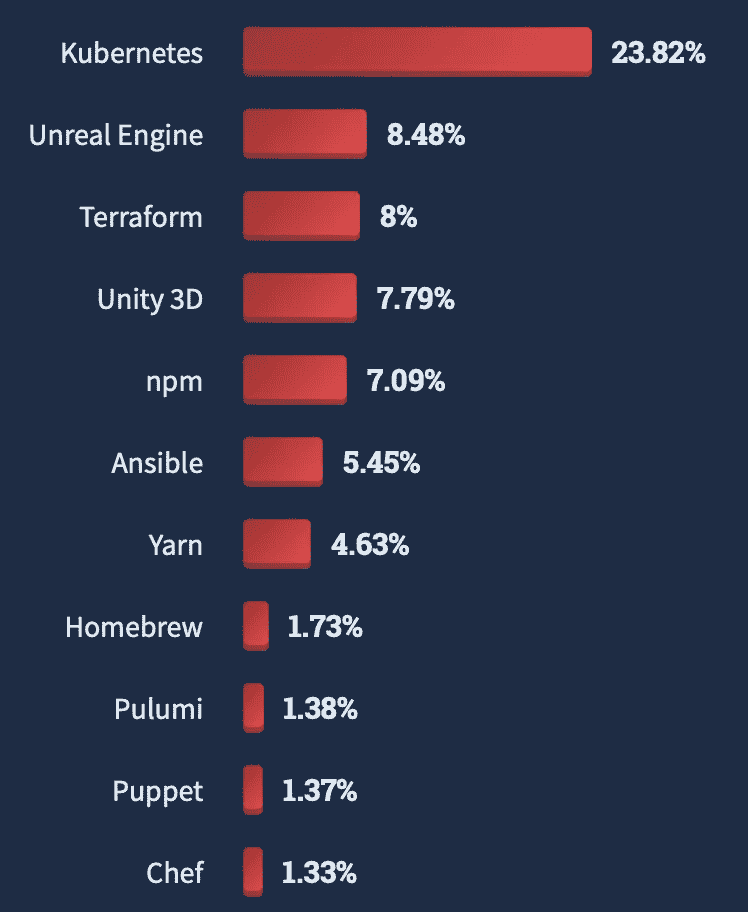
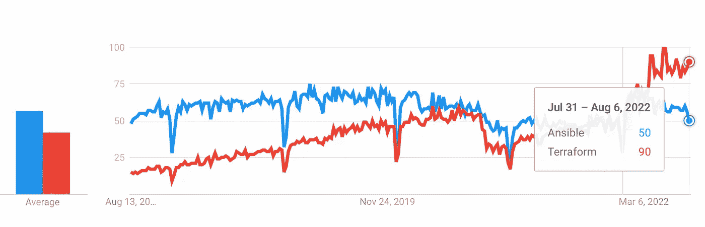
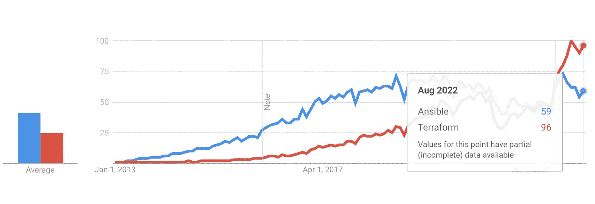

# 安西贝尔快死了吗？是的，有点…

> 原文：<https://levelup.gitconnected.com/is-ansible-dying-yes-kinda-e381b1a61bcc>

## Ansible | Terraform |配置|裸机|云

## 受欢迎程度和兴趣是两回事


[Sei](https://unsplash.com/@itssecondkaki?utm_source=unsplash&utm_medium=referral&utm_content=creditCopyText) 在 [Unsplash](https://unsplash.com/s/photos/end?utm_source=unsplash&utm_medium=referral&utm_content=creditCopyText) 上的照片

# 三个原因

*   Stackoverflow 开发调查和谷歌趋势。
*   向云的转变意味着向平台的转变。安装一个操作系统，这是可行的。
*   我写的文章几乎没有什么吸引力。

# 排名第一的 Stackoverflow 调查和谷歌趋势

让我们看看最近两年的 Stackoverflow 报告，类别“其他工具”。

[](https://insights.stackoverflow.com/survey/) [## 堆栈溢出

### 2022 年，来自 180 多个国家和地区的 70，000 多份反馈，我们的年度开发者调查考察了…

insights.stackoverflow.com](https://insights.stackoverflow.com/survey/) 

## 流行技术

在这一类别中，Ansible 和 Terraform 在 2021 年几乎持平，但 Terraform 显然在 2022 年比 Ansible 更快地受到欢迎，Terraform 超过 Ansible 近 2%。这两个工具在过去的一年里都增长强劲，而其他类似的工具如 Puppet 或 Chef 则远远落后。



2021(左)，2022(右)

## 被爱与恐惧

回答“喜欢”Terraform 的人在过去一年中从 68.9%增加到 69.2%，而回答“喜欢”的人从 56%增加到 57.9%，增加了近两个百分点，但仍远远落后于 Terraform(超过 10%)。



2021(左)，2022(右)

## 受通缉的

“想要的”调查结果证实了我们的预期:Terraform 增长了 2%以上，而 Ansible 远远落后，仅增长了 1.2%。



## 调查摘要

我们可以观察到 Ansible 仍然是一项受欢迎的技术，并且在该类别中也有显著增长。然而，目标群体更喜欢 Terraform，对它的需求远远超过 Ansible。

谷歌趋势(`Ansible` vs `Terraform`)只是证实了这一点:Ansible 趋势正在缓慢下降，而 Terraform 趋势正在稳步增长，似乎在 2022 年超过 Ansible 后加快了速度。



谷歌趋势，Ansible vs Terraform，过去 5 年

纵观历史趋势，更明显的是 Terraform 正在接管。



谷歌趋势，Ansible vs Terraform，自 2013 年以来

# #2 向云基础架构的转变

在看了调查和趋势之后，让我们做一个现实的检查，为什么会发生这种情况。

无论是在公共云提供商还是内部，向云基础架构的转变似乎都是合理的。世界正在向云端移动。因此，对 Terraform 解决方案(启动和拆除)的需求高于 Ansible(安装操作系统/裸机)的需求。而在云中，你处理的是映像，所以你不需要用 Ansible 安装或更新包——你替换的是节点。

## 但是为什么 Ansible 没有 Terraform 那么受人喜爱呢？

是什么让它用起来如此…不舒服？

实际上，我会质疑 Ansible 本身使用起来不舒服。毕竟它很容易开始，你可以清楚地定义你希望它执行的步骤。它很强大！

根据我的经验，这个领域的一些同事也证实了这一点，坏名声的原因可能在于与 Ansible 的使用相关的问题和“事件”。在许多情况下，Ansible 要么在本地工作站上执行，要么在中央“部署”主机上执行，但在这两种情况下都是手动执行的。如果你坚持这种方法，你将不可避免地遇到随之而来的问题:员工会改变代码并执行它来测试它——然后代码还没有被测试、提交给 VCS 或评审就投入生产了。

所以我得出结论:不是技术，而是缺少支持 **GitOps** 的工具:在合并到 master 之前在管道中测试，并在标记后自动(半)部署。这需要在剧本中开发可变角色并组合它们的训练，但这是完全可能的！

# #3 我写的文章几乎没有什么吸引力

我最近发表了 2 篇关于如何用 Ansible 进行本地测试的文章。正如我们在上一节中发现的那样，每个人都想使用云，而 Terraform 使用起来更加愉快。因此，可以理解的是，这种趋势正在下降。

也难怪裸机经理群体的缩小对 Ansible 表现出了很少的兴趣——它是众所周知的(包括它的缺陷),每个人都找到了自己的方法。

然而，除非您以自动化的方式部署 Ansible，否则您会一次又一次地遇到设计上的问题。由于与之相关的问题，这使得它使用起来很不舒服。

我的文章关注于改善这种情况并自信地部署。通过在不同的发行版(和版本，如果需要的话)上本地测试您的更改，并提交被证明有效的代码。下一步是使用它来自动化 GitOps 管道中的一切——所以请继续关注！

> 因为:必须有人提供裸机！

因此，通过使用 Molecule 测试您的代码，让您的每一天变得更加愉快:

[](https://betterprogramming.pub/testing-ansible-roles-locally-with-molecule-on-linux-and-windows-a0903ec92496) [## 在 Linux 和 Windows 上用 Molecule 在本地测试角色

### 加快您的开发周期，满怀信心地发布

better 编程. pub](https://betterprogramming.pub/testing-ansible-roles-locally-with-molecule-on-linux-and-windows-a0903ec92496) [](/test-windows-ansible-roles-on-local-libvirt-vms-within-minutes-e5dfa031bc4) [## 在几分钟内测试本地 libvirt 虚拟机上的 Windows Ansible 角色。

### 在几分钟内启动 Windows 虚拟机，测试您的可行角色。

levelup.gitconnected.com](/test-windows-ansible-roles-on-local-libvirt-vms-within-minutes-e5dfa031bc4) 

感谢您的关注！

```
**Want to Connect?** If you want to support me, sign up for Medium through my membership link: [*https://drpsychick.org/membership*](https://drpsychick.org/membership) or visit me on GitHub.
```

# 参考

Ansible /分子

[](https://github.com/drpsychick/ansible-testing) [## GitHub-DrPsychick/ansible-testing:一个 ansi ble 角色，允许为…

### 允许创建 SystemD 实例来测试角色的一个角色

github.com](https://github.com/drpsychick/ansible-testing) [](https://www.ansible.com) [## Ansible 是简单的 IT 自动化

### Ansible 是自动化应用和 IT 基础设施的最简单方式。应用程序部署+配置管理+…

www.ansible.com](https://www.ansible.com) [](https://molecule.readthedocs.io/en/latest/) [## 可翻译的分子-分子文档

### Molecule 只支持 Ansible 的最新两个主要版本(N/N-1)，也就是说如果最新版本是 2.9.x…

分子. readthedocs.io](https://molecule.readthedocs.io/en/latest/) 

更多关于 Terraform 的信息

[](https://medium.com/swlh/design-principles-and-practices-for-terraform-276b2c463563) [## 地形的设计原则和实践

### 为了让我的工作更受欢迎，我遵循了一些 Terraform 原则和实践。

medium.com](https://medium.com/swlh/design-principles-and-practices-for-terraform-276b2c463563)