# Bun.js 是 Node.js 杀手吗？！

> 原文：<https://levelup.gitconnected.com/is-bun-js-the-node-js-killer-ffeb0f89196a>

## Bun 概述及其性能和运行时与 Node 的比较

最近 Bun.js 在网上大做文章，被诬陷为又一个 Node.js 杀手，但真的是这样吗？我们一起想办法。

# Bun.js 是什么？

首先，Bun.js 是一个新的 JavaScript 运行时，按照它的创建者的说法，“它被设计成当前 JavaScript &类型脚本应用或脚本的替代物……”

一般来说，Bun.js 有点像 js 世界的**“瑞士刀”,因为你有一个 bundler、transpiler 和包管理器作为单一的工具。**

听起来很有希望，不是吗？！

# Bun.js 函数

作为 JS 界的一把瑞士刀，Bun.js 有不同的功能，让我们来谈谈它们。

## 使用 bun 作为打包器/传输器

现代 Node.js 被称为后端工具。我想我们有时会忘记，在一开始，Node.js 主要是用来提高前端工程师的生活质量，不同的工具如 gulp/grunt/webpack 就是为了这个目的而出现的。

Bun.js 开箱即可支持 JSX、Typescript 和 TSX。想试试吗？只需运行`bun create react ./app`，然后做`bun dev`来启动 dev 服务器。此外，您可以用常规的`tsconfig.json`文件配置您的类型脚本。

想要捆绑您的代码用于生产吗？只要运行`bun bun`，它就会以惊人的速度创建一个扩展名为`.bun`的二进制文件，然后你就可以将这个文件发布到一个静态 web 服务器上来提供内容。

相比之下，为生产捆绑一个基本的 Create React 应用程序模板，Node.js 需要大约 6 秒，而 Bun.js 需要 8 毫秒。这是一个重大的改进，尽管我们需要记住 Bun.js 还不支持树抖动，我也无法找到一种方法来分块这个包。

## 使用 bun 作为后端

Bun.js 有着雄心勃勃的目标，希望有一天取代 Node.js，现代 Node.js 的很大一部分是后端开发。

幸运的是，您可以用 Bun 安装`express`，它将正常工作，所以让我们用 bare express 服务器性能做几个测试。下面你可以看到一个我在测试中使用的样本。

我们先测试一下 Bun。为此，我们将使用 [wrk](https://github.com/wg/wrk) 工具。我们将在 30 秒内为服务器加载 256 个并发连接。

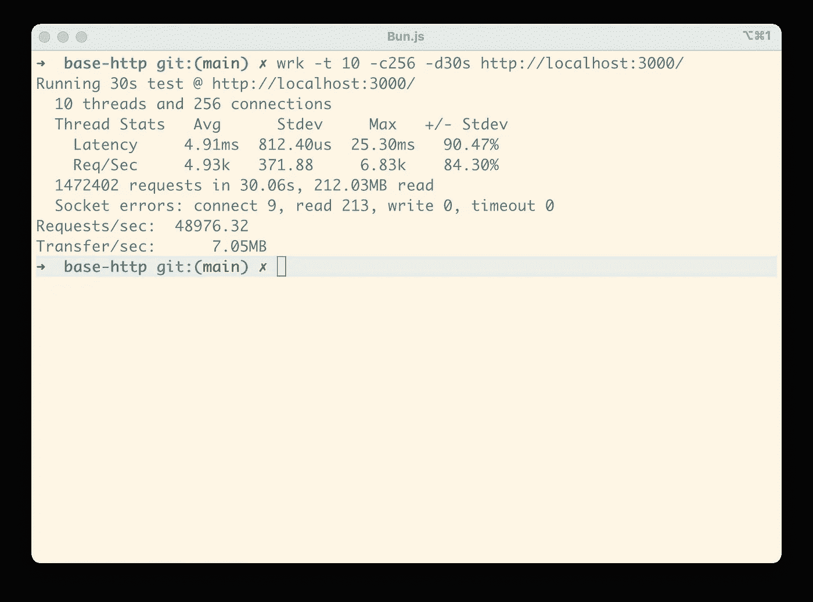

它平均每秒可以处理 49k 个请求。现在让我们看看 Node.js 可以用同样的代码做什么。

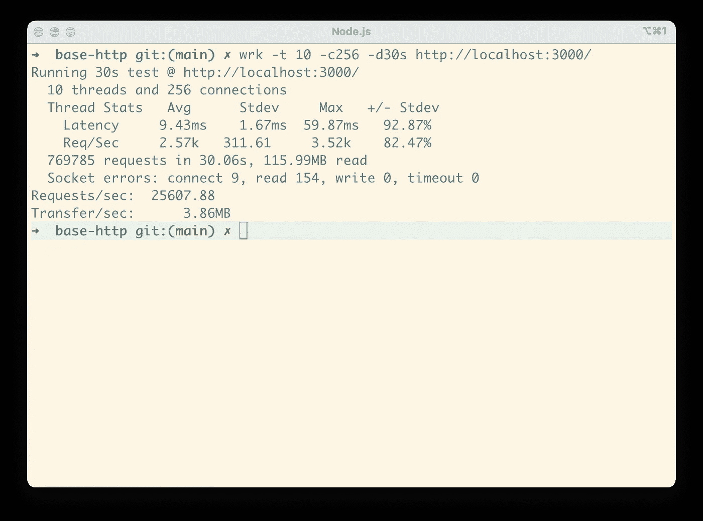

如您所见，使用 Express 时，Bun 比 Node.js 快 2 倍，但是让我们更进一步，看看如果我们删除 Express 并使用原始 HTTP 服务器会发生什么。

我们将对 Node.js 使用以下代码。

如您所见，raw Node.js HTTP 服务器每秒可以处理大约 70k 个请求。

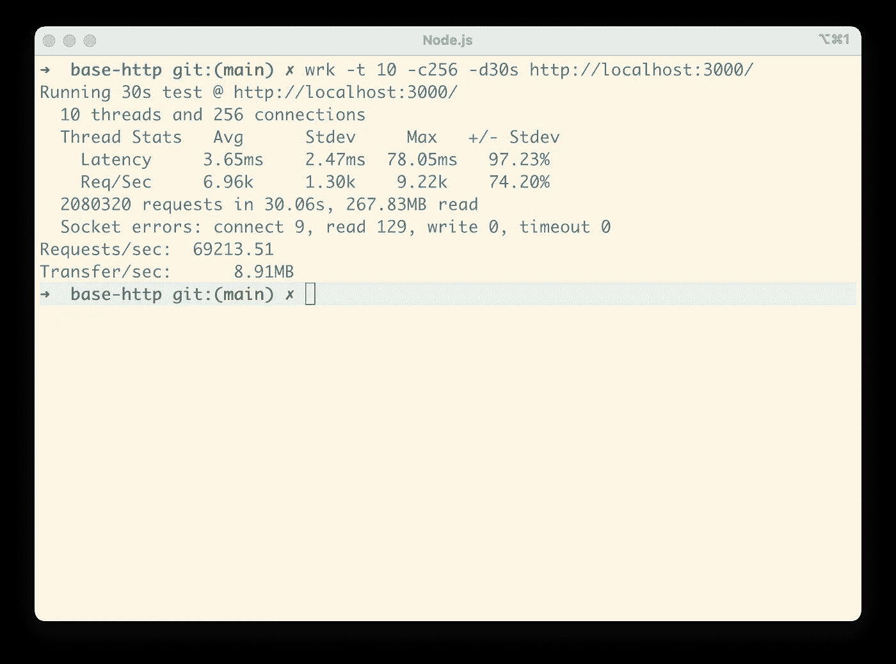

现在让我们测试 Bun，用它自己的方式创建一个 HTTP 服务器。

现在 Node.js 和 Bun.js 的差距更大了，Bun.js 每秒处理 152k 请求。

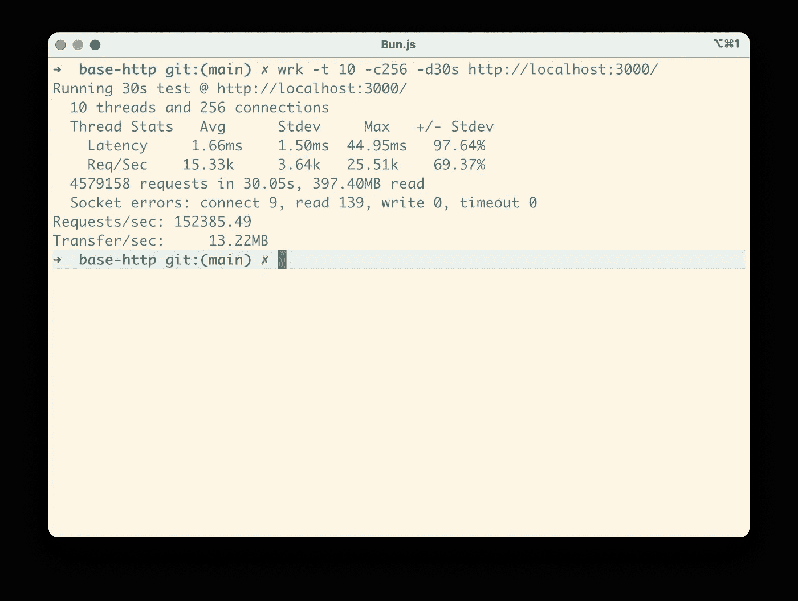

## 使用 bun 作为软件包管理器

Bun.js 比 NPM 快 4-80 倍。您可以打开现有的应用程序并运行`bun install`,看看它会以多快的速度为您的应用程序下载所有的依赖项。

您可以使用`bun add`和`bun remove`在您的应用程序中添加/移除包。

# 挑战 Bun.js

与 Node.js 和 Deno.js 相比，Bun.js 显示了巨大的性能改进，我想看看 Bun.js 展示的三个主题中的每一个。

## 服务器端渲染反应

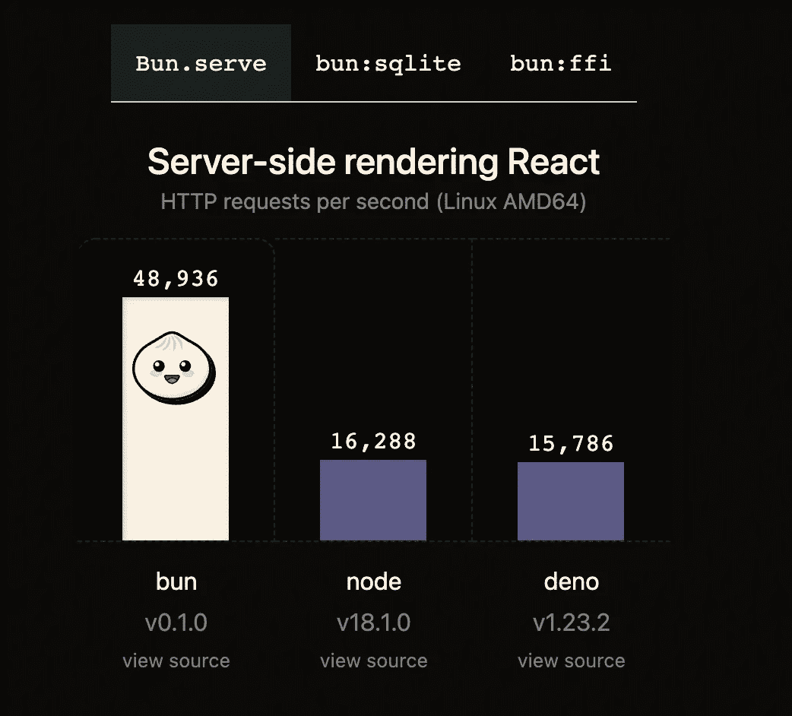

Bun.js 声明在使用服务器端 React 渲染时，它至少比 Node.js 和 Deno 快 2.5 倍。

但是当您开始研究 Bun.js 提供的性能测试示例时，您会发现它是一个呈现在后端的裸露 React 组件。

上一次有人用“raw React”用 Node.js 实现 SSR 是什么时候？所以还是尽量现实一点用 Next.js 吧！

你可以用一行代码`bun create next ./app`用 bun.js 创建一个 Next.js 应用程序，然后你可以用`bun dev`运行你的应用程序来启动一个开发服务器。

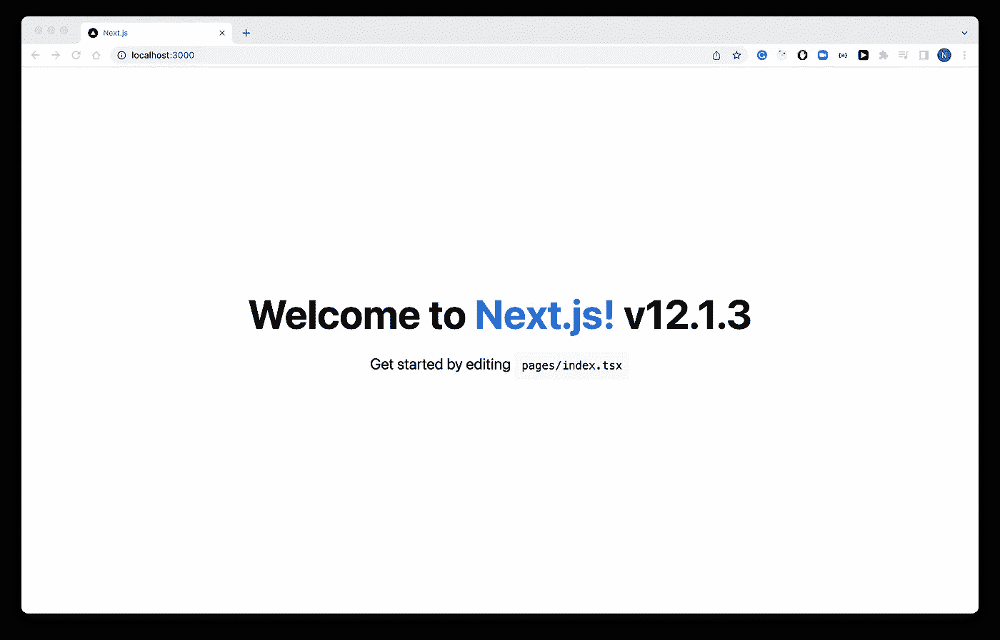

让我们做一个简单的“性能测试”。我将使用 Apache Benchmark 加载 bun.js，将并发性设置为 10，产生 10000 个请求。

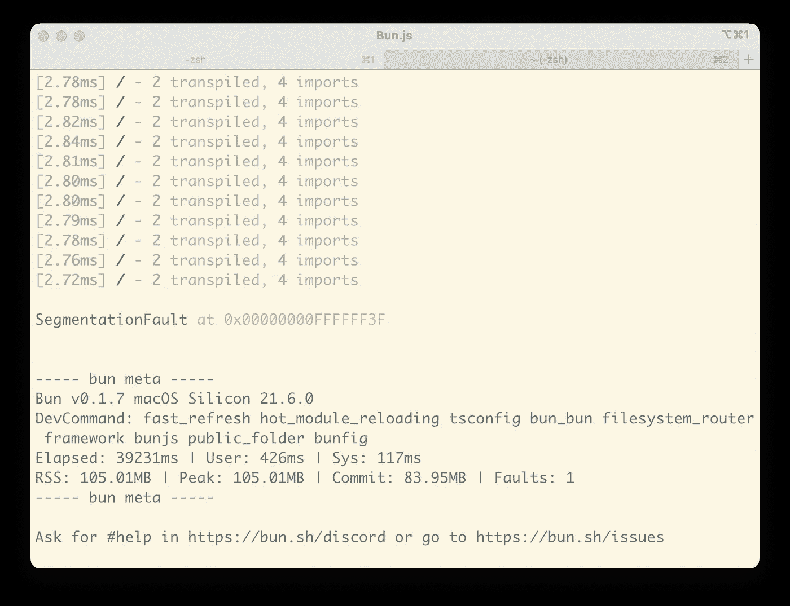

没想到在完成 722 个请求后，Bun.js 因分段错误异常而崩溃，而用 Node.js 运行 Next.js 可以轻松处理 879 个请求/秒这样的负载。

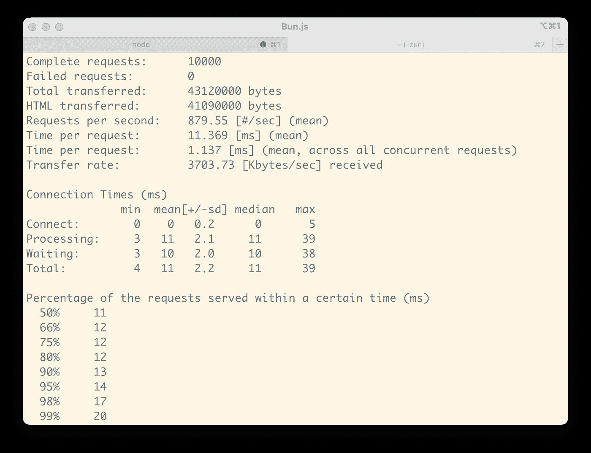

平心而论，根据 Bun.js [路线图](https://github.com/oven-sh/bun/issues/159)，Next.js 目前只是部分支持，其他 SSR 工具如 [Nuxt.js](https://nuxtjs.org/) 或 [SvelteKit](https://kit.svelte.dev/) 还不支持。

## 装上一张大桌子

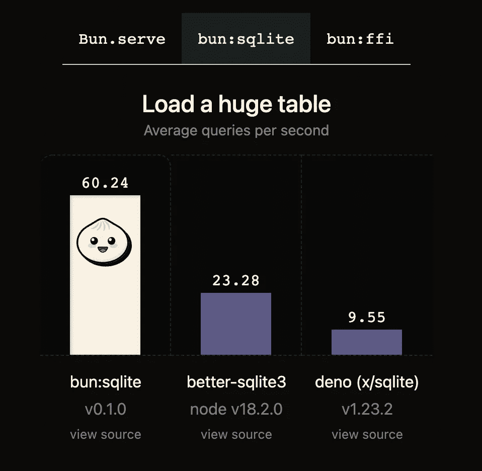

有趣的是，Bun.js 展示了对 [SQLite](https://www.sqlite.org/index.html) 包的性能测试，以显示它可以进行多少次查询。

如果您不知道，SQLite 是一个数据库引擎，主要用于移动/计算机本地应用程序，因为 SQLite 中的数据库只是文件系统上的一个本地文件。您从来没有使用 SQLite 来构建您的后端，因为您不能适当地扩展它。

我承认这显示了 Bun.js 的性能有多好，因为它作为数据库引擎比 Deno 或 Node.js 好得多。

为了确保我们理解使用真实数据库时的区别，让我们尝试使用真实的数据库来执行一个简单的测试。我更喜欢 [PostgreSQL](https://www.postgresql.org/) ，因此我将使用 [*pg*](https://www.npmjs.com/package/pg) NPM 包。

我创建了一个表，并为它生成了一百万条记录。让我们创建一个 HTTP 服务器，它从数据库中读取数据并将其返回给客户机。对于每个请求，我们将从 DB 中读取 100 条记录，并带有随机偏移量。我们将使用下面的代码来执行测试。

出乎意料的是，当我用 Bun.js 运行这段代码时，我得到一个错误，它不能解析模块`dns`。它是 Node.js 的核心模块，似乎 Bun.js 还不支持它。

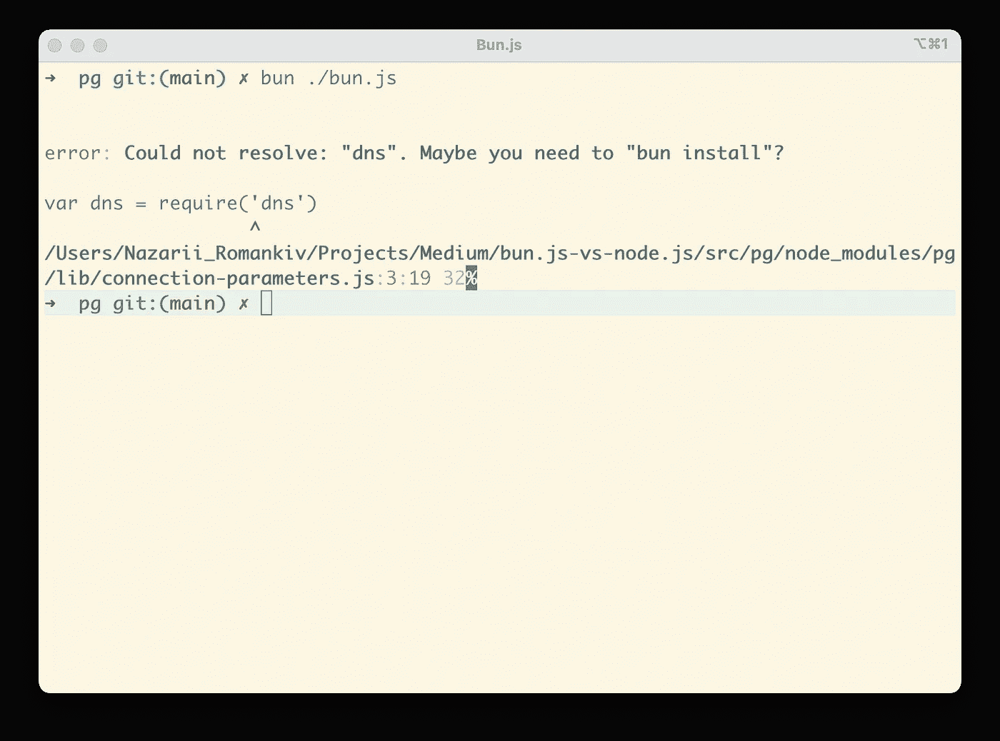

我们必须等待 Bun.js 提供更好的向后兼容支持来执行这个测试。

## 对外功能接口

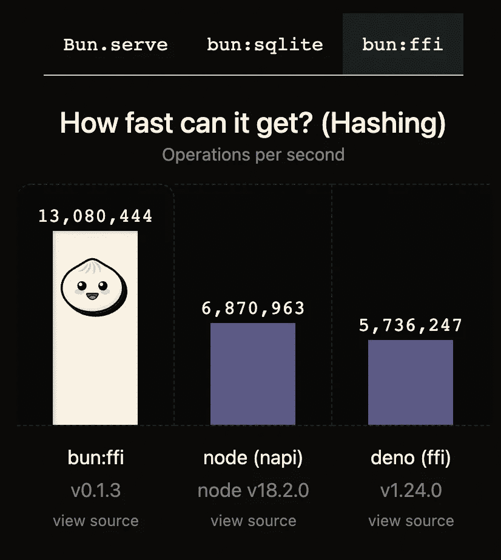

Bun 用 FFI 显示了很好的结果，但是让我们弄清楚 FFI 是什么。假设你有一个用另一种语言编写的函数，比如 C 或 C++，出于某种原因你想调用它。假设你想用一些 C 库进行图像处理。有两种方法可以做到这一点，第一种是为你的语言/运行时实现某种扩展(在 Node.js 的情况下，它将是一个[原生插件](https://nodejs.org/api/addons.html))或者使用 FFI 来允许你这样做。

我要说的是，在 Node.js world 中使用 FFI 是一种罕见的情况，尽管它仍然显示了 Bun 有多快。

# 其他亮点

## **没有调试器**

它实际上还没有调试器。

## 捆绑和运输

JS 世界变化很快。今天，我们使用 JSX，因为 React，但我们也有 Angular/Svelte/Vue，他们有不同的文件格式，目前你不能只使用 Bun.js。

## 以打字打的文件

Bun.js 提供了现成的 TS 支持，他们正在犯 Deno 开发人员犯过的同样的错误(即使由于捆绑/移植而规模更大)，必须有人支持核心 Bun.js 以跟上 TypeScript 的变化。现在，要获得 TS 的最新特性，你需要等待 Bun.js 添加对它的支持，这对于某些人来说可能没问题。

## Bun.js！== Node.js

Bun.js 目前并不是 100%向后兼容 Node.js，尽管它努力尽可能向后兼容。这是一个完全独立的运行时。目前并不是所有的 Node.js 核心模块都在 Bun.js 中实现，像`cluster`或者`dns`和`child_processes`。

## 证明文件

因为现在还是早期测试版，所以 Bun.js 没有太多关于它和它内部的文档。

## 快速启动时间

Bun 比 Node.js 有更好的启动时间，这在无服务器的环境中或者用类似 Electron 的东西构建的 PC 应用程序中是一个很大的优势。

## Bun.js 为什么这么快？

首先 Bun.js 用的是不一样的 js 引擎。它没有使用 [V8](https://v8.dev/) ，而是使用了 [JavaScriptCore](https://developer.apple.com/documentation/javascriptcore) 。除此之外，它是用 [Zig](https://ziglang.org/) 编程语言编写的。

# 我对 Bun.js 未来的展望

Bun 试图做一个多合一的工具，给贡献者带来很多负担。在我看来，Bun 应该思考如何走 UNIX 的路。我所说的 UNIX 方式是指拥有独立的小工具，它们能做好一件事，并且还能一起玩。Bun.js 现在就像一个扑克碗，我会把它分成不同的成分。

bowl 可以是一个 bun-core，一个运行时+包管理器，它将提供核心功能，为我们的应用程序提供疯狂的性能和最小的开销。

然后 bun-core 可以提供 API 来用模块(我们的组件)扩展它，并且可以通过内置的包管理器安装一个单独的模块来提供诸如捆绑或传输、对其他框架的支持等等。

## Node.js 杀手？

值得称赞的是，Bun.js 对未来有很大的野心。它的目标是取代 Node.js，尽管做出这样的声明还为时过早。Bun.js 的性能肯定是疯狂的，但是它试图一次替换很多工具，这给 Bun.js 的贡献者带来了很大的负担，而且它是用 [Zig](https://ziglang.org/) 这种不是很流行的编程语言编写的，这使得搜索贡献者成为一项艰巨的任务，IMHO。

# 摘要

Bun.js 仍然是一个太年轻和不成熟的工具，需要几年的时间才能开发到可以在我们的生产应用程序中使用的程度。虽然它有很大的潜力。

我相信现在 Node.js/Deno 会有更多的“动力”来尽可能地提高他们的表现，因为他们在市场上有一个潜在的强大竞争对手。

## 接下来呢？

想要更多 Bun.js 的实验？在下一篇文章中，我们将看到如何在 AWS Lambda 中使用它。

爱 Node.js？你可以阅读我关于 Node.js 的其他文章:

*   [为什么异步是一种趋势？](/why-asynchronous-is-a-trend-c9892667e245)
*   [如何处理 Node.js 中的拦截器？](/how-to-handle-blockers-in-node-js-1966d0399703)

# 分级编码

感谢您成为我们社区的一员！在你离开之前:

*   👏为故事鼓掌，跟着作者走👉
*   📰查看[级编码出版物](https://levelup.gitconnected.com/?utm_source=pub&utm_medium=post)中的更多内容
*   🔔关注我们:[推特](https://twitter.com/gitconnected) | [LinkedIn](https://www.linkedin.com/company/gitconnected) | [时事通讯](https://newsletter.levelup.dev)

🚀👉 [**加入升级人才集体，找到一份惊艳的工作**](https://jobs.levelup.dev/talent/welcome?referral=true)