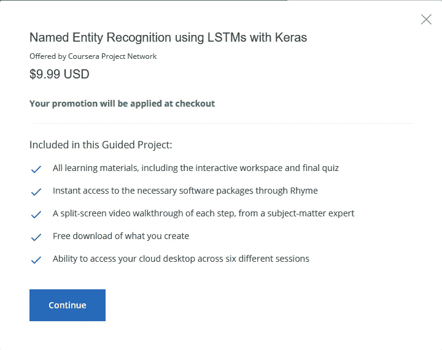
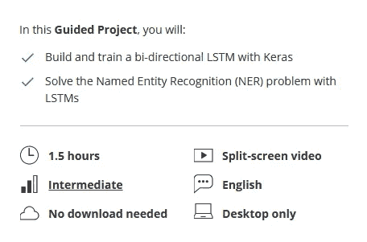
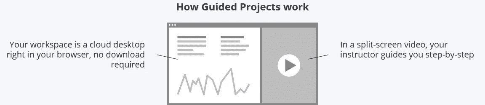
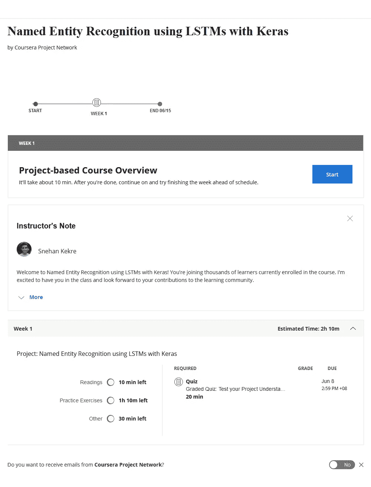
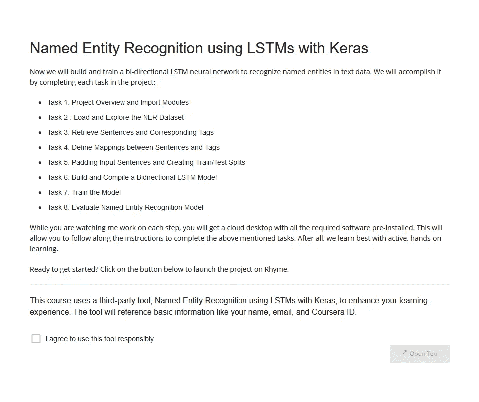
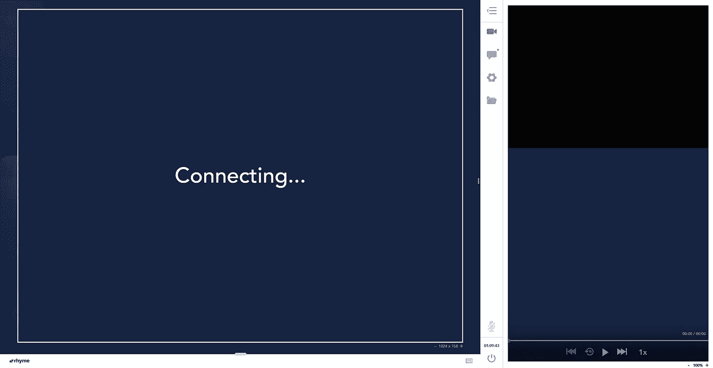
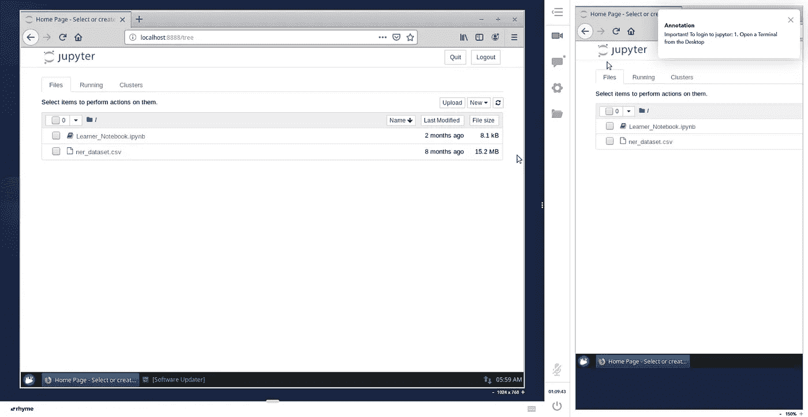
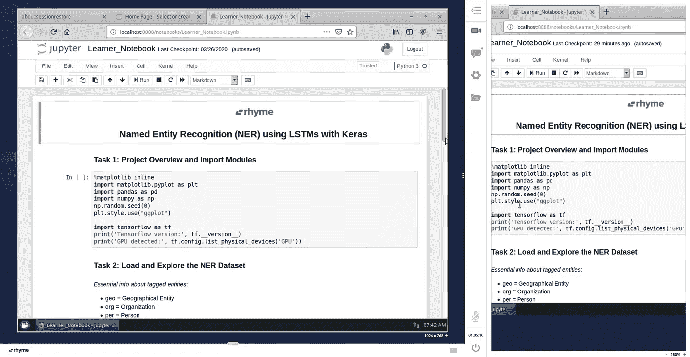
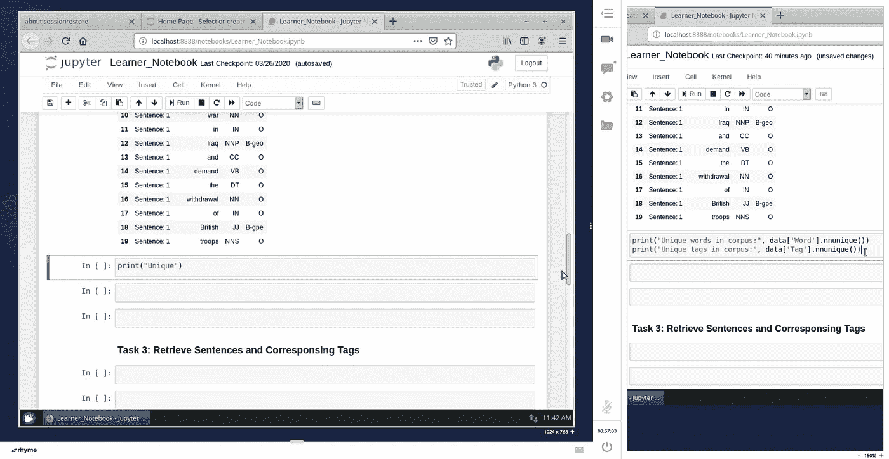

# Coursera 导学项目值得吗？

> 原文：<https://levelup.gitconnected.com/is-coursera-guided-project-worth-it-589a7669f62f>

韦斯·希克斯在 [Unsplash](https://unsplash.com?utm_source=medium&utm_medium=referral) 上的照片

# 背景

当我收到 Coursera 的电子邮件时，我第一次知道了 Coursera 的指导项目。出于好奇，我想看看它们，看看它们是否能对我的学习有所帮助。在他们的页面上，他们涵盖了数据科学、商业和计算机科学方面的项目。我在探索他们能为数据科学提供什么，偶然发现了[“在 Keras 中使用 LSTMs 进行命名实体识别”指导项目](https://click.linksynergy.com/deeplink?id=q15T/SfRF14&mid=40328&murl=https%3A%2F%2Fwww.coursera.org%2Fprojects%2Fnamed-entity-recognition-lstm-keras-tensorflow)。这将为我提供两件事，一是学习命名实体识别，二是在指导项目中的经验。

我将浏览以下部分:

*   价格
*   时间
*   行为
*   我自己的经历
*   我的想法

 [## 教育

### 通过我们的练习题为您的下一次技术认证考试树立信心。我们提供课程来加速…

www.eduelk.com](https://www.eduelk.com)  [## 关于我们-教育

### 在爱德克教育，我们相信熟能生巧。我们知道准备参加技术认证是…

www.eduelk.com](https://www.eduelk.com/about-us)  [## 通过我们负担得起的练习题获得自信——教育

### 编辑描述

www.eduelk.com](https://www.eduelk.com/shop-for-practice-questions)  [## 预订课程-教育

### 我们的课程对学生很有吸引力。我们确保每个学生在课堂上都有充分的练习。我们的…

www.eduelk.com](https://www.eduelk.com/book-a-lesson) 

# 价格

指导项目的成本[1]

在这种情况下，9.99 美元的 1.5 小时指导课是合理的，可以访问支持 GPU 的环境。

# 时间

指导项目总结[1]

对于大约 1.5 小时的课程，我认为学习内容和知识应该是相当大的，不会涉及太多的理论。这些课程完全是动手实践课。但这种情况下建议具备 Python 编程、神经网络知识等一些先决条件。

# 行为

引导式项目如何工作[1]

指导项目会议通过 Rhyme 进行。Rhyme 是 Coursera 的一个平台，供学习者在浏览器中进行实践。所需工具安装在他们的云桌面上。登录后，学员将看到两个片段，一个是他们的工作区，另一个是教师的视频教程。

# 我的经历

我决定尝试一下，因为我的工作要求我在用例中应用命名实体识别(NER)。

迎接我的是摘要页，其中包括讲师的笔记和我需要完成的内容。由于指导项目本质上是非常具体的知识领域，我相信该项目可以在一周内完成。你想多快完成它实际上取决于你对学习的专注程度。

因此，我准备好开始学习，并得到了这个指导项目中涵盖的任务/主题的概述。我不得不同意负责任地使用这个工具，以避免误用云桌面。

同意并登录后，迎接我的是承诺的分屏。需要一段时间来连接。

一旦成功连接，我就可以访问左侧的云桌面，并与右侧的分屏视频进行交互。还没什么特别的。

当我播放右边的视频时，我按照教师的指示进行操作。

我注意到的一件事是，你必须左右移动屏幕才能查看讲师视频上的源代码。但是，您可以相应地调整分屏，尽管只能从右到左或从左到右。

## 初始延迟问题

Rhyme 最初有可怕的延迟问题。最初的时刻真的让我怀疑这个指导性项目是否值得。然而，一天后，没有太大的问题。

# 思想

所以回到这个问题，“Coursera 引导的项目值得吗？”。我会说，如果你的工作需要一个特定的知识领域，或者你打算向未来的雇主展示你的实际知识，那么是的。然而，如果你想学习一个知识领域的整个流程，比如一般的数据科学，那么这可能并不合适。这适合于那些想学习知识领域特定部分的人，比如使用 Keras 中的 LSTMs 进行命名实体识别。

从现在起到 2020 年 6 月 12 日，Coursera 允许你免费参加一次指导项目。只需在 2020 年 6 月 12 日之前报名参加列出的任何指导项目，即可享受免费课程。

希望你喜欢并了解 Coursera 的课程。下一篇文章再见。和平！✌️

 [## 教育

### 通过我们的练习题为您的下一次技术认证考试树立信心。我们提供课程来加速…

www.eduelk.com](https://www.eduelk.com/)  [## 关于我们——教育

### 在爱德克教育，我们相信熟能生巧。我们知道准备参加技术认证是…

www.eduelk.com](https://www.eduelk.com/about-us)  [## 通过我们负担得起的练习题获得自信——教育

### 编辑描述

www.eduelk.com](https://www.eduelk.com/shop-for-practice-questions)  [## 联系方式 1——教育

### 编辑描述

www.eduelk.com](https://www.eduelk.com/book-a-lesson) 

# 参考

1.  [https://www . coursera . org/projects/named-entity-recognition-lstm-keras-tensor flow](https://click.linksynergy.com/deeplink?id=q15T/SfRF14&mid=40328&murl=https%3A%2F%2Fwww.coursera.org%2Fprojects%2Fnamed-entity-recognition-lstm-keras-tensorflow)

 [## 编写面试问题

### 一个完整的平台，在这里我会教你找到下一份工作所需的一切，以及…

技术开发](https://skilled.dev)