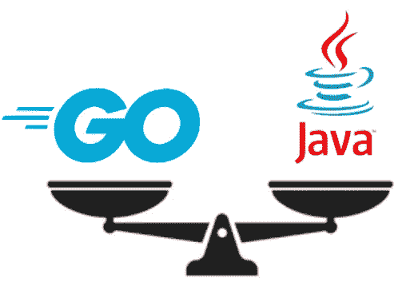

# 围棋比 Java 快吗？一个不该问的问题

> 原文：<https://levelup.gitconnected.com/is-go-faster-than-java-a-wrong-question-to-ask-adfbe0b071cb>

## 对于理性的选择，我们需要考虑其他更重要的因素。

我经常碰巧在帖子中比较 Java 和 Go。几乎总是，比较的中心要么是执行速度，要么是特定特性的存在/缺乏(通常在 Go 中不存在，而在 Java 中已经很好地建立)。

因此，如果有人写道 Go 很棒，会有几十条回复说 Java 更好，因为“*有一个基准测试证明 Java 快得多*”(加上它有泛型和 try-catch)。然后你阅读了“*基准测试*，它声称 Java 比 Go 快，你发现另一群评论支持相反的观点。

基调倾向于迅速转向宗教战争。



但是，等一下。有没有可能从不同的角度来看待它？是否有可能评估两种语言中的哪一种可能给特定的组织、产品或项目带来更多的好处？

> 在比较不同的编程语言时，标准企业业务应用程序的易于开发和维护是要考虑的最重要的方面

这意味着比较编程语言中真正重要的东西，在大多数情况下，特别是在企业中，是开发和维护标准业务应用程序代码的效率。标准业务应用程序代码的开发和维护通常是大部分成本所在。因此，这种代码的开发和维护的容易程度应该是任何评估的中心。

# 让我们从事实出发

是的，有些事实是真实的，不依赖于观点，至少在绝大多数情况下是如此。这里我列出了我想到的，没有特定的顺序。

## 事实:Go 产生更小的可执行文件，使用更少的内存

包含 Go 可执行文件的 Docker 镜像通常比 Java 的同类文件[小](https://www.ardanlabs.com/blog/2020/02/docker-images-part2-details-specific-to-different-languages.html)。如果基础设施资源的优化或预热时间的最小化很重要，这一点很重要，后者与“功能即服务”模式相关。

## 事实:Go 可以维持更高水平的并发性

Go 可以轻松火[十万 goroutines](https://rcoh.me/posts/why-you-can-have-a-million-go-routines-but-only-1000-java-threads) 。Java 线程要受限得多。同样，如果我们希望最大限度地利用我们的 CPU，特别是在 I/O 受限的工作负载环境中，这一点非常重要。

## 事实:Java 有连接一切的库

在某些情况下，这可能是一个关键的决策因素。如果需要连接 CICS 或 TxSeries 等事务管理器或其他更老的技术，那么 Java 是唯一的选择。Go 中没有这方面的包。

## 事实:现在有更多的 Java 程序员

就这么简单。

## 事实:Go 的语法更简单

Go 规格说明书有 86 页，包括例子。2000 年的 Java 规范已经有 [250 页](https://books.google.it/books?id=Ww1B9O_yVGsC&printsec=frontcover&source=gbs_ge_summary_r&cad=0&q&f=false#v=onepage&q&f=false)，从那时起事情就没有变得更简单。恰恰相反。

## 事实:“编写一次，到处运行”是不太相关的

随着容器越来越受欢迎，你几乎可以用任何语言编写，并且在任何地方都可以在 Docker 上运行

## 事实:在构建方面，Go 更快

你见过 Java 开发人员启动测试套件执行的屏幕上的纺车吗？嗯，这种情况在围棋中发生的可能性要小得多。

# 还有一些不太明显的事实，我们称之为观点

不幸或幸运的是，生活并非非黑即白。有灰色的阴影。这里有一些与我们案例相关的阴影。

## 有问题:Go 对于严肃的应用程序开发来说太有限了

Go 没有泛型。围棋没有试接球。有人说，如果没有这些基本特性，就无法开发出真正的企业级代码。你很容易一遍又一遍地重复同样的代码。

## 问题:Java 变得太复杂了

相反的论点。有了 Java，你就有了面向对象、通过注释面向方面的编程、函数式编程(即使它听起来有点笨拙)，还有像 Spring 这样的神奇框架。有人说，根据你早上起床时的心情，你可以用许多方式开发相同的逻辑，有许多不同的风格，这可能会混淆代码，使应用程序更难维护。

## 可疑:Go 是用于系统编程的

虽然它确实被大量用于构建像 Docker 和 Kubernetes 这样的东西，但没有明确的理由说明它为什么不适合标准的企业应用程序开发，除非我们使用其他有问题的元素作为论据，例如上面列出的“generics & try/catch”论据。

# 真正的问题是:哪种语言能提供最高效的开发体验和最少的 gravose 维护？当然，在我们的背景下

正如你所看到的，这两种选择都有利弊。但是在做决定的时候，我们需要看具体的语境。

让我们考虑一个标准场景，一个开发企业解决方案的软件商店，比如银行应用程序或订单管理系统。

在这种情况下，对总成本贡献最大的两个要素是开发工作和维护工作。在某些情况下，某个解决方案所需的基础设施的成本也可能是相关的。因此，这些是我们需要考虑的因素，以便围绕要使用的技术做出合理的选择。

## 开发和维护工作

这是大多数情况下最重要的评估因素。开发和维护一个用 Go 写的应用程序和用 Java 写的应用程序成本更低吗？

## **有限初始投资**

让我们从头开始。如果我们是一个 Java 商店(大多数都是)，我们可能倾向于认为只有一个答案:“你懂 Java ->用 Java 你会更有效率”。

另一方面，简单在这里非常方便。简单意味着容易学习。如果我们知道如何编码，只需几天就能在 Go 中编写出产品代码。不是最复杂的，但肯定是好的。同时，如果我们不知道如何很好地编码，我们就有一个基本的问题，不管是什么语言。总结就是，考虑到它的简单性，你仍然可以评估 Go，即使你目前知道的只是 Java。

## **是单纯还是贫穷？**

围棋很简单。但也可能被视为贫穷。我们已经提到，它没有泛型，错误管理可能被认为是冗长的。本质上没有类，也没有继承。因此可以说，缺乏这些特性会降低生产率。

另一方面，围棋通常只有一种方法来做一件事。围棋创作者称之为“正交”。

如果只有一种方法，我们就不必考虑在解决问题时采用哪种风格。如果只有一种方法，那么阅读和理解别人的代码会更容易。

[一些研究](https://www.ybrikman.com/writing/2018/08/12/the-10-to-1-rule-of-writing-and-programming/)测量出我们花在阅读代码上的时间是写新代码的十倍，不管是我们自己的还是别人的。如果这是真的，简单和直接对优化效率是至关重要的。

# 看来围棋值得一试

所以，如果围棋简单易学，我们不需要投入太多就可以开始使用它。

如果 Go 如此简单和精益，它可以使企业级应用程序代码的开发和维护更加容易和高效。

如果构建和测试周期更快，开发人员最终会减少盯着旋转的轮子的时间。

如果 Go 中对并发性的支持如此之好，那么我们可以更好地利用我们的基础设施，特别是在 I/O 受限的场景中。

综上所述，用 Go 开发企业应用程序确实有可能在 IT 功能的整体效率方面带来实质性的提高。

当然，这一切都取决于环境，但获得重大利益的可能性似乎是具体的。因此，很可能值得考虑开始尝试它。我们只需要选择正确的项目候选人，创建一个团队，接受一些培训，看看结果是否是积极的。

这是一项投资。像任何投资一样，它伴随着一些风险，但也承诺一些收益。根据结果，您可以决定延长或停止它。

# 最终决策算法

在企业世界里，围棋值得一试吗？我们可以用一个决策过程算法来概括本文的全部内容，显然是用 Go 编写的

```
func DecideIfTryGo() Outcomes {
 // check for showstoppers (g.g. CICS integration) in my environment
 showstopper := os.Getenv("SHOWSTOPPERS") // if there are showstoppers there is no point to try Go
 if showstopper != "" {
   return errors.New(showstopper)
 } // find a good candidate project considering Go characteristics
 project := FindProject("concurrent", "IOBound", "InfraEfficiency") // create a team
 team := NewTeam(project) // do a bit of training
 TrainTeam(team) // launch the project with a timeout
 ctx, cancel = context.WithTimeout(context.Background(), timeout)
 outcomes := Launch(ctx, project) // return the outcomes
 return outcomes
}
```

# 最后的想法

本文围绕 Go 和 Java 展开，但是围绕真正重要的东西进行比较的核心思想可以应用于任何一组技术。

所以，只要你把它们和真正重要的东西进行比较，你就可以随意用其他东西代替 Java。让我们认识到环境很重要。