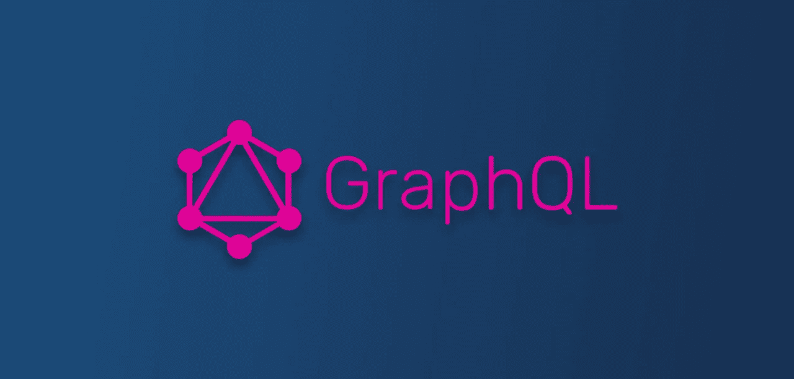

# GraphQL 是新的 REST 吗？

> 原文：<https://levelup.gitconnected.com/is-graphql-the-new-rest-fd9db3feb72b>



**什么是 GraphQL？**

[**GraphQL**](http://www.graphql.org/) 是一个新的 API 标准，它提供了一个更高效、更强大、更灵活的 REST 替代方案。它是由脸书创建的，目的是基于直观和灵活的语法构建客户端应用程序，用于描述它们的数据需求和交互。

传统 REST 调用的主要挑战之一是客户端无法请求定制的(有限或扩展的)数据集。在大多数情况下，一旦客户机向服务器请求信息，它要么获得所有字段，要么不获得任何字段。

另一个困难是工作和维护多个端点。随着平台的发展，数量也会增加。因此，客户端经常需要从不同的端点请求数据。

在构建 GraphQL 服务器时，只需要有一个 URL 用于所有的数据获取和变异。因此，客户机可以通过向服务器发送一个查询字符串来请求一组数据，该字符串描述了它们想要的内容。

**为什么选择 GraphQL？**

它解决了 REST 的过度提取和提取不足问题，因为客户端可以在*查询*中准确指定它需要的数据。

它支持快速的产品升级/版本控制，因为无需在服务器上做任何额外的工作就可以在客户端进行更改。

Dataloder APIs 通过批处理和缓存提供了一种减少通信开销的简单方法。

**GraphQL 分类法-**

*   **查询:**是向 GraphQL 服务器请求的只读操作
*   **突变:**是对 GraphQL 服务器的读写操作请求
*   **Resolver:** 负责映射运行在负责处理请求的后端上的操作和代码。
*   **类型:**一个*类型*定义了可以从 GraphQL 服务器返回的响应数据的形状，包括作为其他*类型*边缘的字段
*   **输入:**类似于*类型，*但是定义了发送到 GraphQL 服务器的输入数据的形状
*   **标量:**是一个原语*类型*，比如一个*字符串*、 *Int* 、 *Boolean* 、 *Float* 等
*   **接口:**接口将存储字段的名称和它们的参数，因此 GraphQL 对象可以继承它，确保特定字段的使用
*   **模式:**在 GraphQL 中，模式管理查询和变异，定义允许在 GraphQL 服务器中执行什么

**GraphQL 模式加载-**

将模式加载到 GraphQL 服务器有两种方式:

1.通过使用 GraphQL 的接口/模式定义语言(IDL/SDL)

2.通过使用一种受支持的编程语言

让我们用 IDL 来演示一个例子:

```
**type Employee {** **firstName: String****}**
```

现在，一个使用 Java 代码的模式定义的例子:

```
**GraphQLObjectType personType = newObject().name(“Employee “)** **.field(newFieldDefinition().name(“firstName”).type(GraphQLString))** **.build();**
```

**界面 Defⁿ语-**

接口定义语言(IDL)是指定 GraphQL 模式的最简洁的方式。该语法定义良好，将被正式的 GraphQL 规范采用。

例如，让我们为用户/电子邮件创建一个 GraphQL 模式，可以这样指定:

```
**schema {** **query: QueryType****}****type User {** **id: String!** **firstName: String!** **lastName: String!** **age: Int! @default(value: 0)** **emails: [Email!]! @relation(name: “Emails”)****}****type Email {** **id: String!** **email: String!** **user: User @relation(name: “Emails”)****}**
```

**感谢阅读💜**