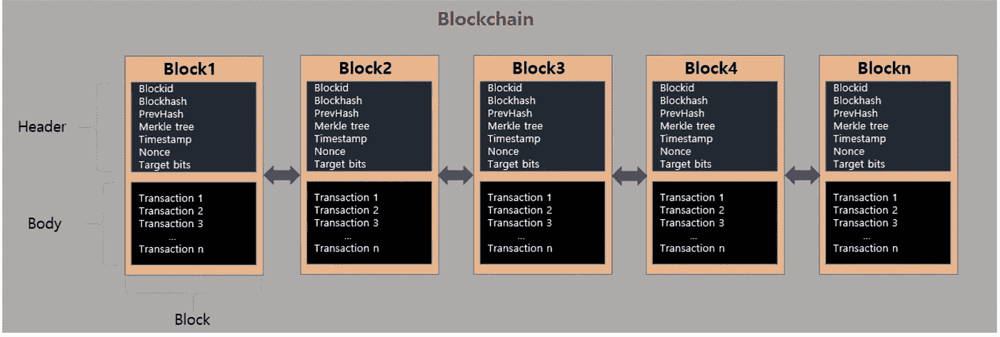
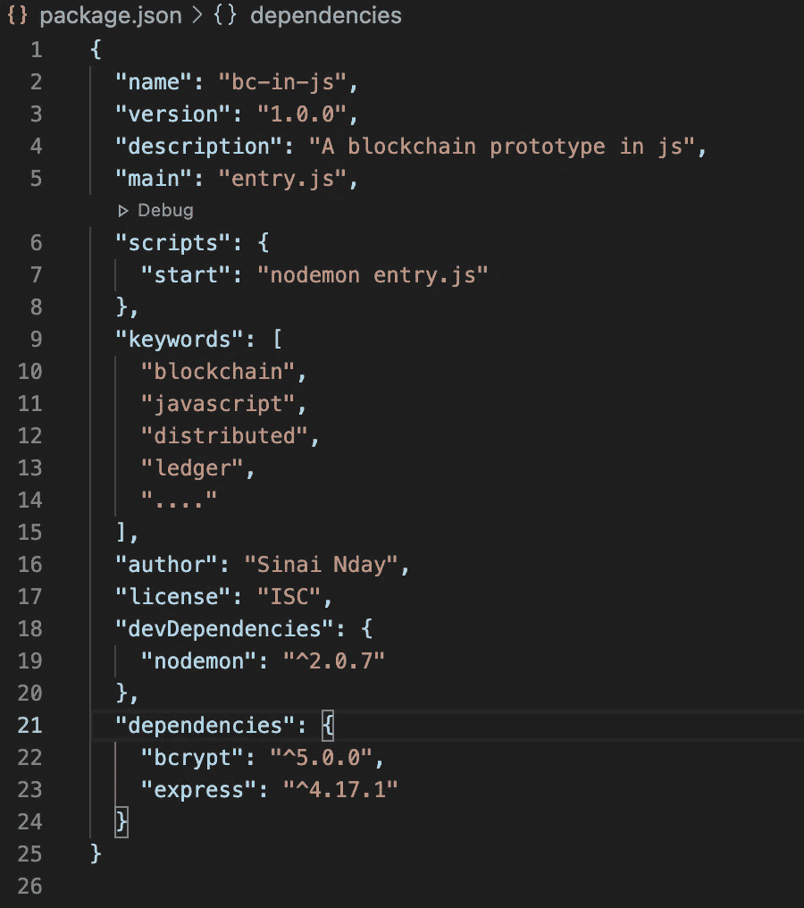
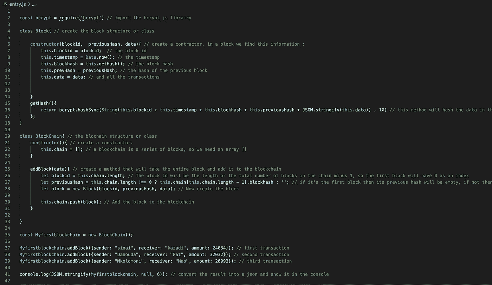
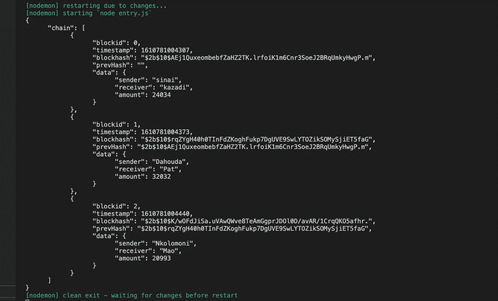

# 从零开始建立一个区块链很难吗？

> 原文：<https://levelup.gitconnected.com/is-it-hard-to-build-a-blockchain-from-scratch-93d95cb45f57>

> Javascript 中的第 2 集

网址:[https://open-blockchain-project.com/](https://open-blockchain-project.com/)

改进的 Golang 代码(前端+后端):[https://github.com/ndaysinaiK/baby-blockchain](https://github.com/ndaysinaiK/baby-blockchain/tree/master/baby-blockchain/Simple)

这篇文章是上一篇的延续，确保你看了第一集可以在这里找到。

在第一集中，我们讨论了区块链概念，并建立了一个婴儿原型，在这一集中，我们将使用一种不同的编程语言 javascript 来实现相同的概念。我知道在围棋中编码可能很难，希望你现在开心了😉。

所以参考我们在第一集画的图，让我们把它复制粘贴到这里，谢谢，[拉里·特斯勒](https://en.wikipedia.org/wiki/Larry_Tesler)。

西奈·恩代

使用 javascript 将应用相同的机制，耶！最常用的编程语言之一。

为了实现这一点，我们需要一台可以运行我们的 javascript 代码的服务器，我们可以使用网络浏览器，但让我们专业地做事。

**要求**:

*   **Nodejs** :在 web 浏览器外执行 JavaScript 代码的运行时环境。安装它，并尝试建立一个项目，你可以按照步骤[这里](https://nodejs.dev/learn/how-to-install-nodejs)。
*   **Express** :一个 nodejs 中间件 web 应用，这个我们后面会用到，不过先安装一下。
*   **Nodemon** :一个帮助开发基于 node.js 的应用程序的工具，当文件被修改时，它会自动重启节点应用程序
*   **Bcrypt** :一个快速加密的库，你也可以使用任何你想要的哈希函数。

让我们开始吧:

*   创建一个名为 javascript 的文件夹，并添加一个名为`entry.js`的文件
*   在文件夹中键入`npm init`来初始化项目，填写所有要求，对于入口点输入`entry.js`
*   打开终端，键入`npm i --save-dev nodemon`安装`nodemon`工具。
*   运行`npm i express`也安装 express JS。
*   安装 bcrypt `npm i bcrypt`

毕竟我的 package.json 是这样的:

文件夹结构如下所示:

打开终端，进入 javascript 文件夹，输入`npm run start`如果看到错误，不要介意，因为`entry.js`文件中没有任何内容。

现在我们准备开始编码我们的区块链。在任何 IDE 中打开`entry.js`文件并编写代码来理解它，跳过注释:

打完了吗？

**以下是一些解释**:

在上面的代码中，我们创建了一个 B **锁类**，它包含 id、时间戳、哈希、以前的哈希和数据属性。为了将来使用该类，我们创建了一个构造函数，并添加了一个散列生成方法。

由于区块链是一组块，我们创建了另一个名为 **Blockchain** 的类来存储所有的块，它只是一个在 javascript 中具有数组的承包商，然后我们添加了一个方法 **AddBlock** 将块添加到我们的链中。

最后，我们初始化了我们的链，并通过发出 3 个不同的事务进行了测试。

**结果**:

如果你安装了`**nodemon**`，只要检查你运行它的终端，你就会看到整个区块链的信息。

最终结果:西奈·恩代

恭喜你！这在 javascript 中非常简单，我们只用了几行代码就完成了。

**你知道你可以点击 50 次中等喜欢按钮吗？所以，如果你喜欢这篇文章，就把它打碎吧。👍**

整个代码:

Python 版本[此处](https://kabulo-nday.medium.com/is-it-hard-to-build-a-blockchain-from-scratch-23bac74e4f)

“**区块链工程师**是一名专业人士，他完全理解区块链、安全和软件工程的原理，用于设计、开发、维护、测试和评估区块链核心引擎和软件，而**区块链开发者**是一名专业人士，他在被称为去中心化应用的区块链之上构建软件。大多数区块链开发人员使用开放的区块链平台和框架，如以太坊、hyperledger fabric、EOS 等……”

你想成为哪一个？

> ***如果您在运行代码时发现任何错别字或错误，请联系我:***

LinkedIn: [西奈 Nday](https://www.linkedin.com/in/sinai-nday-312195160/)