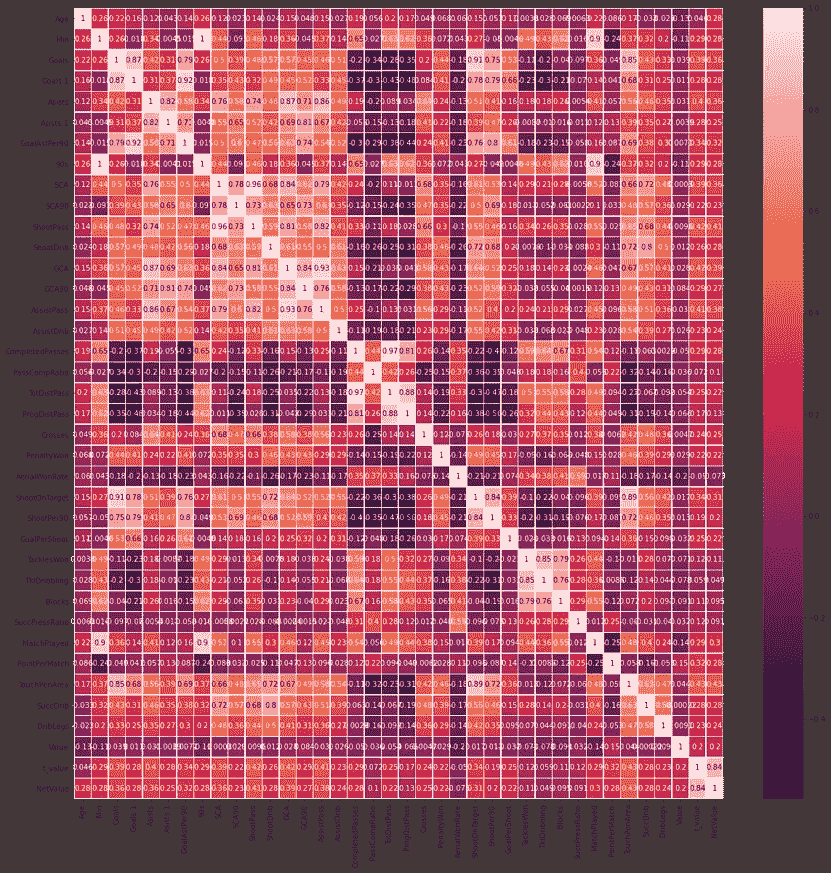
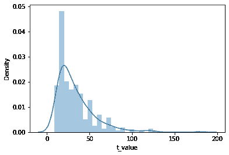
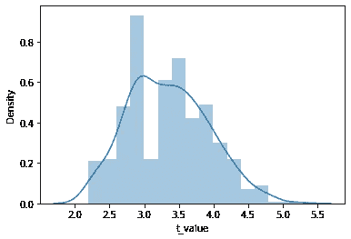
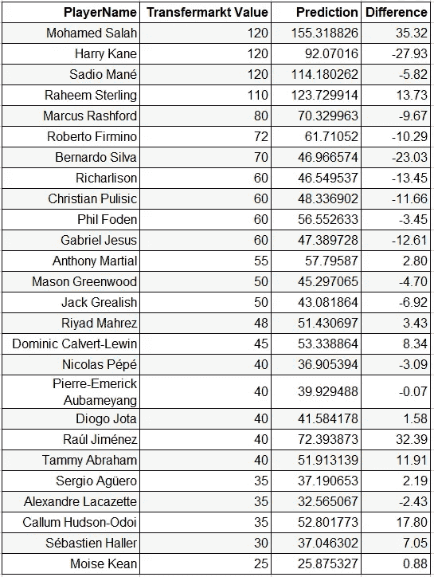
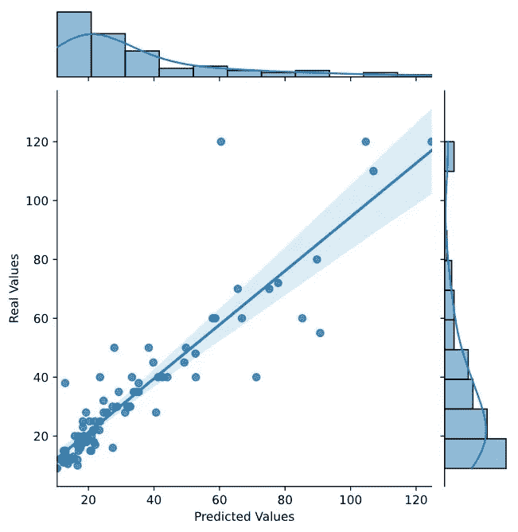

# 有可能预测足球运动员的价值吗

> 原文：<https://levelup.gitconnected.com/is-it-possible-to-predict-football-players-value-617eafe8669b>

## Web 抓取和回归模型简介

我在伊斯坦布尔数据科学院数据科学训练营的第二个项目；我试图通过一名球员 2019/2020 赛季的统计数据来发现是否有可能确定他的价值。这个项目是关于获得网络抓取，回归模型和交叉验证的实践经验。我的目标是预测它们的价值。我从著名的足球价值和统计网站 transfermarkt.de 上搜集了数据。这里有一个关于价值的问题。它们是基于它们过去和当前性能的当前更新值。但是我用的数据是上一季的。

马里奥·克拉森在 [Unsplash](https://unsplash.com?utm_source=medium&utm_medium=referral) 上的照片

## 通过网页抓取获取数据

我从[2019–2020 欧洲五大联赛统计(球员)| FBref.com](https://fbref.com/en/comps/Big5/2019-2020/stats/players/2019-2020-Big-5-European-Leagues-Stats)获取球员统计数据，从 transfermarkt.de 获取球员价值。首先，我从多个页面获取各种统计数据，包括进攻，防守，创造力，传球，射门和其他关键性能指标。我用 BeautifulSoup 分析了数据。

瓦列里·塞索耶夫在 [Unsplash](https://unsplash.com?utm_source=medium&utm_medium=referral) 上的照片

我重复了上面的代码，然后将所有数据合并到一帧中。这是由 seaborn heatmap 函数创建的每个项目的相关性快照。

功能:位置、年龄、分钟、进球、进球游戏、辅助、辅助进球游戏、进球 90、90s、SCA、SCA90、射门传球、射门 Drib、GCA、GCA90、辅助传球、辅助 Drib、完成传球、传球比、TotDistPass、ProgDistPass、传中、点球、AerialWonRate、射门 Target、射门 90、进球射门、铲球、TklDribbling、拦网、成功压比、匹配、积分匹配、触球区

作为目标，我从 transfermarkt.de 获取数据。这些是估计值，因此它们都是四舍五入的。玩家的价值观呈倾斜分布。我们从理论上知道，当我们建立模型时，对称分布的数据将帮助我们获得更好的结果。对数转换帮助我们将扭曲的玩家值转换成更正常的分布。您可以看到应用变换后分布是如何变化的。

玩家价值分布

## 更好贴合的新功能

年龄组而不是年龄组:我把数据分成与球员价值相关的组。

**赢家**:在大俱乐部踢球对球员的市场价值总是积极的。为了确定这一点，我创建了一个名为 winner 的 kpi，其计算公式如下:

winner = "每场比赛的点数" ^ 2 *比赛次数

**目标改变创建者**:我创建了一个 kpi 来确定对团队得分有影响的球员。而不是“助攻”，“射向目标”，“运球领先助攻”，“传球领先助攻”，“点球获胜”，“在第三区成功施压”。

被转换为分类变量的特征被转换为虚拟/指示变量:联赛和球员位置。一些联赛比其他的更有挑战性，所以同样的数据在那里更有价值。从数据集中，我们知道球员的价值与他的位置高度相关。

我还删除了彼此高度相关的特征。例如，在罚球区触球的球员比其他球员进更多的球。

我也不得不移除大部分替补球员；因为他们没有足够的统计数据。我们模型的预测性能严重依赖于数据；因此，删除数据意味着模型性能的下降。

对于建模，我使用了 scikit-learn 库中的各种回归模型。为了更好地拟合，我为不同的位置创建了单独的模型。我为前锋、中场和防守队员训练了不同的模型。因为对于每个位置，特征的重要性可能不同。比如对于一个前锋位置来说，在对方禁区内触球的次数和球员的价值是非常相关的，但是对于一个防守球员来说却不是。

交叉验证是成功的关键。对于训练数据和测试，我强烈推荐使用交叉验证。通过拥有不同的数据切片并对其进行训练，你将为现实生活中的挑战做好更充分的准备。Kfold 是一个很棒的自动化这个过程的功能，请检查一下。您可以在下面看到一个使用 kfold 进行交叉验证的简单代码。

在交叉验证和拟合多个模型后，线性回归是最好的一种，具有最小的 MSE，优于其他回归方法。所以我用它来训练我的数据。

## 结果

下面是一些球员 vs 他们 Transfermarkt 值的预测。为了显示更人性化的数字，我重新转换了这个值。这里有一些顶级球员和他们的转会市场价值与我的预测值(百万欧元)的对比，也有一个比较球员价值与预测的图表。

## 未来的工作

有些问题是统计不出来的。作为未来的工作，我们需要找出如何克服这些问题。

*   团队成员可能会影响彼此的统计数据。
*   替补球员缺少统计数据，所以我们正在丢失数据。
*   有些运动员容易受伤。俱乐部避免签下经常受伤的球员。
*   如果他们有几个精英球员，球员在他们国家的受欢迎程度是很重要的。本田圭佑就是一个很好的例子。俱乐部可以支付他们的实际价值，以获得该地区的知名度。
*   有些人能承受压力，有些人不行。大俱乐部需要能应对压力、能打大型比赛的球员。
*   球员的领导能力，工作效率和职业道德至关重要。光有天赋是不够的。
*   俱乐部的经济实力和声望。

请分享你对如何处理这些问题的见解。关于演示和代码，请检查我的 github。

感谢阅读。