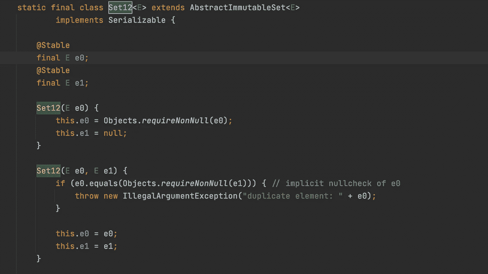

# Java 集合是否有序？

> 原文：<https://levelup.gitconnected.com/is-java-set-ordered-or-not-f5abc80a729f>


作者拍摄于斯德哥尔摩的萨德马尔姆

" Java 集合是否有序？"是你面试 Java 开发人员职位时最常被问到的问题。许多人没有回答这个问题，我不得不承认我是其中之一。

我早就知道答案是“是和不是”。

*   **否**。`HashSet`不是命令。
*   **是**。`TreeSet`是命令。

如果面试官继续问一些后续问题，我不确定我知道答案。

*   为什么 TreeSet 是有序的？
*   还有其他有序集实现吗？

作为一个总想进步的成长型开发者，有必要在阅读其源代码后，吸收 JDK 在设计和实现上的一些优秀思想，并总结相关资料。为了这个目的，我开始写这篇文章，并尽力解释集合的顺序。

首先，我们来看一个简单的集合类图。


集合—设置类图

Set 与 List 的唯一区别是 **Set 没有重复的元素**！请记住这一点，无论 Set 实现是什么，它都是基于这个原则。

# 有序集合

我们可以从上面的类图中直观的找到答案。所有实现`NavigableSet`接口的集合都是有序集合，如`LinkedHashset`、`EnumSet`等。

`NavigableSet`对`SortedSet`进行了扩展，在其基础上增加了一些界面功能。


分类集合


可导航集

```
E lower(E e);// Returns the greatest element in this set strictly less than the given element
E floor(E e);
E ceiling(E e);// Returns the least element in this set greater than or equal to the given element
```

这样，`Set`实现类提供了各种外部可用的方法，比如顺序、逆序、第一个、最后一个。

例如，`TreeSet`通过使用实现`NavigableMap`的`TreeMap`实现内部排序。但如果你真的了解它，你就知道为什么它被认为是糟糕的表现。

并非所有有序集合都共享相同的排序逻辑，例如，`LinkedHashSet`排序方式不同。一般来说，如果我们说集合元素是有序的，并且它们的顺序可以归类为两种不同的逻辑模式。

*   根据插入元素的顺序进行排序。
*   按照`Comparator`或`Comparable`接口实现排序。

`TreeSet`是后一种情况，而`LinkedHashSet,`是第一种情况。而且你可以从它的名字大致推断出`LinkedHashSet`的实现。

> **Set 接口**的哈希表和链表实现，迭代顺序可预测。— LinkedHashSet

它的底层是在`LinkedHashMap`实现的基础上，通过 1.8 版本后的`Spliterator.DISTINCT | Spliterator.ORDERED`迭代器来保证顺序。

除了实现`NavigableSet`接口或者`Spliterator`迭代器集合，还有其他选择实现集合排序吗？

**是的。**

最简单的情况是一组“`of(E)`方法”JDK9 添加到 set 接口，支持构造包含 0 到 10 个元素的不变集，其真正的内部实现是`ImmutableCollections`类。

在这个工具类中有两种方法来实现这些集合。

*   包含少于两个元素的集合通过`Set12`类实现。



`ImmutableCollections.Set12`

*   为了实现两个以上元素的集合，我们使用`SetN`类。

不仅`SetN`类本身是不可变的，而且它还通过内部的最终数组和`@Stable`注释的声明来确保元素的不变性。


`ImmutableCollections.SetN`

对于它的不变性，它自己的实现只会集中在 add(构造函数)和 traverse ( `SetNIterator`)两个方面。


`ImmutableCollections.SetN`

用数组存储集合元素的最大特点是确定数组索引和元素 hashcode 的关系，这通常是保持集合高效率的关键因素。这里的实现是探针方法。


`ImmutableCollections.SetN.probe`

实际上，与这种实现类似的代码在早期的`EnumSet`中已经有了，也是通过数组保存元素。

# 哈希特

**HashSet 为什么是无序的？**

我想到的直接原因是**性能**和**简单性**。在语言设计的最初阶段，由于计算机的性能远远落后于目前的水平，所以快速和高效是非常重要的。

在保持 Set 特性方面，hashcode 显然比 equals 要高效得多。并且能够直接定位数组中的元素位置使得 hashcode 比 iterate 更有效。但是在这种情况下，很难保证元素的顺序。


来自 https://en.wikipedia.org/wiki/Hash_table[的 HashSet](https://en.wikipedia.org/wiki/Hash_table)

通过计算 hashcode，我们可以实现最快的重复数据删除。考虑到可能的哈希冲突，我们使用一个额外的数组来存储与哈希一致的元素。JDK 一直在改进的高效散列算法是高效散列集的秘密。

在 JDK8 之前，HashMap 中的 Java hash 函数是这样实现的 [this](http://hg.openjdk.java.net/jdk6/jdk6/jdk/file/tip/src/share/classes/java/util/HashMap.java) :

```
static int hash(int h) {
    // This function ensures that hashCodes that differ only by
    // constant multiples at each bit position have a bounded
    // number of collisions (approximately 8 at default loadfactor).
    h ^= (h >>> 20) ^ (h >>> 12);
    return h ^ (h >>> 7) ^ (h >>> 4);
}
```

从 [JDK8](https://hg.openjdk.java.net/jdk8/jdk8/jdk/file/687fd7c7986d/src/share/classes/java/util/HashMap.java) 开始改了。我不能很好地解释这个数学问题，如果你感兴趣，请参考 [wiki 页面](https://en.wikipedia.org/wiki/Hash_table)。

```
static final int hash(Object key) {
    int h;
    return (key == null) ? 0 : (h = key.hashCode()) ^ (h >>> 16);
}
```

除了修改 hash 算法，HashSet 在 JDK1.8 版本中最大的进步是将保存重复元素顺序的列表改为使用[红黑树](https://en.wikipedia.org/wiki/Red%E2%80%93black_tree)的列表，将重复元素搜索的效率从`O(n)` 提高到`O(log n)`。

顺便说一句，`HashSet`并不是为了性能而并发安全！

# 第三方设置

除了 JDK 的实现，许多开源框架提供了具有各种功能的集合。著名的有

*   番石榴套餐
*   [月食收藏](https://www.eclipse.org/collections/)
*   [Fastutil](http://fastutil.di.unimi.it/)

在性能和存储方面，各种第三方工具的实现通常比 JDK 要好。下图是 [Eclipse 集合](https://www.eclipse.org/collections/)的 UnifiedSet 和 HashSet 的内存使用对比。


来自[日蚀收藏](https://www.eclipse.org/collections/)

[番石榴开源库](https://github.com/google/guava)应该是除了`[apache.commons](https://commons.apache.org/)`之外，Java 开发者最常用的第三方库。

我写这篇文章的想法是在我的同事提出一个问题时引发的。

> "订购了番石榴，你知道吗？"“不，”我叹了口气，诚实地回答。

为了更加博学，我花了一些时间阅读了`[ImmutableSet](https://guava.dev/releases/21.0/api/docs/com/google/common/collect/ImmutableSet.html)`的源代码，以了解它是如何实现有序特性的。哇，多么出色的设计啊！

简而言之，ImmutableSet 使用`Array + HashSet`来实现有序集。因为它是不可变的，所以不需要实现任何修改方法。

阅读起来并不难，只花了我大约 5-10 分钟。你可以从`add`法中找到所有有趣的东西。同样，ImmutableSet 的实现也依赖于底层数组。

*   计算哈希码
*   将项目添加到多个数据结构中，同时保持它们有序并支持快速获取。
*   调整大小。


来自 Guava com . Google . common . collect . immutableset

# 摘要

当你阅读 Java 或第三方库的集合代码时，你是在开动脑筋。作为我们课堂上学到的各种基础算法的真实练习，无论是复制、排序、哈希，还是搜索，你总能在各个地方找到反映。还包括位运算、移位运算等。面试中的大部分算法题，当你真正理解的时候，就成了小菜一碟。

Java Set 是 Java 集合的一部分，是最常用的类之一，并且经常更新。理解和掌握它并密切关注第三方的实现有助于您编写优雅和高性能的代码。

感谢阅读！