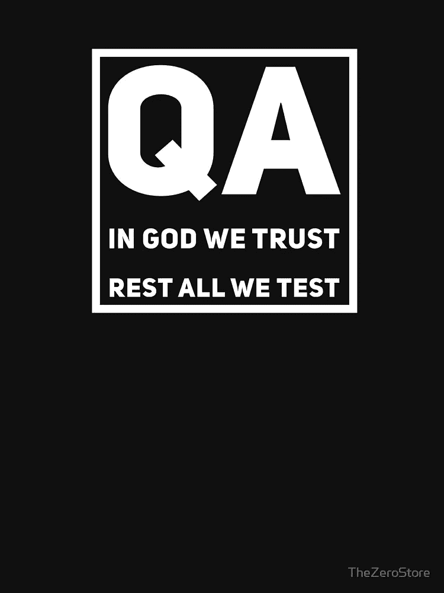

# 手工测试是个好职业吗

> 原文：<https://levelup.gitconnected.com/is-manual-testing-a-good-career-8b4cf5b45ed8>

在 [Unsplash](https://unsplash.com?utm_source=medium&utm_medium=referral) 上 [engin akyurt](https://unsplash.com/@enginakyurt?utm_source=medium&utm_medium=referral) 拍摄的照片

软件行业没有给手工测试人员足够的认可。

并不是每个人都对手工测试员这个头衔不满。那些日子还很遥远，可能永远不会到来。但是如果你提到你是一名 DBA，你比你提到你是一名测试人员更有可能进入一场关于技术的热烈讨论。尤其是手动类型的。

这与驾驶手动挡汽车对抗自动驾驶汽车很不一样，后者给你一种从引擎中获得更多工作的*机器人的感觉。*

# 我是一名手工测试员

在我 20 年的开发生涯中有 18 个月。这不是一个选择驱动的决定，而是一个情况驱动的决定。

测试既不是我的激情，也不是我的野心。我这样做只是因为我被一个会给我分配钟点任务的美体购物者缠住了，我不能离开他们，因为他们远程支付我很高的薪水——这是我家人需要的东西，但在 2010 年不是很主流。

我继续说，小心翼翼地制定我的退出计划。作为一名程序员，我认为自动化测试是我回归开发的唯一途径。

在没有心脏的情况下，我自学了丝绸、硒和 TestComplete 之类的东西。

不过，最后我遇到了两个结果:

对于我的耗时的自动化测试来说，我可以完成分配给我的任务。但是我不能证明客户投资是合理的，因为他们一直在考虑最大规模的自动化测试。一段时间后，整个自动化测试项目被取消了。我的身体购物者失去了收入来源。我没有被解雇只是一个技术性问题。

**#2:** 对于我在**手动测试**中 20%的技术工作和 80%的 Excel 工作，我修改了我的客户的税务产品以用于 IRS 报告。通过我的 bug 发现，客户能够增加他向客户提供的价值，从而使他能够被一家十亿美元的公司收购。他对我的工作给予了非常积极的反馈。(我的 body shopper 顾问甚至拒绝承认我的成功，更不用说奖励我升职了，这已经超出了本文的范围——反正我并不期待升职)。

重新获得我的开发角色已经 9 年了，并且和这么多优秀的 QA 专业人员一起工作过，我对测试职业的尊重与日俱增。

尤其是手工测试人员。

但是首先，我想剖析一下为什么手工测试在业界没有得到足够的重视。

# 为什么手工测试没有得到足够的重视？

商业要求一切都必须经过测试。

> 我们相信上帝。其余的，我们测试。

信用:[用于 QA 的 t 恤](https://www.redbubble.com/i/t-shirt/QA-engineer-t-shirt-In-god-we-trust-rest-all-we-test-by-TheZeroStore/55868716.FB110)

理论上，每个测试都可以自动化。编程原则规定，如果手工活动可以用软件自动化，那么软件也可以用来自我测试。

程序员喜欢这种自动化的概念，因为它确立了他们相对于手工的、繁琐的做事方式的优势。看科幻，他们(鄙视或者喜欢)生活在一个机器人检测你是否摄入了每日摄入的 X 克汤的世界里。在即时编译 ide 上工作，他们无法理解一个没有自动化可验证性的世界。

经理们喜欢自动化的概念，因为自动化给人一种可预测的感觉。(大多数经理对光环感兴趣，不是出于精神上的原因，但这是另一个讨论的主题😏).可预期的产品盈利能力更好。

但是像许多其他行业一样，在软件行业，时间就是金钱。自动化每一个测试是不实际的。

然而，有一些事情使得自动化测试的理由更加充分。为什么？

答案在某种程度上在于手工测试人员的相对幼稚。更多的是服务公司经理的强烈贪婪。

软件测试是一个主要由软件服务公司处理的领域。直到最近，产品公司自己才把测试掌握在自己手中。

大多数软件服务公司按小时提供服务。1 小时相当于 xx 美元。但是谁来决定小时数呢？

> 贪婪的手工测试人员的希望:客户在不久的将来不会雇佣任何聪明的程序员

在西部大开发时期，每项功能都被认为要花费 N 个小时。一个聪明的人工 QA 领导基于最复杂的单元为一个功能单元估计了 40 个小时(为方便起见为 1 周)，然后将同样的 40 个小时应用于每个单元。

完全被忽略的两个因素是:

*   并非所有单元都同样复杂
*   随着团队在项目上花费更多的时间，复杂的(甚至未知的)单元变得更加容易

如果客户谈判者没有足够意识到这两点，他就会被困住。他可能会要求 5 美元/小时的让步来取悦他的老板，QA 领导会很高兴地让步，盯着门里的脚。这 5 美元/小时可以通过低调的做法挤出来，并基于第一个项目中获得的信任获得利息。

然而，赢得合同后，服务公司开始偷工减料。它需要证明每小时 5 美元的折扣是合理的。它开始把不该标准化的东西标准化了。它还减少了对手工测试人员进行产品培训的工作量。

标准的测试模板、过时的设置脚本、关于功能的愚蠢问答("*为什么称呼字段没有验证？*”)，对用例细节毫不犹豫——这些都是费力、不聪明、无效的手工测试方式的标准症状，大多数测试人员都为此受到指责。

低薪测试人员缺乏批判性思维能力。他们也没有意识到围绕他们自己公司承诺的危险谈判。当他们以小时为基础被雇佣时，他们犯了一个错误，认为他们的简单任务是理所当然的，在很多纸上写满了无意义的测试，并向客户多收费。

然后，整个服务合同就悬在希望的最细线上:客户在不久的将来不会雇用任何聪明的程序员，他们会很快建议大多数手动测试可以自动化:

*   使用 TDD 可以使单元测试自动化(每个开发人员都会编写自己的测试)
*   集成和系统测试将在内部进行，由大多数利益相关者共同完成

当这种担心成为现实时(聪明的开发人员反对手动的、外包的测试)，甚至不可自动化的工作也被从手动测试人员手中夺走，因为他们(或者以前的)公司失去了围绕手动测试所提供的价值的所有可信度。

> 大多数手工测试人员会因为他们公司不道德的商业决策而受到责备。

如果你仔细观察，这并不是手工测试作为一种实践的失败。事实上，人们也承认其中一些是强制性的。但是服务公司的贪婪和人工测试人员的相对无能导致了一个商业决策，揭示了问题在于方法(人工测试)，而不是人。

大多数手工测试人员会因为他们的母公司不道德的商业决策而受到责备。

这种情况一直持续下去，直到一些人工测试人员出色地完成了改变产品生命周期的工作，并且得到了他们领导的认可。

# 为什么手工测试仍然是一个值得从事的职业？

尽管理论上是可能的，自动化不能完全覆盖任何软件产品的质量范围。

如果您的代码库不够解耦，那么使用自动化测试任何给定的特性都是困难的。50 个源文件中一个微小的代码变化需要测试套件中更大的变化。

更大的变化还是可以处理的，但梅西耶不行。如果 QA 足够好，特性和/或开发人员就会被淘汰。如果质量保证不够好，公司就完蛋了。

此外，没完没了的自动化也有人为因素。自动化测试需要有编程才能的熟练 QA 专业人员。行业和人口限制通常会限制这一点。

然后房间里有一头大象:**端到端测试**。编写每天被数十亿人使用的软件的公司更喜欢开发人员编写的单元测试。但是它最聪明的 QA 程序员反对编写端到端的自动化测试。

谷歌[强调](https://testing.googleblog.com/2015/04/just-say-no-to-more-end-to-end-tests.html)单元测试反对端到端测试的需要，这是出了名的。

原因？端到端的自动化测试需要测试人员和开发人员之间的密切合作。与单元测试相比，它提供的价值是微不足道的，单元测试在隔离错误代码方面也有额外的价值。有时，E2E 自动化测试导致开发团队生产力的损失，以至于整个开发团队觉得他们可以在端到端测试中求助于手动模式。

> 有了足够大的客户群，手工测试的好处远远超过雇佣具有特定技能的自动化测试人员的成本。

自动化测试越多，就越不可能/越慢地改变底层代码来满足评估。这让你无法适应不断变化的客户需求。每当一个需求被提出，团队就反驳说“它将需要相等或更多的测试时间。”并且该特征被丢弃或受到损害。

相反，在缺乏全自动测试设置的情况下，快速的代码修复加上一轮小的手动测试(有时由产品所有者进行)就可以完成这项工作。有了足够大的客户群，手工测试的好处远远超过雇佣具有特定技能的自动化测试人员的成本。

人工测试方法存在质量问题。但它们往往是没有根据的。虽然自动化测试人员有一个捕捉 1 个错误的微观方法，但是好的人工测试人员有一个更好的宏观方法，可以捕捉分布在多个模块和屏幕上的二分法。

> 伟大的自动化测试人员了解代码。但是足够好的手动测试人员了解业务。

我的一位人工 QA 专家(在我知道自动化测试之前)在她的分析中非常细致。她曾经维护一个 excel 表(有时带有屏幕图),其中保存了应用程序的所有可能状态。她没有陷入关于本质细节的愚蠢的来回沟通，而是坚持自己的主张，并让业务分析师将需求精确到 100%——所有这些都是在编码人员有机会编写一行代码之前完成的。

伟大的自动化测试人员了解代码。但是足够好的手动测试人员了解业务。

# 结论:

> 不管你是自动化测试人员还是手工测试人员。这一切都归结于所有权。

我认识的很多优秀的手工测试人员都是在公司里爬上来成为产品负责人和业务分析师的。他们最终塑造了改变世界的产品的未来。

相反，有许多手工测试人员把它简单地当作进入软件世界的入场券。他们首先被训练成手工测试员，然后从事低调的软件服务工作。但是他们没有理解这个行业，而是试图跳过这个圈。在这样做的过程中，他们有时进入自动化领域，然后进入开发领域，只是比他们更明智的手工测试同行更快地被淘汰。

最终，你是自动化测试人员还是手动测试人员并不重要。这一切都归结于所有权。

你有多想拥有你正在开发的产品？你认为你值得把它变得更好吗？或者你只是把自己看作是大机器中的一个齿轮？

如果你知道*拥有*你的产品意味着什么，并且有一个宏观的视野来看代码之外的事情——通过行为，手动测试是一个非常有益的职业。

因为人工测试人员最接近用户。