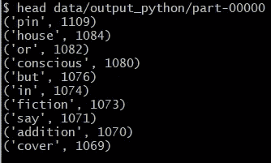

# Python Spark 真的比 Scala Spark 慢 10 倍吗？

> 原文：<https://levelup.gitconnected.com/is-python-spark-really-being-10x-slower-than-scala-spark-8a76c907adc8>

字数统计用例的执行时间


**Apache Spark** 是最流行的大数据分析框架之一。Spark 是用 **Scala** 编写的，也可以用 Scala 编写，但它也有用于 **Python** 、 **Java、**和 **R** 的 API。

**Scala** 和 **Python** 是最流行的 API。关于**Scala**vs**Python**以及哪个更适合 **Apache Spark** 一直有很多争论。对于 Spark 来说 Python 比 Scala 慢 10 倍吗？这篇博文对 Python Spark 和 Scala Spark 进行了测试，并将它们的性能(执行时间)与字数用例进行了比较。因此，在我们进一步讨论这个主题之前，让我们先来看看本文中将要使用的用例。

# 测试数据生成

字数统计用例是大数据行业中的`print("HELLO WORLD !")`，目标是获得给定文本文件中单词的频率。为了生成我们的测试文件，我们将使用 **random_text.py** 脚本。

随机文本脚本

我们可以调整`n`和`p`来增加或减少生成文件的大小。在我们的测试中，我们将使用一个 1.17GB 的文件**。**

# **执行环境**

这些测试在同一台机器上执行:

*   处理器 i7
*   32 GB 内存
*   总共 4 个内核
*   总共 8 个线程
*   Python 3.10.2
*   Scala 2.12.8
*   Java 8
*   火花 3.0.3

# **Python 火花字数**

非常简单的代码，我们读取一个文本文件。我们使用空格`" "`作为分隔符来拆分每一行，我们将每个单词映射到一个元组(word，1)，1 是该单词出现的次数，我们基于关键字减少所有单词，然后我们基于关键字进行排序。我们将结果保存在本地文件中。

我们可以验证我们已经计算了唯一的单词，如下所示:



十大常用词汇

这个程序的执行时间是`274290 ms = 4 min 34 s`

```
Elapsed Time in mili seconds:  274290
```

# Scala 火花字数

非常类似于 Python 版本。我们有相同的结果。

该程序的执行时间为`89660 ms = 1 min 28 s`

```
Elapsed Time in mili seconds: 89660
```

# 结论

在这些情况下，我们在 Scala 程序和 Python 程序之间有一个`274290/89660 = 3.06`的分割比。Scala 无疑提供了比 Python 更好的性能，但它并不总是快 10 倍，随着内核数量的增加，Scala 的性能优势开始减弱。

Spark 选择 Scala 还是 Python 取决于最适合项目需求的特性，因为每种特性都有自己的优缺点。在选择用 Apache Spark 编程的语言之前，开发人员有必要学习 Scala 和 Python 来熟悉它们的特性。学习了 Python 和 Scala 之后，决定什么时候用 Scala 做 Spark，什么时候用 Python 做 Spark 应该是很容易的。

我希望这些信息是有帮助的和有趣的，如果你有任何问题，或者你只是想打个招呼，我很乐意连接并回复你对我的博客的任何问题！欢迎访问我的 [**网站**](https://mohamedkhey.ml/) **了解更多**！