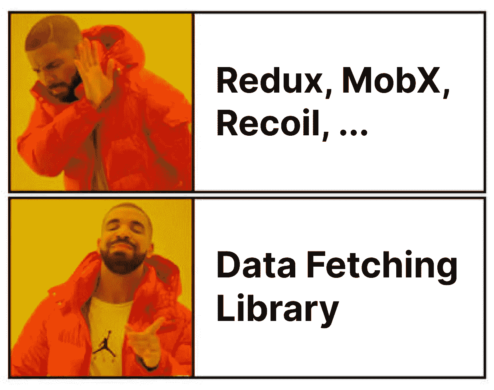

# Redux 过时了吗？请改用数据提取库

> 原文：<https://levelup.gitconnected.com/is-redux-outdated-use-data-fetching-library-instead-bd37b83c375e>

Redux 过时了吗？不应该再用 Redux 了吗？数据提取库是处理前端组件之间的数据管理和状态共享的一种替代方案。



毫无疑问，Redux 已经成为最流行的状态管理库，被许多大公司用作标准。Redux 本身是视图层不可知的，可以用在 React、Vue、Angular 等很多前端框架中。我们可以将状态分为两种类型:客户端状态和服务器状态。客户端状态管理仅在前端使用的内部状态。例如，在一个表单中，根据用户输入可能会发生不同的行为。这种行为与服务器无关，只存在于客户端。另一方面，服务器状态是从 API 中检索的，需要在许多前端组件中共享。例如，从 API 检索的用户数据。许多组件可能需要该数据，因此需要将其保存为服务器状态。

Redux 本身是一个客户端状态库。当然，您可以将 API 数据保存到客户端状态，但是需要手动完成。实际上，大多数状态共享数据都是 API 数据，您需要从服务器检索并保存到服务器。除此之外，你的应用程序需要大量的同步客户端状态更新，比如像 *Figma* 这样的设计应用程序或者像*乐队实验室这样的音乐制作。*

在 redux 中，共享状态需要几个构件。有一个动作触发状态更新，有一个 reducer 直接根据动作更新状态，有一个选择器选择必要的状态，最后有一个 store 把很多 reducer 合二为一。如你所见，在 Redux 中需要做很多复杂的事情。我们仍然没有谈到设置中间件，如 redux thunk 或 redux saga。

一般来说，Redux 的一些问题是:

*   **可扩展性**

如何构建规模足够大的 redux 架构？甚至 Redux 团队也意识到很多人一直在错误地构建 Redux，最后他们发布了 Redux toolkit 来给出一些固定的指导方针。

*   **性能**

如何处理缓存和重复数据删除多个相同的请求，以防止不必要的 API 调用？我们是否应该以及如何使用选择器来选择必要的数据以避免不必要的渲染？

*   **开发决策:**

如何处理数据加载，数据错误等？我们应该把加载和错误状态放在 redux 还是 local 状态？如果许多组件都需要数据，那么在哪里调用检索数据的操作呢？

*   **支持库**

用什么中间件？该不该用 immerJs？我们应该使用 immutableJs 吗？

# 那么，还有什么选择呢？

数据提取库来拯救。有很多这样的库，如 React-query、SWR、Apollo client、Relay 等。这个库是一个服务器状态管理库，它保存和管理许多组件的 API 响应数据共享。它还支持其他功能，例如:

*   数据缓存
*   将多个请求删除为单个请求
*   数据失效、重新验证和网络恢复
*   在后台更新数据
*   乐观的更新
*   自动刷新获取数据
*   性能优化，如分页和延迟加载
*   内存和垃圾收集管理

这个库在幕后做了很多在 Redux 中确实很难做到的优化。例如，Redux 不处理缓存和重复数据删除请求。您需要自己编写功能，这有点棘手。此外，通过使用这个库，您不需要像在 Redux 中那样自己设置复杂的架构。这些使得数据获取库的使用变得非常简单明了。

# 给我们举个例子

如果没有例子，你可能不会相信。让我们看看 React-query，它是最流行的数据获取库之一。它主要通过定义查询键和查询获取函数来工作。例如，如果我们想要检索待办事项列表数据:

```
const getTodos = () => axios.get('API_URL')
const result = useQuery(['todos'], getTodos, <options>) //options are optional
```

有了这两行代码，react-query 做了很多事情。它将基于查询键缓存数据，因此如果其他组件调用相同的查询键，它将只从缓存中检索它。结果包含数据本身、`error`、`isLoading`状态、`isSuccess`状态等多种信息。有关完整信息，您可以查看以下内容:

```
const {
  data,
  dataUpdatedAt,
  error,
  errorUpdatedAt,
  failureCount,
  failureReason,
  isError,
  isFetched,
  isFetchedAfterMount,
  isFetching,
  isPaused,
  isLoading,
  isLoadingError,
  isPlaceholderData,
  isPreviousData,
  isRefetchError,
  isRefetching,
  isStale,
  isSuccess,
  refetch,
  remove,
  status,
  fetchStatus,
} = result
```

此外，您可以在`useQuery`钩子中输入一些选项，在这里您可以指定一些参数，例如当错误发生时该做什么、何时成功提取数据、缓存时间有多长、数据占位符等。有关完整信息，您可以查看以下内容:

```
const {
  cacheTime,
  enabled,
  networkMode,
  initialData,
  initialDataUpdatedAt,
  isDataEqual,
  keepPreviousData,
  meta,
  notifyOnChangeProps,
  onError,
  onSettled,
  onSuccess,
  placeholderData,
  queryKeyHashFn,
  refetchInterval,
  refetchIntervalInBackground,
  refetchOnMount,
  refetchOnReconnect,
  refetchOnWindowFocus,
  retry,
  retryOnMount,
  retryDelay,
  select,
  staleTime,
  structuralSharing,
  suspense,
  useErrorBoundary,
} = options
```

还有其他可用的功能，如数据突变、相关查询、乐观更新、分页等。在这里的官方文档里可以看到更多:【https://tanstack.com/query/v4/docs/overview

然而，事情没那么简单。获取数据的心理模型与我们通常所做的有点不同。以前，我们可能按如下顺序处理它

```
const data = await fetchTodoById(todoId)
if(data.isError){
  //handle error
} else {
  //handle success
  setState(data)
} 
```

在 React 查询中，情况正好相反。在调用 fetch 函数之前，我们需要传递错误和成功处理程序，并且为动态参数触发 fetch 函数的方式略有不同，只有在参数发生变化时才会重新获取。例如:

```
const [todoId, setTodoId] = useState(1)
const result = useQuery(['todos', todoId], (id) => getTodoById(id), {
  onSuccess: () => {
    //handle success
  },
  onError: () => {
    //handle error
  }
}) //options are optional

//to trigger refetch, we can just call setTodoId(...)
```

如您所见，对于初学者来说，处理动态数据、动态 onSuccess 和 onError 有点棘手。虽然我个人认为 React Query 可以改善这一点，以获得更好的灵活性。React Query 的维护者 [***多米尼克***在这里解释了关于设计决策的一切:](https://twitter.com/tkdodo)[https://tkdodo.eu/blog/react-query-fa-qs](https://tkdodo.eu/blog/react-query-fa-qs)

我们不会详细讨论这个问题，因为这不是本文的目的。我希望通过上面给出的例子，您可以理解数据获取库有多强大，它能做什么，以及它如何使开发比 Redux 更简单、更快

总而言之，数据提取库是使用 Redux 的一个替代方案。特别是，当大多数应用程序(几乎 90%)的使用依赖于服务器状态数据管理而不是客户端状态时。它还带来了其他好处，如代码可维护性更低、产品代码可伸缩性更好以及性能优化。试着给它一个尝试和机会。

**参考文献:**

*   [https://nosleepjavascript . com/redux-data-fetching-anti pattern/](https://nosleepjavascript.com/redux-data-fetching-antipattern/)
*   [https://tan stack . com/query/v4/docs/guides/does-this-replace-client-state？from = react queryv 3&original = https://react-query-v3 . tan stack . com/guides/does-this-replace-client-state](https://tanstack.com/query/v4/docs/guides/does-this-replace-client-state?from=reactQueryV3&original=https://react-query-v3.tanstack.com/guides/does-this-replace-client-state)
*   [https://javascript.plainenglish.io/react-query-you-may-not-need-state-management-️-15de0837a569](https://javascript.plainenglish.io/react-query-you-may-not-need-state-management-%EF%B8%8F-15de0837a569)

*感谢您的阅读。我会每两周发布一次新文章(希望如此)。它们大多与我的软件工程经验和我对社会生活的想法有关。如果你对我接下来应该写什么有任何问题或建议，请不要犹豫，把它们放在评论区。* ***别忘了通过订阅媒体支持我使用我的推荐链接:***[***https://andreassujono.medium.com/membership***](https://andreassujono.medium.com/membership)**甚至在下面的小费框里给我买咖啡。感谢**

# *分级编码*

*感谢您成为我们社区的一员！在你离开之前:*

*   *👏为故事鼓掌，跟着作者走👉*
*   *📰查看[级编码出版物](https://levelup.gitconnected.com/?utm_source=pub&utm_medium=post)中的更多内容*
*   *💰免费编码面试课程[查看课程](https://skilled.dev/?utm_source=luc&utm_medium=article)*
*   *🔔关注我们:[推特](https://twitter.com/gitconnected) | [LinkedIn](https://www.linkedin.com/company/gitconnected) | [时事通讯](https://newsletter.levelup.dev)*

*🚀👉 [**加入升级人才集体，找到一份神奇的工作**](https://jobs.levelup.dev/talent/welcome?referral=true)*