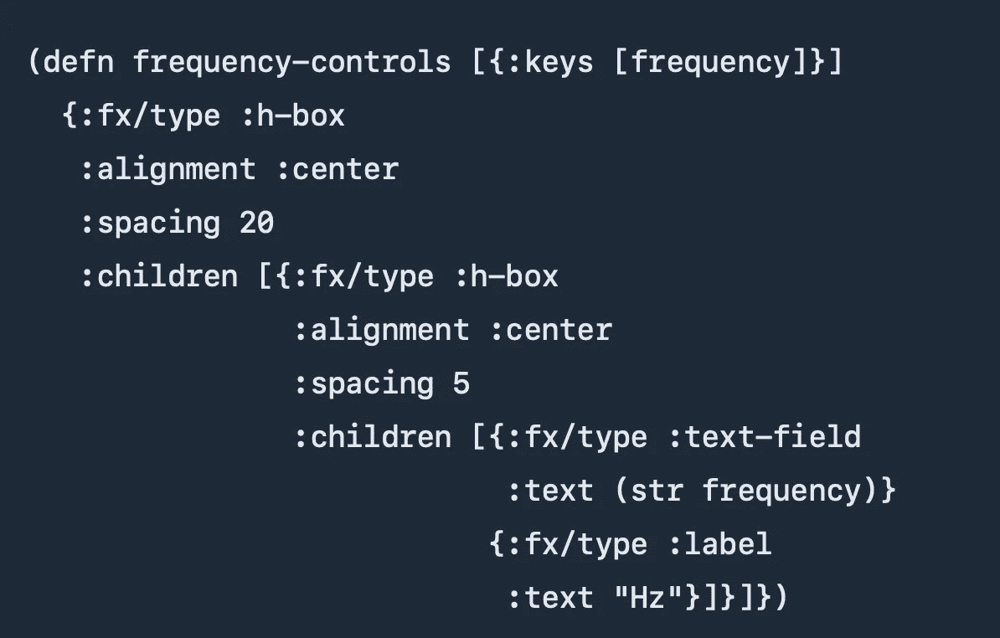

# macOS GUI 开发场景真的有这么差吗？

> 原文：<https://levelup.gitconnected.com/is-the-macos-gui-development-scene-really-this-bad-3ed300f343e>

当然应该比这容易。

有一些我一直想写的东西，作为一个网络应用程序来说没有意义。由于我现在主要使用 macOS(至少是为了休闲)，我想要一个 macOS 应用程序。

经过大量挖掘和绝望之后，我发现在 macOS 上创建 GUI 应用程序的最佳解决方案实际上是 [Xamarin。微软的 Mac](https://docs.microsoft.com/en-us/xamarin/mac/get-started/) 。这绝对有些讽刺意味。

(坦率地说，糟糕的是事情的状态，而不是 Xamarin。)

## 迅速发生的

Swift 是不错，但是我连“我如何读取一个目录的内容”这样的基础都找不到。我确信这是我的 Google-fu 所缺乏的——这是一个相当基本的要求——但是如果网络搜索没有显示出这样的东西，当我搜索到更复杂的东西时会怎么样呢？

**更新:**我已经找到了[如何做到这一点](https://developer.apple.com/documentation/foundation/filemanager/1413768-contentsofdirectory)，感谢[一个 StackOverflow 答案](https://stackoverflow.com/a/27722670/609921)(标记为 iOS 以获得额外的乐趣)。我以前尝试过这个答案，但没有成功，Xcode 抱怨说`FileManager`不存在。原来你需要`import Foundation`。

## Java Script 语言

这些天来，我对 JavaScript 并不陌生，但是我所看到的“作为应用程序的 JavaScript”并没有让我感到兴奋。

(到目前为止，大部分是电子和 nwjs——还有一些别的东西，但我忘了。)

**更新** : Trey 把我指向了 [Tauri](https://tauri.studio/en/) ，我现在记得那是我之前短暂看过的。不记得之前为什么贴现了；它看起来肯定比电子好。我将再试一次，看看效果如何。

除了携带数百兆字节的 JavaScript 解释器的一般事情之外，整个事情感觉相当笨拙。这让我想起了很久以前我遇到的一句话:

> 想象一只剑龙穿着火箭动力的旱冰鞋，你会对它的优雅、稳定和易于崩溃恢复有一个公平的想法。莱昂内尔·劳尔

## 计算机编程语言

使用 Python 和 Qt 会很好——但在我使用之前，他们需要发布一个在苹果芯片上工作的版本。上次我试了一下，没有。虽然它没有告诉我，但是当我尝试导入 Qt 库时，它抛出了一个异常。

另外，我认为我必须购买 Qt 许可证来分发我写的任何东西(假设我没有使它符合[OSI](https://opensource.org/licenses))。我想在这方面有所选择。

Python 和 Gtk——嗯，是 Gtk。如果我想要那种痛苦，我只要反复用头撞墙，就会更快更容易。

## Clojure

clo jure——我对它还不够了解，但是说实话，我不想被迫用代码手动设计我的 UI。有一些教程是由走那条路的人写的，但是……不用了，谢谢。

Clojure GUI 代码

上面的代码来自[马修·D·米勒的网站](https://blog.matthewdmiller.net/learn-clojure-by-example-javafx-gui-with-cljfx)。无意冒犯 Matthew——如果你正在用 Clojure 编写 GUI 代码，这似乎是一种完美的功能性方式。(双关语绝对有意……)

## 其他选项

rust——我做了一些搜索，但总结是它还不能用于主流 GUI。

go——还没有为主流 GUI 构建做好准备。

目标 c——我知道这行得通，但我永远无法理解它所涉及的所有问题。

C++ —只有 ***没有*** 。你是哪种受虐狂？(这听起来像是脸书的“二十个问题”中的一个。)

## Xamarin。苹果个人计算机

可以说，这又让我们回到了起点。我不得不说 Xamarin 团队做得很好。

我已经完成了[“你好，Mac”演练](https://docs.microsoft.com/en-us/xamarin/mac/get-started/hello-mac)。Xcode GUI 有几个地方发生了变化，但是写得很清楚。

它与 Xcode 集成使用界面生成器。Visual Studio 负责幕后的所有工作，但是您不必关心这些。还有 acid 测试——在完成演练后，我能够简单地扩展“Hello Mac”示例来重置计数器，不需要进行谷歌搜索或令人费解的操作。

## 结论

我很高兴我找到了似乎值得进一步追求的东西，但我必须诚实地说，我对为此付出的努力感到有点难过。

我肯定漏掉了什么明显的东西？不会是写 GUI 应用的工具**缺少**吧？请务必让我知道(礼貌地！)，我想有更多的选择。

照片由 [Dragos Gontariu](https://unsplash.com/@dragos126) 在 [Unsplash](https://unsplash.com/s/photos/child-painting) 上拍摄。