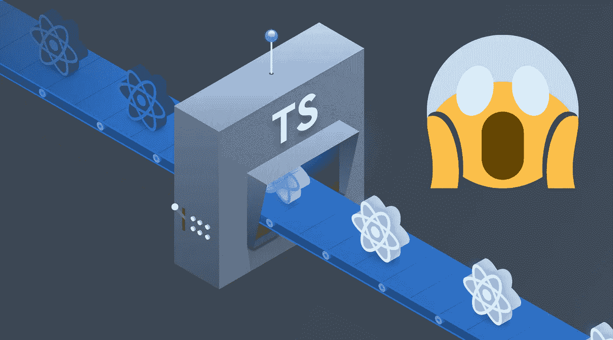

# ReactJS 中的 TypeScript 对于小团队来说是个好主意吗？

> 原文：<https://levelup.gitconnected.com/is-typescript-in-reactjs-a-good-idea-for-a-small-team-b2a9b222136a>

图片摘自 Ely Lucas 发自[https://ionicframework . com/blog/how-to-use-typescript-in-react/](https://ionicframework.com/blog/how-to-use-typescript-in-react/)的一篇博文

*“我会在几天前完成这个组件，编写普通的 JavaScript！”—匿名 Crew2Captain 开发者。*

# 背景

让我从项目和团队的一些背景开始。Crew2Captain 是一个面向社区的平台，主要目标是将拥有船只的人与喜欢水上活动的人联系起来，以便他们可以分享旅行。我们有一个由 4 名开发人员和 3 名分析师组成的小团队。我们都是全职员工，每个人每周最多只能抽出 10 个小时。因此，我们的首要任务之一是尽可能提高这些时间的效率。团队中开发人员的水平从研究生到高级都有，只有一个开发人员有使用严格类型语言的经验。

我们用 vanilla js 开始了这个项目。这非常好，灵活性和编码速度都在掌握之中。然后我们意识到我们最初的小项目可能会发展成巨大的项目。因此，我们必须从一开始就尽可能地将其纳入最佳实践。

# 理由

转向打字稿的原因既浪漫又实用😊(1)我们开始遇到在公共和共享组件中传递属性的错误。(2)我们阅读了更多关于最佳实践的内容，他们经常提到切换到 TypeScript，特别是如果您期望中型到大型代码库，我们希望我们的项目介于两者之间😁。最后，(3)我们认定 TypeScript 会让我们的职业生涯受益，因为越来越多的职位将这一技能作为强制要求。

# 孤岛危机

TypeScript 的引入并不出乎意料；我们进行了长时间的会话和大量的个人阅读。然而，这对我们的开发者来说仍然是一个冲击。我们在头几周陷入瘫痪:与错误和不熟悉的异常作斗争。我们必须改变编码方式，引入新的实体和标准。我们停止了进展，甚至埋葬了几个冲刺(安息吧，冲刺 6 和冲刺 7😭).老实说，当时那看起来像一场灾难。我不再数这个问题“我们能回到香草吗？”在我们的站立和每日更新中长大。尽管如此，我们还是像那些超级马拉松运动员一样继续前进，他们会问自己“我在做什么？为什么我会在这里？我为什么要让自己挣扎？”我从未跑过马拉松，但我认为这些冠军一定有这样的想法，或者他们是外星人😂

# 彩虹和独角兽

但最后总有好的一面，不是吗？在一次 sprint 回顾中，我们注意到了一些神奇的事情:开发人员没有抱怨过 TypeScript(是的，他们仍然在抱怨，但是这些天在抱怨别的事情😂)，视频通话时更多的微笑……啊，我们一般不视频通话🙈，但我很确定他们在微笑😜。

那么是什么改变了呢？我相信我们通过了“语言”障碍阶段，终于打好了基础。我们完成了组件所需的所有接口，并学习了更好地设计它们的方法。我们开始利用枚举、类型、泛型和其他特性来防止将来可能出现的错误，并减少所需的代码量。因此，我们到达了启蒙阶段。👼

# 值得吗？

是的，它是。有打斗吗？—是的，有。然而，作为专业人员，我们确实成熟了，最终提高了我们的表现。

一个细心的读者可能会问我们花了多少时间来适应打字稿和那些死冲刺。但我相信，这变成了一项出色的投资，我唯一的遗憾是我们没有早点这样做。今天，我们避免了“错误的值/类型”错误，并且由于类型和枚举，我们没有任何硬编码的东西，也没有字符串常量，这通常会导致不可预测的错误。使用泛型，我们编写的代码更少，编程更优雅。开发人员花更少的时间来理解与共享组件的交互，因为所有的输入都是描述性的。而且没有足够的文字来赞美接口！它们帮助我们描述属性；我们重用它们来定义后端实体和全局状态(这是 redux，另当别论😎)

我读过很多文章，建议不要为小团队和/或小项目打字。我的观点是，如果你正在为你最喜欢的项目单独编码，从一开始就使用 TypeScript！首先，你永远不知道旅程会把你带到哪里，其次，在最坏的情况下，你会在简历上增加一项杀手技能。对于一个开始“绿地”项目的团队来说，不管规模大小，打字稿都是必须的，原因如上。

# 蹩脚的小费

尽可能避免使用 *`any`* 类型。这看似无害，但我是通过艰苦的努力才学会的。TypeScript 最终会编译成普通的 js，您可能会陷入漫长的调试会话中，试图理解为什么 *`(10 < 3) === true`* ，而实际上您正在比较两个字符串。

# 最后的话

我是一个幸运的人，在 Crew2Captain 项目中，我曾与这样的传奇人物合作过 [@Vladimir Abramov](https://www.linkedin.com/in/vladimir-abramov-196739a/) 、 [@Klemen Abrams](https://www.linkedin.com/in/klemen-abrams-87553016a/) 、 [@Irina 德米特连科](https://www.linkedin.com/in/irina-dmitrenko-b78482125/)、 [@Kirill Kholine](https://www.linkedin.com/in/kirill-kholine-2a9502105/) 、 [@Malik Omonov](https://www.linkedin.com/in/malik-omonov-a78976166/) 、 [@Ian 博贝克](https://www.linkedin.com/in/iancognito/)、 [@Igor Doinikov](https://www.linkedin.com/in/igor-doinikov/) 、 [@Johnny Samoletov](https://www.linkedin.com/in/samoletov/) 。

你从不害怕挑战，总是愿意学习新东西。你总是挺身而出，把事情做好。感谢你们如此出色的团队成员，感谢你们的激励和努力。

谢谢你，读者，看到最后一行，祝你有美好的一天！👍✌️