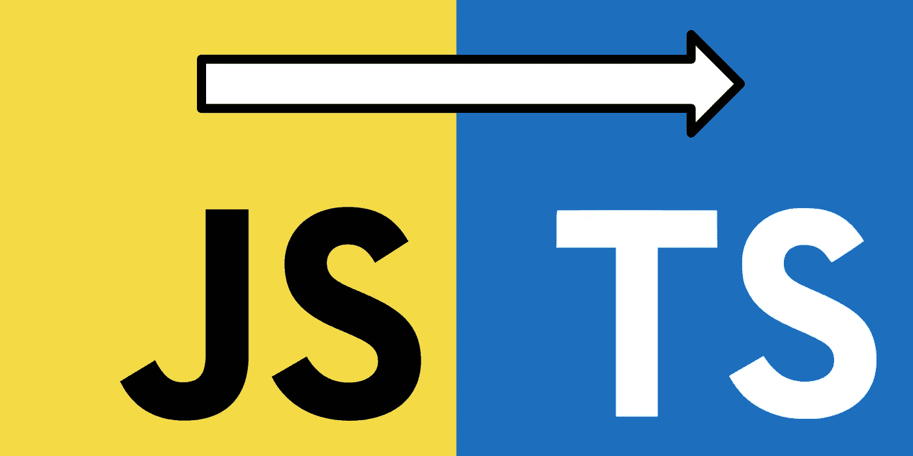
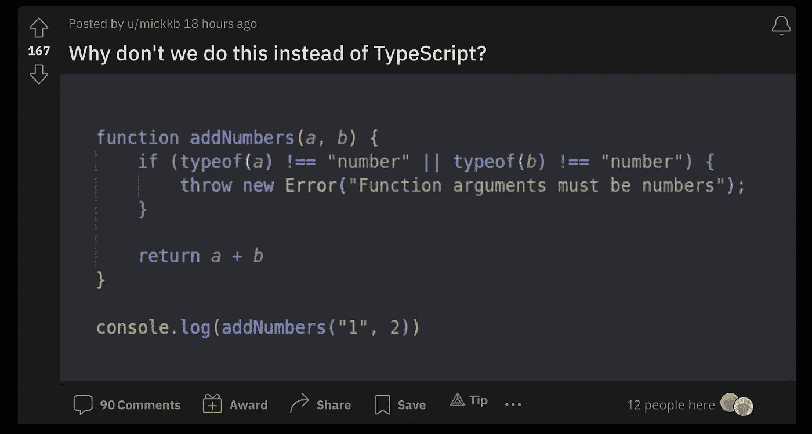

# TypeScript 值得吗？

> 原文：<https://levelup.gitconnected.com/is-typescript-worth-it-5bccc280f99f>

## 你根本不用它。然而…



图片来自[自由代码营](https://www.freecodecamp.org/news/how-to-add-typescript-to-a-javascript-project/)

Reddit 是一个非常有趣的地方，任何人都可以听到他们的声音，回答他们的问题。它可以是严肃的，讽刺的，有时只是在耍花招。

不管这篇文章属于哪一类[，它确实提出了一个有趣的问题。](https://www.reddit.com/r/learnjavascript/comments/u7j266/why_dont_we_do_this_instead_of_typescript/?utm_source=share&utm_medium=ios_app&utm_name=iossmf)



由 [u/mickkb](https://www.reddit.com/user/mickkb/) 发布

在这种情况下，TypeScript 肯定不是至关重要的。事实上，从技术上来说从来都不是。同样的方式反应，Vue，Svelte，jQuery 等。是永远不需要的。理论上，你可以用普通的 JavaScript 代替框架或库来制作任何应用程序。所以这就引出了一个问题…

为什么我们会有它们？

很简单。它们让事情变得更简单。或者至少在正确的情况下正确使用时可以。

考虑反应。

[React](https://reactjs.org/) 创建了一个可重用组件的生态系统(实际上是 JavaScript 块，有条件地更新/呈现网页上的 HTML ),这些组件与虚拟 DOM 交互。

使用可重用组件，您可以简单地导入一个组件，将它添加到另一个组件的渲染中，并传递它需要的属性/函数。有了虚拟 DOM，你不必直接操作网页上的 DOM 接口，并且当值更新时，整个*DOM 树不需要重新呈现。*


从这个意义上说，React 对于开发来说并不是必需的，但是它确实可以帮助开发人员交付更高效的代码。

对于[类型脚本](https://www.typescriptlang.org/)，可以直接检查变量、对象属性等的数据类型。用香草 JS。回头看看最初的 Reddit 帖子就知道了。然而，这可能会变得非常麻烦，取决于您的应用程序和您使用的数据集的复杂性。

如果一个对象有嵌套的对象或者数组呢？如果一个属性可以是两种类型中的一种呢？您的代码可能会成为过于细粒度的`if...else`语句的密集集合。相反，你可以定义一个所谓的*接口*，然后要求传递给一个函数的参数必须是同一个接口。见下文。

```
interface Person {
  name: string; 
  age: number;
}const myFunction = (arg: Person) => {
   console.log("My name is: " + arg.name)
   console.log("My age is: " + arg.age)
}var me = {name: 'Matt'}myFunction(me)
```

在上面的场景中，我提供了一个*不*满足`arg`接口需求的对象。使用 TypeScript，我们已经提前声明了这个函数应该期望 argument 具有与`Person`相同的属性。现在，如果我将`me`提供给`myFunction`，我正在使用的 ide 将突出显示(或 lint) `myFunction(me)`，并描述问题是它不符合要求。


图片来自[打字稿网站](https://www.typescriptlang.org/)。

这有必要吗？号码

在函数执行之前知道它是否会导致错误是不是很好？是的。

如果你要用普通的 JavaScript 重写上面的代码，你必须等到`myFunction`被执行后才能意识到`me`缺少`age`属性。或者，可能有这样一种情况，您包含了`age`属性而没有包含`name`。你甚至可能会忘记包括任何一个属性。你可以通过如下重写你的函数来解决这个问题。

```
const myFunction = (arg) => {
  if (arg.name) console.log("My name is: " + arg.name)
  if (arg.age) console.log("My age is: " + arg.age)
}var me = {name: 'Matt'}myFunction(me)
```

如果你在你的控制台上尝试这样做，你的代码不会中断，它会打印出`My name is: Matt`。很简单。


但是，如果您有其他功能要与`me`交互呢？您可以将这些 if 语句添加到每个函数中，以确保避免任何`Undefined`错误。或者，您可以删除`if`语句，并确保第一次就做对了。但是让我们现实一点。

在编程中，我们第一次把事情做对的几率有多大？


第三个选项:创建一个接口，并声明*中的`arg`所有的*函数都需要与`Person`接口具有相同的属性。如果不满足这些要求，IDE 会在运行任何代码之前告诉您。您可以相应地更新它。

## 摘要

TypeScript 对 JavaScript 来说绝对不重要。没有它你也可以编写一个 JavaScript 应用程序，就像你可以编写一个纯 JavaScript 应用程序来代替 React 应用程序一样。

具有许多重复代码块的应用程序可以受益于一个拥有可重用性和虚拟 DOM 更新的库。具有许多数据类型规范的大型应用程序可以受益于一个有助于代表您的代码的库。这完全取决于你在做什么，你想如何度过你的时间，以及你喜欢使用什么。

[***升级您的免费 Medium 会员资格***](https://matt-croak.medium.com/membership) *并接收来自各种出版物上数千名作家的无限量、无广告的故事。这是一个附属链接，你的会员资格的一部分帮助我为我创造的内容获得奖励。*

*您还可以通过电子邮件* *订阅，每当我发布新内容时，您都会收到通知！*

*谢谢！*

# 参考

[](https://www.freecodecamp.org/news/how-to-add-typescript-to-a-javascript-project/) [## 如何向 JavaScript 项目添加 TypeScript

### 我喜欢写代码。我想成为真正的高手。但是不知何故，写 JavaScript 从来都不是我的强项…

www.freecodecamp.org](https://www.freecodecamp.org/news/how-to-add-typescript-to-a-javascript-project/) [](https://reactjs.org/) [## react——用于构建用户界面的 JavaScript 库

### React 使得创建交互式 ui 变得不那么痛苦。为应用程序中的每个状态设计简单的视图，并反应…

reactjs.org](https://reactjs.org/) [](https://www.typescriptlang.org/) [## 带有类型语法的 JavaScript。

### TypeScript 通过向语言中添加类型来扩展 JavaScript。TypeScript 通过以下方式加速您的开发体验…

www.typescriptlang.org](https://www.typescriptlang.org/)