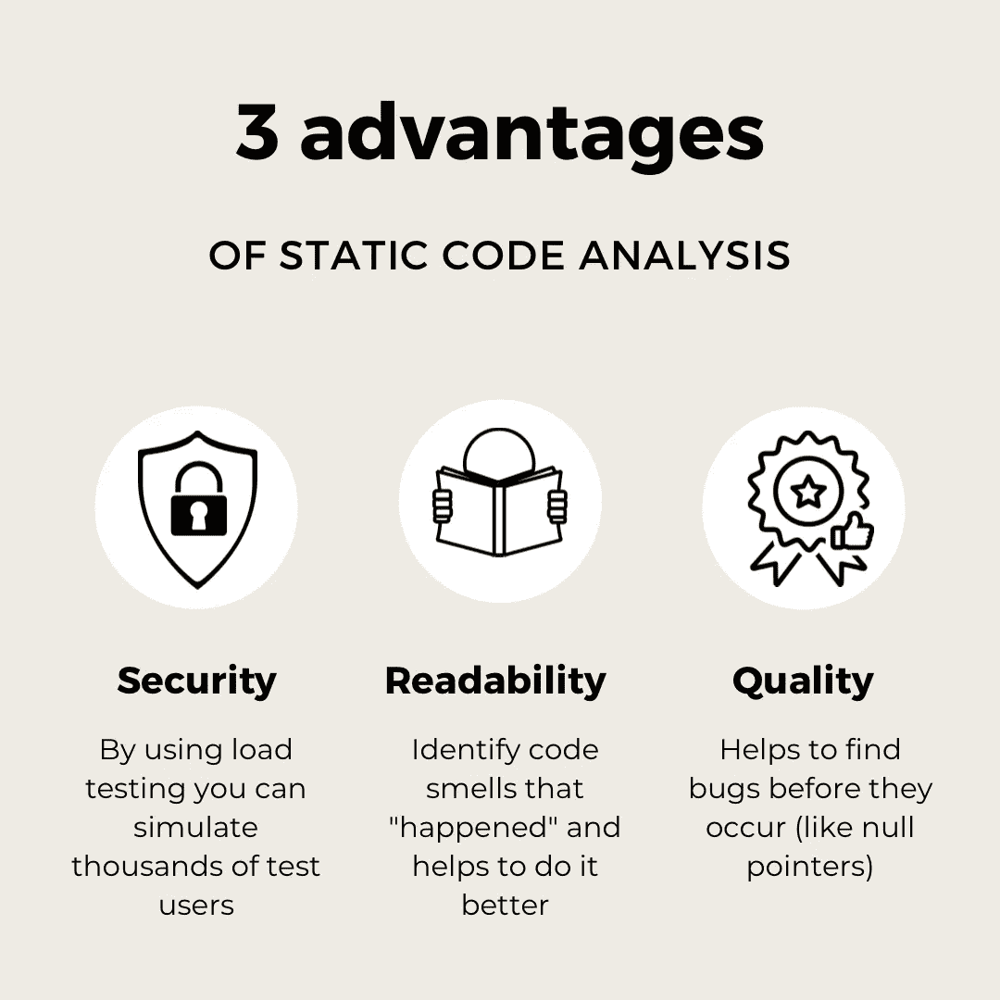
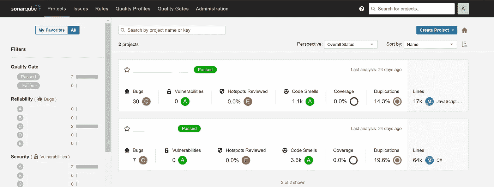
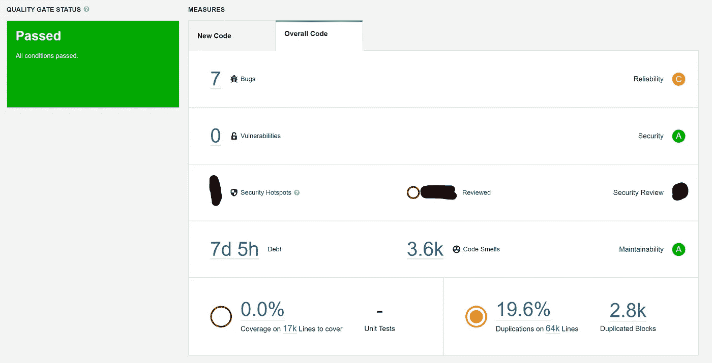
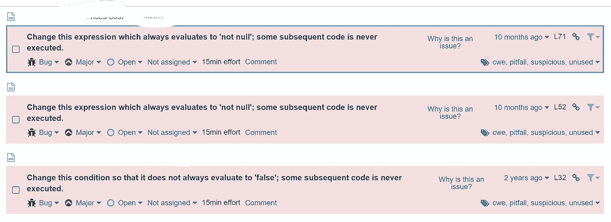
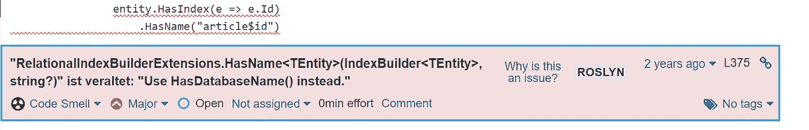
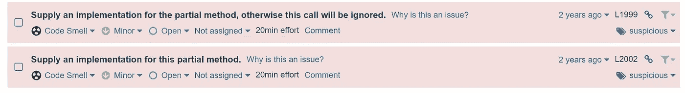

# 你的代码安全可靠吗？我会告诉你如何解决这个问题。

> 原文：<https://levelup.gitconnected.com/is-your-code-safe-and-reliable-i-will-tell-you-how-to-figure-this-out-2c36923fecfe>


[斯科特·格雷厄姆](https://unsplash.com/@homajob?utm_source=medium&utm_medium=referral)在 [Unsplash](https://unsplash.com?utm_source=medium&utm_medium=referral) 上拍照

*在寻找潜在的安全漏洞、错误和代码味道时，静态代码分析是一个强大的助手。我使用 SonarQube 进行了测试，SonarQube 是一个流行的用于静态代码分析的开源工具，下面是您也可以这样做的方法。*

# 什么是静态代码分析？

静态代码分析是这样一个过程，SonarCube 这样的检查器检查源代码本身是否存在潜在的错误和陷阱。检查器在代码流中导航，并根据预定义的规则进行检查。

静态代码分析是构建稳定的测试金字塔的基础。有了静态代码分析，您甚至可以在为它编写测试之前就覆盖最常见的错误，只需让那些工具查看您的代码。

# 为什么我应该执行静态代码分析？

静态代码分析有助于确保代码的质量。这可能是在使用 sonarLint 或 ESLint for JavaScript 等 Linters 编写时，也可能是在特定时间执行的过程，就像运行单元测试一样。我喜欢在编写代码时使用简单的 linters，如 style cop 和 ESLint，并在合并特性之前运行更详细的分析。这将是我在下一节中描述的 SonarCube 的一个完美用例。



进行静态代码分析将有助于您在黑客之前发现安全漏洞。

静态代码分析可以通过分析您的代码及其执行流，帮助您在错误发生之前找到它们。例如，对于某些执行路径，这些值可能为空，从而触发异常。静态代码分析的另一个好处是，它可以帮助您识别代码的味道，使您的代码更具可读性，而重复代码会使维护变得更加困难。

# SonarQube 是什么？

SonarCube 是一个静态代码分析工具，支持 24 种以上的语言。它检查您的代码库，并告诉您潜在的陷阱和错误，这些陷阱和错误不会导致编译错误，但可能会在运行应用程序时导致错误。SonarQube 还有一个由安全专家制作的巨大的潜在安全问题库，并内置了许多像 Roslyn 这样的代码质量检查器。

# 我为什么要用 SonarQube？

SonarCube 和 sonarLint 可以帮助您在错误发生之前找到它们。SonarQube 是一个开源程序，可以对你的代码进行静态分析。

它可以在 Docker 映像中本地运行，也可以在您的配置项中托管。SonarQube 为您提供了漂亮的仪表盘和报告，让您可以全面了解您的问题。他们会直接向您展示他们发现问题的代码、为什么会出现问题的描述，并给出修复问题的估计时间。

sonar cube 可用于分析 24 种以上不同的编程语言！

JavaScript、C#、Java、Python 等等，仅举几个例子，

它可以帮助你提高你的编码技能。

SonarQube 还支持 OWASP Top 10，以查找并修复 10 个最常见的安全问题。因此，它可以帮助您在团队中没有安全专家的情况下发布更安全的应用程序。

# 如何安装 SonarQube

要安装 SonarQube，您有两种可能。

1.  下载压缩文件并在本地运行
2.  在 Docker 内部运行我更喜欢第二种方式，因为 Docker 使得使用任何东西都更加容易，并且抽象出了与 windows 相关的问题，给了应用程序一个完美的运行环境。

# 安装 sonarQube docker 映像

要获得 sonarQube 映像，只需在您喜欢的命令行中运行以下命令。

```
docker pull sonarqube
```

# 运行 SonarQube docker 映像

要运行 sonarQube docker 映像，请运行以下命令:

```
docker run -d --name sonarqube -e SONAR_ES_BOOTSTRAP_CHECKS_DISABLE=true -p 9000:9000 sonarqube:latest
```

然后访问 [http://localhost:9000。](http://localhost:9000.)确保等待几秒钟，直到前端出现。

# 如何建立一个 SonarQube 项目？

接下来，是关于导入您的项目。为了保持简单，我将从手动安装开始。我将为 GitHub 集成撰写自己的文章。要在您的应用程序上执行扫描，首先安装一个声纳扫描仪。向导将帮助您完成这项工作。一切都很简单。完成所有设置后，运行以下命令:

```
dotnet sonarscanner begin /k:"<yourProject<" /d:sonar.host.url="http://localhost:9000"  /d:sonar.login="<yourKey>"
dotnet build
dotnet sonarscanner end /d:sonar.login="<your key>"
```

当一切都被执行后，你会发现自己在 SonarQube 仪表板。

# SonarQube 仪表板



SonarQube 完成后，在仪表盘上会显示一行。

我这样做是为了一个 JavaScript 项目(第一次)和我的。net API(秒)。

在您的仪表板中，您可以清楚地看到 sonarQube 正在收集的数据。在下一章，我将更详细地介绍这些指标。

# 了解 SonarQube 指标



当单击我们控制面板中的一个项目时，我们将进入其中一个项目，以进一步调查收集的数据。

# 什么是 bug？

这个就挺自圆其说了:)。这个数字表示您的应用程序有多少潜在的错误。Bug 是每一个可能导致问题的陷阱。



因此，对于我的应用程序来说，这将是很多糟糕的评估，导致代码无法执行。当更深入地研究这个问题时，我发现所有这些都发生在重构一个特性的过程中，并且没有很好地完成这项工作。

我真正喜欢 sonarQube 的是，它总是解释为什么这是一个问题，所以他们对这里的问题有很好的解释，而不是仅仅说这是错误的。这样的解释也能让你成为更好的程序员。

我喜欢的另一件事是修复这个问题的估计时间。所有这些估计的时间加起来就是 dev **债务**。

# 什么是漏洞？

SonarQube 在您的代码中发现的安全问题的数量。

例如，这可能是 SQL 注入、跨站点脚本编写的可能性，或者以不良方式存储的敏感 cookies。要查看完整列表，请访问[sonarquebes 文档](https://docs.sonarqube.org/latest/user-guide/security-rules/)。

# 什么是 SonarQubeSecurity 热点？

sonarQube 安全热点向您展示了哪些地方容易受到攻击。例如，他们会用禁用的请求大小限制来标记端点，因为这样你就是 DDoS 攻击的美丽目标！(所以不要那么做！).他们也标记愚蠢的(对不起，但它确实是愚蠢的)事情，如设置**【CORS ***标题。

# 什么是 SonarQube 可维护性？

可维护性表示不可读/错误的代码。这可能是使用了过时的语法，如下所示:



或者其他罗斯林的问题。但是在使用罗斯林的时候也会发现。

SonarQube 还检查非 Roslyn 问题，比如缺少分部方法的实现。



# SonarQube 的技术债是什么？

技术债务度量是修复所有这些代码味道所花费的时间。

# 其他指标

SonarQube 还为您提供了其他有用的指标，如重复代码或测试覆盖率。

我只是没有设法获得 C#的测试覆盖工作。如果你有，我很想在我的联系人栏里听到答案。

# 结论

SonarQube 是一个执行静态代码分析的神奇工具。他们收集大量关于错误或代码味道的有用信息，并解释每一个问题，以使你成为更好的程序员，并提高你的代码质量。

在 docker 中设置 SonarQube 是一种很好且简单的启动和运行方式，您可以轻松地将这个 docker 映像推送到 AWS 或 Azure，使您的 CI 可以访问它。

您还可以使用 sonarLint 作为 IDE 扩展，在编码时检查您的代码。

总而言之，我肯定会推荐把静态代码分析作为 QA 的另一层，你的用户会感谢它的！

我希望这篇文章能给你提供一些价值。

[这篇文章](https://www.the-koi.com/projects/static-code-analysis-with-sonarqube/)最初发表在我的博客上。如果你想阅读更多这样的文章，你可以访问我的博客【https://www.the-koi.com/ 

快乐分析，

亚历克斯

# 参考

[SonarCube 文档](https://www.sonarqube.org/)

[SonarCube docker 图像](https://hub.docker.com/_/sonarqube)