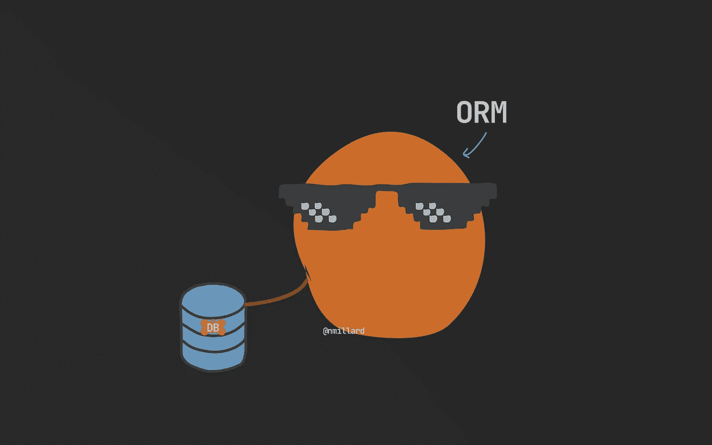
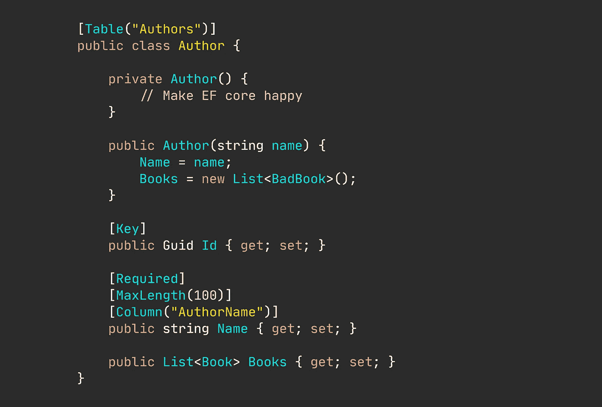
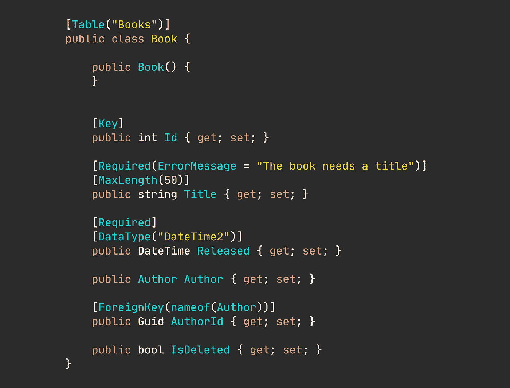
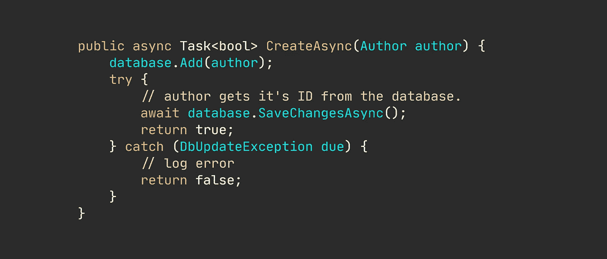
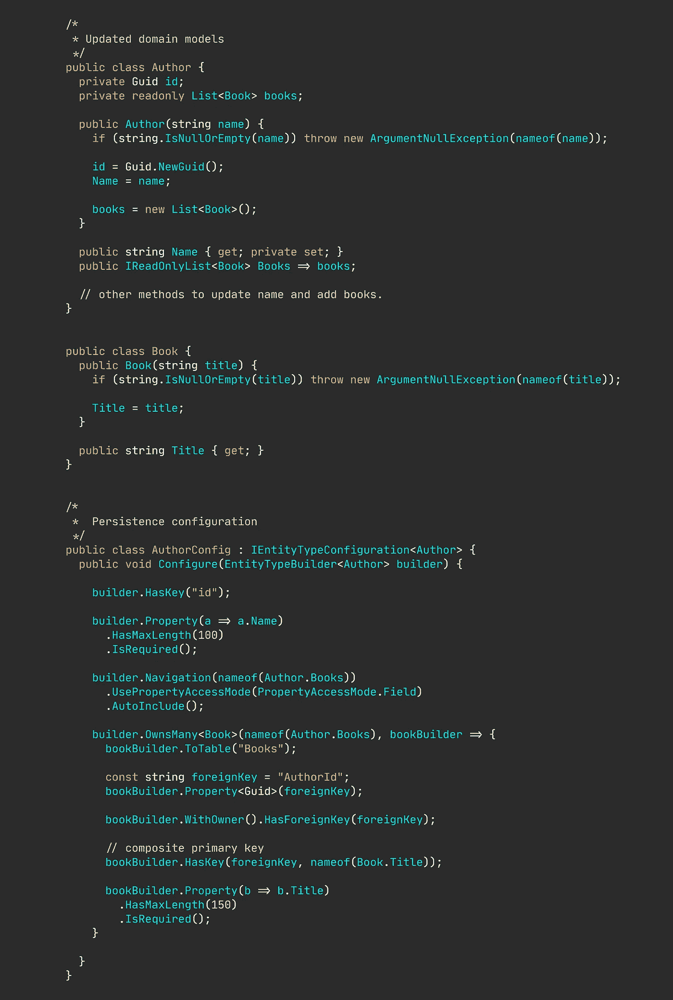

# 你的数据库/ORM 也让你做傻事吗？

> 原文：<https://levelup.gitconnected.com/is-your-database-bullying-you-bc0b2d587be6>

## 固执己见的观点

## 不要仅仅为了让你的 ORM 开心而写代码。

图片由@nmillard 提供

不要让你的数据库控制你的应用程序。

您可能会让数据库生成您的 id。不是吗？也许是因为它的便利性——尽管它真的一点也不方便。

你多久对你的模型做一次“务实”的决定？或者在某些领域不变量上有所松懈，因为这样可以更容易地使用您的对象关系映射(ORM)框架？

> 在设计领域模型时，只要您关心基础设施，就会让数据库或 ORM 欺负您。

你有没有为了讨好 ORM 大神而添加属性，或者让属性有公共 setters？添加无用的私有默认构造函数怎么样？这些构造函数从来没有被你自己的代码使用过，只有 ORM 才需要。

你是否故意实施了一些不好的实践，因为你的 ORM 使得做正确的事情太麻烦了？比如，让持久性问题渗入您的领域模型。

🔔[想要更多这样的文章？在这里签名。](https://nmillard.medium.com/subscribe)

# 查看取悦数据库的(真正的)糟糕代码的示例。

在设计领域时考虑到持久性会导致糟糕的设计。

作为一个初级开发人员，这种废话我都记不清写了多少遍了。更令人担忧的是，即使有经验的开发人员也会这样做。

可怕的领域模型。

这段代码来自一个实际的、有效的应用程序——为了简洁起见，我更改了类名并删除了大量属性。

代码片段完美地展示了您可以对域模型做的所有坏事。

这个模型绝不是持久性不可知的。一旦保存到数据库中，就会生成作者 id(这是我的主要烦恼之一)。另一方面，理想情况下，域实体甚至不需要公共 id 属性。

> 身份应该是不可变的和全局唯一的。数据库提交应该会突然改变实体的身份。那只是糟糕的做法。

在为其属性赋值方面没有安全措施。模特尖叫着“没有规则管我！”。`Books`集合是可变的，这显然是一个非常糟糕的主意。所有的财产都有公共设置者——我们都知道有公共设置者是通往灾难之城的高速公路。

让我们看看同样设计糟糕的`Book`车型。

又一个可怕的域类。

没有什么比默认构造函数、导航属性和领域模型中的持久性问题更让我头疼的了。绝对没有理由拥有`Author`房产，更不用说`AuthorId`房产了。默认构造函数允许您实例化不完整状态的对象，这违反了业务规则。

当您想要比较对象时，这些实践也使单元测试变得很痛苦。通常，您使用 id 属性来比较域对象，但这是不可能的，因为在第三方系统(数据库)分配它们的 id 之前，对象没有 id。

# 为什么你让数据库欺负你，让它创建你的域名 id？

有时候这是很容易做到的事。我明白了。但是很有可能以后你会为这种假定的便利付出代价。

我知道您可能对让您自己的应用程序生成域 id 持保留意见，这些域 id 随后会存储在数据库中。但是试着把逻辑翻转 180 度。为什么您愿意让第三方应用程序派生您特定于业务的身份值？

知道当对象被传递给这个方法时,`author` id 为空，您觉得下面的代码看起来不错吗？

在上面的代码片段中，您在自己的应用程序中实例化了一个域对象，只是让第三方指定其身份。它的身份在创建时就应该是已知的。

为了便于讨论，我们假设操作失败了。调用代码仍然会有一个实际的、无效的`Author`对象，但是没有 id 它就没有用了——使用无效对象进行后续的比较或相等检查会导致不好的事情(但是，老实说，不管 id 是在哪里生成的，忘记检查`CreateAsync()`的返回值都是不好的)

# “IDs 只是基础设施方面的问题！”

你看，域(或实体)标识和数据库主键是两个不同的东西，经常互换使用。

当然，主键肯定只是一个基础设施问题，并且显式地向您的域实体添加一个 public `Id`属性很可能是泄漏到您的模型中的一个基础设施问题。当在域边界内时，您将希望避免使用 ids。

确定等式的更好方法是例如覆盖等式运算符。

平等比较。

然而，在您的数据库中，您肯定需要一个用于域实体的主键。但是您可以在单独的基础架构或数据层中处理这个问题。

# 你最好的防御数据库或 ORM 的方法是了解你的工具。

现在，我知道您可能认为使用 ORM 进行数据库操作需要牺牲模型的有效性和领域规则的宽松性。

没必要这样。

您只需要更好地理解您选择的 ORM，或者使用只能在您的基础设施层中访问的持久性对象，这些对象按照 ORM 的规则和模型，根据您的实体在性能方面的最佳存储方式来运行。

如今任何体面的 ORM 都提供流畅的配置。流畅的配置基本上消除了对专门的持久模型的需求，因为您可以配置 ORM 如何持久化您的领域模型。

因此，让我们来看看如何在您的领域模型中完全忽略持久性问题。

ORM 和域封装的正确使用。

现在真的很难把事情搞砸。您的域是安全的，您的数据库和 ORM 是愉快的。

您甚至可以更进一步，将[影子属性](https://docs.microsoft.com/en-us/ef/core/modeling/shadow-properties)添加到您的持久性逻辑中，这可以进一步提高性能、安全性、可审计性、监控等。

# 让我们保持联系！

[在这里注册我的简讯](https://nmillard.medium.com/subscribe)并查看新的 YouTube 频道[*(@ Nicklas Millard)*](https://www.youtube.com/channel/UCaUy83EAkVdXsZjF3xGSvMw)

*连接上* [*LinkedIn*](https://www.linkedin.com/in/nicklasmillard/)

# 好奇者的资源

*   [实体身份与数据库主键](https://enterprisecraftsmanship.com/posts/entity-identity-vs-database-primary-key/)作者 Vladimir Khorikov
*   [不要在你的域实体中使用 id！弗拉基米尔·霍里科夫](http://by Vladimir Khorikov)
*   [由 Vladimir Khorikov 提出的 ORM](https://enterprisecraftsmanship.com/posts/separation-of-concerns-in-orm/) 中的关注点分离
*   [聚集索引的争论还在继续……](https://www.sqlskills.com/blogs/kimberly/the-clustered-index-debate-continues/)金伯利·特里普
*   [Kimberly Tripp 将 GUIDs 作为主键和/或聚类键](https://www.sqlskills.com/blogs/kimberly/guids-as-primary-keys-andor-the-clustering-key/)
*   [领域模型没有 ID 正常吗？](https://softwareengineering.stackexchange.com/questions/365524/is-it-normal-for-a-domain-model-not-to-have-an-id)关于堆叠交换的问题