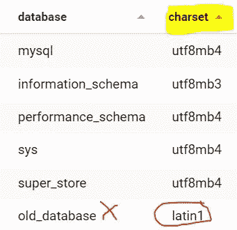

# 您的 SQL 数据库是全球通用的吗？

> 原文：<https://levelup.gitconnected.com/is-your-database-world-ready-5086e8cc2970>

## 如何支持外语和表情符号🚀✨

你是否曾经访问过网站，并且在重音符号上有错误，例如，句子“你好，世界🚀”而不是“你好，世界”🚀"?

或者不得不管理应用程序，因为世界各地的用户抱怨您在网站上安排的活动没有在宣布的时间段发生？

**我们日常使用的 web、移动和重量级应用程序如何确保它们在所有语言中都可用？**

本系列文章将着眼于在全球用户使用的应用程序环境中准备数据库时要评估的不同元素！


**你的数据库已经准备好了吗？**照片由 [NOAA](https://unsplash.com/@noaa?utm_source=medium&utm_medium=referral) 拍摄

1.  你将从准备在数据库中插入和处理信息开始**，而不考虑在你的网站上注册的人的地理来源。**
2.  然后，**您将了解时区及其在 SQL** 中的管理。您将保存适用于您的应用程序的每个用户的日期。
3.  最后，您将发现不同的策略**来管理字符串的翻译**并能够以多种语言提供您的站点和应用程序。

> 本文将重点讨论这个列表中的第一项。以下文章过几天就要发表了！别忘了跟着我，这样你就不会错过他们了。

# 如何管理语言:字符编码的问题

**目标:**

*   理解字符编码的概念
*   最常用的字符编码是什么
*   如何配置 SQL 数据库的字符编码

## 理解字符编码的概念

在我们的应用程序和网站中，我们以不同的方式交流信息:通过声音、视频，当然还有文本。

In an international context, the information is translated into different languages, sometimes using a different alphabet than the one we know.
But how can a computer program understand or store the information corresponding to the character “A” or the kanji “文”?

这就是编码的概念，或者更确切地说是字符编码的由来。

由于世界并不简单和统一，最初在每个区域创建了许多编码来处理所使用的大多数字母表。那么，当一个字符没有出现在所使用的字符编码表中时，会发生什么呢？

这时，一些奇怪的替换字符被显示出来，这些字符被称为“Mojibake”或“象形文字”，直观地翻译了一个编码的问题。

## 最常用的字符编码是什么

十年前，开发人员的生活比今天复杂得多，因为 web 不像今天这样标准化，许多编码都是通用的，甚至在同一个国家内也是如此！

开发人员必须指出所使用的编码类型，以便 web 浏览器能够正确地转换要显示的内容。

例如，在生成 HTML 文档时，这种类型的声明是必需的:

当时，有几种常用的编码类型:

*   UTF-8；
*   ISO-8859–1；
*   windows-1251；

但是在 2022 年，大约 98%的网络使用 UTF-8 编码。

> 这是个好消息，因为在设计数据库时，您只需要指定这些信息，这样 MySQL 就可以对您输入的字符串进行编码，并使用正确的编码表修改数据库。

**但是 UTF-8 到底是什么，为什么最终被选中？**

这是一个很好的问题，我很高兴你问了！

UTF-8 是一种基于 Unicode 的编码方法，unicode 被定义为一套能够处理所有语言的标准化字符集，还包括“+”、“-”等符号，如箭头“🡑”以及著名的表情符号“like”🤪"!

> 这就是**,因为**Unicode 标准和 UTF-8 能够比其他编码方法发展得更快，它们逐渐被各地采用。

## 如何配置 SQL 数据库的字符编码

要配置您的数据库使用 UTF-8 编码，您将使用如下建议的[字符集](https://dev.mysql.com/doc/refman/8.0/en/charset-table.html)语句:

UTF-8 编码方法继续发展(例如，支持表情符号)，插入或修改期间的控制方法也相应发展。

截至 2022 年，MySQL 项目推荐使用 **utf_mb4** 编码字符，这是 UTF-8 的一种进化。

**如何检查你的数据库是否已经正确配置，如何更新编码方式？**

要检查数据库的编码，我们可以使用以下查询:



您会注意到，在我的示例中，有一个数据库使用了不同的字符编码方法，这可能会导致问题。

为了纠正这一点，下面是要执行的指令:

为此，您还必须将内容转换成新的字符编码！有了 MySQL，这很容易:

```
mysqlcheck -u <mysql_user> -p --auto-repair --optimize --all-databases
```

如果您是 PostgreSQL 用户，您将使用[**pg _ char _ to _ encoding()**](https://pgpedia.info/p/pg_encoding_to_char.html)函数:

```
update pg_database set encoding = pg_char_to_encoding('UTF8') where datname = '<database_name>'
```

## 如何改变数据库的编码:安全的方法

虽然前面的方法是可行的，但是如果您尝试(例如)从现代字符编码转换到旧的编码，可能会出现一些错误，因为有些字符将无法识别。

这很不常见，但你应该这样做:

1.  将数据库作为文件转储
2.  请**复制一份**，并使用新的编码进行转换(例如，从*拉丁语-1* 到 *utf8mb4* )
3.  删除您的数据库
4.  使用新编码创建新数据库
5.  重新加载您的数据。

# 结论

在本文中，您需要理解许多新信息，但矛盾的是，您只需要学习一些新东西！

如果您条件反射地在 UTF-8 中创建数据库，最好是使用您的数据库版本的最新版本。

为此，使用**字符集**，它定义了插入或修改字符串时 SQL 的编码。

虽然不太可能，但您可能必须将旧数据库更新为 UTF-8 编码:然后，您将通过将" **ALTER DATABASE** "语句与前面的语句耦合来重用您的知识。

你的数据库可能会有错误，如果你使用 MySQL，这些错误会被 mysqlcheck 软件自动纠正。

在命令提示符下执行的指令如下:

```
mysqlcheck -u <mysql_user> -p — auto-repair — optimize — all-databases
```

***最安全的方法是将数据库的内容转换成新的字符编码，并将其导入新的数据库。***

如果你[关注我](https://medium.com/@dataforeveryone)，我会在以后发布文章的时候通知你！