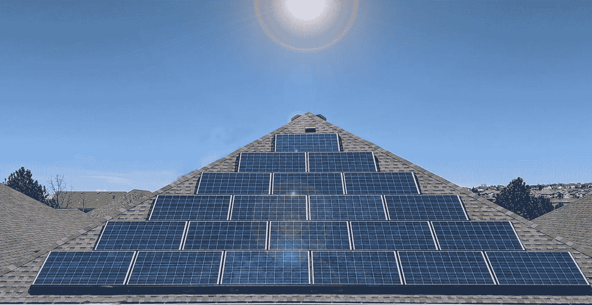
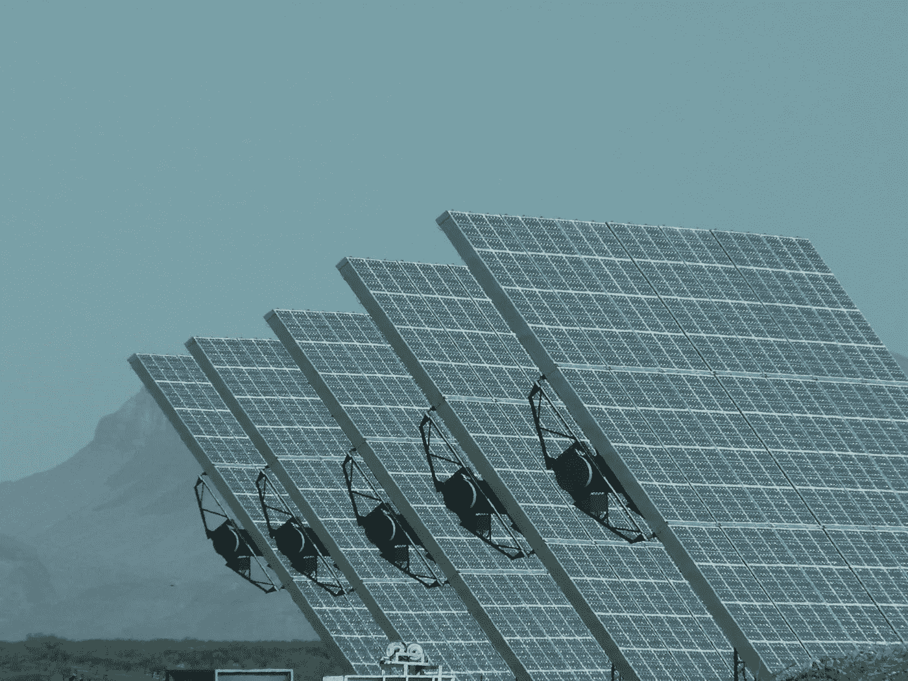
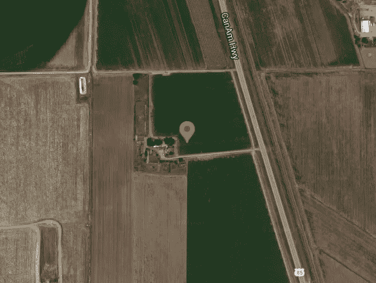
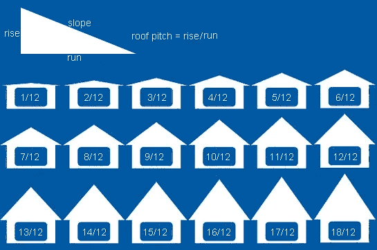
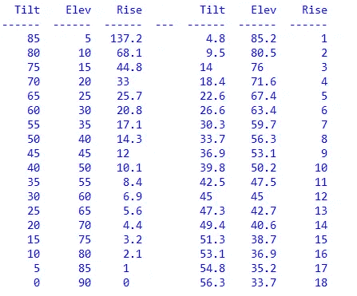

# 使用 Python 来确定你的屋顶是否适合太阳能电池板发电

> 原文：<https://levelup.gitconnected.com/is-your-roof-aimed-well-for-solar-panel-power-8ff21bd97681>

大多数屋顶做得出奇的好，即使它们不朝南，或者它们的斜度不理想。这里有一个简短的 Python 程序，可以很容易地分析任何屋顶。



关于屋主的屋顶将如何与太阳能电池板一起工作，有很多错误信息和虚假信息。这里介绍的 Python 程序可以帮助你决定你的屋顶是否真的可以通过太阳能为你省钱。

# 我为什么创建这个 Python 工具

我妻子是顶尖的太阳能电池板销售人员。自从我和她被她父亲介绍给彼此后，我们一起参与了各种规模的太阳能项目，他是我遇到过的最好的老板。(在被指派创建几个世界上最大的太阳能场之前，他曾参与海盗号火星着陆器计划。)我提到所有这些是因为我能够为我妻子提供的许多知识丰富、对房主有帮助的软件工具之一是一种确定他们的屋顶是否能有效产生节省成本的太阳能的方法，即使它不是朝南或倾斜到每年收集最多阳光的最佳角度。

# 跟踪与固定面板

光伏板可以被安装来跟踪太阳，或者被固定在某个地方，比如屋顶上。在一个或两个旋转轴上的跟踪，确实增加了可以收集的太阳能的数量，正如我们在我们的大型太阳能项目中所展示的那样，但大多数房屋屋顶上的固定面板仍然可以收集足够的阳光，随着时间的推移，可以为房主节省大量资金。使用固定面板，无需维护，也不会磨损活动部件，为房主提供了简单、轻松、省钱和拯救地球之间的理想平衡。



光伏追踪器增加了能量，但也增加了费用

# 瞄准天空

太阳能电池板使用非常标准的支架和硬件安装在屋顶上，对木瓦和屋顶完整性的影响最小，并且易于移除和更换以进行屋顶维修，例如冰雹风暴。(如果你想知道，科罗拉多州国家可再生能源实验室的测试和实际经验证明，今天的太阳能电池板比木瓦和其他标准屋顶材料更坚固，更不容易损坏。)因此，面板平行于屋顶安装，对准与屋顶本身相同的天空方向。有一个空气间隙，所以这些面板实际上比一棵大遮荫树更好地遮挡了炎热的太阳。(是的，在我们拿到面板后，我们的空调账单减少了！)

# 如果我的屋顶不朝南怎么办？

好的太阳能电池板公司不会试图向你出售安装在面向北半球的屋顶上的电池板，尽管成本较低的电池板这一规则有所放松。对朝北的屋顶进行彻底的分析可能会表明，你仍然可以节省水电费，特别是低斜度的屋顶，但一般来说，最好在屋顶上安装面板，从东地平线到正西，向南接近理想状态。我之所以说接近理想，是因为在美国的一些地方，稍微偏西的 aim 更适合当地公用事业公司的分时计费。请咨询您的 solar 代表，了解您的具体情况。

好消息是，即使你的屋顶不直接面向南方，你的屋顶也可能产生非常节省成本的电力。这里介绍的程序将帮助你确定你的屋顶的最大可能功率的百分比。

# 我的屋顶斜度怎么样？

屋顶坡度通常以上升至坡度来表示。在美国，这是在水平方向上每英尺升高的英寸数。零倾角是平屋顶，12:12 倾角是与地面成 45 度角。大多数房屋的典型间距约为 3:12 至 5:12，取决于位置和当地的天气条件。

# 快速、轻松的数学总结

下面的 Python 程序会在您所在的纬度找到朝南屋顶的最佳倾斜角。然后，通过计算全年每隔 10 分钟太阳的确切位置，可以计算出这个屋顶接收的能量与你的屋顶接收的能量之间的总体比较。每 10 分钟时间点的太阳能根据空气质量和太阳能板与太阳的法线之间的夹角余弦进行调整。简单来说，太阳能在一天的中午是最好的，它在一天的早些时候和晚些时候以可预测的方式逐渐减少。该程序使用行业标准公式来确定全年到达面板的太阳强度。理想屋顶总能量与你的屋顶总能量的比率用百分比表示，100%是最好的。

# 关于 Python 程序

这个程序导入另一篇媒体文章中出现的[太阳位置代码](/python-sun-position-for-solar-energy-and-research-7a4ead801777)。您需要将该代码复制到一个名为 sunpos.py 的文件中，并将其放在与下面的程序相同的文件夹中。下面是导入该文件的主程序:

```
# roof_sun.pyimport sunpos as sp
from datetime import datetime, timedelta
import mathdef main():# Location of the roof
    latitude = 40.602778
    longitude = -104.741667
    location = (latitude, longitude)# Roof azimuth
    roof_az = 135# roof pitch (inches rise per foot horizontal)
    roof_pitch = 5# Convert roof pitch to elevation angle in degrees
    roof_el = round(90.0 - math.degrees(math.atan(roof_pitch / 12)), 1)# Get the ideal roof elevation angle when facing south
    best_el = best_roof_elevation(latitude)# Convert ideal elevation to approximate pitch
    best_pitch = round(12 / math.tan(math.radians(best_el)), 1)# We can ignore Daylight Savings Time changes
    timezone = -7# Start time is on a January 1
    the_year = 2022
    tm = datetime(the_year, 1, 1)# Set the time interval
    delta = timedelta(minutes=10)# Initialize the solar power factors
    pow_roof, pow_best = 0, 0# Process relative solar energy for entire year
    while tm.year == the_year:# Get sun position for this moment
        when = [tm.year, tm.month, tm.day, tm.hour, tm.minute, tm.second, timezone]
        sun_az, sun_el = sp.sunpos(when, location, True)# Is the sun up?
        if sun_el > 0:# Get angle between roof normal and the Sun
            roof_sun_angle = angle_between(roof_az, roof_el, sun_az, sun_el)# Get angle between best roof angle and the Sun
            best_sun_angle = angle_between(180, best_el, sun_az, sun_el)# Get solar energy factor for the roof and for ideal roof
            sol_roof = solar_factor(sun_el, roof_sun_angle)
            sol_best = solar_factor(sun_el, best_sun_angle)# Tally relative solar power factors
            if roof_sun_angle < 90:
                pow_roof += sol_roof
            if best_sun_angle < 90:
                pow_best += sol_best# Add the time interval to the date and time
        tm += delta# Roof efficiency is percent of roof power to best power
    roof_efficiency = round(100 * pow_roof / pow_best)print("\nLatitude: ", location[0])
    print("Roof azimuth: ", roof_az)
    print(f"Roof pitch, elevation:  {roof_pitch}:12  {roof_el}")
    print(f"Ideal pitch, elevation:  {best_pitch}:12  {best_el}")
    print("Percent ideal power: ", roof_efficiency)def angle_between(az1, el1, az2, el2):
    """ Return angle between two azimuth, elevation directions """# Convert first direction to spherical
    theta = math.radians(90 - az1)
    phi = math.radians(90.0 - el1)# Convert first direction to cartesian
    x1 = math.cos(theta) * math.sin(phi)
    y1 = math.sin(theta) * math.sin(phi)
    z1 = math.cos(phi)# Convert second direction to spherical
    theta = math.radians(90 - az2)
    phi = math.radians(90.0 - el2)# Convert second direction to cartesian
    x2 = math.cos(theta) * math.sin(phi)
    y2 = math.sin(theta) * math.sin(phi)
    z2 = math.cos(phi)# Find angle between in degrees
    num = x1 * x2 + y1 * y2 + z1 * z2
    mag1 = math.sqrt(x1 * x1 + y1 * y1 + z1 * z1)
    mag2 = math.sqrt(x2 * x2 + y2 * y2 + z2 * z2)
    angle = math.degrees(math.acos(num / (mag1 * mag2)))
    return angledef air_mass(elevation):
    """ Return air mass AM for elevation angle """# Linear function if near or below horizon
    if elevation < 1:
        return -10.076 * elevation + 36.387# Published formulas use angle from the zenith_ang
    zenith_ang = 90.0 - elevation# Get cos of zenith_ang angle
    zcos = math.cos(math.radians(zenith_ang))# Calculate air mass
    return 1 / (zcos + 0.50572 * (96.07995 - zenith_ang) ** -1.6364)def solar_intensity(AM):
    """ Return solar intensity as function of air mass """
    return 1.1 * 1.353 * 0.7 ** (AM ** 0.678)def solar_factor(elevation_sun, angle_to_sun):
    """Return solar factor given elevation angle of the sun
    and the angle between panel normal and the sun."""
    AM = air_mass(elevation_sun)
    sol = solar_intensity(AM)
    rad = math.radians(angle_to_sun)
    return math.cos(rad) * soldef best_roof_elevation(latitude):
    """ Return approximate best panel elevation angle for given latitude """
    tilt = -0.004261 * latitude ** 2 + 1.05952 * latitude - 1.66
    return round(90 - tilt, 1)if __name__ == "__main__":
    main()
```

# 做出改变

对于你的屋顶，你需要在程序中改变三件事；纬度、屋顶方位角和屋顶斜度。在清单开头附近找到这三个变量赋值。如图所示，只是为了好玩，我使用了电影《第三类接触》中给出的地球上的位置。这是在科罗拉多州奥尔特北部的一片田野里，而不是在怀俄明州的魔鬼塔，但是，嘿，谁在数呢。



这不是魔鬼塔，但它是近距离接触的地点

你不需要为你的房子改变经度，因为它实际上并不用于计算。理想的屋顶斜度只取决于你的纬度，或者你位于赤道以北多远。

方位角是从北向东测量的。所以，90 度是正东，180 度是正南，270 度是正西。输入 0 到 360 之间的方位角。

这里有一张图表可以帮助你确定屋顶的倾斜度。关于屋顶斜度的详细解释，请访问[calculator.net/roofing-calculator](https://www.calculator.net/roofing-calculator.html):



calculator.net[礼貌](https://www.calculator.net/roofing-calculator.html)

或者，如果你知道你的屋顶的倾斜角或仰角，你可以从这个图表中找到它的大概上升数:



请注意，倾斜是从天顶向下的角度，而仰角是从地平线向上的角度。如果你的屋顶是平的，倾斜度为零，仰角为 90 度，上升为 0 度，或者说每英尺 0 英寸。如果你想知道这个图表是如何创建的，这是我的快速小 Python 程序:

```
import math
import tabulateresults = [["Tilt","Elev","Rise"," ","Tilt","Elev","Rise"]]

for n in range(1,19):
    a1 = n * 5
    t1 = 90 - a1
    r1 = 12 / math.tan(math.radians(a1))
    r1 = round(r1,1)
    r2 = n
    a2 = math.degrees(math.atan(12/r2))
    a2 = round(a2,1)
    t2 = 90 - a2
    results.append([t1,a1,r1,"",t2,a2,r2])print("")
print(tabulate.tabulate(results, headers="firstrow"))
print("")
```

# 真实世界的例子

使用上面主程序中显示的纬度、方位角和俯仰角的值，您应该得到下面的输出。

```
Latitude:  40.602778
Roof azimuth:  135
Roof pitch, elevation:  5:12  67.4
Ideal pitch, elevation:  8.2:12  55.7
Percent ideal power:  92
```

这表明，即使面向东南，屋顶斜度在天空中比理想角度高出约 12 度，与地球上这个位置的完美屋顶相比，这座房子每年仍将获得约 92%的太阳能电力。

# 更进一步

正如我之前提到的，我的妻子是一个顶尖的太阳能专家，在全国有很多快乐的顾客。她实际上是其他销售人员的导师，所以她非常了解太阳能技术的最新发展。我们的工具箱里有更多的工具可以帮助你决定太阳能电池板是否适合你的家。免费咨询，当然没有任何义务，[点击这里](https://powur.com/solar.proud/education/why-solar)留下您的联系方式。请放心，使用此链接，她将是公司中被通知的人。我喜欢和她聊天，我想你也会的！

John 的热情和使命是分享 Python 代码，帮助揭开生活挑战的神秘面纱，并从中获得乐趣。约翰著有 [*Python 为 Numworks*](https://amzn.to/3k4O39j) *，* [*Python 为 OpenSCAD*](https://amzn.to/3mHK0Br) *，以及* [*等诸多头衔*](https://amzn.to/320uLMg) *。*