# SwiftUI 中的等轴测视图

> 原文：<https://levelup.gitconnected.com/isometric-viewmodifier-aafcaee1c9a>

## 关于使用自定义视图修改器将 2D 视图和图像转换为等轴测视图的 SwiftUI 教程。

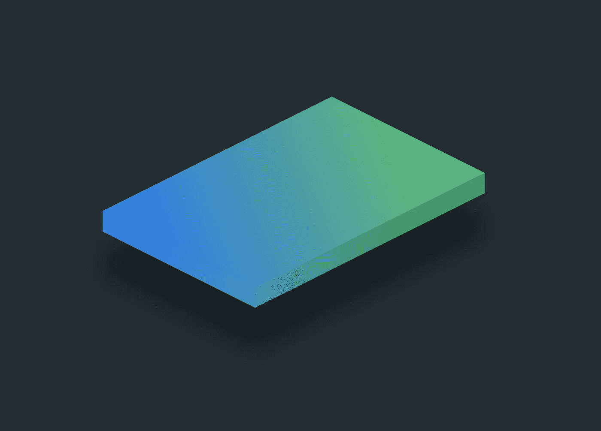

等距 SwiftUI 视图

前几天，我开始在 Figma 中将 2D 的设计转换成等距视图。我认为在 SwiftUI 中创建一个做同样事情的`ViewModifier`可能会很棒。在 [twitter](https://twitter.com/TrailingClosure/status/1292525094481219585?s=20) 上发布了我的工作截图后，我决定写这篇教程。

## 概观

我把教程分成了两部分(都在下面):

1.  将等轴测变换应用于视图
2.  拉伸等轴测视图

> 在开始之前，请考虑使用这个[链接](https://trailingclosure.com/signup/?utm_source=trailing_closure&utm_medium=blog_post&utm_campaign=isometric_viewmodifier)订阅，如果你没有在[TrailingClosure.com](https://trailingclosure.com/?utm_source=trailing_closure&utm_medium=blog_post&utm_campaign=isometric_viewmodifier)上阅读这篇文章，请随时来看看我们！

在整个教程中，你会看到我最好的 2D 方形西瓜片图。是的…我提前道歉，但是当我写这个教程的时候，有一个正坐在我的前面，所以那就是你将要得到的图像…😊

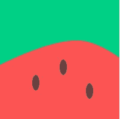

假装是西瓜片…

## 将 2D 视图转换为等轴测视图

变换 2D 视图的最简单的方法之一是旋转它`45°`，然后按因子`0.5`缩放它的高度。简单旋转收缩！

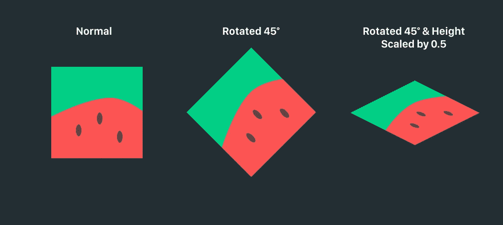

## 写成自定义`ViewModifier`

现在我们可以采取上面的步骤，将它转换成一个定制的 SwiftUI `ViewModifier`，如下所示:

```
struct IsometricViewModifier: ViewModifier {
    func body(content: Content) -> some View {
        content
            .rotationEffect(Angle(degrees: 45), anchor: .center)
            .scaleEffect(x: 1.0, y: 0.5, anchor: .center)
    }
}
```

当设计师想要在真实设备上模拟他们的 UI 设计时，这种技术被广泛使用。下面你可以看到它是如何在我的另一个教程的设计中使用的。这真的就像旋转和缩放高度一样简单。


典型的用户界面设计模型

**反向反向！**

如果我们在实体模型图像上颠倒上述步骤，那么我们得到的是等距变换前的原始图像。

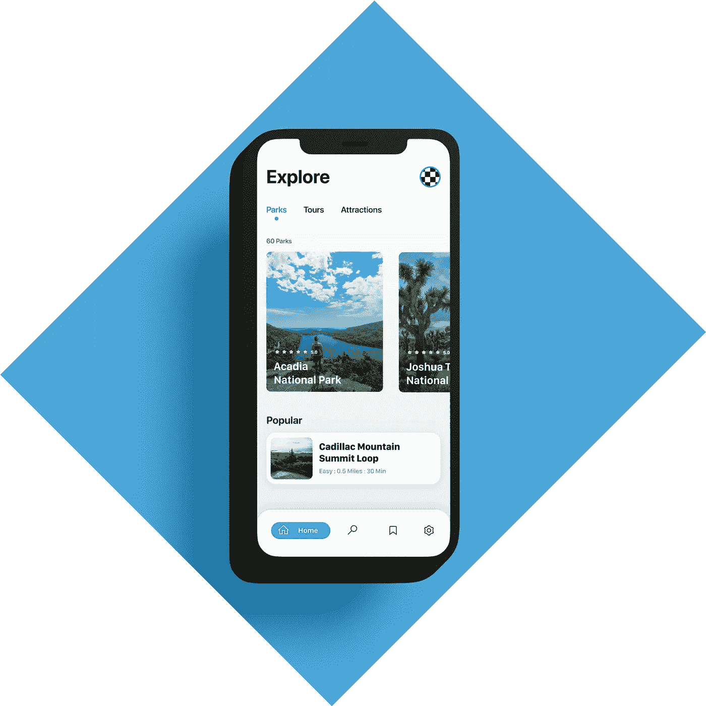

预等距变换

## 拉伸等轴测视图

现在是最难的部分。我们的等距视图缺少的是深度。对于下一个零件，我们将创建等轴测视图的拉伸基础。

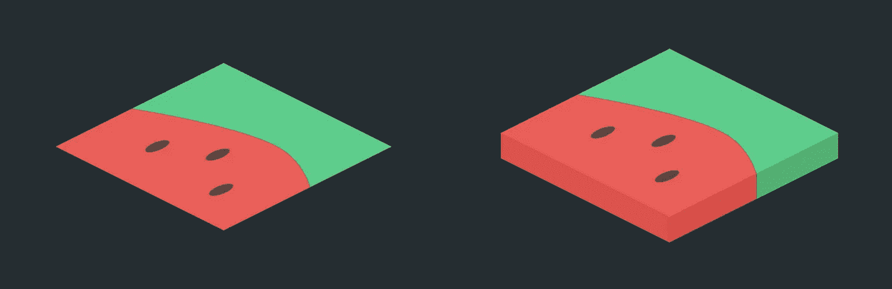

平面与拉伸等轴测视图

> 请注意，本节提供了非圆角矩形视图的拉伸技术。我仍然在用潜在的方法来应用等距变换，并用圆角挤出视图。在像 Figma 这样的设计程序中，这可能很容易，但是将这个过程转换成代码却很困难。

## 模拟挤压

为了创建一个完美的视图，我们需要从外面(前面两个等轴测的边)取颜色，并沿着等轴测的 z 轴向下延伸。我实现这一点的方法是沿着 x 或 y 轴缩放所提供的内容，然后将其裁剪到正确的大小和形状。这使我们能够从图像和渐变等视图中保留精确的颜色。

对于这种技术，我将挤出分解为两个部分:左前侧和右前侧。在代码中，它们实际上是 2D 等轴测视图上的两个单独的覆盖图。

## 自定义`ExtrudeModifier`

这里是`ExtrudeModifier`结构的模板。下面我将通过一组图片来展示挤压前左侧。然后我简单的把同样的过程复制到对面，完成挤压。

```
struct ExtrudeModifier<Texture: View> : ViewModifier {

    var depth: CGFloat // Extrusion Depth
    var texture: Texture

    func body(content: Content) -> some View {
        content
            // Front Left Side
            .overlay(
            	// Content (Texture) here
            , alignment: .center)

            // Front Right Side
            .overlay(
                // Content (Texture) here
            , alignment: .center)
    }
}
```

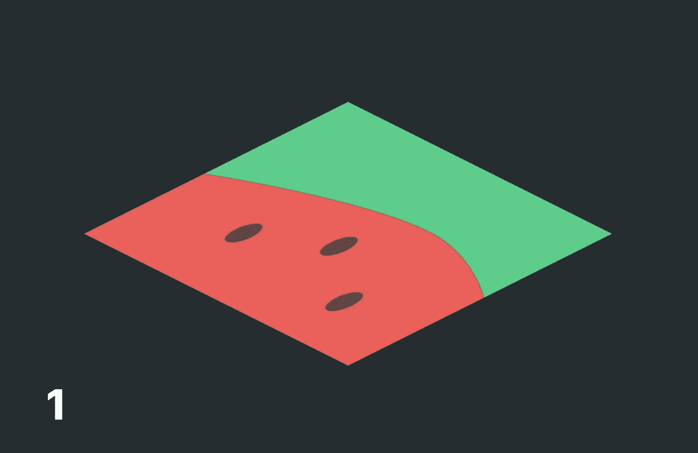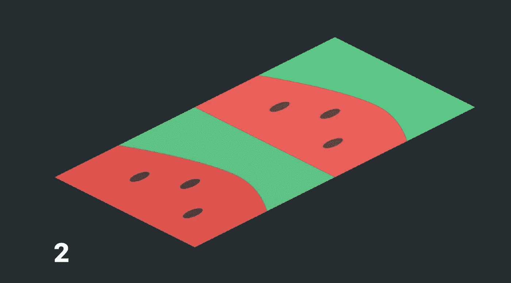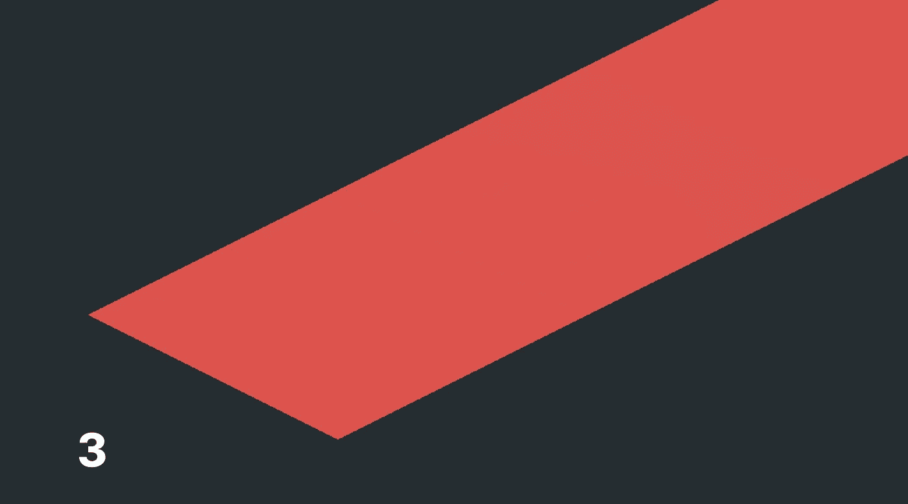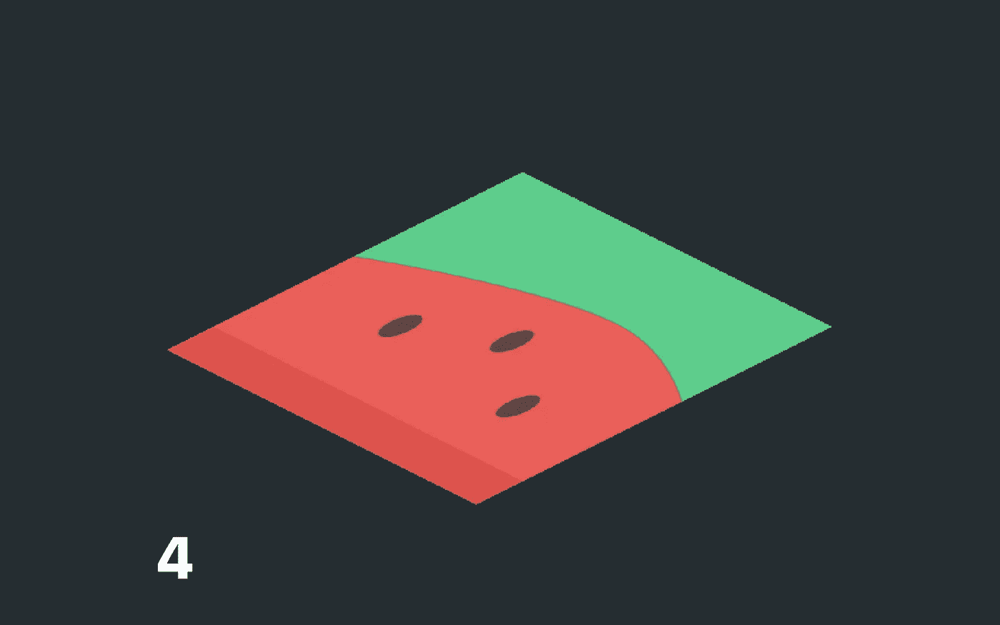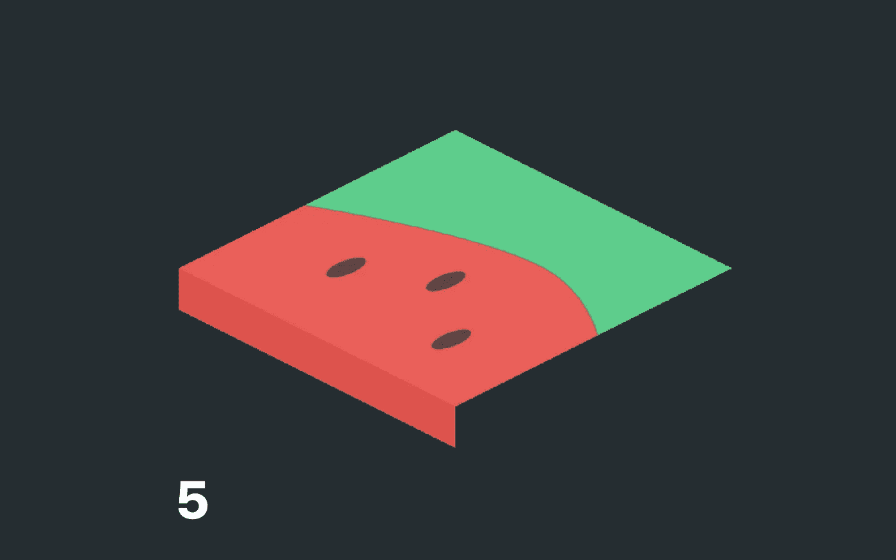

下面代码中的步骤引用

下面我评论了我为创建挤压的前半部分所采取的步骤。

> 注意:上面的照片已经申请了`offset(x: 0, geo.size.height)`。我这样做是为了帮助读者在我浏览代码时直观地看到这些步骤。

```
struct ExtrudeModifier<Texture: View> : ViewModifier {

    var depth: CGFloat
    var texture: Texture

    func body(content: Content) -> some View {
        content
            // Front Left Side
            .overlay(
                GeometryReader { geo in
                    texture // Step 2
                        .brightness(-0.05)
                        .scaleEffect(x: 1, y: geo.size.height * geo.size.height, anchor: .bottom) // Step 3
                        .frame(height: depth, alignment: .top) // Step 4
                        .mask(Rectangle())
                        .rotation3DEffect(
                            Angle(degrees: 180),
                            axis: (x: 1.0, y: 0.0, z: 0.0),
                            anchor: .center,
                            anchorZ: 0.0,
                            perspective: 1.0
                        )
                        .projectionEffect(ProjectionTransform(CGAffineTransform(a: 1, b: 0, c: 1, d: 1, tx: 0, ty: 0))) // Step 5
                        .offset(x: 0, y: geo.size.height)

                }
                , alignment: .center)

            // Front Right Side
            .overlay(
            	// TO DO    
            , alignment: .center)

    }
}
```

**现在另一侧**
现在我将同样的技巧应用到等轴测视图的另一侧。

```
struct ExtrudeModifier<Texture: View> : ViewModifier {

    var depth: CGFloat
    var texture: Texture

    func body(content: Content) -> some View {
        content
            // Front Left Side
            .overlay(
           		// See code from before...
            , alignment: .center)

            // Front Right Side
            .overlay(
                GeometryReader { geo in
                    texture
                        .brightness(-0.1)
                        .scaleEffect(x: geo.size.width * geo.size.width, y: 1.0, anchor: .trailing)
                        .frame(width: depth, alignment: .leading)
                        .clipped()
                        .rotation3DEffect(
                            Angle(degrees: 180),
                            axis: (x: 0.0, y: 1.0, z: 0.0),
                            anchor: .leading,
                            anchorZ: 0.0,
                            perspective: 1.0
                        )
                        .projectionEffect(ProjectionTransform(CGAffineTransform(a: 1, b: 1, c: 0, d: 1, tx: 0, ty: 0)))
                        .offset(x: geo.size.width + depth, y: 0 + depth)
                }
                , alignment: .center)

    }
}
```

**你为什么要改变两边的亮度？**

如果你注意到上面，我修改了两个叠加的亮度，使它们更暗。这有助于模拟等轴测视图的三维特性。没有它，视图在屏幕上看起来会很简单，很平坦。在下面的比较中，请注意这有多么大的不同。

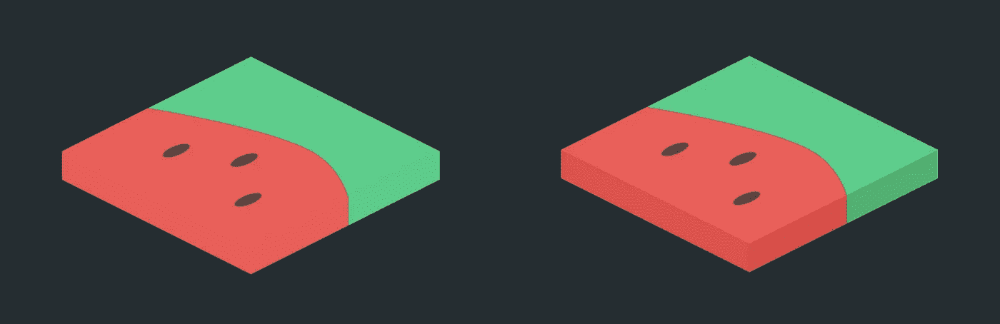

亮度无变化与变化

## 把所有的放在一起

如果你愿意，你可以创建一个定制的`IsometricView`组件，利用上面的`ExtrudeModifier`和`IsometricViewModifier`。此自定义组件为开发人员提供了动态更改视图是否等轴测以及拉伸深度的选项。

```
struct IsometricView<Content: View>: View {

    var active: Bool
    var content: Content
    var extruded: Bool
    var depth: CGFloat

    init(active: Bool, extruded: Bool = false, depth: CGFloat = 20, @ViewBuilder content: ()-> Content) {
        self.active = active
        self.extruded = extruded
        self.depth = depth
        self.content = content()
    }

    @ViewBuilder var body: some View {
        if active {
            if extruded {
                content
                    .modifier(ExtrudeModifier(depth: depth, background: content))
                    .modifier(IsometricViewModifier(active: active))
                    .animation(.easeInOut)
            } else {
                content
                    .modifier(IsometricViewModifier(active: active))
                    .animation(.easeInOut)
            }
        } else {
            content
                .animation(.easeInOut)
        }

    }
}
```

## 示例使用

一旦你开始玩`IsometricViewModifier`和`ExtrudeModifier`，你就可以做出一些有趣的东西。下面我有一个浮动等距视图，另一个有两个不同的挤出纹理，也有一个图像。

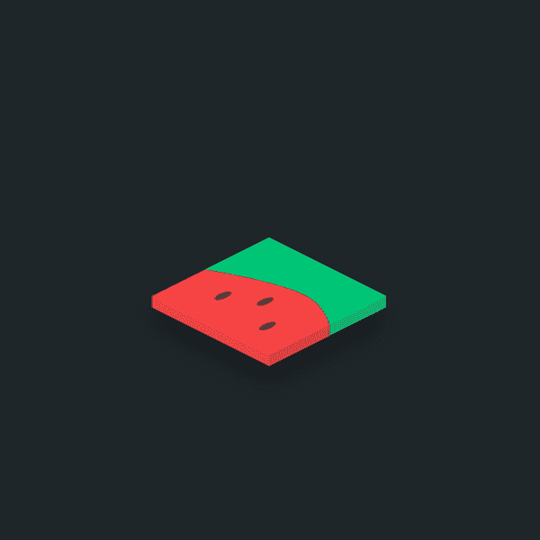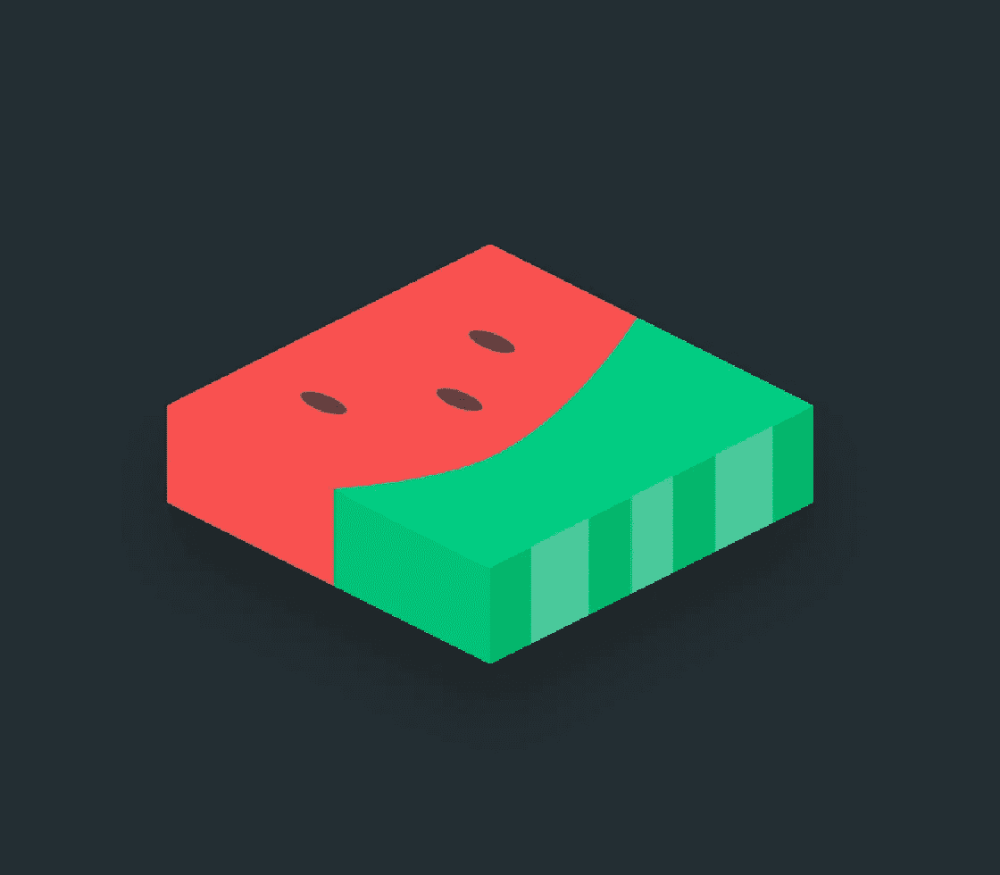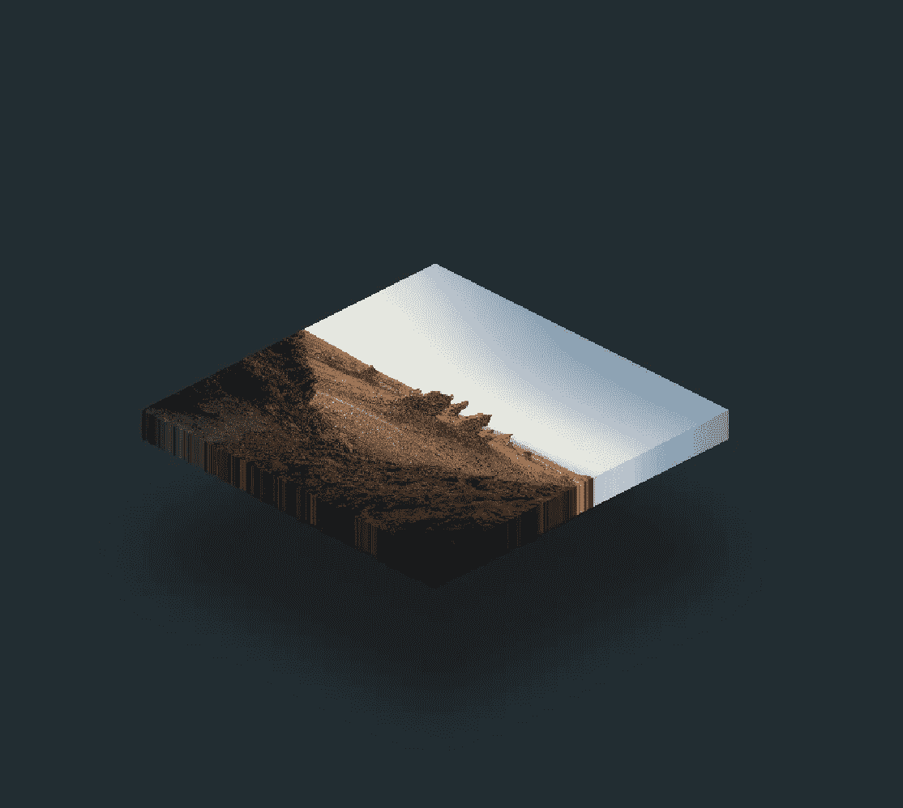

## 让我们看看你做了什么！

我们想看看你用这个教程做了什么！给我们发照片！在 Twitter [@TrailingClosure](https://twitter.com/TrailingClosure) 、insta gram[上找到我们，或者发邮件到 howdy@TrailingClosure.com联系我们。](https://www.instagram.com/trailingclosure/)