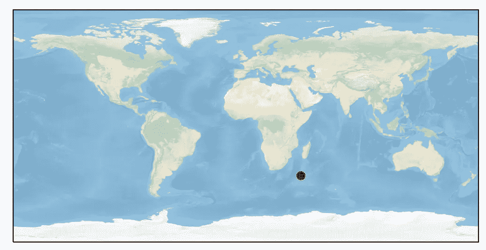
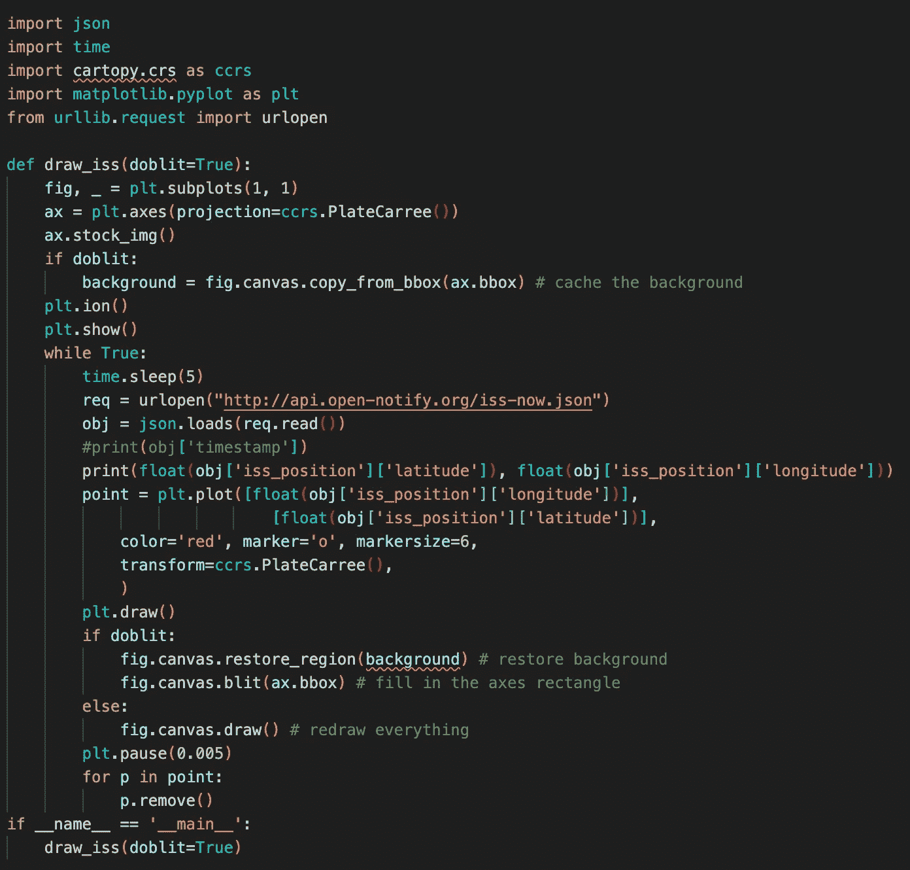

# ISS Python 跟踪器

> 原文：<https://levelup.gitconnected.com/iss-python-tracker-50222170f473>

编写 Python 脚本来跟踪和可视化 ISS


# 康达环境

我们将使用适用于 Conda 环境的 Cartopy 库。这个库允许我们从坐标和图像中投射和转换适当的映射。

```
conda create --name iss_trackerconda activate iss_tracker
conda install cartopy, matplotlib
```

让我们设置我们的脚本导入:

```
import json                               # For reading ISS info
import time                               # For reducing polling
import cartopy.crs as ccrs                # Mapping
import matplotlib.pyplot as plt           # Visualization
from urllib.request import urlopen        # Fetching ISS info
```

首先，我们要设置将要映射的环境。为此，我们使用 PlateCarree 的 Cartopy 投影，它等同于设置坐标映射的范围。

```
fig, _ plt.subplots(1,1)
ax = plt.axes(projection=ccrs.PlateCarree())
ax.stock_img()plt.show()
```

运行到目前为止，应该会显示一个简单的地球地图。接下来我们要为国际空间站放置一个标记。为了做到这一点，我们想获取国际空间站的位置数据——幸运的是，这可以通过 [Open-Notify](http://open-notify.org/Open-Notify-API/ISS-Location-Now/) 免费获得。

```
req = urlopen("http://api-open-notify.org/iss-now.json")
obj = json.loads(req.read())
```

这个对象包含一个 JSON 对象，带有成功/失败消息、时间戳以及 ISS 的纬度和经度。为了访问这些信息，一旦 json 库将这些信息读入字典格式，Python 就会变得很容易。现在我们可以在地图上绘制一个 ISS 的实例。

```
...
plt.plot([float(obj['iss_position']['longitude'])],
         [float(obj['iss_position']['latitude'])],
         color='red', marker='o', markersize=6,
         transform=ccrs.PlateCarree()
)
plt.show()
```

这将产生以下结果(给定国际空间站的当前位置):



ISS 位置

# 实时跟踪器

为了实现一个实时跟踪器，我们将不得不调用 matplotlib 的一些更好的功能，并注意删除旧点，否则如果放置太久，我们的地图将会不堪重负。

为了减少重新绘制的工作量，我们将通过从图中复制当前背景来缓存背景。

```
background = fig.canvas.copy_from_bbox(ax.bbox)
```

我们稍后在重绘循环中使用这个对象。在我们编写重绘循环之前，我们必须以非阻塞的方式启用地图绘制—这是通过 plt.ion()完成的。这将启用可视化的交互模式。

在重绘循环中，我们将把 ISS 信息请求移入并传递给一个“point”对象。在这一步之后，我们将重新绘制我们的情节。

根据 Open-Notify 请求，我们将把轮询频率限制为每 5 秒一次，以减轻服务器的负担——我们将通过简单地调用 time.sleep(5)来实现这一点。

```
while True:
    time.sleep(5)
    req = urlopen("http://api.open-notify.org/iss-now.json")
    obj = json.loads(req.read())

    point = plt.plot([float(obj['iss_position']['longitude'])],
                     [float(obj['iss_position']['latitude'])],
                      color='red', marker='o', markersize=6,
                      transform=ccrs.PlateCarree(),
)
plt.draw()
```

为了利用缓存的背景，我们实现了 matplotlib 的 blit 功能。

```
if doblit:
    fig.canvas.restore_region(background) # restore background
    fig.canvas.blit(ax.bbox) # fill in the axes rectangle
else:
    fig.canvas.draw() # redraw everything
plt.pause(0.005) # Allows rendering to catch up
```

最后，为了消除地图上的路径条纹，我们将移除旧的坐标点——这就是点对象出现的地方。

```
for p in point:
    p.remove()
```

现在运行这个脚本将展示国际空间站的实时定位。完整的代码可以在下面看到。

# 完整脚本



[完整剧本](https://github.com/BnJam/iss_tracker)

# 来源

*   [如何使用 matplotlib 在 while 循环中实时绘图？](https://stackoverflow.com/questions/11874767/how-do-i-plot-in-real-time-in-a-while-loop-using-matplotlib)
*   [使用 Matplotlib](https://stackoverflow.com/questions/28269157/plotting-in-a-non-blocking-way-with-matplotlib) 以非阻塞方式绘图
*   [卡通画](https://pypi.org/project/Cartopy/)
*   [打开-通知/ISS-现在](http://open-notify.org/Open-Notify-API/ISS-Location-Now/)