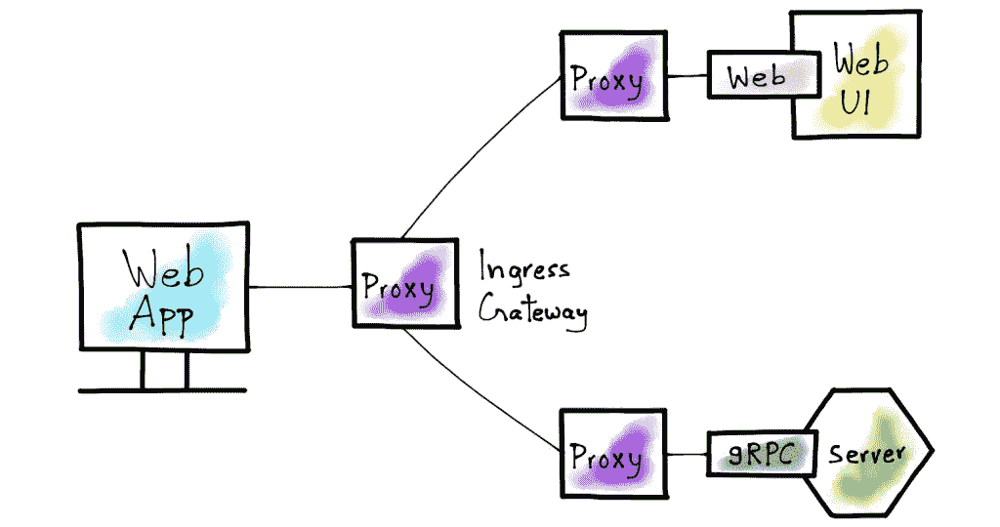

# Istio + gRPC Web +证书管理器=🔥(第 1/2 部分)

> 原文：<https://levelup.gitconnected.com/istio-grpc-web-cert-manager-e212873624d5>


我用 gRPC-Web 和 Istio 构建了一个概念验证，但是在将它们结合起来时，我几乎没有找到任何资源。更不用说当我在寻找用 HTTPs 加密流量的资源时，搜索结果变得更加稀缺。这促使我自己创建了一个指南。

在第 1 部分中，我将解释如何使用 Istio 在 gRPC 后端服务器和使用 gRPC-web 的前端 Web 客户端之间建立通信。在第 2 部分中，我将介绍如何通过使用 HTTPs 加密前端和后端之间的网络流量来保护通信。



来源: [VMware 博客](https://blogs.vmware.com/networkvirtualization/2019/04/grpc-web-and-istio.html/)

在我们深入技术细节之前，让我先介绍一下 Istio 和 gRPC-Web 到底是什么。

[Istio](https://istio.io/latest/docs/concepts/what-is-istio/) 是一个服务网格实现，它创建、管理并帮助理解微服务之间的网络。Istio 在服务到服务的通信方面有很多优势，比如负载平衡、认证和授权、监控、可追溯性等等。

[gRPC-Web](https://grpc.io/blog/grpc-web-ga/) 支持 Web 应用直接与 gRPC 后端服务通信，无需 HTTP 服务器作为中介。和 gRPC 一样，gRPC-Web 允许您使用协议缓冲区定义客户端(Web)和后端 gRPC 服务之间的服务“契约”。
由于我们似乎不会很快获得对 gRPC 的本地浏览器支持，gRPC-Web 提供了一个很好的解决方案，它使用一个代理，如 Envoy 或 Nginx，将来自浏览器的 HTTP 调用转换为对后端的本地 gRPC 调用。Istio 使用 Envoy 作为其服务网格代理；因此，我们在该教程中使用 Istio。

介绍完了，让我们直接进入有趣的部分。

# **我们将实现的目标:**

1.  部署单节点 Kubernetes(k8s)集群。为了这个教程，我们将使用 [K3s](https://k3s.io/) 。
2.  在 k8s 集群中下载并安装 Istio 服务网格。
3.  确定 Istio 的入口 IP 和端口。
4.  将前端、gRPC 后端服务和 Envoy gRPC web 过滤器部署为集群中的 k8s 对象。
5.  创建 Istio 网关和虚拟服务
6.  测试应用程序

现在让我们把手弄脏吧！

## 1)部署一个 k8s 集群:

*我将在本教程中使用* [*K3s*](https://k3s.io/) *，在我看来，它是 K8s 的一个非常可靠的轻量级发行版，非常适合开发和 edge(资源有限的环境)部署。要安装它，你只需要运行* `$ curl -sfL https://get.k3s.io | sh -`

在撰写本教程时，使用的是 Kubernetes 版本。

## 2)下载并安装 Istio:

为了[安装](https://istio.io/latest/docs/setup/getting-started/) Istio，需要完成以下步骤:

*   `$ curl -L [https://istio.io/downloadIstio](https://istio.io/downloadIstio) | sh -`(撰写本教程时，使用的是 Istio 1 . 9 . 3 版本)
*   `$ cd istio-1.9.3`
*   `$ export PATH=$PWD/bin:$PATH`
*   `$ istioctl install — set profile=demo -y`(如果运行该命令时出现连接被拒绝的错误，请按照此处[提到的步骤](https://discuss.istio.io/t/solved-error-installing-istio-using-istioctl/5254)，这应该可以解决问题)
*   最后但同样重要的是，我们希望指示 Istio 在应用程序中自动注入其 Envoy sidecar 代理:
    `$ kubectl label namespace default istio-injection=enabled`

## 3)确定入口 IP 和端口

按照以下步骤识别 k8s 集群入口主机和端口:(有关以下步骤的更多详细信息，请查看 Istio 的[文档](https://istio.io/latest/docs/setup/getting-started/#determining-the-ingress-ip-and-ports)

```
$ export INGRESS_HOST=$(kubectl get po -l istio=ingressgateway -n istio-system -o jsonpath='{.items[0].status.hostIP}')$ export INGRESS_PORT=$(kubectl -n istio-system get service istio-ingressgateway -o jsonpath='{.spec.ports[?(@.name=="http2")].nodePort}')$ export SECURE_INGRESS_PORT=$(kubectl -n istio-system get service istio-ingressgateway -o jsonpath='{.spec.ports[?(@.name=="https")].nodePort}')$ export GATEWAY_URL=$INGRESS_HOST:$INGRESS_PORT$ echo "$GATEWAY_URL"
```

这是将应用程序暴露在集群之外并允许浏览器中的前端客户端和后端之间通信所必需的。记下$GATEWAY_URL，我们以后会用到它。

## 4)部署前端、gRPC 后端服务和 Envoy gRPC web 过滤器

由于后端和前端的实现细节不是本教程的范围，我将在这里重用后端和前端实现的。

我为后端和前端创建了一个 docker 映像，并将在下面的 K8s 部署清单中使用它们。

要让它们运行，请遵循以下步骤:

*   如果您还没有帐户，请在 [dockerhub](https://hub.docker.com/) 上创建一个帐户。
*   创建一个 docker 注册表秘密能够拉图片:
    `$ kubectl create secret docker-registry regcred --docker-username=<your-name> --docker-password=<your-password>`
*   创建一个新目录，并将下面的目录复制到其中。

特使过滤器

后端部署和服务

前端部署和服务

*   用步骤 3 中确定的值替换环境变量`REACT_APP_GATEWAY_URL`的值。
*   按顺序运行以下命令(注意，需要在后端服务之前创建 envoy 过滤器，因为过滤器将安装在后端 pod 中运行的 Istio 的 sidecar 上)

```
$ kubectl create -f envoy-filter.yaml
$ kubectl create -f grpc-backend.yaml
$ kubectl create -f grpc-web-frontend.yaml
```

*   通过运行`$ kubectl get pods`来验证部署，应该会看到与下面类似的输出

```
NAME                      READY   STATUS    RESTARTS   AGE
server-xxxxxx-xxxxxxxxx   2/2     Running   0          xm
client-xxxxxx-xxxxxxxxx   2/2     Running   0          xm
```

## 5)创建 Istio 网关和虚拟服务

我们需要指示 Istio 配置集群的入口流量，并将 HTTP 流量路由到后端。这可以通过为后端和前端创建目的地规则，以及创建网关和虚拟服务来实现。

正如您在下面的对象定义中看到的，虚拟服务定义应该有将流量路由到后端和前端的规则。

在项目目录下创建下面的文件，然后运行
`$ kubectl create -f gateway.yaml`

Istio 的目的地规则、网关和虚拟服务

## 6)测试应用程序

按照前面的步骤，我们应该成功部署了 gRPC 后端服务和使用 gRPC-web 与后端通信的前端服务。Istio 的网关充当代理，将来自浏览器的 http 调用转换为后端的 gRPC 调用。

要验证该流程，请打开一个新的浏览器选项卡并访问`http://$GATEWAY_URL/ui`

您应该能够看到一个简单的 UI，它具有如下所示的温度和湿度读数。数字应该每 5 秒或更短时间变化一次。


用户界面中的预期输出

那都是乡亲们！🎉

在这一部分，我们能够

*   部署 gRPC 后端服务和使用 gRPC web 与后端通信的前端服务。
*   在前端和后端 pod 上注入 Istio 的 sidecar 代理
*   使用 Istio 入口网关公开服务
*   配置 Istio 的入口网关，将 HTTP 流量代理到 gRPC 后端

在**第 2 部分**中，我将解释如何使用**证书管理器保护与 HTTPs 的前端到后端通信。**敬请期待！

> *免责声明:所有使用的 yaml 文件不一定是为生产使用而创建的。要在生产中使用它们，可能需要进行一些更改。*

## 资源:

*   [https://istio.io/latest/docs/setup/getting-started/](https://istio.io/latest/docs/setup/getting-started/)
*   [https://medium . com/swlh/building-a-real time-dashboard-with-react js-go-grpc-and-envoy-7be 155 DFA FB](https://medium.com/swlh/building-a-realtime-dashboard-with-reactjs-go-grpc-and-envoy-7be155dfabfb)
*   [https://venil noroha . io/seamless-cloud-native-apps-with-grpc-web-and-istio](https://venilnoronha.io/seamless-cloud-native-apps-with-grpc-web-and-istio)