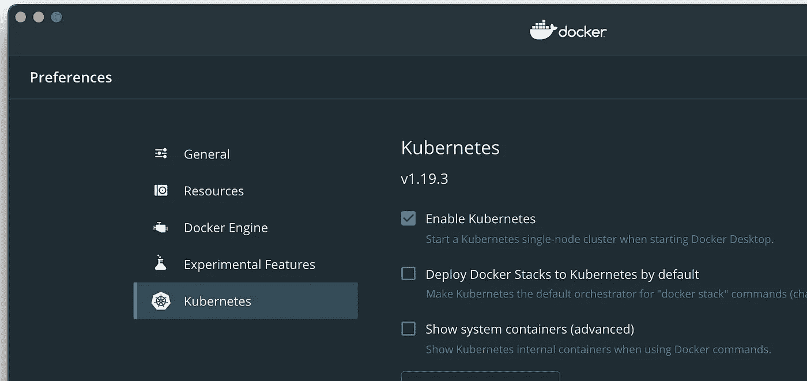
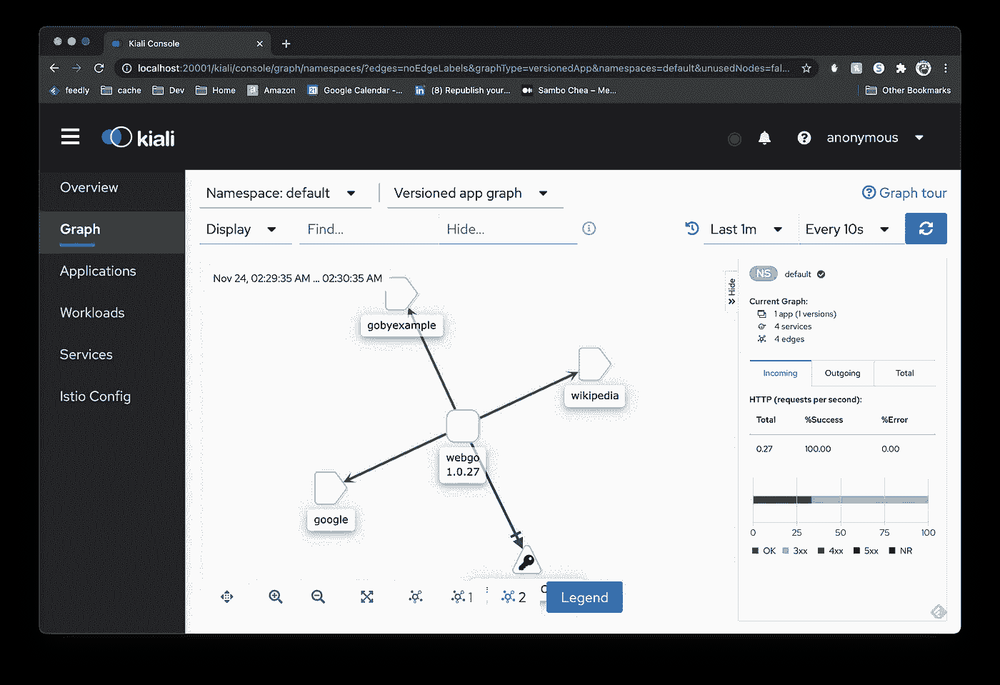
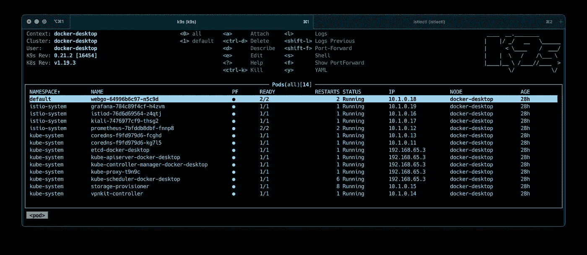

# Istio:设置本地沙箱

> 原文：<https://levelup.gitconnected.com/istio-setting-up-a-local-sandbox-5ee84175de0f>


为了在 Kubernetes 中学习和测试新事物，我喜欢在本地集群中进行。能够在你的笔记本电脑上旋转是一个简单的胜利。这篇文章不会讨论“为什么 Istio ”,只讨论“如何”。之前我写了一篇关于用 Docker 桌面和 Helm 获得一个[本地 Kubernetes 集群的文章。沿着这条路走下去，我加入了](/go-helm-kubernetes-docker-desktop-bf59f4eb9e9d) [Istio](https://istio.io/) 。这项工作是在同一个[库](https://github.com/nwillc/webgo/tree/feature/istio)的一个分支中完成的。

## 入门指南

您可能想要抓住[库](https://github.com/nwillc/webgo/tree/feature/istio)来跟随。

你将只需要**两个**东西来完成这一切， [Docker Desktop](https://www.docker.com/products/docker-desktop) 和 [asdf](https://github.com/asdf-vm/asdf) 。我们将使用 Docker Desktop 进行集装箱化和 Kubernetes 集群:



这一切都适用于 Kubernetes 的 Minikube，但不需要额外安装。

## 为了得到剩下的…

安装 [asdf](https://github.com/asdf-vm/asdf) 。这是一个很好的工具。一旦你准备好了，运行我包括的`bin/asdf-sync.sh`。那会给你我们需要的一切。

## 获取 Istio

Istio 是那些为*也为*提供了许多受支持的安装方式的工具之一，并且固执己见的正确方式似乎在不断变化。在这里，我们将看到 Istio 1.8.0，他们又回到了提倡头盔，这是我更喜欢的，至少对于基础安装来说，插件，其中一些几乎是必需的，但可悲的是没有在头盔中。无论如何，让我们看看我的安装脚本的内容:

```
*# Get the distribution
mkdir* istio
*cd* istio
*curl* -L https://istio.io/downloadIstio | *sh* -
*cd* istio-1.8.0# Create a namespace for Istio
*kubectl* create namespace istio-system# Use Helm to install Istio
*helm* install --namespace istio-system istio-base \
  manifests/charts/base \
  --set global.jwtPolicy=first-party-jwt *helm* install --namespace istio-system istiod \
  manifests/charts/istio-control/istio-discovery \
  --set global.hub="docker.io/istio" \
  --set global.tag="1.8.0" \
  --set global.jwtPolicy=first-party-jwt# Now get the key addons
*kubectl* apply -f samples/addons/prometheus.yaml
*kubectl* apply -f samples/addons/kiali.yaml
*kubectl* apply -f samples/addons/grafana.yaml# And set up automatic sidecar injection
*kubectl* label namespace default istio-injection=enabled
```

这比我想要的要多，但它非常简单，一旦完成，你就有了 Istio，它的关键插件在你的集群中，并设置为在需要的地方自动注入它的边车。我已经将上述内容作为`bin/install-istio.sh`脚本包含在我的存储库中。

## 给我们看看你有什么

此时，您将拥有一个包含 Istio 的 Kubernetes 集群。那又怎样？我还包含了一个演示应用程序。如果您只是想获得笑点，而不是查看引擎盖下的内容，则部署已经在 Docker Hub 上构建的映像:

```
./bin/deploy.sh -r nwillc/webgo -v 1.0.27
```

然后打开 Istio 的 Kiali addon 的仪表盘:

```
istioctl dashboard kiali
```



哇，那是可观察性！该应用程序，它的端点，流量分析，等等，你只需点击一下。不坏 5 分钟安装到笔记本电脑上。或者用 K9s 看这是你已经实现的:

