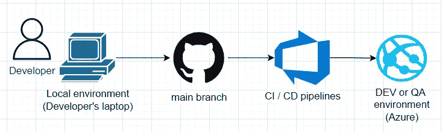
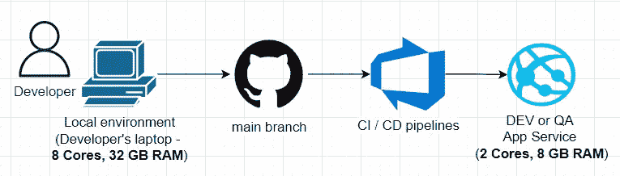

# 它在我的机器上工作…

> 原文：<https://levelup.gitconnected.com/it-works-on-my-machine-f2782c50fab4>

## 将代码合并到主分支之前要考虑的首要问题

由 [Shubham Dhage](https://unsplash.com/@theshubhamdhage?utm_source=medium&utm_medium=referral) 在 [Unsplash](https://unsplash.com?utm_source=medium&utm_medium=referral) 上拍摄

在将代码合并到主分支之前，软件开发人员开始开发和测试他们在本地环境中开发的功能。通常，根据项目基础设施的设置，自动化的 CI/CD 管道随后被运行，以将变更部署到开发或 QA 环境(在本文的后面我们称之为“目标”环境)。

在本地环境和目标环境之间经常会有许多差异，开发人员可能没有意识到或者只是忘记了，直到代码被合并、部署，然后…在目标环境中崩溃。

# 本地 CPU 和 RAM 高于目标环境

本地和目标环境在处理器类型、内核数量和 RAM 容量方面可能有所不同。通常，在目标环境中，本地工作站比 web 服务更高效。

如果开发人员实现并合并了 CPU 或内存受限的代码，机器资源的这种差异会导致问题。

**场景#1(内存问题):**开发人员实现了一个逻辑，将一个非常大的文件加载到内存中，从中解析数据，进行一些处理，最后将输出存储在某个地方。这个逻辑会消耗大量内存:加载一个文件会占用一些内存，解析和处理会导致托管堆中的大量分配。

在本地，由于足够的内存资源，该功能可以按预期工作。但是，在目标环境中，如果文件大于可用的 RAM，即使在将文件加载到内存的阶段，该功能也可能失败。

**场景#2 (CPU 问题):**开发人员已经实现了处理某个文件的逻辑。该文件相对较小，因此不会像第一个场景中那样出现内存问题，但是由于在处理该文件期间需要执行数千次检查、映射和验证，因此执行代码需要很长时间。开发人员决定通过使用`Parallel.Foreach`、`Task.WhenAll`等所有可用的内核来优化性能。

这种并行化改进有助于开发人员在本地满足非功能性需求，因为它甚至可以快 8 倍！然而，在目标环境中，由于内核数量减少，相同的代码运行速度会慢得多。

**如果开发者在与目标环境相同的资源上测试他的代码，上述问题和类似的问题** **可以避免**。这可以通过运行和测试 Docker 中的代码来实现，Docker 允许您限制 CPU 和内存资源，以匹配目标环境的资源。

# 本地数据库中缺少主数据或主数据量微不足道

本地开发通常需要创建应用程序数据库的本地副本，并用一些数据填充它。

数据库中有两种类型的数据:**主数据**和**参考数据**。参考数据是应用程序不能正常运行的数据。这可以是应用程序逻辑在注册过程中检索并显示在下拉列表中的货币列表。所有环境(包括开发人员的 PC)的参考数据量都是一样的，因为它是存储在存储库中的种子或部署后脚本的一部分。所以有参考数据没什么好担心的。

主数据是应用程序在其生命周期中生成的数据。注册用户、创建订单以及用户在应用中执行的许多其他操作都会在数据库中创建所谓的主数据。根据活动用户的数量，主数据的数量在不同的环境中会有很大的差异。成千上万的活跃用户可以使用生产环境。QA 环境可以被几十个用户使用，他们是 QA 工程师、业务分析师等。因此，使用该环境的人越多，数据库中生成的主数据就越多。

通常，最小的主数据集位于本地开发环境中，因为只有一个活动用户，即开发人员。

由于本地数据库中的数据量很小，开发人员在本地测试时可能不会注意到性能问题。从性能的角度来看，开发人员在 30 个项目上使用线性搜索还是二分搜索法并不重要。然而，当目标环境中有 1000 万个项目时，问题就出现了。

因此，当本地主数据集太小时，很容易忽略性能问题。出于测试目的，开发人员可以在本地生成额外的主数据，或者至少考虑算法在大型主数据集上是否有效。

# DevOps 不会为您的代码实现基础架构更改

开发人员编写的代码通常不是一个自包含的单元，因为它通常需要各种外部依赖才能正常工作。例如，需要通过 HTTP 请求调用服务 B 的服务 A 可能需要从某个密钥管理服务(Azure Key Vault、AWS KMS 等)读取服务 B 的认证密钥。).

假设一个开发人员实现了一个很大的功能，其中也包括服务之间的集成。开发人员向本地配置添加一个身份验证密钥，以便服务 A 可以在本地测试期间成功调用服务 B。但是，除非将身份验证添加到目标环境的密钥管理服务实例中，否则在合并到主分支并进行部署后，此功能将不起作用。

开发人员可能只是忘记自己设置 auth key，或者要求 DevOps 团队这样做。这可能发生在(以我个人的经验来看)当开发人员过于沉迷于应用正确的设计模式、算法和其他编程技巧时，因此基础设施依赖性变得不重要并逐渐消失在背景中。

因此，在将代码合并到主分支之前，重要的是了解它需要哪些外部依赖，然后**在合并代码之前确保它们都在目标环境**中实现，以避免不愉快的问题。

感谢阅读。如果你喜欢你所读到的，看看下面这个故事:

 [## 微服务之间建立通信的 4 种方式

### 每种方法的主要优缺点

levelup.gitconnected.com](/4-ways-to-establish-communication-between-microservices-984207f29497) 

# 分级编码

感谢您成为我们社区的一员！更多内容请参见[升级编码出版物](https://levelup.gitconnected.com/)。
跟随:[推特](https://twitter.com/gitconnected)， [LinkedIn](https://www.linkedin.com/company/gitconnected) ，[时事通讯](https://newsletter.levelup.dev/)
升一级就是转型科技招聘👉 [**加入我们的人才集体**](https://jobs.levelup.dev/talent/welcome?referral=true)