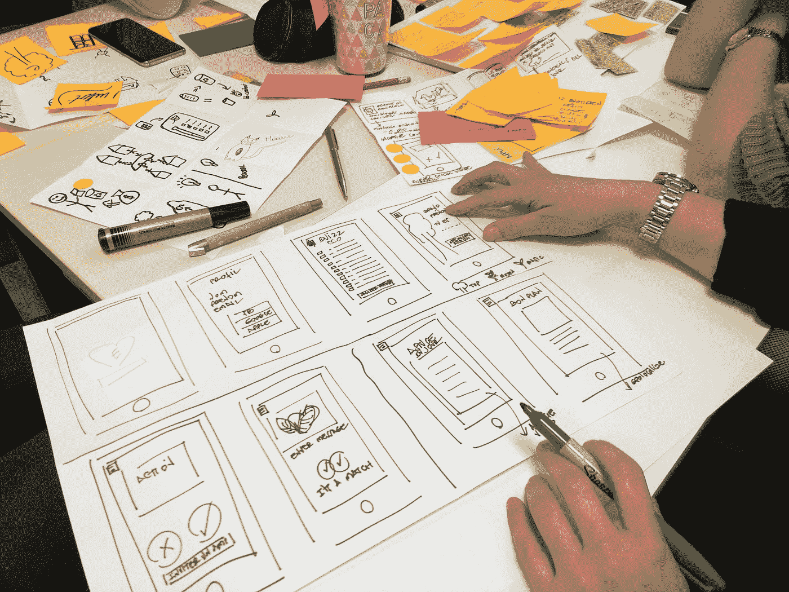

# 它不总是关于代码，它是设计

> 原文：<https://levelup.gitconnected.com/its-not-always-about-code-it-s-design-596f10384264>

软件开发人员痴迷于代码。它必须高效、可扩展，甚至漂亮。问题是有时候改变源代码并不能解决你的问题。

照片由 [Unsplash](https://unsplash.com?utm_source=medium&utm_medium=referral) 上的[艾米利·莫里雄](https://unsplash.com/@amayli?utm_source=medium&utm_medium=referral)拍摄

# Airbnb 的最初几年

【2008 年 8 月，乔·格比亚和布莱恩·切斯基创立了 Airbnb。2009 年 1 月，保罗·格拉厄姆邀请 Airbnb 的创始人参加 Y Combinator 的培训。他对公司感兴趣。那是 2009 年 1 月。

2009 年 8 月，Airbnb 还很少赚钱。该公司的收入约为每周 200 美元。创始人和保罗·格拉厄姆都住在三藩市。这笔钱不够支付那里的食物和账单。船正在下沉。

查看 Airbnb 上纽约市的房源，这三位企业家发现他们之间有一种模式。

> 相似的是照片很烂。照片不是很好。
> 
> 乔·格比亚

寻找住处的人有时甚至可以看到卧室。你会租一间没看过的房间吗？嗯，可能不会。这就是问题开始变得清晰的地方。

照片很烂最明显的解决方法是什么？用更好的相机和角度再拍一次。他们就是这么做的。

他们租了一台相机，买了一张去纽约的机票，花时间和业主一起拍了一些高分辨率的照片。

如果他们错了呢？如果照片不是问题所在呢？他们没有数据证明这一点。这是一个赌注。那是**直觉**。幸运的是，他们是对的。

Airbnb 开始每周赚 400 美元后的一周。

收入翻了一倍。

这条路是正确的，这个策略让 Airbnb 度过了那场危机。

# 教训

当时，Airbnb 列出了纽约市大约 40 处房产。解决方案包括去每一个地方拍摄难以置信的高分辨率照片。如果属性是 80，或者 200 呢？

是的，该解决方案不可扩展。不过，它完美地解决了这个问题。

如果你，作为一个企业主，同情你的顾客，你就知道错在哪里了。如果你站在顾客的角度，你就知道发生了什么。这可能意味着把你自己放在舒适区之外，但这是必须要做的。编程无法解决图片质量差的问题。

你必须到现实世界中去，与客户交谈，与他们一起解决问题。

# 什么是设计思维

Airbnb 的故事有很多关于设计问题解决方案的见解和教训。这个故事是设计思维的一个例子。

## 有同感

普里西拉·杜·普里兹在 [Unsplash](https://unsplash.com?utm_source=medium&utm_medium=referral) 上的照片

设计思维是一种以人为中心的解决问题的方法。它侧重于解决方案中必须解决的人类需求。客户必须是我们每个商业决策的核心。

了解他们的问题。它们是未得到满足的需求。

感同身受，谈心，环顾四周。尽量扩大自己的视野。先不要把重点放在解决方案上。试着去理解拥有你的顾客的需求意味着什么。

## 框定问题

现在，定义问题。记住，人必须是你的焦点。在 Airbnb 的案例中，问题不在于“我们赚的钱不够多”。那是错误的。这是客户未满足需求或不满意的结果。

这是一个问题:

> 人们需要看到他们租的公寓，并对其感到惊讶。

是的，因为否则，他们不会租的。

## 想象

此时，你应该明白你所面临的问题。你应该开始思考创造性的解决方案来解决这个问题。拿起纸和笔，开始写下你想到的一切。甚至是你认为愚蠢的解决方案。没关系。你以后会有时间分析它们的。

不排除不可扩展或不技术的解决方案。

写下一切。

## 原型

分析你的想法，制作原型。不要专注于建立一个完美的。即使是一个粗略的原型作品。你只需要确认你的想法是否朝着解决问题的正确方向发展。它将帮助你改进和建立你的想法。在开发原型时，您可能会遇到以前没有考虑到的问题。

## 测试。测试。再次测试。

顾客的需求，你还记得吗？收集反馈，并询问用户原型是否朝着正确的方向发展。

获得见解，并使用它们来进一步改进你的原型。第一次没有什么是完美的。这是一个**迭代过程**。需要多次迭代才能好。但是你永远不知道有多少。意思是把自己放在舒适区之外，但这是必须要做的。

编程无法解决图片质量差的问题。你必须到现实世界中去，与客户交谈并解决问题。

# 结论

我希望在这篇文章结束时，你能相信代码并不总是解决问题的方法。

到现实世界中去，与人交谈，打破你的假设，会有所不同。

如果你喜欢这篇文章，订阅获取更多这样的内容。别忘了[分享一下](/its-not-always-about-code-it-s-design-596f10384264)😉！

# 资源

[1][https://www . ideou . com/blogs/inspiration/what-is-design-thinking](https://www.ideou.com/blogs/inspiration/what-is-design-thinking)

[2][https://review . first round . com/How-design-thinking-transformed-Airbnb-从一家失败的初创公司到十亿美元的企业](https://review.firstround.com/How-design-thinking-transformed-Airbnb-from-failing-startup-to-billion-dollar-business)