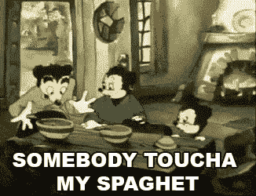
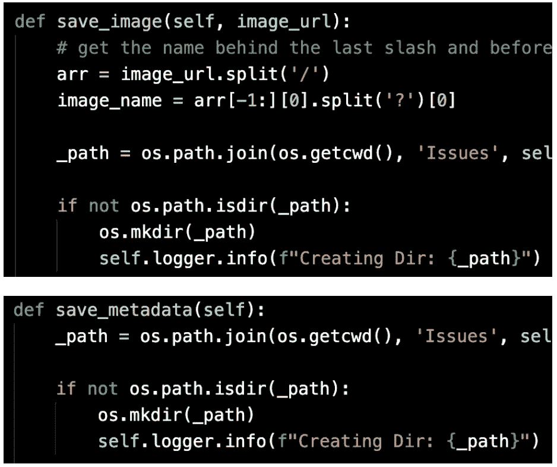
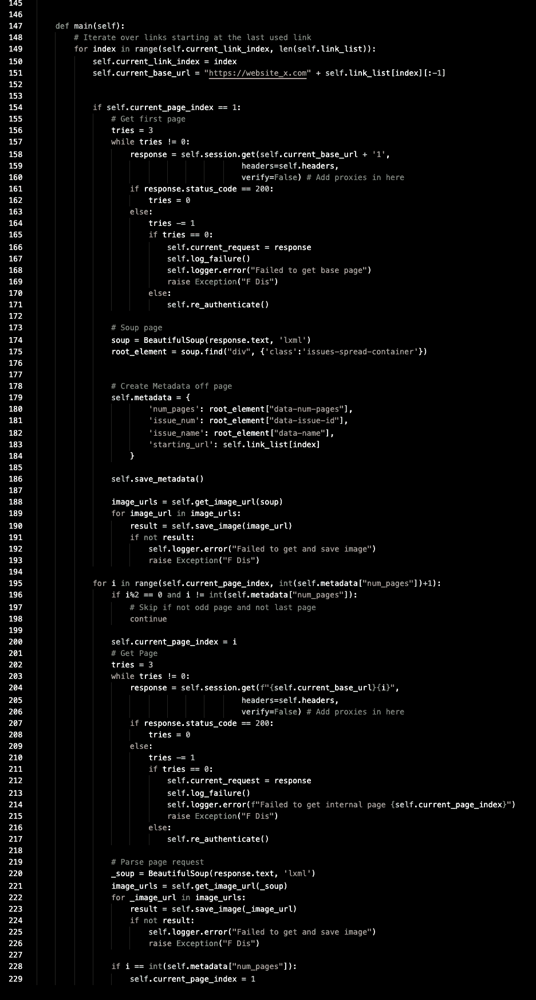
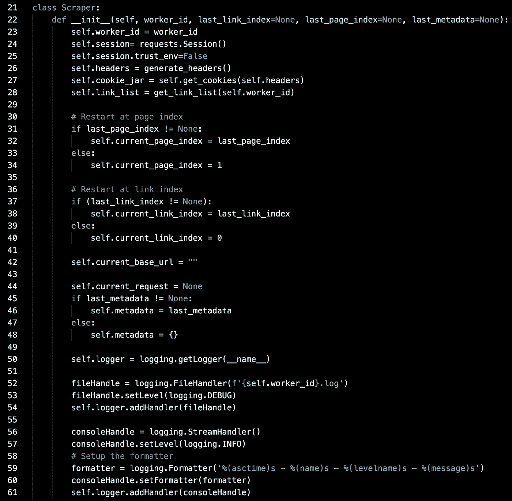

# 写垃圾代码没关系

> 原文：<https://levelup.gitconnected.com/its-okay-to-write-crap-code-90563a511491>

我知道。管它呢。对于那些不知道的人，几个月前，我写了一篇文章，“停止写废话代码”。这是我写的最好的文章之一。今天，我要做一个小小的修改:偶尔写垃圾代码是可以的。

 [## 停止写垃圾代码

### 编写易读易调试代码的实用指南。

medium.com](https://medium.com/better-programming/stop-writing-crap-code-7d3458f42384) 

在过去的一周里，许多不同的网站取消了订阅要求，向公众开放了内容。这是因为冠状病毒隔离。作为一个数据迷，我看到了这个机会，并决定利用它。唯一的问题？时间不多了。我需要在尽可能短的时间内收集所有的内容。

# 什么时候写垃圾代码

首先，并不是你写的每一个应用程序都需要永久存在。当你第一次学习编码时，你应该把注意力集中在解决问题和许多问题上。您将开始理解为什么以及在哪里需要使用良好的编码实践。

第二，有时你只需要你的程序运行一次，就可以把你从大量的手工劳动中解放出来。我今天要展示的例子来自我编写的一个程序，它从一个杂志档案中收集数据。他们有 418 期，超过 38014 页。我不想手动存档。这里是您可以安全地编写垃圾代码的地方。

# **什么垃圾代码看起来像**

那么，是什么让我的代码如此糟糕呢？让我们好好看看！

## 1.复制

垃圾代码包含大量重复代码。举上面的例子。我用相同的代码在两个不同的地方创建了一个目录。有趣的是在 save_image 函数中不应该包含创建的目录代码。save_metadata 函数应该是我创建目录的唯一地方，因为我必须在保存图像之前拥有元数据。

修复上面的代码很简单，因为它们实际上使用的是完全相同的代码。但是更常见的情况是，你需要确保你的功能足够灵活来处理不同的用例。

## 2.功能太长，做得太多

*请不要阅读所有这些代码。只需滚动到我对它的评论。

很抱歉让你看到这些。这是为了说明一点。一个函数不应该太长，以至于你需要滚动才能看到全部。这使得调试变得不可能。除了长度之外，这个函数还包含了太多内容。以下是该函数中发生的所有事情的列表:

1.  迭代文章链接
2.  请求文章封面
3.  解析元数据
4.  解析图像 URL 输出
5.  迭代文章中的页面链接
6.  请求文章页面
7.  解析文章页面中的图像 URL

这是一个噩梦，因为如果上面的任何部分坏了，我去哪里修复它？在主函数\_(ツ)_/的某个地方

为了修复上面的代码，我可能会先把它分解成上面列出的 7 个函数。然后，再回头看一遍，我会看到上面的几个函数有相似的位，并将它提取到自己的功能中。以请求文章封面和文章页面为例。它们都使用代码来检查请求是否被成功返回。应该提取到它自己的函数中。

## 3.国家管理不善

信不信由你，事情并不是这样开始的。它从一个简单的函数程序开始…好吧，所以我至少从一个程序开始。进行到一半时，我意识到在失败的情况下，我希望能够重新加载状态的大部分，这样我就可以从我离开的地方重新开始。我很高兴我这么做了，因为有几次我不得不这么做。

尽管如此，所有这些状态都没有得到很好的管理。如果这个构建得更好，我会将状态分解成更小的块。应该有一个管理会话状态，另一个管理文章/页面状态。

# 为什么这个项目是好的

我能够在几个下午内编写这个程序。它能够从杂志 x 中抓取 41Gb 的数据。现在我完成了，我可能会把它放在我完成的项目文件夹中，让它腐烂。不过，我从中学到的经验不会白白浪费。制作它教会了我很多从网站下载图片和处理会议的方法。

不是你写的每个程序都必须是最好的。写一次性代码没问题。只要知道如果你必须维护你的代码，让它正确是值得的。

如果你想尝试重构这段丑陋的代码？叉我的仓库，并给它一个去！

 [## dtaivpp/一次性图像刮刀

### 这个项目是为了证明不是所有的代码都需要完美。这是一个完全一次性的项目…

github.com](https://github.com/dtaivpp/one-time-image-scraper)