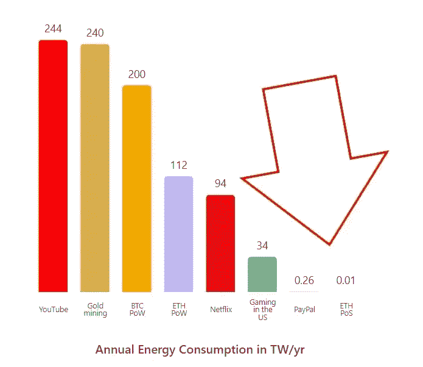

# 是时候重新考虑你对以太坊的假设，超越环境借口了。

> 原文：<https://levelup.gitconnected.com/its-time-to-re-think-your-assumptions-about-ethereum-and-move-beyond-environmental-excuses-690fbaa5720a>

在为时已晚之前，你必须仔细看看第二大加密货币。

在 [Unsplash](https://unsplash.com/s/photos/thinking-pose-laptop?utm_source=unsplash&utm_medium=referral&utm_content=creditCopyText) 上由[米米·蒂安](https://unsplash.com/@mimithian?utm_source=unsplash&utm_medium=referral&utm_content=creditCopyText)拍摄的照片

你听说过那些故事吗？人们很早就开始做某事，赚了很多钱。

我有。

例如，如果你在 2019 年特斯拉的价格为 23 美元时投资 1000 美元，你今天就会赚 10 万美元。

如果你有勇气在互联网泡沫破裂后投资亚马逊，你可以以每股 8 美元的价格购买该股，让你获得原始投资的 500 倍回报。

40%的加密货币持有者拥有以太坊，去年增长了 26%。

凭借以太坊的市值、采用速度和不断增长的用例，与自己进行一次对话并近距离观察数字货币是一个好主意。

潜在的好处是巨大的，但风险也是巨大的。

我不能保证投资新技术会产生 500 倍的回报，但与其他选择相比，这是一个可靠的赌注。

但是阻止人们看待新事物的最大障碍是当他们接触新技术时的怀疑。

环境因素是我们大多数抵抗的普遍原因。

这很可笑，考虑到我们不会抱怨我们接受的技术对环境的影响，比如汽车、飞机、节日灯、YouTube、网飞或亚马逊。

我们不把艺术品、金钱、黄金或钻石称为庞氏骗局。

系好安全带，系好安全带，因为在做了一些研究后，我找到了答案。

# 你在抵制新技术。

在他的书《创新及其敌人》中，Juma 教授深入研究了导致抵制新技术的各种因素。

这本书从我们丰富的技术进步历史中汲取素材，并考察了专家和公众在形成创新理念的过程中所扮演的角色。

根据这本书，在理解人们为什么会抵制新技术时，你需要考虑以下几个要点:

*   由于希望维持现状，新技术经常面临来自公众的抵制。
*   如果人们认为新技术的好处主要由特定的个人群体获得，他们就不太可能接受新技术。
*   如果公众相信新技术的好处会在长期内实现，人们可能会对其持怀疑态度。
*   人们可能更容易接受新技术，如果它们不破坏他们现有的信仰或社会地位的话。

值得注意的是，这些点并不是以太坊或任何特定新技术所独有的。

相反，它们提供了对影响人们对创新态度的各种因素的洞察。

最终，新技术通常需要时间来完全接受并成为新常态。

# **环保借口结束**

你知道以太坊比 YouTube 和网飞更节能吗？

对加密货币的主要批评之一是它对环境的负面影响，这主要是由于高能耗的工作证明区块链。

以太坊最近成功完成了一次合并活动，通过过渡到一个证据确凿的网络，使区块链的能效提高了 99.5%。

环保主义者呼吁禁止以太坊，因为它被认为对气候有负面影响，这一事件让他们措手不及。

以下是以太坊每年的能源消耗:

# 如果每次有人说以太坊是庞氏骗局，我就有一便士；我可以运行一个。

"以太坊是一个庞氏骗局."

这种说法在很多层面上都是不准确的。但是，这种对整个技术的诽谤一直很流行。

庞氏骗局是一种投资欺诈，新投资者的资金被用来支付现有投资者。

它承诺低风险或零风险的高回报。

以太坊没有中央权威或单点故障，因此不太可能遭受欺诈。

没有第三方再投资或转移你的以太坊给其他不知情的个人。

这是一种高风险和不稳定的资产，没有未来盈利的承诺。

事实上，以太坊有潜力成为一种互联网货币，因为它有独特的“智能合约”用例。

智能合约是自动执行的代码行，根据买卖双方之间的协议条款，在计算机网络上自动验证和执行。

智能合约消除了对中间人的需求，当部署在区块链上时，使交易可追踪、透明且不可逆转。

缺乏透明度是庞氏的特征。

以太坊是庞氏骗局的反义词，所以我们能不能摘下眼罩，把它从这个类别中去掉？

# “钱上涨”并不是你在这里应该有的唯一心态，但它值得看看一个预期的价值结果。

我们不可能确定地预测未来，但是我们可以用过去作为指导来告知我们的期望。

如果你看看分散的数字资产与全球货币供应相比的百分比，数字资产目前约占 0.5%。

大约。

未来十年，这一比例可能会上升或下降。

监管和政府控制等因素可能会降低失业率，而提高数字素养和采用数字技术可能会推高失业率。

从长远来看，这一比例可能会上升。

我相信。我们正变得更加身临其境，而不是更少。

一位备受尊敬的加密货币专家和该领域的思想领袖分享了这一想法，并自比特币和以太坊诞生以来一直使用这种“预期价值结果”方法。

> 推特— [Punk6529](https://twitter.com/punk6529/status/1477259846739283968?ref_src=twsrc%5Etfw%7Ctwcamp%5Etweetembed%7Ctwterm%5E1477259846739283968%7Ctwgr%5Ec268f5826da004e65b0fb946dc04f5332fc3e8b6%7Ctwcon%5Es1_&ref_url=https%3A%2F%2Fcdn.embedly.com%2Fwidgets%2Fmedia.html%3Ftype%3Dtext2Fhtmlkey%3Da19fcc184b9711e1b4764040d3dc5c07schema%3Dtwitterurl%3Dhttps3A%2F%2Ftwitter.com%2Fpunk6529%2Fstatus%2F1477259846739283968image%3Dhttps3A%2F%2Fi.embed.ly%2F1%2Fimage3Furl3Dhttps253A252F252Fabs.twimg.com252Ferrors252Flogo46x38.png26key3Da19fcc184b9711e1b4764040d3dc5c07) :
> 
> 我的第一种分析形式是“期望值”计算。例如，假设有 50%的可能性，crypto 在总资产中的百分比达到 1%,有 50%的可能性 crypto 结束并达到 0%。
> 
> 在这种情况下，我们应该保持中立。50% x 1% + 50% x 0% = 0.5% =我们现在的情况
> 
> crypto doubles 的几率比它变为零的几率大得多，这意味着期望值为正。
> 
> 因此，我想有一个加密投资，即使是今天。[我第一次做这个分析时，crypto 占全球市值的 0.005%]。"

# **最后的想法。**

以太坊的智能合约技术面临着其他提供类似功能的区块链平台的竞争。

它还一直在努力解决可扩展性问题以及关于其去中心化程度的问题。

比特币和其他区块链技术面临着自己的挑战，比如速度和环境影响。

然而，重要的是要记住，超过 4000 名活跃的每月开发者正在努力改进以太坊的技术。

很可能，正如人类在过去已经使其他技术更加用户友好，他们将找到解决这些挑战和改进以太坊的方法。

这是一个信任这些开发人员的奉献精神和专业知识的问题。

> *如果你想在 Web3 上读到更多我的观点，可以考虑成为会员。你的会员费直接支持你读的作家。如果你用我的链接* [*注册，我会赚一小笔佣金。点击这里*](https://medium.com/@jayden_levitt/membership) *。*

*本文仅供参考；不应将其视为财务、税务或法律建议。在做出任何重大的财务决定之前，你可以咨询财务专家。*