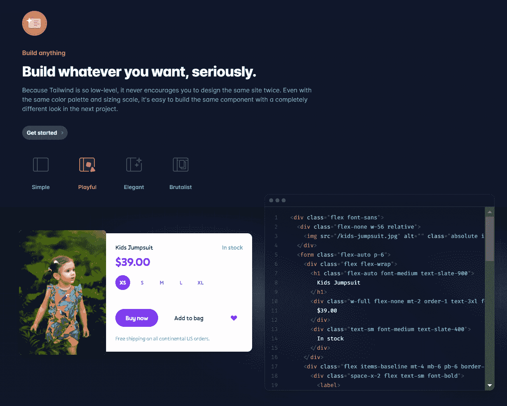
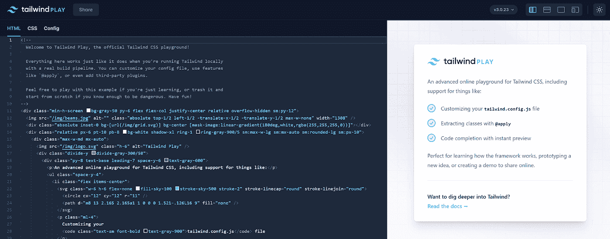
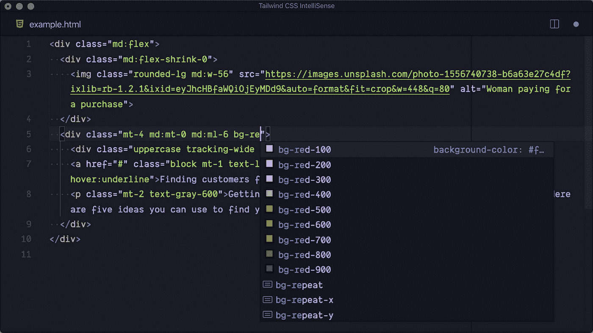
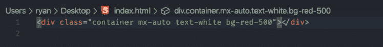

# 是时候和 Bootstrap 说再见了

> 原文：<https://levelup.gitconnected.com/its-time-to-say-goodbye-to-bootstrap-11ed5fc9f3f1>

最近，我们的开发团队获得了一个非常令人兴奋的 web 应用程序项目。这是一个合适的时机，让我们尝试一些新鲜和新的东西，而不是 Bootstrap 和 Sass。因此，我们决定使用新的 UI 库，我们很高兴我们做出了正确的选择。让我来告诉你为什么顺风会改变游戏规则。请继续阅读，直到我的团队学到了一些技巧。

从我开始软件生涯的第一天起，我就一直在使用 Bootstrap。它对我快速构建原型帮助很大。然而，适应新的设计是很难的。

Tailwind 通过允许原子 CSS 来解决这个问题。这并不意味着你必须定义每一个细节。原子术语意味着一个简单的底层特性，你通常通过写一堆锅炉板 CSS 来实现。从我的经验来看，只要有大约 3 到 6 个类名，您就会拥有一个漂亮的 div 组件。班名也很优雅，很好记。例如，所有颜色类别名称共享相同的前缀(例如 text-slate-900)。

由于 Tailwind 所提供的灵活性，它使得社区能够生成许多 UI 组件。如果你因为 Tailwind 没有提供默认的 UI 主题而感到失落，你可以选择一个并从那里开始。另一件很棒的事情是，你可以从技术上把多个不同的 Tailwind 库混合在一起，创造出全新的东西。

在这里，我列出了你在下一个顺风项目中应该知道的三个技巧。

# 顺风游乐场:

如果你对新的顺风风格有任何疑问，只要把它贴在这里，看看它的神奇之处，而不会破坏你的代码库。

# 顺风智能感知:

这是类固醇的顺风。有竞争力的开发者必备的顺风扩展。

# 逆风:

如果你像我一样有强迫症，这个可能适合你。它会自动以相同的自以为是的方式重新排列所有的类名，因此您会有更快的导航。

到目前为止，对我的团队来说，这是一次令人惊叹的经历。如果你喜欢我的内容，别忘了留个赞，订阅。此外，请考虑通过以下方式支持我:

*   [我全新的 Patreon(简历/自由职业服务)](https://www.patreon.com/leonto101)
*   [中等会员](https://leon101.medium.com/membership)

我会让你们了解顺风的最新进展。非常感谢。