# 是时候开始学习编码了:2020 年学习编程的前 20+最佳网站

> 原文：<https://levelup.gitconnected.com/its-time-to-start-learning-coding-top-20-best-websites-to-learn-programming-in-2020-9c5105c76c96>

我相信我们中的许多人都想知道如何在大流行后的世界中保持相关的专业。显然，其中一个方法是学习编程。现在这个行业已经达到了 21%的增长率(比其他任何领域都要高)，很明显对优秀开发人员的需求不会消失。

此外，随着越来越多的企业将考虑用数字流程和实践取代物理流程和实践，这一趋势在未来几年可能会增长。

在这篇文章中，你会发现为什么现在是掌握编码的时候了，并收集一个完整的资源甲板来推动你的进步——超过 20 个网站，帮助未来的编码员更好地工作。

# 为什么现在是学习编程的最佳时机

掌握一项新技能是跨出舒适区的一大步。对于初级程序员来说，感觉程序员市场竞争太激烈，工作太有挑战性，痛苦得不偿失是很常见的。

然而，根据统计数据，学习一门新的编程语言是你花时间做的最好的事情——原因如下:

*   一个软件开发人员的[工资中位数是 103620 美元](https://money.usnews.com/careers/best-jobs/software-developer/salary#:~:text=Software%20Developers%20made%20a%20median,paid%2025%20percent%20made%20%2479%2C340.)。
*   在软件开发市场有超过 13 亿个职位空缺[。](https://www.bls.gov/ooh/computer-and-information-technology/software-developers.htm)
*   平均而言，学习编程好到足以找到工作需要 3 年时间——比获得大学学位还少。
*   根据世界经济论坛，编码被视为下一代工人的[基本技能之一。](https://www.weforum.org/agenda/2016/09/job-in-2025-skills-sectors-to-focus-on/)

简而言之，软件开发是一个快速发展的领域——你在这个行业找工作肯定不会费劲。除此之外，还有大量面向初级开发人员的学习资源，可以帮助没有受过技术教育的人精通编码。

# 学习编程的 20 多个网站

无论您是编程新手还是渴望学习新技术的有经验的开发人员，拥有一个参考资料总是很有帮助的。就我个人而言，我有几十个用来学习和教授编码的网站——以下是我最喜欢的。

# 1. [Codegym](https://codegym.cc/)

**平台**:在线、桌面、安卓应用

**编程语言** : Java

**定价**:免费安卓应用，付费桌面订阅(每月 30 美元或每年 300 美元)。

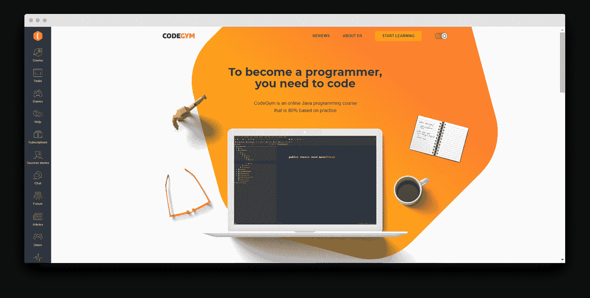

Codegym 是一个以 Java 为中心的平台，它比我在网上见过的任何其他平台都更接近语言。我喜欢这个网站将理论和实践知识结合起来的方式——有超过 1200 个练习可以帮助你从零到英雄。

除此之外，一定要看看社区论坛——在这里，Java 学生回答彼此的问题，讨论学习一门新的编程语言的挑战。

**主要好处**:

*   一门互动课程，提供超过 500 小时的活跃编码体验
*   内置 IDE，学习者可以在其中解决练习问题
*   活跃的 Java 社区
*   虚拟导师
*   小而简单的讲座
*   该平台通过游戏化和引人入胜的故事让学习变得有趣

# 2.[树屋](https://teamtreehouse.com/)

**平台**:桌面、iOS、Android

**编程语言** : Java，Python，C#，PHP，Ruby，HTML

**定价**:每月 25-199 美元

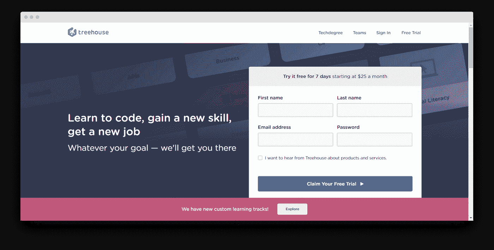

Treehouse 是另一个平台，它不把编码当作一系列抽象概念。相反，它教会你处理特定项目所需的技能——无论是构建一个移动应用程序，建立一个 WordPress 博客，还是回答大学作业的 CS 工作表。

Treehouse 支持所有流行的编程语言——Java、Python、C++、Ruby 等等。由于其实践驱动的性质和简短的教程，你不需要很多时间来学习网站如何工作，并将很快获得更多的编程信心。

**主要好处:**

*   同行评审支持
*   离线访问
*   在现实环境中练习问题
*   与讲师面对面互动

# 3.[可汗学院](https://www.khanacademy.org/computing/computer-programming)

**平台**:在线、桌面、iOS、Android

**编程语言**:前端和数据库管理技术(HTML、CSS、SQL)。

**定价**:免费

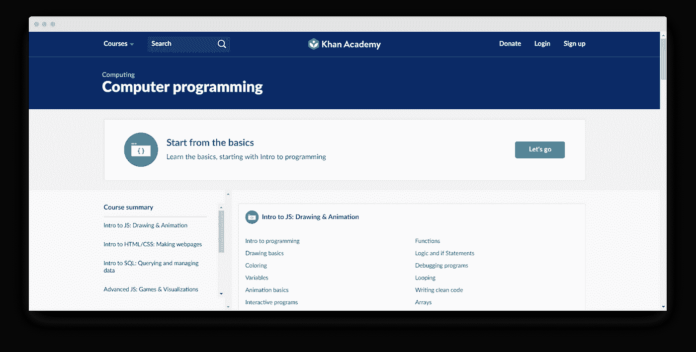

虽然 Khan Academy 没有 Java 或 Python 教程，但该平台是理解计算机科学基本概念的一个很好的起点。完成这些课程后，你将了解典型的编程数据结构是如何工作的，掌握 OOP 概念的诀窍，并获得“程序员的头脑”。

**主要好处:**

*   免费课程
*   前端开发和数据库管理的鸟瞰图
*   易于使用的界面
*   有助于提高知识记忆的测验

# 4. [Udemy](https://www.udemy.com/courses/development/?awc=6554_1592545995_d2a1d1ec3ab35e873e26fa324dd0ab54&utm_source=Growth-Affiliate&utm_medium=Affiliate-Window&utm_campaign=Campaign-Name&utm_term=101248&utm_content=Placement&persist_locale=&locale=en_US)

**平台**:桌面、iOS、Android

**编程语言** : Java、Javascript、Python、C++、Ruby 等。

**定价**:10 美元以上

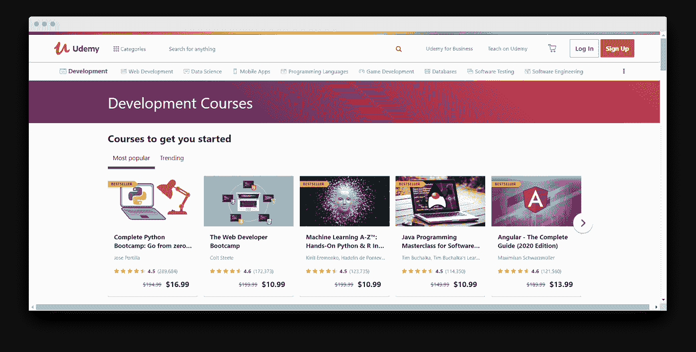

Udemy 是一个领先的在线教育平台，提供几乎所有的课程，包括大多数编程语言。在那里举办的一些项目很快成为畅销书，拥有数千名注册学生。

特别是，你可以看看这些著名的 Udemy 课程:

*   [Python 编程简介](https://www.udemy.com/topic/python/)
*   [面向完全初学者的 Java 教程](https://www.udemy.com/course/java-tutorial/)
*   [高级面向对象的 JavaScript 和 ES6](https://www.udemy.com/course/advanced-and-object-oriented-javascript/)

Udemy 的课程没有固定的费用——每位教师都可以选择收取多少费用。这就是为什么有些课程的价格从十美元到数百美元不等。

**主要好处**:

*   广泛的编码类别选择
*   根据自己的进度访问学习材料
*   很多负担得起的十美元课程
*   短期、低投入的课程

# 5.[代码 4 启动](https://code4startup.com/)

**平台**:在线、桌面

语言:Java、Ruby 和其他语言

**定价**:免费，提供付费内容

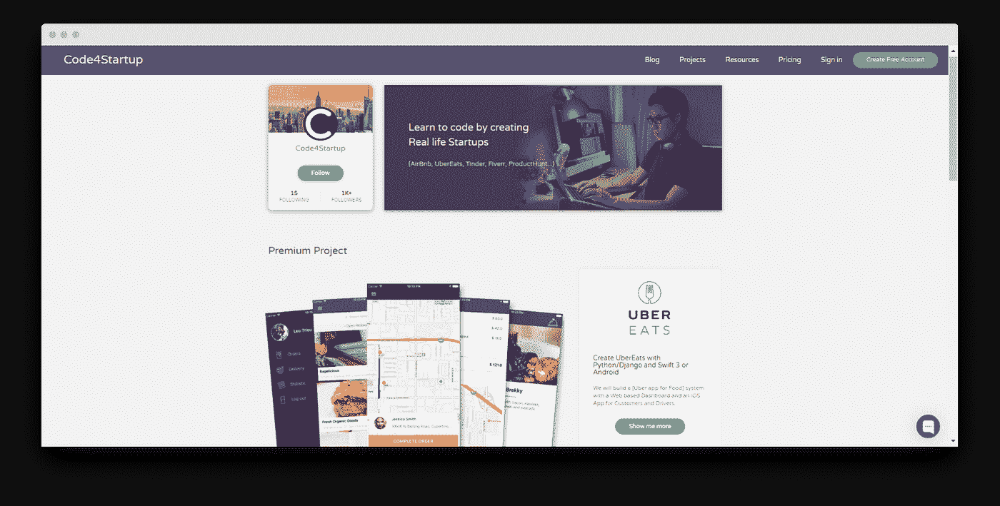

如果你想在创业世界中获得更多的实践经验，Code4Startup 是一个很好的平台，可以很好地利用你的开发技能。这个项目允许初级程序员为真正的初创公司编写代码，同时，企业主可以节省雇佣人才的费用。

除了练习场地，Code4Startup 还为编程学生提供大量免费课程。就个人而言，我喜欢这个平台的 Learn Ruby on Rails、Heroku 和 Wistia API。

**主要好处**:

*   省时的学习方法
*   类似于开发人员每天处理的工作的项目
*   创建一个强大的投资组合和 kickstart 求职的可能性

# 6.[一个月](https://onemonth.com/)

平台:在线，桌面

**语言** : JavaScript、Python、Ruby、SQL、HTML CSS 等。

**定价**:299 美元/年，免费试用

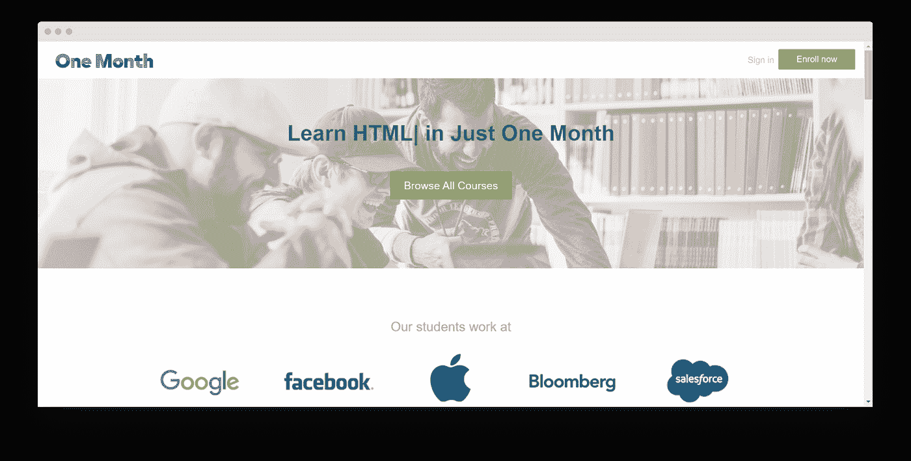

如果你被诸如“我如何在一个月内学会一门编程语言”这样的问题所困扰，一定要去看看这个平台。一个月是一个类似训练营的课程，帮助初级程序员尽快掌握 JS、Python 和 Ruby 的基本概念。

平台上的大多数课程都是付费的，尽管也有一些免费的，比如命令行课程。有一个博客和一个播客讨论编码的热点新闻——也可以考虑关注它。

**主要好处:**

*   快速的学习节奏
*   有免费课程
*   按年付费后可参加所有编程课程

# 7.[复数形式](https://www.pluralsight.com/codeschool)

**平台**:线上、桌面

**编程语言** : Python，C#，Java，JS

**定价**:每年 29-499 美元

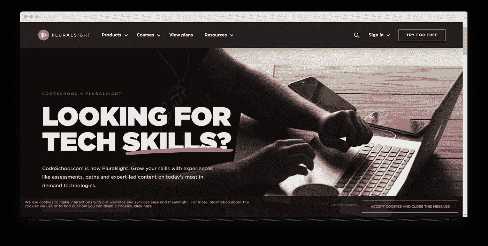

Pluralsight 是计算机科学教育的另一个一站式商店。这里的课程从初级到高级，涵盖了所有流行的编程语言，以及数据科学的基础知识。

一旦你很好地掌握了你决定学习的编程语言，Pluralsight 就是其中一个不使用其相关性的平台——有大量的课程和教程涵盖了深入的概念，对高年级学生也是有用的参考。

**主要好处**:

*   广泛的课程
*   面向高级开发人员的高级内容
*   支持顶级编程语言
*   广泛的订阅计划

# 8. [Coursera](https://www.coursera.org/)

**平台**:在线、桌面、iOS、Android

**编程语言** : Python、R、Java、Javascript、C#、C++

**定价**:免费和付费课程(通常费用为 40-80 美元)。

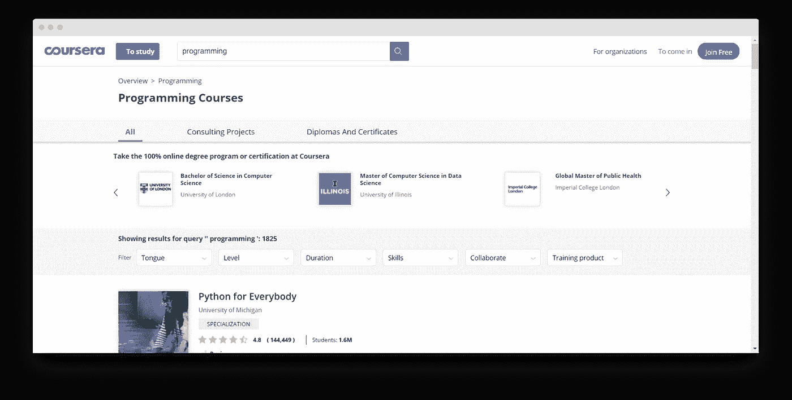

与 Udemy 相比，Coursera 是 CS 和编程学生的另一个有价值的资源。与 Udemy 不同，该平台专注于深入的大学水平的研究，而不是实践概念。

这个平台是计算机科学专业的强大资源。你可以学习斯坦福大学、密歇根大学和其他学校的课程，用这些知识在你参加的每一次计算机科学考试中获得高分。

**主要好处**:

*   广泛的课程
*   深入了解计算机科学
*   所有程序都经过认证
*   数百门免费课程

# 9.[自由代码营](https://www.freecodecamp.org/)

**平台**:在线、桌面

编程语言:Python，Java，C，PHP，JS，CSS，HTML

**定价**:免费

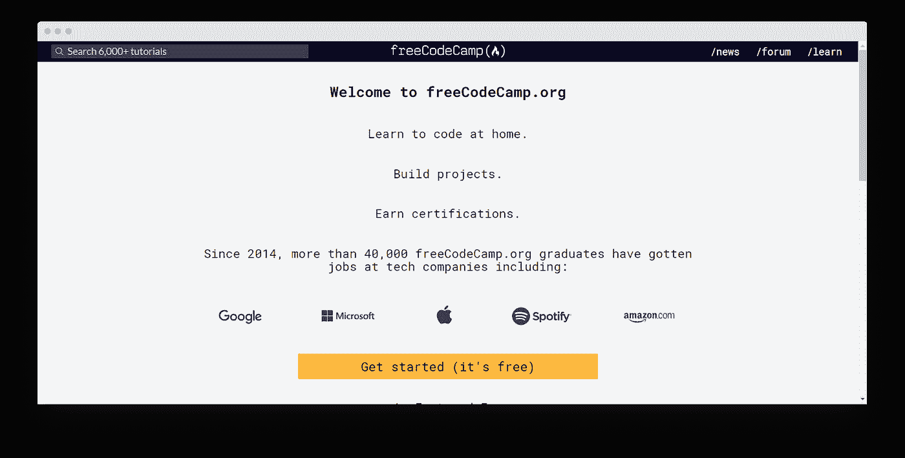

在编程中，Freecodecamp 是一股不可忽视的力量。它拥有最大的技术社区之一，广泛的教程和课程，以及一个博客，在我看来，这是任何其他开发资源都无法比拟的。

你会在这里找到实用的、基于项目的作业——这就是为什么一旦你对编程理论有了坚实的理解，去网站看看会更好。

**主要好处**:

*   强大的社区
*   旨在构建投资组合的任务
*   注重提高解决问题的技能
*   大量免费资源(博客文章、Slack 频道等)

# 10.[代码大战](https://www.codewars.com/)

**平台**:在线、桌面

**编程语言** : Java、JS、C、C++、Rust、Go、Swift、PHP、Ruby、Scala 等

定价:免费版本和每月 9.99 美元的订阅，可以获得更多的教程

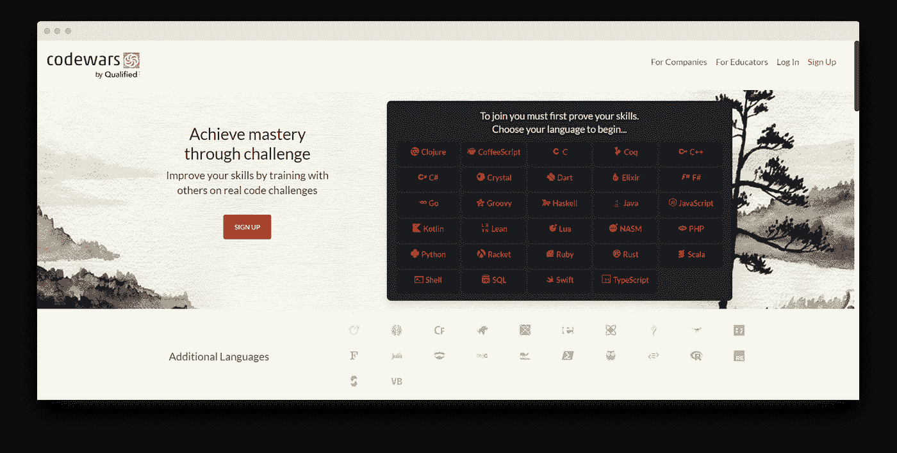

如果你很快就厌倦了独自学习，并且很难有足够的动力让你坚持下去，使用 Codewars 是提醒你自己编程有多有趣的一种方式。这个平台上有几十个名为 kata 的挑战，允许开发人员与他们的同行测试他们的技能。

除了 Codewars 的作业非常容易上瘾这一事实之外，它的社区也值得一提。在这里，你可以向成千上万的开发人员提问——在 99%的情况下，你会得到一个详细的、改变游戏规则的答案，这将帮助你更快地进步。

**主要好处:**

*   吸引人的任务
*   抑制动机的竞争环境
*   支持数十种语言
*   新的工具和特性以惊人的速度增加

# 11. [Git 沉浸](https://gitimmersion.com/)

**平台**:在线、桌面

**编程语言** : GIt、Github

**定价**:免费

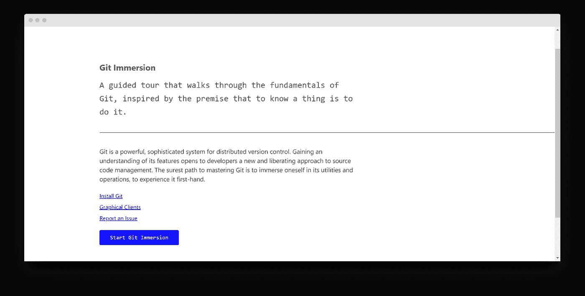

Git Immersion 是一个资源，它将帮助您熟悉版本控制工具——Git 和 Github。尽管这些在编程语言中并不重要，但是您将在工作中使用它们来与同事协调、共享您的代码以及对代码进行修改。

Git Immersion 是由 Jim Weirich 编写的一个简短而有趣的课程。除了向您介绍基本的功能，作者还分享了几十个别名，这些别名可以立即提高编码人员的工作效率。

**主要好处:**

*   易于用作参考
*   所有内容是免费的
*   这门课程安排得很好
*   Git 和 Github 的深度视图。

# 12.站点点

**平台**:在线、桌面

编程语言:Java，JS，Python，Swift，Ruby，PHP

价格:9 美元/月

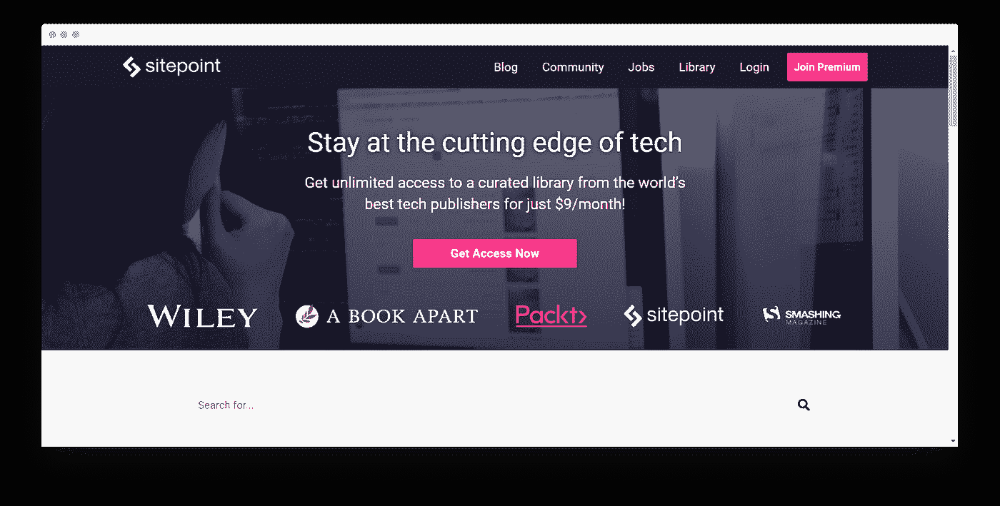

SitePoint 是一个专门为 web 开发学生构建的学习资源。这是一个用户生成的数据库，包含了关于编程语言、框架、库和其他用于构建 web 项目的支持技术的全面文章和教程。

在这里找到你的问题的答案很容易——只要在搜索标签中输入你想知道的，一卷匹配的文章就会出现。

**主要好处**:

*   最全面的网络开发数据库在线
*   负担得起的订阅
*   易于使用的界面
*   网站内容定期更新

# 13.[仪表板总成](https://dash.generalassemb.ly/)

**平台**:在线、桌面

**编程语言** : CSS3，HTML5

**定价**:免费

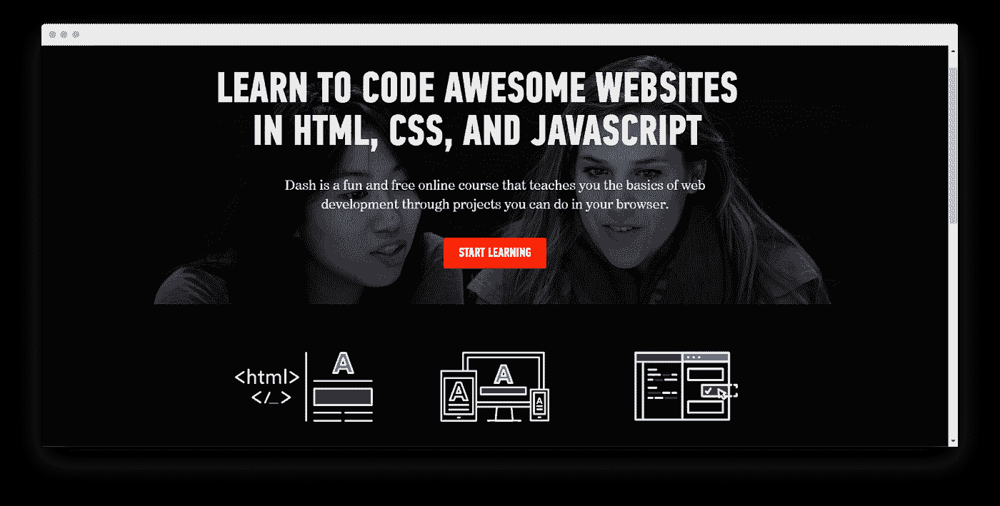

HTML5 和 CSS 是编程教育的支柱。众所周知，大多数程序员都是通过学习这些技术开始他们的编程之旅的。如果你不熟悉或不精通 HTML5 或 CSS，访问 Dash 大会是填补知识空白的最佳方式。

该资源包含一系列免费教程和课程，帮助开发人员构建专业布局。就我个人而言，我相信，如果每个初学者都知道 Dash General Assembly，那么编码器组合中的网页布局将会更加时尚和好看。

**主要好处**:

*   10 多门课程，帮助开发人员创建时尚的投资组合
*   主要技术术语完全指南
*   该网站教授如何从头开始构建交互式网页。

# 14. [Learnpython](https://www.learnpython.org/)

**平台**:在线、桌面

**编程语言** : Python、Go、C++、Java 等

**定价**:免费

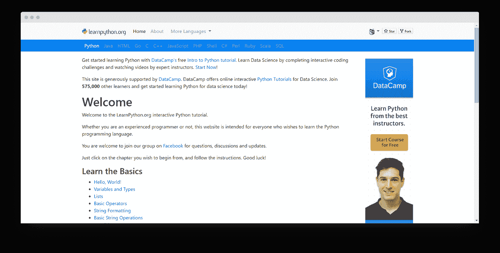

Python 无疑是这十年中一门非凡的编程语言。由于发展如此迅速，它将很快成为开发人员最重要的技能之一(与 Java 和 JS 一起)。如果你打算掌握 Python，不要错过 Learnpython.org。

这个平台简洁明了地展示了这门语言的基础。如果您想使用 Python 进行机器学习或数据科学，Learnpython 也涵盖了这些内容。

**主要好处**:

*   超过 500，000 名社区成员
*   所有教程都被整齐地分组
*   涵盖基本和高级 Python 概念

# 15.Rubymonk

**平台**:在线、桌面

编程语言:Ruby

**定价**:免费

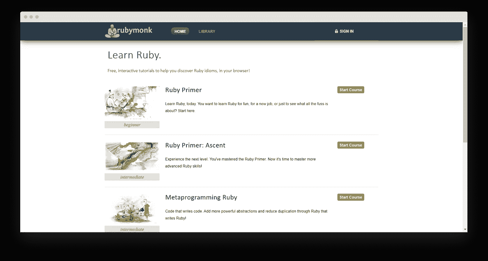

这是 Ruby 初学者可以在网上找到的最详细的资源之一。在这里，所有的学习内容都是结构化的——你可以选择你的语言熟练程度，完成初级、中级或高级课程。

Rubymonk 课程易于阅读，它们不会使用太多的技术术语，并帮助你在整个学习过程中保持动力。我希望我能早点知道这个——它绝对值得一试。

**主要好处**:

*   关于 Ascent、Primer 和元编程的深入教程
*   所有课程均免费
*   参与讲故事有助于更好地保留知识

# 16.[w3 学校](https://www.w3schools.com/)

**平台**:在线、桌面、安卓

**编程语言**:所有流行的编程语言

定价:免费课程和 95 美元认证费

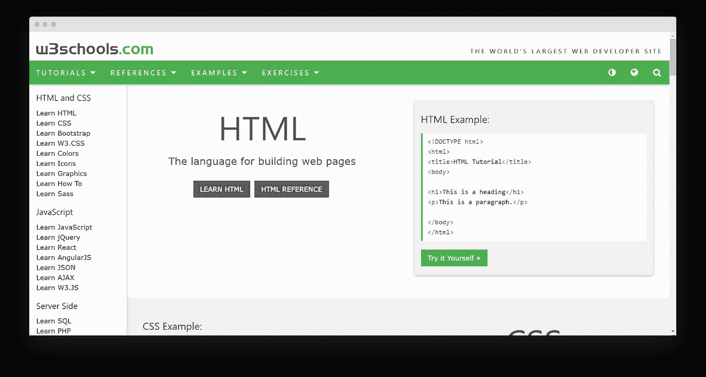

W3Schools 是最受 CS 学生和有经验的开发人员欢迎的参考平台之一。首先，它有涵盖所有顶级编程语言的深入材料。除此之外，这些教程都很简洁——如果你需要参考，很容易找到一个概念。

**主要好处**:

*   最大的教程选择
*   深思熟虑的导航系统
*   支持 50 多种编程语言

# 17. [edX](https://www.edx.org/)

**平台**:在线、桌面、iOS、Android

**编程语言** : C、Python、Java、JS 等

价格:虽然课程费用各不相同，但通常在 50-300 美元之间

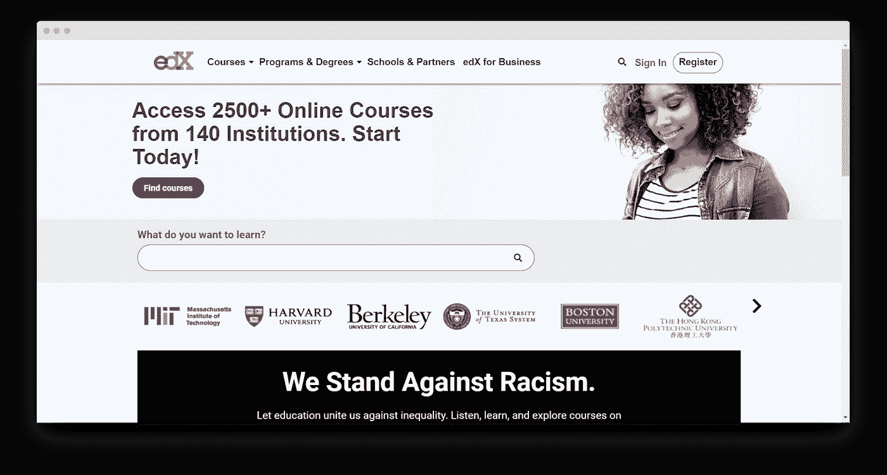

即使你没有机会在哈佛学习计算机科学，这也不意味着你没有办法坐在沙发上学习常春藤联盟的编程课程。这就是 edX 的目的——一个超过 90 所大学共享其课程的平台。

EdX 拥有最广泛的在线学生社区之一，连接了超过 500 万名学习者。

**主要好处**:

*   广泛的编程语言覆盖面
*   顶尖学校发布的课程——哈佛、斯坦福、密歇根大学等。
*   广泛的学习管理工具，帮助您掌控编程教育

# 18.代码学院

**平台**:在线、桌面、iOS、Android

编程语言:Java，JS，PHP，C，C++，Ruby，Swift，Python 等等。

价格:19.99 美元

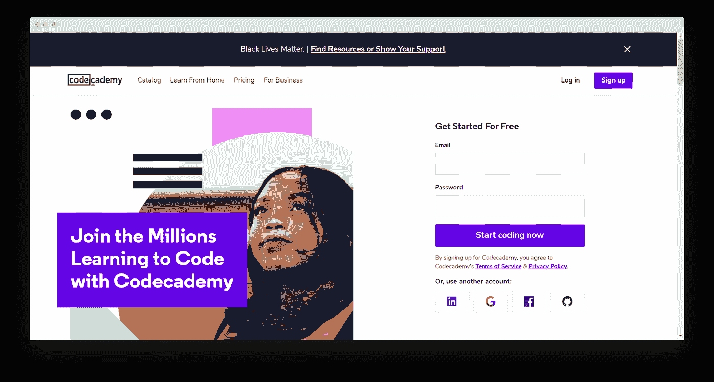

Codecademy 是最著名的编程教育资源之一。这个平台提供了几十门结构良好的认证课程。大多数都是免费的——如果你是 bootstrapped，尝试一下 Codecademy 是非常有意义的。除此之外，这里主持的项目结构良好——你将能够创建一个编码课程并坚持下去。

**主要好处**:

*   大多数课程有 50 多个讲座和互动测验
*   一个专家社区，可以联系他们进行面对面的代码评审
*   免费课程
*   这个平台很容易搭建

# 19. [Geeksforgeeks](https://www.geeksforgeeks.org/)

**平台**:在线、桌面

**编程语言** : Java、JS、PHP、Swift、Scala、Rust、C 等等

**定价**:免费

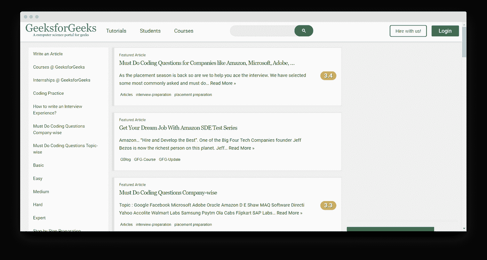

Geeksforgeeks 是我最喜欢在我的项目中用作参考的工具之一。在这里，您可以找到数百篇关于编程语言的有帮助的文章，所有文章都塞满了示例。我喜欢贡献者对待每一个技术概念的彻底性——大多数极客 forGeeks 教程提供了几种处理编程问题的方法——你可以自己选择最舒服的一种。

**主要好处**:

*   完整教程库
*   易于导航的界面
*   所有内容是免费的
*   向网站投稿的人都是知名的技术专家。

# 20.[代码复仇者联盟](https://www.codeavengers.com/)

**平台**:在线、桌面

编程语言 : JS，HTML，CSS，Python

**定价**:每月 20-29 美元

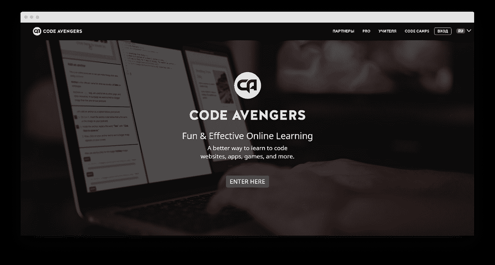

代码复仇者联盟是一个巨大的编码挑战集合。在这里，您可以找到超过 1000 个关于 JS、Python、HTML 和 CSS 的测试题。在我看来，高级开发人员在这里找不到太多相关的信息——然而，对于初学者来说，《代码复仇者联盟》是脚踏实地和实践驱动的，所以你会清楚地知道如何应用学到的技能。

**主要好处**:

*   实践驱动课程
*   引人入胜的测验
*   7 天免费试用
*   有多种语言版本

# 结论

在我看来，现在是开始学习编程的好时机——需求正在激增，有许多有用的资源，而且，即使你最终在非技术领域工作，你也会找到使用编码技能的方法。

希望我的资源卡片能够有所帮助，激励编程学生不要放弃他们的梦想和抱负。掌握一门编程语言并不容易——然而，只要有足够的毅力和决心，你一定会达到更高的水平。

 [## 编写面试问题

### 一个完整的平台，在这里我会教你找到下一份工作所需的一切，以及…

技术开发](https://skilled.dev)