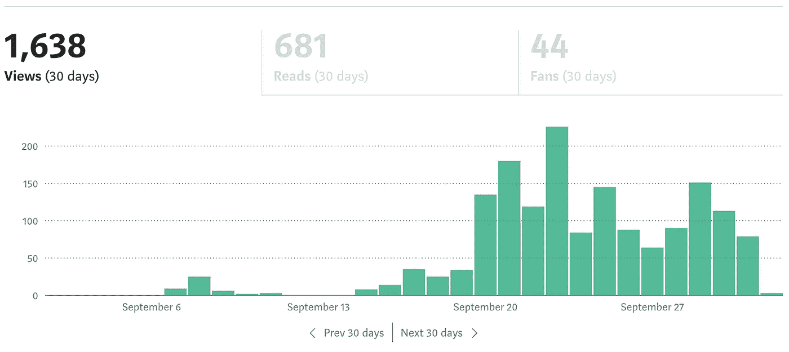
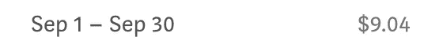
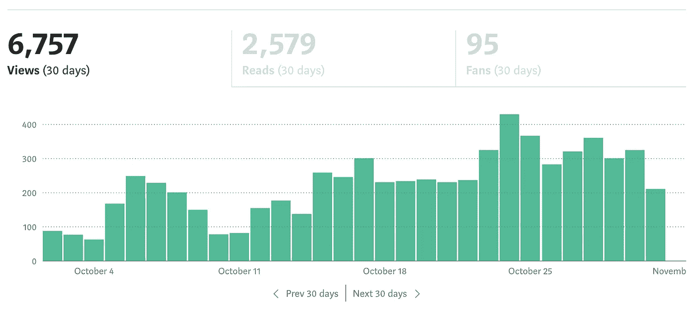
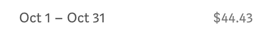
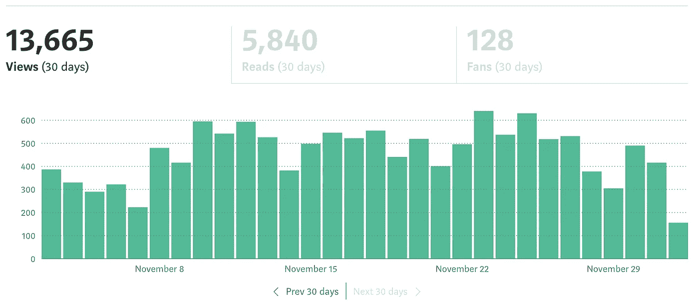
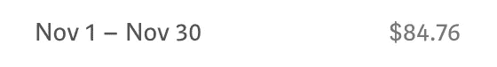

# 我在 2.5 个月内发表了 50 多篇文章——这是我学到的！

> 原文：<https://levelup.gitconnected.com/ive-published-over-50-articles-in-2-5-months-this-is-what-i-have-learned-e4f747e9463d>

## 现在开始看到一些回报…

2020 年 9 月中旬开始在 Medium 上写作。我是一名技术作家，所以专注于撰写教程、复杂问题的解决方案和感兴趣的技术。我读过很多作家写的关于他们在媒体上写作的经验的文章，它们是多种多样的。我想这确实取决于所写文章的类型。

我读过一些作家说奇怪的话，比如你不应该花超过 30 分钟在一篇文章上，你应该每天写 2-3 篇文章。我是兼职作家，晚上写作，所以这绝对不会发生。我的文章的性质意味着我需要在开始写作之前做很多准备。我希望我的文章是高质量和最新的。我大概花 3-4 个小时研究和思考我想写的内容，准备内容，然后写出来。由于我的文章通常以教程的形式出现，我需要自己运行几次，以确保阅读和关注我的文章的人不会有任何惊讶或卡住。

我不打算粉饰这一点，这是一项艰苦的工作。我将与你分享我在过去 2.5 个月的进步，以及我对如何成功写作的建议。正如你在下面看到的，我从 2020 年 9 月 13 日开始认真地写我的第一篇文章。

起初，我有点震惊，所有写这些文章的时间和精力只赚了 9.04 美元。那才 6 左右！我不认为我在这个时候有任何追随者，我作为一个作家在媒体上完全不为人知。

现在我们进入了 2020 年 10 月。很高兴看到我之前在 2020 年 9 月发表的文章还在被浏览，我也在靠它们赚钱。

10 月份赚了 44.43 美元，大概 33。仍然不惊人，但与上个月相比有相当大的增长。

这是我 11 月份的统计数据。

所以上个月我几乎翻了一倍。我挣了 84.76 美元，相当于 64 英镑。

9 月至 10 月半月: **391.482%涨幅**
10 月至 11 月: **90.772%涨幅**

我真的不希望每月都像这样无限增长，但作为一个开始，我很高兴到目前为止。我会在 12 月后更新这个，看看我们在哪里。

我听说每月 100 美元被认为是不错的，但实际上这还不够。大约只有 75 英镑。我个人的目标是每月最低 670 美元，也就是每月 500 美元。作家对他们的统计数据和收入有点谨慎，所以我不知道这有多现实，但这将使时间和努力值得。

## 我给刚开始写作的作家的 10 条建议…

*   **目标是让你所有的文章都在媒体上发表**。中等将提供很少或没有帮助促进你的文章，所以你真的需要出版物。
*   利用社交媒体。我不依赖媒体和出版物来传播我的文章。我使用文章的分享功能将文章发布到 LinkedIn、脸书和 Twitter 上。确保你也在推广你的文章。
*   **分享你的好友链接**。当你写一篇文章的时候，一定要把你的朋友链接发给那些可能感兴趣的朋友和同事，他们不是媒体订阅者。如果我没有弄错的话，这个朋友链接一个月可以被 5 个朋友使用。
*   **支持其他作家**。我知道一些作家也像我一样开始写作。我们都阅读彼此的文章，提供反馈，“鼓掌”并相互关注。
*   **写有趣的文章**。不要只是为了写作而写作。用那种方法你将一事无成。对当前的热门话题做一些研究，看看你是否能写一些有趣的东西。写下你感兴趣的东西。
*   **向刊物征求建议**。我从出版物中得到了一些很棒的想法。Coinmonks 给了我一些建议。当时我不知道这些建议是什么，但我做了研究，创建了一个教程，写了一些东西，现在它们是我的一些更受欢迎的文章。
*   **获得更多关注者**。我注意到增加关注你的读者数量是关键。你想让读者在你发表文章时看到你的文章。你需要有这样的心态，当你写一篇文章时，你希望读者喜欢它，并希望在将来阅读你写的东西。无主题的乱七八糟的文章帮不了你。
*   **将物品对准正确的高度**。我想这是更多的写作教程，但要确保你的文章不做假设。确保没有什么知识的读者能够理解你所解释的内容，而且有经验的读者也能从文章中获得一些有用的东西。
*   **使用主题**。我写的文章一般都是分组的。我写了很多关于 AWS 服务和如何使用它们的文章，关于道德黑客和渗透测试的文章，关于加密货币交易的文章，关于交易技术分析代码的文章，以及关于区块链的文章。阅读我文章的读者希望我会继续这些主题并跟随我。几周前我已经开始学习机器学习和数据科学，所以我希望我很快会在这个领域写更多的东西。
*   **不要做羊**。我见过很多作家开始写另一篇文章，我们已经在媒体上看到过几百篇了。除非你对某件事有独特的观点或者能增加一些价值，否则就找些新的东西来写。常见的 AWS 服务就是一个例子，现在已经做得不行了。我的意思是，如果你愿意，你可以这样做，但如果你想在写作上取得成功，你需要做一些原创的东西，或者在现有的基础上加以改进。

如果你想让我在几个月后继续写这篇文章，分享我的进展，请关注并留下评论:)

我希望你觉得这篇文章有趣并且有用。如果您想随时了解情况，请不要忘记关注我，注册我的[电子邮件通知](https://whittle.medium.com/subscribe)。

# 迈克尔·惠特尔

*   ***如果你喜欢这个，请*** [***跟我上媒***](https://whittle.medium.com/)
*   ***更多有趣的文章，请*** [***关注我的刊物***](https://medium.com/trading-data-analysis)
*   ***有兴趣合作吗？*** [***让我们在 LinkedIn 上连线***](https://www.linkedin.com/in/miwhittle/)
*   ***支持我和其他媒体作者*** [***在此报名***](https://whittle.medium.com/membership)
*   ***请别忘了为文章鼓掌:)←谢谢！***