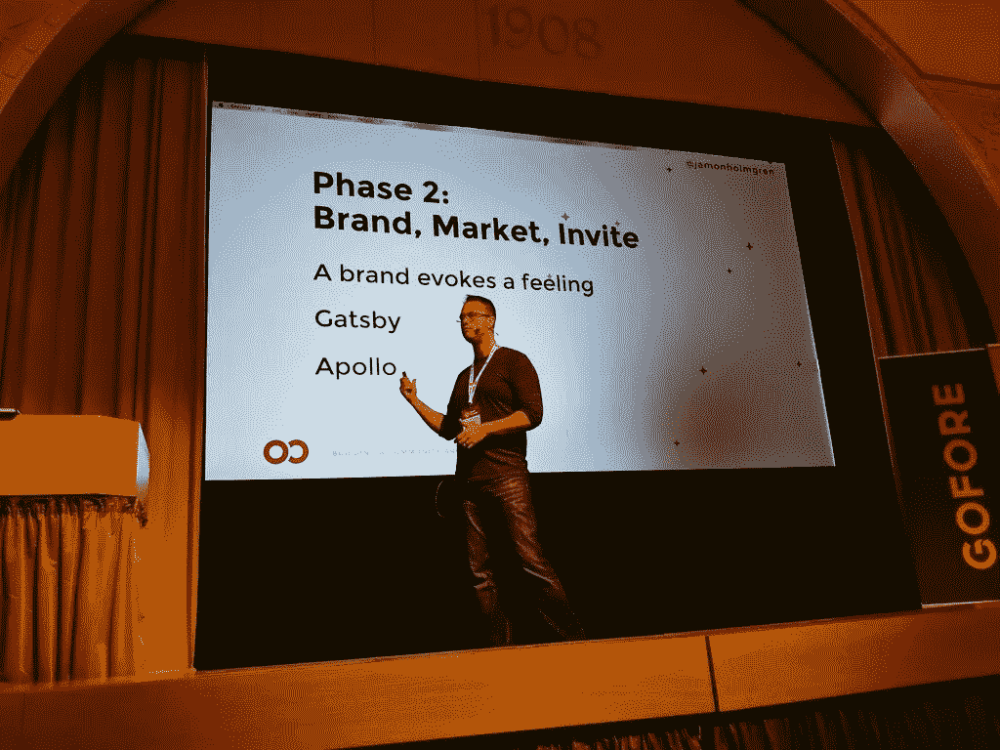

# Jamon Holmgren:管理远程团队是一项繁重的工作，但最终会有很好的回报

> 原文：<https://levelup.gitconnected.com/jamon-holmgren-managing-remote-teams-is-a-lot-of-work-but-pays-off-well-in-the-end-c6791b377cb>

## 我采访了 Jamon Holmgren，他是无限红的创始人兼首席技术官，T2 连锁反应的创建者和组织者，他和我分享了他建立一个成功的远程软件代理的道路

我有幸采访了贾蒙·霍尔姆格伦(Jamon Holmgren)，他是四个漂亮孩子的父亲，是一名拥有超过 25 年编程经验的软件工程师， [Infinite Red](https://infinite.red/) 的成功创始人兼首席技术官，这是一家应用程序设计&网络开发公司，多年来与微软、Crossover、Fandor、蓝战士、Inventist、加州大学伯克利分校等公司合作。贾蒙和他的团队还在俄勒冈州波特兰举办了一年一度的 React Native 会议，名为 [Chain React](https://infinite.red/ChainReactConf) 。

在这个演讲中，他分享了建立一个完全远程团队的旅程，展示了一些他为之自豪的公司项目，以及对办公室文化的未来的看法(剧透警告:它要死了！！！).Jamon 正在参观 6 月 29 日至 30 日举行的全球最大的远程工作会议。 [Soshace](http://soshace.com) 是 Running Remote 的媒体合作伙伴:我们帮助 RR 采访了来自 conf 的演讲者和与会者。

四个孩子，嗯？！接受挑战？

***你好 Jamon，欢迎来到《奔跑吧远程》的访谈！请分享你的故事。你是如何对软件开发产生热情的？***

我在美国沿海俄勒冈州的一个伐木小镇长大。我父亲经营着一家小型挖掘公司，所以在我 11 岁左右的时候，他决定买一台电脑来帮他记账。我立刻就被它迷住了，想一直坚持下去。不仅仅是为了玩游戏，虽然我确实这么做了，但也是为了弄清楚它是如何工作的。我甚至通过编辑机器码毁了我们的一个游戏。那时我知道了一个好的备份系统的价值！

几年后，我父亲又买了一台电脑，上面安装了 QBasic。所以我真的是从那时开始写代码的。我在青少年时期制作了数百个小(或大)游戏。当我开始对篮球感兴趣的时候，我的速度才真正慢了下来，我整个高中都在打篮球。但是我从来没有真正停下来，从那时候开始继续做游戏和程序。

***请带我看一下你的职业生涯。你，从新传统家园开始，成为无限红的联合创始人兼首席技术官。***

我在当地一家建筑商[新传统住宅](https://www.newtraditionhomes.com)的办公室里工作。我是一名设计师，从事房屋和社区的 CAD 绘图工作。

2005 年，我决定自己创业。我知道我可以利用我的 CAD 技能，继续为房屋建筑商绘制平面图。我还决定利用我的编码技能，学习建立网站。我买了一本关于 PHP/MySQL 的书和一本关于 JavaScript 的书，这就是我对 web 开发的介绍。

2008 年，美国房市崩盘，我也没有更多的家居设计工作。所以我完全专注于网站，并从那里开始发展我的业务。

2015 年，我将我的公司与另一家来自旧金山湾区的咨询公司合并，成为新的[无限红](https://infinite.red)。我获得了几个生意伙伴，生意真的很兴隆。

***无限红是做什么的？你为什么认为建立这样一家公司很重要？***

我们为各种公司设计和构建移动应用和 web 应用，包括企业、中型公司和初创公司。我喜欢做这种咨询工作的多样性；我们每年开发几十个应用程序，获得了各种各样的体验。它非常有趣，但也很有挑战性，而且速度很快。

我们还在俄勒冈州波特兰市举办了名为 [Chain React](https://infinite.red/ChainReactConf) 的 React Native 年会。组织一次会议是一次巨大的学习经历！

贾蒙在[反应芬兰](https://react-finland.fi/)

***你的专业领域是什么？你懂什么编程语言？你现在在无限红做什么？***

以前我大多是用 PHP，SQL，JavaScript，当然还有 HTML/CSS 来编码。然后我去了 Ruby，做了五年。还学习了 Objective-C，搭建了 iOS 应用。这些天，我主要写 JavaScript(针对工具以及 [React Native](https://facebook.github.io/react-native/) )。我还帮助维护 React Native，并参与各种其他开源项目。

我现在在 Infinite Red 的角色是领导我们的技术团队，主要负责指导、成长和其他方面，同时还负责我们几乎所有的技术销售。

在你网站的客户中，你提到了微软、Fandor、加州大学伯克利分校；你能分享一下你为那些客户做了什么或者你为他们做了什么吗？

我们与微软在 [React 原生 Windows](https://github.com/microsoft/react-native-windows) 上合作了一年多，这是一个非常有趣的项目。我们必须将它从 Windows 10 移植到 Windows 7，这很有挑战性，但也很有趣。

Fandor 是一个基本上是网飞的应用程序，但用于独立电影。我们开发了他们应用的第一个版本，并帮助他们取得了良好的开端。

[加州大学伯克利分校](https://www.berkeley.edu/)多年来一直是我们的客户，我们有一个完整的团队随时致力于他们的各种项目。我们主要为他们开发 Ruby on Rails，这是我们多年来一直在做的事情。

***为什么你觉得你的公司和同类的 web 开发公司不一样？***

首先，我们雇佣善良、乐于助人、积极向上的人，而且员工流动率极低。我们在 2015 年内开始的软件开发人员几乎都是我们在 2019 年的开发人员，加上我们慢慢小心成长时的一些补充。我们真的尽力善待他们。

我们的团队也很有经验！我们的大多数开发人员都有 7 年以上的经验，有些人有 20 年甚至 30 年以上的软件开发经验。

我们的设计团队也很棒，并与我们的开发人员密切合作。我们最大的价值在于我们能够从头到尾设计、构建和发布一款应用。

***可以秀一下你最近的一些作品吗？你最自豪的是什么？***

我们最近为 uShip 开发了一个新的应用程序，它基本上和优步一样，但适用于卡车或拖车装载。这是一个令人惊讶的功能齐全的应用程序，我为我们团队的工作感到非常自豪。

我们还开发了[富通乘客](https://infinite.red/work/fortis-riders)，这是一个私人飞机应用程序。这是一个有趣的项目。

[BlendSpace](https://infinite.red/work/blendspace) 是一款教师计划 app，允许针对教案的&拖放界面。这是我个人的最爱之一。

我们最近的其他作品几乎都是在 NDA 的指导下完成的——我希望我能分享它！在接下来的几个月里，将会有几个应用程序问世，它们能更好地展示我们的工作。

我们确实有一个非常棒的展示一个还没有出来的应用程序，谈论设计过程。那是[街机城](https://infinite.red/work/arcade-city)——看看吧。

***贵公司有多少人远程办公？你认为就业的未来很遥远吗？***

我们 30 个人都远程工作，包括三个老板:Todd Werth、Gant Laborde 和我！我住在俄勒冈州波特兰市北部，托德住在内华达州拉斯维加斯，甘特住在路易斯安那州新奥尔良。我们现在在七个州有雇员，在更多的州有承包商。

我认为对于大部分知识工作者，尤其是全新的企业家来说，远程工作是未来的发展方向。对于大多数有几年历史的公司来说，转向远程是非常困难的(但不是不可能的)。

***您在管理远程团队时遇到的最大挑战是什么？***

有不少。许多都源于这样一个事实，即社会并不是真正为远程工作而建立的，所以我们不得不边走边学。我还认为，我们真的必须付出很多努力，让团队感到相互联系，并进行良好的沟通。这需要积极主动的领导，需要做大量的工作，但从长远来看，回报会非常好。

***你认为远程工作如何影响你的工作生活平衡？你能给别人什么建议来保持家庭和工作的稳定平衡？***

我认为这是非常积极的。我过去常常在办公室工作到很晚，我妻子会发短信问我什么时候回家。现在，我所有时间都在家，我发现自己工作的时间更少了——更多的时间分散在一天中，但总体上更少了。我可以在白天休息一下，和我的小女孩一起玩，或者和我的儿子出去玩。我的妻子喜欢把孩子留给我，让我去跑腿——身兼二职、首席技术官和全职爸爸！即使有四个孩子，这样做也没什么大不了的。

***你还有其他爱好吗？它们是什么？***

贾蒙和他的孩子一起打篮球

几年前我开始举重，甚至在我的车库里建了一个健身房。我也热爱篮球，无论是打篮球还是看篮球，无论是我儿子的球队还是 NBA 篮球(开拓者加油！).我也和我的孩子一起玩电脑游戏，包括《我的世界》，去路德教堂，工作之外还有相当活跃的社交生活。

贾蒙展示他的车库健身房

你为什么认为在远程工作的自由职业者、首席执行官、营销经理中组织这样的活动很重要？你认为那些事件的最终目的是什么？

我是这些活动的超级粉丝。我认为，尤其是在技术世界，太容易以技术为中心，永远不会离开我们的圈子。但了解其他像我们这样工作的公司并了解其利弊是非常棒的，无论是从学习的角度，还是从建立关系网和寻找潜在的合作伙伴和客户的角度。

***正在进行的远程会议进行的怎么样了？你最喜欢的话题是什么？你提到你是后备演讲者，你最终开口了吗？***

我真的很喜欢远程操作！我在巴厘岛学到了很多东西，度过了一段美好的时光。我最喜欢的演讲可能是来自 [HotJar](https://www.hotjar.com/) 的[肯·威瑞](https://twitter.com/kenweary)的演讲——它从他们的经历中得到了极好的、有用的建议。我是替补发言人，但(很高兴地)不必发言，因为所有的发言人都来了。我确实做了一个播客采访，希望能在某个时候播出。我遇到了来自世界各地的许多人；来自澳大利亚、新加坡、中国、美国、法国、德国、西班牙、俄罗斯、乌克兰、菲律宾和许多其他国家的人们。有这么多不同的参与者真是太好了。会议中我最喜欢的部分是和这么多人交流。

*我是*[*Soshace.com*](http://Soshace.com)*的文案，一个网页开发者招聘平台:* [*招聘*](https://soshace.com/for-clients) *一个开发者或者* [*应聘*](https://soshace.com/for-developers) *远程工作。如果你有有趣的故事要讲，请在 Twitter 上 ping 我@*[*MaryVorontsov*](https://twitter.com/MaryVorontsov)*我很乐意收到你的来信并分享你的故事。*