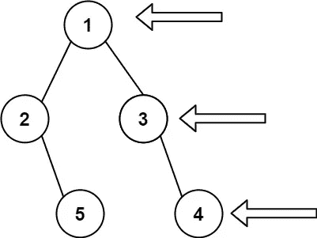
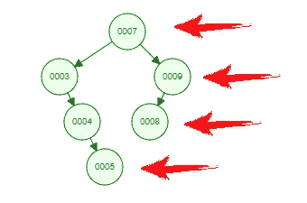
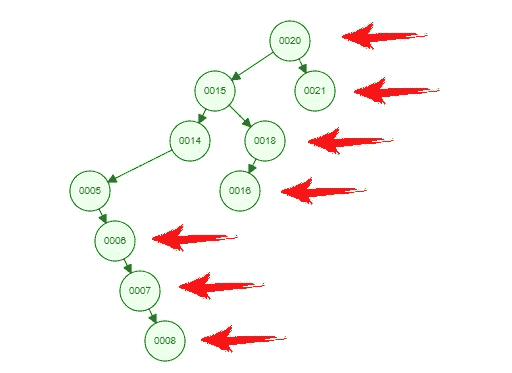
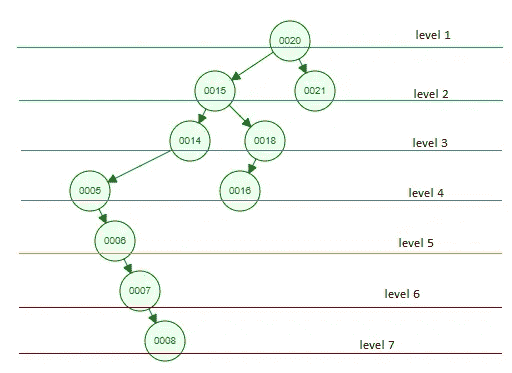
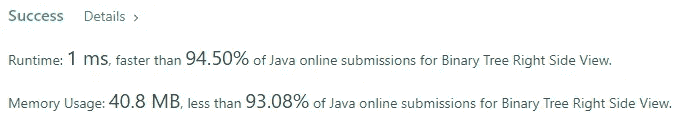

# Java 算法:二叉树右侧视图(LeetCode)

> 原文：<https://levelup.gitconnected.com/java-algorithms-binary-tree-right-side-view-leetcode-69e69430e2d1>


图为[托德·夸肯布什](https://unsplash.com/@toddquackenbush?utm_source=unsplash&utm_medium=referral&utm_content=creditCopyText)在 [Unsplash](https://unsplash.com/s/photos/binary-tree?utm_source=unsplash&utm_medium=referral&utm_content=creditCopyText)

## 任务描述:

给定二叉树的`root`，想象你站在二叉树的**右侧**，返回*你能看到的从上到下排序的节点的值*。

**例 1:**



```
**Input:** root = [1,2,3,null,5,null,4]
**Output:** [1,3,4]
```

**例 2:**

```
**Input:** root = [1,null,3]
**Output:** [1,3]
```

**例 3:**

```
**Input:** root = []
**Output:** []
```

**约束:**

*   树中的节点数量在范围`[0, 100]`内。
*   `-100 <= Node.val <= 100`

## 推理:

我认为这是一个在编码面试中很常见的问题。乍一看，它似乎很容易实现。这是错误的感觉。你这样想是因为提供了例子。让我给你看另一个不那么容易的例子。



第一个例子

你怎么看待这个例子？对你来说还是那么明显吗？如果你的答案是肯定的，让我再试一次



第二个例子

还那么明显吗？我不这么认为。如果你不同意我的观点，你可以停止阅读，尝试实现你自己的解决方案。对于那些感到困惑的人，请和我在一起。

让我们介绍水平的概念:



二叉树的层次

使用简单的词语——将二叉树中特定节点的级别视为该节点的深度。或者换句话说，从树根开始到特定的节点，你需要向下走多少步。

我想此时你已经意识到我们需要遍历一个二叉树中的每个节点，对于每个节点，我们只需要回答一个问题。这个节点是同级中最正确的节点吗？就这么简单。

## 解决方案:

我将使用递归方法来解释解决方案。我们需要引入一个集合来存储我们的答案。

如果我们得到空的根节点，我们可以立即返回空的集合。

我还引入了一个 HashMap 来存储我们是否访问了特定级别的信息

是时候介绍一下主要逻辑在里面的递归方法了。

该方法中有三点很重要:

1.  我们需要在某个时候停止探索树，如果我们到达的节点为空，我们就停止探索
2.  当我们访问节点时，我们希望检查它是否是这个特定级别上最合适的节点。如果是这样，我们存储它并将这个节点添加到存储答案的集合中。
3.  我们如何探索这棵树很重要。你可能已经猜到，只要我们被要求在每一层提供最右边的节点，我们就想先去当前节点的右边的子节点，然后去左边的。

完整的解决方案是这样的

这段代码给了我们线性的时间和空间复杂度，并且执行得相当好。



下一篇文章再见🙃🙃🙃🙃🙃🙃🙃🙃🙃🙃🙃🙃🙃🙃🙃

# 分级编码

感谢您成为我们社区的一员！更多内容见[级编码出版物](https://levelup.gitconnected.com/)。
跟随:[推特](https://twitter.com/gitconnected)，[领英](https://www.linkedin.com/company/gitconnected)，[通迅](https://newsletter.levelup.dev/)
**升一级正在改造理工大招聘➡️** [**加入我们的人才集体**](https://jobs.levelup.dev/talent/welcome?referral=true)