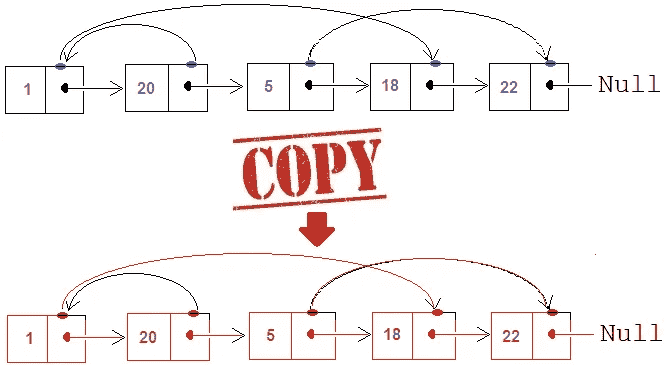
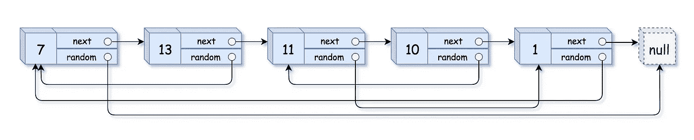
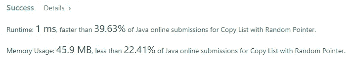

# Java 算法:用随机指针复制列表(LeetCode)

> 原文：<https://levelup.gitconnected.com/java-algorithms-copy-list-with-random-pointer-leetcode-55c127e4320a>



## 任务描述:

给定一个长度为`n`的链表，使得每个节点包含一个额外的随机指针，它可以指向列表中的任何节点，或`null`。

构造一个 [**深度复制**](https://en.wikipedia.org/wiki/Object_copying#Deep_copy) 的列表。深度副本应该完全由`n` **全新的**节点组成，其中每个新节点的值都被设置为其对应的原始节点的值。新节点的`next`和`random`指针都应该指向复制列表中的新节点，使得原始列表和复制列表中的指针表示相同的列表状态。**新列表中的指针不应指向原始列表中的节点**。

例如，如果原始列表中有两个节点`X`和`Y`，其中`X.random --> Y`，那么对于复制列表中对应的两个节点`x`和`y`，`x.random --> y`。

返回*复制的链表头*。

链表在输入/输出中被表示为一列`n`节点。每个节点被表示为一对`[val, random_index]`,其中:

*   `val`:表示`Node.val`的整数
*   `random_index`:指针`random`指向的节点(范围从`0`到`n-1`)的索引，如果没有指向任何节点，则为`null`。

你的代码将**只有**被赋予原始链表的`head`。

**例 1:**



```
**Input:** head = [[7,null],[13,0],[11,4],[10,2],[1,0]]
**Output:** [[7,null],[13,0],[11,4],[10,2],[1,0]]
```

**例二:**


```
**Input:** head = [[1,1],[2,1]]
**Output:** [[1,1],[2,1]]
```

**例 3:**


```
**Input:** head = [[3,null],[3,0],[3,null]]
**Output:** [[3,null],[3,0],[3,null]]
```

**约束:**

*   `0 <= n <= 1000`
*   `-10^4 <= Node.val <= 10^4`
*   `Node.random`是`null`或者指向链表中的某个节点。

## 推理:

乍一看，这项任务似乎很难，但实际上并非如此。但是它有一个我们需要注意的属性，并围绕它建立一个习惯。每当你看到一个可以分成小问题的问题，就把它分开。这是你可以应用于几乎任何问题的基本模式之一。让我来帮你。让我们再次重读这个任务，并把它分成更小的子问题。

1.  我们需要用与原始节点相同的值创建每个节点的副本。
2.  我们需要以与原始节点相同的方式设置指向下一个节点的指针
3.  我们需要像在原始节点中一样设置指向随机节点的指针

在这一点上，你可以说，等待，而不是有一个问题，现在我们有 3 个。是的，你是对的，但是它们更容易解决。让我们跳到解决方案部分，我会证明给你看。

## 先决条件:

如果你想调试你的代码，我个人推荐，你必须引入这个类

节点类

## 解决方案:

让我们从解决第一个子问题开始。让我们做一些简单的事情，遍历链表，为其中的每个节点创建一个副本。我选择 HashMap 来存储像旧节点->新节点这样的节点对。既然我们要从列表的头部迭代到尾部，那么我们也引入一个临时变量，并把它设置为列表的头部。

我们解决了第一个子问题。接下来的两个问题很容易解决，你会惊讶的。我们已经有了新旧节点之间的连接。我们只需要填充指向下一个节点的指针和随机指针。我们的地图已经储存了我们需要的所有信息。让我们再次将 temp 设置为列表的头部。让我们也引入新的虚拟节点，它将存储到我们新复制的头的链接。我们需要的最后一件事是 prev 指针，它将帮助我们设置关系节点->下一个节点

我们的解决方案应该是这样的

上面的代码给了我们线性的时间和空间复杂度。



# 分级编码

感谢您成为我们社区的一员！更多内容见[级编码出版物](https://levelup.gitconnected.com/)。
跟随:[推特](https://twitter.com/gitconnected)，[领英](https://www.linkedin.com/company/gitconnected)，[通迅](https://newsletter.levelup.dev/)
**升一级正在改造理工大招聘➡️** [**加入我们的人才集体**](https://jobs.levelup.dev/talent/welcome?referral=true)