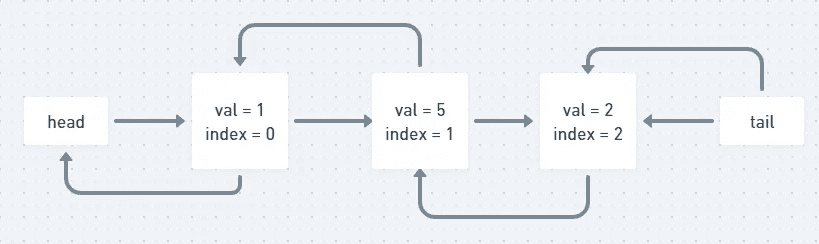

# Java 算法:设计链表(LeetCode)

> 原文：<https://levelup.gitconnected.com/java-algorithms-design-linked-list-leetcode-ecbd7edbb022>


扬·安东宁·科拉尔在 [Unsplash](https://unsplash.com/s/photos/binary-tree?utm_source=unsplash&utm_medium=referral&utm_content=creditCopyText) 上拍摄的照片

## 任务描述:

设计你的链表实现。您可以选择使用单向或双向链表。

单链表中的一个节点应该有两个属性:`val`和`next`。`val`是当前节点的值，`next`是指向下一个节点的指针/引用。

如果你想使用双向链表，你还需要一个属性`prev`来指示链表中的前一个节点。假设链表中的所有节点都是索引为 **0 的**。

实现`MyLinkedList`类:

我们的结构`MyLinkedList`

*   `MyLinkedList()`初始化`MyLinkedList`对象。
*   `int get(int index)`获取链表中`indexth`节点的值。如果索引无效，返回`-1`。
*   `void addAtHead(int val)`在链表的第一个元素前添加一个值为`val`的节点。插入后，新节点将成为链表的第一个节点。
*   `void addAtTail(int val)`追加一个节点值`val`作为链表的最后一个元素。
*   `void addAtIndex(int index, int val)`在链表中的`indexth`节点前添加一个值为`val`的节点。如果`index`等于链表的长度，该节点将被追加到链表的末尾。如果`index`大于长度，节点**不会插入**。
*   `void deleteAtIndex(int index)`如果索引有效，删除链表中的`indexth`节点。

**例 1:**

```
**Input**
["MyLinkedList", "addAtHead", "addAtTail", "addAtIndex", "get", "deleteAtIndex", "get"]
[[], [1], [3], [1, 2], [1], [1], [1]]
**Output**
[null, null, null, null, 2, null, 3]**Explanation**
MyLinkedList myLinkedList = new MyLinkedList();
myLinkedList.addAtHead(1);
myLinkedList.addAtTail(3);
myLinkedList.addAtIndex(1, 2);    // linked list becomes 1->2->3
myLinkedList.get(1);              // return 2
myLinkedList.deleteAtIndex(1);    // now the linked list is 1->3
myLinkedList.get(1);              // return 3
```

**约束:**

*   `0 <= index, val <= 1000`
*   请不要使用内置的 LinkedList 库。
*   最多`2000`次呼叫`get`、`addAtHead`、`addAtTail`、`addAtIndex`和`deleteAtIndex`。

## 我的想法:

我个人喜欢这样的任务。这可以通过许多不同的方式来解决，如果我们描述它们，你会对阅读大量的信息感到厌倦。这项任务可以帮助你建立或提高将任务分成小块的技能。同样，如果你想成为一名伟大的软件工程师，这是非常重要的技能。如果你已经有了算法和数据结构的经验，你可以这样做。

这项任务最简单的解决方案

以这种方式解决问题是非常好的，但是只有当你已经知道 LinkedList 是如何工作的，并且你能够从头开始实现它的时候，这种方式才会起作用。虽然上述方法可以节省您的时间。我建议深入研究并实现我们自己版本的 LinkedList。我很确定你们中的许多人知道它是如何工作的，但是当我要求你们实现它的时候，你们中的一些人可能会很纠结。

我认为在你阅读或学习一些东西后，你应该实现你刚刚学到的东西。它将帮助您理解这种数据结构是如何工作的，以及它可以用在什么地方。你学到的知识会被更好地记住。

## 推理:

正如我所说的，这个任务是一个很好的例子，说明我们可以将一个大任务分成更小的任务。所以让我们试着去理解怎么做。

似乎我们需要实现至少 5 种不同的方法。这是一个很好的起点。当你头脑中有一个更大的图景时，我们可以专注于每种方法必须解决的特定子问题。让我们逐一解决较小的问题。

根据描述方法`**int get(int index)**`可以接收元素的索引，如果我们的列表中有这个元素，就返回这个索引处的元素。听起来很简单。我们有一个包含元素的列表，让我们遍历它并跟踪当前索引和提供给我们的索引。如果它们相等，我们就找到了元素，可以返回。在所有其他情况下，我们返回-1。注意第 11 行。我们使用 **head** ，因为它存储了列表头部的链接。请记住，我们会回来的。

示例:我们有列表*1->2->3->4->5*

1 的索引为 0，2 的索引为 1，依此类推。如果给定了索引 3，我们必须返回 4

`int get(int index)`

列表中的下一个方法是`**void addAtHead(int val)**`,它必须在列表的前面插入值。这个有点棘手。我们有 **head** ，它存储了到 head 的链接，所以我们想要推送下一个元素，并在 head 之后插入提供的值。我们做的第一件事是创建新的**链接**，它将存储提供的值(下面的*方案*)。同时，我们需要更新现有链接和新链接之间的关系。让我们看一些图片来代替文字，我希望我能帮助你理解这个概念


MyLinkedList 的初始状态


我们创建了值为 5 的新链接


更新所有链接后 MyLinkedList 的状态

我们还有一个变量 **size** ，它在这里存储列表中元素的数量。

`void addAtHead(int val)`

链接类

下一个方法是`**void addAtTail(int val)**`,它做的几乎和前一个一样，唯一的不同是我们在列表的**尾**前插入我们的值。

`void addAtTail(int val)`


MyLinkedList 的初始状态


我们创建了一个值为 7 的新链接


更新所有链接后 MyLinkedList 的状态

下一个方法是`void addAtIndex(int index, int val)`,它必须在 LinkedList 中的特定索引处插入一个值，该值作为参数提供。在**头**之后的第一个节点的索引为 0，它旁边的节点的索引为 1，依此类推。


MyLinkedList 中节点的值和索引

我们的目标是迭代到目标索引并在该索引处插入值。让我们在索引 1 处插入值 5。


我们创建了一个值为 5 的新链接


更新所有链接后 MyLinkedList 的状态

我们最后要实现的方法是`void deleteAtIndex(int index)`。它做的事情几乎和在索引处插入一样，除了一点，这次我们删除了 Link。这篇文章太大了，所以我提供了一些图片和代码，让它更容易理解。让我们删除索引 3 处的节点。


MyLinkedList 的初始状态



更新所有链接后 MyLinkedList 的状态

最后，我添加了您的 MyLinkedList 的完整代码

上面的代码给出了以下结果


# 分级编码

感谢您成为我们社区的一员！更多内容见[级编码出版物](https://levelup.gitconnected.com/)。
跟随:[推特](https://twitter.com/gitconnected)，[领英](https://www.linkedin.com/company/gitconnected)，[通迅](https://newsletter.levelup.dev/)
**升一级正在改造理工大招聘➡️** [**加入我们的人才集体**](https://jobs.levelup.dev/talent/welcome?referral=true)