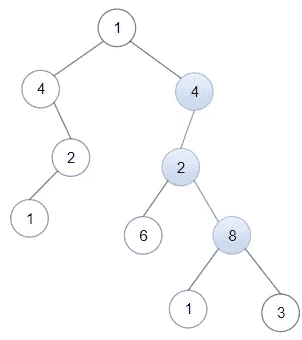
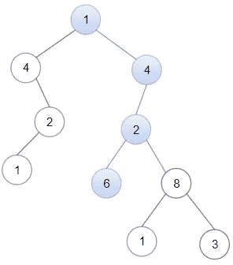
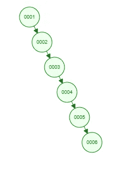
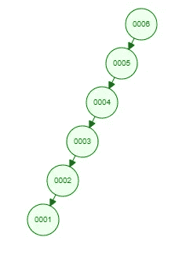
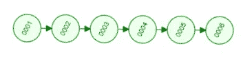
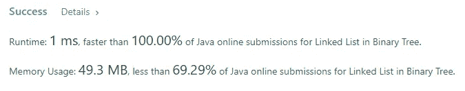

# Java 算法:二叉树中的链表(LeetCode)

> 原文：<https://levelup.gitconnected.com/java-algorithms-linked-list-in-binary-tree-leetcode-942daa409b3f>


照片由 [**莫里茨·金德勒**](https://unsplash.com/@moritz_photography) 在 [Unsplash](https://unsplash.com/s/photos/binary-tree?utm_source=unsplash&utm_medium=referral&utm_content=creditCopyText) 上拍摄

## 任务描述:

给定一棵二叉树`root`和一个以`head`为第一个节点的链表。

如果链表中从`head`开始的所有元素都对应于二叉树中连接的某个*向下路径*，则返回 True，否则返回 False。

在这个上下文中，向下路径意味着从某个节点开始并向下的路径。

**例 1:**



```
**Input:** head = [4,2,8], root = [1,4,4,null,2,2,null,1,null,6,8,null,null,null,null,1,3]
**Output:** true
**Explanation:** Nodes in blue form a subpath in the binary Tree.
```

**例 2:**



```
**Input:** head = [1,4,2,6], root = [1,4,4,null,2,2,null,1,null,6,8,null,null,null,null,1,3]
**Output:** true
```

**例 3:**

```
**Input:** head = [1,4,2,6,8], root = [1,4,4,null,2,2,null,1,null,6,8,null,null,null,null,1,3]
**Output:** false
**Explanation:** There is no path in the binary tree that contains all the elements of the linked list from head.
```

**约束:**

*   树中节点的数量将在范围`[1, 2500]`内。
*   列表中的节点数量将在`[1, 100]`范围内。
*   `1 <= Node.val <= 100`对于链表和二叉树中的每个节点。

## 推理:

似乎这个任务迫使我们使用至少两种不同的数据结构，一个二叉树和一个链表。让我们介绍两个简单的类来描述构成二叉树和链表的基本部分。

用于构建 LinkedList 的 ListNode 类

用于构建 BinaryTree 的 TreeNode 类

你可能会注意到它们之间的一些相似之处。唯一的区别是 TreeNode 有一个额外的指针，仅此而已。事实上，您可以使用 LinkedLists 来表示某些类型的二进制树。



可以用 LinkedList 表示的 BinaryTree 的第一个示例



可以用 LinkedList 表示的二进制树的第二个示例

我们来找点乐子，换个“视角”。第二个例子可以做同样的事情。



第一个向左旋转的示例

让我们回到我们的任务。我们需要找出一个给定的二叉树是否在从任意节点开始的路径中包含一个链表。不要被任务定义吓到，它比你想象的要简单。先说蛮力解法。我们能做的是遍历二叉树的每个节点，并从它开始遍历链表。如果我们遍历二叉树中的每个节点，它将是 O(n)——线性时间复杂度。链表中每个节点的迭代也是 O(n)。如果对于二叉树的每个节点，我们迭代链表，将得到 O(n)-二次时间复杂度。

听起来是个糟糕的解决方案？让我们看看提供的数字。二叉树的最大节点数是 2500。链表中的最大节点数是 100。2500 * 100 = 250000 为了解决这个问题，我们必须执行的最大操作数。任何现代 CPU 都可以在不到一秒的时间内处理多达 10⁸运算。我们的强力解决方案有 2*10⁵.

## 解决方案:

我将使用递归方法来实现这个解决方案，但它也可以通过非递归方法来解决。

在 **isSubPath** 方法中，我们调用递归方法**遍历**

在遍历函数中，我们检查当前根节点是否为空，结果，我们返回头部是否等于空。如果二叉树中的一个节点的值和链表中的一个节点的值相等，我们可以尝试验证我们是否找到了匹配。为此，我们调用 **findPath** 方法。

否则，我们继续通过去左边和右边的节点来探索二叉树。

在 **findPath** 方法中，我们做了与**遍历**几乎相同的事情。如果头为空，意味着我们到达了链表的末尾，我们返回 true。如果根为空，则意味着我们已经浏览了二叉树中的所有节点，无法继续。我们返回 false。在所有其他情况下，我们检查二叉树和链表的节点值是否相等。同时我们尝试从二叉树的当前节点探索两条路径，我们尝试去左边的子节点和右边的子节点。任何可用的路径都足以让我们回答主要问题——二叉树包含所提供的链表中的所有节点。

完整的解决方案

如前所述，这个解决方案具有二次时间复杂度，但它很好，因为我们知道任务的确切限制。测试系统证明了这一点。



# 分级编码

感谢您成为我们社区的一员！更多内容见[升级编码出版物](https://levelup.gitconnected.com/)。
跟随:[推特](https://twitter.com/gitconnected)，[领英](https://www.linkedin.com/company/gitconnected)，[通迅](https://newsletter.levelup.dev/)
**升一级正在改造理工大招聘➡️** [**加入我们的人才集体**](https://jobs.levelup.dev/talent/welcome?referral=true)