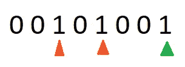
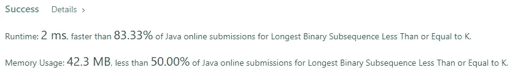

# Java 算法:小于或等于 K 的最长二进制子序列(LeetCode)

> 原文：<https://levelup.gitconnected.com/java-algorithms-longest-binary-subsequence-less-than-or-equal-to-k-leetcode-a6034d1c646a>


## 任务描述:

给你一个二进制字符串`s`和一个正整数`k`。

返回****的长度最长****`s`*的子序列，即组成一个* ***的二进制*** *数小于等于* `k`。**

**注意:**

*   **子序列可以包含**前导零**。**
*   **空字符串被认为等于`0`。**
*   ****子序列**是可以通过删除一些字符或不删除字符而不改变剩余字符的顺序从另一个字符串中导出的字符串。**

****例 1:****

```
****Input:** s = "1001010", k = 5
**Output:** 5
**Explanation:** The longest subsequence of s that makes up a binary number less than or equal to 5 is "00010", as this number is equal to 2 in decimal.
Note that "00100" and "00101" are also possible, which are equal to 4 and 5 in decimal, respectively.
The length of this subsequence is 5, so 5 is returned.**
```

****例 2:****

```
****Input:** s = "00101001", k = 1
**Output:** 6
**Explanation:** "000001" is the longest subsequence of s that makes up a binary number less than or equal to 1, as this number is equal to 1 in decimal.
The length of this subsequence is 6, so 6 is returned.**
```

****约束:****

*   **`1 <= s.length <= 1000`**
*   **`s[i]`不是`'0'`就是`'1'`。**
*   **`1 <= k <= 10^9`**

## **推理:**

**有几件事值得一提。我们需要找到子序列，而不是子串。这意味着我们可以从任何位置选取任何位，但是我们不能改变它们在初始输入中的相对位置。使用这个例子“1001010”，我们可以创建类似于“1001”、“111”、“0000”的子序列。同时，我们不能创建子序列“100001 ”,因为我们没有一对中间有 4 个 0 的 1。**

**K 的最大值是 1_000_000_000，可以用 Java 的整数来表示。**

## **解决方案:**

**这个任务是我们可以应用“贪婪”方法的一个很好的例子。我们需要找到一个二进制子串，它是 S 的子序列，值≤k。0 可以表示为 1000 个 0 位。这意味着我们可以计算输入中所有的 0 位。同时，我们可以创建一个数组来记录 1 位:**

**不管有多少个零，也不管我们从哪个位置选择它们，我们都要选择它们，并把它们设为答案。考虑到输入的最大长度，我们可以得到 1000 位，这既不是整数也不是长整数。但是 K 的 max 值表示我们不需要担心大于 Integer 的数。MAX_VALUE。为此，我们正与龙合作。有一个标记了 1 的位置的数组，并且知道给了我们多少个 0，我们将贪婪地在输入中从右到左挑选 1。在这个过程中，我们需要向 num 添加新的值，并检查边界。**

**为了帮助您进一步理解这个逻辑，让我带您看一个简单的例子。假设我们有这个输入“00101001”。**

****

**例子**

**我们有 5 个零，并将它们添加到我们的答案中。带有绿色三角形的 1 向左移动 1 位到 0 位(2 ^ 0 ),得到 1。带有橙色三角形的 1 向左移动 1 位到 3 个位置(2 ^ 3 ),得到 8。带有红色三角形的 1 向左移动 1 位到 5 个位置(2 ^ 5 ),得到 32。**

**现在根据 K 值，我们可以回答给我们的任务。因为我们有许多零，我们知道如何一点一点地构建答案。所以这个任务的解决方案是这样的**

**上面的代码给了我们很好的结果。它具有线性的时间和空间复杂度。**

****

# **分级编码**

**感谢您成为我们社区的一员！升级正在改变技术招聘。 [**在最好的公司**找到你最理想的工作](https://jobs.levelup.dev/talent/welcome?referral=true) **。****

**[](https://jobs.levelup.dev/talent/welcome?referral=true) [## 升级—转变技术招聘

### 升级—转变技术招聘🔥使软件工程师能够找到完美的角色…

作业. levelup.dev](https://jobs.levelup.dev/talent/welcome?referral=true)**