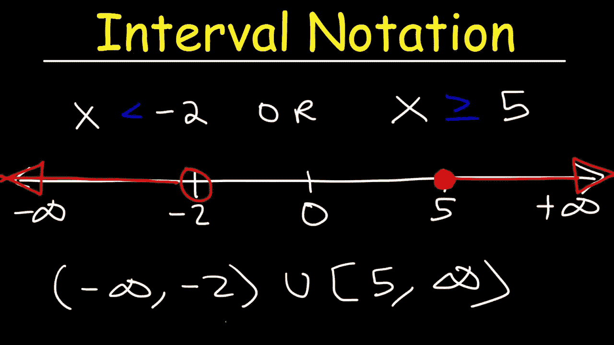
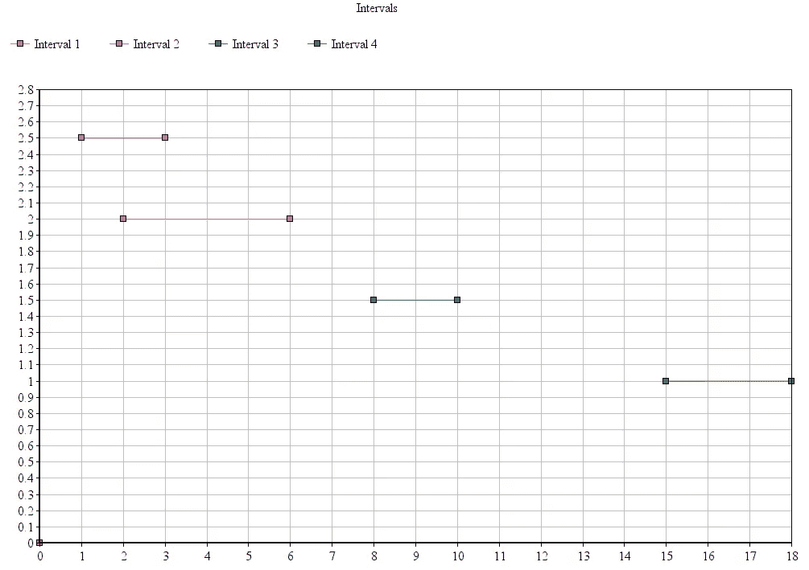
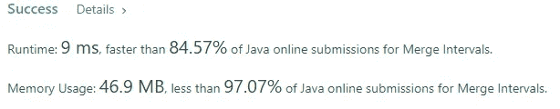

# Java 算法:合并间隔(LeetCode)

> 原文：<https://levelup.gitconnected.com/java-algorithms-merge-intervals-leetcode-24a3277cfa28>



## 任务描述:

给定一个数组`intervals`，其中`intervals[i] = [start_i, end_i]`，合并所有重叠区间，并返回*一个非重叠区间数组，覆盖输入*中的所有区间。

**例 1:**

```
**Input:** intervals = [[1,3],[2,6],[8,10],[15,18]]
**Output:** [[1,6],[8,10],[15,18]]
**Explanation:** Since intervals [1,3] and [2,6] overlap, merge them into [1,6].
```

**例 2:**

```
**Input:** intervals = [[1,4],[4,5]]
**Output:** [[1,5]]
**Explanation:** Intervals [1,4] and [4,5] are considered overlapping.
```

**约束:**

*   `1 <= intervals.length <= 10^4`
*   `intervals[i].length == 2`
*   `0 <= starti <= endi <= 10^4`

## 推理:

让我们试着做一些自然的事情。让我们从第一个例子中画出间隔。这将帮助我们了解问题的本质，并决定采取什么方法来解决这个问题。

我们有这些区间[1，3]，[2，6]，[8，10]，[15，18]



间隔

看着这张图表，我们可以得出两个重要的观察结果。

1.  一旦我们画了线，我们就可以很容易地说出哪一条线彼此相交。
2.  一旦我们画线，它们就被分类了。

记住这一点，我们就可以着手解决问题了

## 解决方案:

我们要做的第一件事是对我们所有的区间进行排序，这样我们就可以把它们合并在一起，就像我们看上面的图表时在脑海中所做的那样。排序很简单，我们先按区间的起点排序，再按区间的终点排序。

一旦区间被排序，我们就可以开始合并它们。看上面的图表，我们可以做出重要的观察——交叉区间有一些重叠，或者它们从另一个区间的结束位置开始。我们将使用 LinkedList，因为它提供了 getLast()方法。我们也可以使用 ArrayList，通过调用 list.get(list.size() — 1)来获取最后一个元素。对于每个区间，我们检查是否与前一个区间有交集。如果我们有一个 intesection，我们只需将它们合并在一起，并放回列表中。

最后要做的就是创造答案。我们这样做是因为我们一开始不知道有多少元素是不相交的。

所以任务的解决方案看起来像这样

上面的代码给了我们很好的结果。它具有 n log n 的时间和线性空间复杂度。

