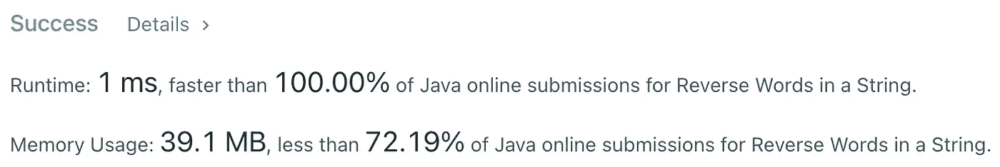

# Java 算法:重新访问字符串中的反向单词(LeetCode)

> 原文：<https://levelup.gitconnected.com/java-algorithms-reverse-words-in-a-string-revisited-leetcode-7659dd83635b>

## 我对这个 LeetCode 问题的看法

Riccardo Annandale 在 [Unsplash](https://unsplash.com?utm_source=medium&utm_medium=referral) 上拍摄的照片

我最近偶然发现了一篇由 [Ruslan Rakhmedov](https://medium.com/u/2e81cf0e57a1?source=post_page-----7659dd83635b--------------------------------) 撰写的 [Medium 文章，讲述了如何用 Java 解决](/java-algorithms-reverse-words-in-string-leetcode-b6d180252e28) [LeetCode 问题 151](https://leetcode.com/problems/reverse-words-in-a-string) :给定一个由一个或多个空格分隔的单词串，返回一个由单个空格分隔的逆序新单词串。原始字符串可能有也可能没有前导空格和尾随空格，但它保证至少包含一个单词。

鲁斯兰的解决方案非常好:它完成了工作，足够快，而且容易理解。老实说，我更愿意看到他的代码投入生产，而不是我的…除非我们的目标是最高的性能，这正是 LeetCode 竞赛的情况！

# 溶液分析

Ruslan Rakhmedov 的原创解决方案

Ruslan 的解决方案依赖于`String.split()`方法将原始字符串分解成单词。该方法接受匹配分隔符的正则表达式，但是它有一个优化的快速路径实现，因为正则表达式实际上是一个字符，所以在这种情况下不进行模式匹配。

`String.split()`内部分配一个`ArrayList`来存储中间结果。`ArrayList`的默认容量是十个元素，当我们的字符串包含十个以上的单词时，这将导致额外的分配和复制。该方法返回一个字符串数组，因此`ArrayList.toArray()`被调用，这又需要一次分配和复制。当然，结果数组的每个元素都是一个`String`，它必须被分配并填充来自原始字符串的数据(即另一个副本)。

由于 Java 字符串是不可变的，Ruslan 使用`StringBuilder`来构建结果字符串。它分配一个默认大小为 16 个字符的数组，这意味着对更长的字符串进行额外的分配和复制操作。最后，`StringBuilder.toString`必须再分配和填充一个`String`对象。

尽管 Java 非常快，但这段代码还是给我们留下了一些改进的空间。那么，我们能做得更好吗？

# 改进的解决方案

事实上，我们可以。避免`String.split()`和`StringBuilder`并由我们自己实现所有需要的代码允许我们大幅减少分配和数据复制操作的数量。想法很简单:以逆序遍历原始字符串，找到单词边界，跳过空白序列。

作者优化的实现

我们用原始字符串的大小分配一个`destination`字符数组。这可能比我们实际需要的内存更多，但是在最坏的情况下，当原始字符串是由一个空格分隔的单词序列，没有前导或尾随空格时，它仅够存储结果。`destinationIndex`保存`destination`数组中的下一个写位置。

原始字符串`s`被视为一系列字符。变量`beforeWordStartIndex`和`wordEndIndex`跟踪字边界，辅助函数`consumeWhitespace`和`consumeWord`用于以逆序遍历字符串并更新变量。对于在原始字符串中找到的每个单词，使用`copyChars`方法将相应的字符复制到`destination`数组中。另外，`writeWhitespace`方法用于向结果字符串发出一个空格分隔符。

最后，我们利用专门的`String(char value[], int offset, int count)`构造函数从 char 数组创建一个字符串，这需要一次分配和一次复制操作。

# 复杂性和 LeetCode 结果

这种解决方案在时间和空间需求上都是线性的。

假定`n`是原始字符串的长度，我们分配`n` chars 数组作为我们的工作缓冲区。结果字符串的长度也不超过`n`个字符。这样分配的总内存大小不超过`2n`个字符，也就是 O(n)。

我们遍历字符串两次:查找字边界和将数据复制到工作缓冲区。在`String`构造函数中还隐藏了另一个复制操作。所以我们的解决方案只需要`3n`个操作，也就是 O(n)。

将解决方案提交给 LeetCode 给出的最高运行时间为 1 ms，我相信这是 LeetCode 时间分辨率的极限。内存消耗主要由 JVM 的使用决定，似乎与代码无关。

LeetCode 提交结果

尽管 Ruslan Rakhmedov 的原始解决方案看起来做了大量的分配和数据篡改，但 Java 可以非常快，并且分配非常便宜。在现实世界中，您可能不会注意到任何性能差异。Ruslan 的代码易于阅读和遵循，这通常比达到顶级性能重要得多。

过早的优化是不好的。这不仅浪费时间，还会导致代码更加繁琐，更难维护。优化代码的唯一真正原因是遇到一个经过验证的性能瓶颈。或者在这种情况下，参加 LeetCode 比赛。

以增加代码复杂性为代价，我们能够将内存需求减少到`2n`个字符，将时间需求减少到`3n`个操作，这是 LeetCode 上最快的解决方案，给出了毫秒级的时间分辨率。