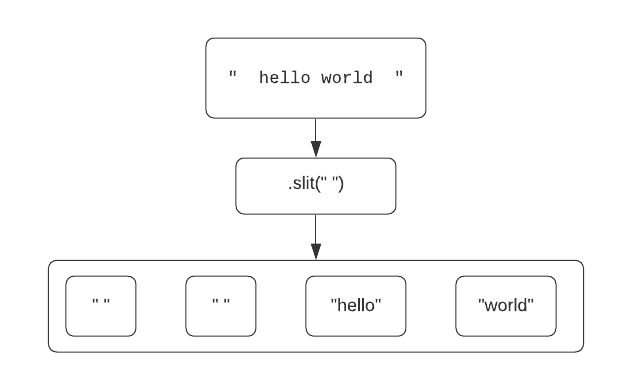
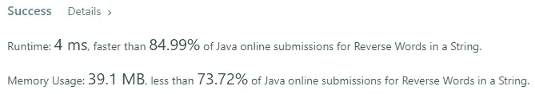

# Java 算法:反转字符串中的单词(LeetCode)

> 原文：<https://levelup.gitconnected.com/java-algorithms-reverse-words-in-string-leetcode-b6d180252e28>


照片由[阿提克·苏利亚纳米](https://unsplash.com/@atik1616?utm_source=medium&utm_medium=referral)在 [Unsplash](https://unsplash.com?utm_source=medium&utm_medium=referral) 上拍摄

# 任务描述:

给定一个输入字符串`s`，颠倒**字**的顺序。

一个**字**被定义为一个非空格字符序列。`s`中的**字**会被至少一个空格隔开。

返回由一个空格连接的逆序单词的字符串。

**注意**`s`可能包含前导空格、尾随空格或两个单词之间的多个空格。返回的字符串应该只有一个空格来分隔单词。不要包含任何多余的空格。

**例 1:**

```
**Input:** s = "the sky is blue"
**Output:** "blue is sky the"
```

**例 2:**

```
**Input:** s = "  hello world  "
**Output:** "world hello"
**Explanation:** Your reversed string should not contain leading or trailing spaces.
```

**例三:**

```
**Input:** s = "a good   example"
**Output:** "example good a"
**Explanation:** You need to reduce multiple spaces between two words to a single space in the reversed string.
```

**例 4:**

```
**Input:** s = "  Bob    Loves  Alice   "
**Output:** "Alice Loves Bob"
```

**例 5:**

```
**Input:** s = "Alice does not even like bob"
**Output:** "bob like even not does Alice"
```

# 解决方案:

这个问题可以用很多方法解决。我想用最直观、最自然的方法来解决这个问题。这个任务说单词之间至少要有一个空格。这使我们得出结论——我们可以使用 string 的 [split()](https://docs.oracle.com/javase/7/docs/api/java/lang/String.html#split(java.lang.String)) 方法将输入字符串分割成几部分(第 3 行)。让我们看例子 2。



这样我们将得到一个字符串数组()。但是如果我们看一下任务描述，我们会注意到，每个单词之间可能有许多空格，而不是一个。我们需要通过简单地检查数组中每个单词的大小来避免空字符串。下一件应该在我们脑海中出现的事情是我们将在哪里存储结果。

StringBuilder 是一个很好的选择。Java 中的字符串是不可变的，如果我们试图在结果中添加一个新单词，将会导致内存使用效率极低。

这个任务要求我们颠倒单词的顺序。为了解决这个问题，我们需要反向遍历我们的单词数组。每当我们看到一个非空单词时，我们必须将它附加到我们的结果中。但是我们也需要在每个单词之间添加空格。所以在添加新单词之前，我们检查结果的长度。如果它不是空的，我们首先添加空格，只有在这之后，我们才应该添加实际的单词。

最后，我们得到了包含适当信息的结果，但是根据方法的返回值，我们必须返回 String 而不是 StringBuilder。所以我们简单地调用 StringBuilder 的方法 [toString()](https://docs.oracle.com/javase/7/docs/api/java/lang/StringBuilder.html#toString()) 并返回结果字符串。我们完成了这项任务。

上面的代码给了我们很好的结果。它具有线性的时间和空间复杂度。



# 分级编码

感谢您成为我们社区的一员！升级正在改变技术招聘。 [**在最好的公司**找到你最完美的工作](https://jobs.levelup.dev/talent/welcome?referral=true) **。**

[](https://jobs.levelup.dev/talent/welcome?referral=true) [## 升级—转变技术招聘

### 升级—转变技术招聘🔥使软件工程师能够找到完美的角色…

作业. levelup.dev](https://jobs.levelup.dev/talent/welcome?referral=true)