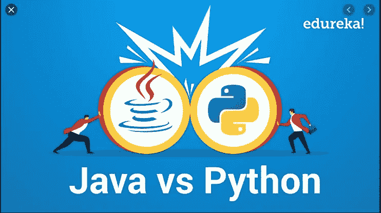
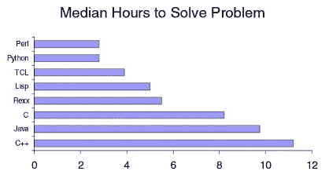

# Java 改变了我编写 Python 的方式

> 原文：<https://levelup.gitconnected.com/java-changed-how-i-write-python-f556bda69bbf>

## 从两种语言中吸取的经验教训



明智的选择—图片信用 edu reka:[https://www.youtube.com/watch?v=s3Ejdx6cIho](https://www.youtube.com/watch?v=s3Ejdx6cIho)

*即将发布第 2 部分:Python 改变了我编写 Java 的方式*

从研究生院毕业后，我非常喜欢用 Python 写代码，而且只喜欢用 Python。其他语言似乎太冗长，尤其是 Java。只需对比这些 **helloworld** 的例子。

```
print('hello world') ---------------public class Main {    
    public static void main(String[] args) {
        System.out.println("hello world");
    }
} 
```

可惜当时(2015 年)我能找到的工作只有在企业，在企业 [Java 为王](https://remotejavadev.com/java-is-still-king/)。不知何故，我找到了一个，随着时间的推移，我开始学习并尊重 Java 及其周围的生态系统。然而，我仍然怀念 Python 的简单性，企业还没有准备好向更新的 JVM 语言如 [Kotlin](https://kotlinlang.org/) 过渡。

终于在 2019 年，我用一个真正的 Python 栈(Python/Flask/PostgreSQL/React)找到了一份新工作。令人惊讶的是，并不全是阳光和玫瑰。事实证明，Java 对我对好软件的看法有很大的影响。哦，转盘有多好...不管怎样，原因如下。

# 打字和红酒一样，适量有益健康

**更新:**Python 3.8 中的新特性是`typing.Protocol`(在 3.5 中是实验性的)，它让我们更接近接口:[来看看](https://www.python.org/dev/peps/pep-0544/#explicitly-declaring-implementation)。

Java 和 Python 的一个关键区别是类型系统。Java 是静态类型的；Python 不是([虽然两者都使用强类型](https://stackoverflow.com/questions/11328920/is-python-strongly-typed/45359010#45359010))。每一种都有优点和缺点，例如静态类型允许 Java 编译器在代码运行之前捕捉简单的错误。它还支持 ide 更好的内省，这就是为什么 [IntelliJ](https://www.jetbrains.com/idea/) 比它的 [PyCharm](https://www.jetbrains.com/pycharm/) 对手有更好的智能感知。另一方面，许多优秀的语言特性，如 monkeypatching、可变函数参数和整体简洁，都是 Python 动态类型的结果。

首先，让我们承认打字经常是多余的，

```
name = 'Steve' ---------------String name = 'Steve' 
```

在这个例子中,“Steve”是一个字符串的事实是显而易见的。Python 为胜利而战！然而，考虑一下 Python 和 Java 中的函数签名

```
def randomize(names):---------------public static Set randomize(List<String> names);
```

Python 版本太模糊了。`names`是列表、集合还是无关紧要？`randomize`是返回一个新的集合还是随机选择现有的集合(即。不返回)？对于这些细节，您需要阅读 docstring 或代码。同时，Java 方法签名虽然冗长，却传达了所有这些信息。很明显，预期的输入是一个列表，返回的实际上是一个集合。

这通常会导致 Python 变量的过度命名，

```
def randomize_to_set(names_list)
```

不要这样！相反，通过核心库使用类型提示`typing`

```
# Python 3.9 only
def randomize(names: list) -> set# Python 3.5 - 3.8
from typing import List, Set 
def randomize(names: List) -> Set
```

当很少使用和使用复杂 IO 类型的函数时，比如使用`ndarrays`和定制类时，类型化是非常有用的。

**小心:**Python 中`typing`的一个重要方面是这些只是*提示*。`randomize`仍可通过非列表输入调用。像 PyCharm 这样的 IDE 至少会抱怨这个问题，但是实际上没有什么能阻止代码脱离 a linter 运行！要通过验证更严格地执行输入，请查看如下所示的[棉花糖](https://marshmallow.readthedocs.io/en/latest/extending.html#schema-level-validation)或`@dataclass`。

# 对接口编程

Python 中非常缺乏的一个 Java 特性是接口，[也是类型系统](https://www.quora.com/Why-doesnt-Python-have-full-OOP-features-like-private-methods-interfaces-etc#:~:text=Python%20doesn't%20have%20interfaces,implements%20a%20set%20of%20methods.)的一个折衷。已经有人尝试这么做了，但是它不太可能成为语言的一部分。

接口基本上是代码库中的规范或 API。如果你不熟悉，这个 StackOverflow 帖子上的公认答案用一个很好的例子解释了它。Python 中带有类型提示的抽象类可以实现同样的事情。

## 虚构的例子

我和我的伙伴约翰正在开发一个交易系统。John 已经同意构建底层的实用程序来实际进行交易，而我则负责更高级别的投资组合管理。我和约翰如何同时独立完成这些任务？关键是在约翰的交易系统中定义一个清晰的边界，或者说*界面*。约翰和我坐在一起，敲出这样的东西:

```
*from* abc *import* abstractmethod
*from* collections *import* ABC

*class* TradingSystem(ABC):

    @abstractmethod
    *def* buy(*stock*: *str*, account: *int*, amount: *float*) -> *str*:
        *"""* ***:param*** *stock: ISIN code for stock, eg. BNY* ***:param*** *account: Account number to bill order* ***:type*** *amount: How much to buy in dollars* ***:return****: Unique order ID for this transaction
        """* @abstractmethod
    *def* sell(*stock*: *str*, account: *int*, amount: *float*) -> *str*:
        ...
```

这实际上是一个契约——John 的实现必须至少实现带有这些调用签名的`buy/sell`方法。只要契约有效，实现细节并不重要(比如 WebSockets vs HTTP)。我现在可以参考`TradingSystem`接口`sell`方法开始工作了，

```
*def* liquidate_financials(system: TradingSystem):
    """ Sell a bunch of stock in banks """
    *for* stock *in* ['BNY', 'GS', 'MS']:
        system.sell(stock)
```

**注意:I** 接口/抽象类可以有多个实现，例如`DowJonesTradingSystem`和`NasdaqTradingSystem`，但是代码只引用通用的`TradingSystem`抽象。

# 隐私和不变性

在 Java 中，我真正怀念的一件事是变量和方法的`public/protected/private`修饰符。其他语言 Javascript 和 Kotlin 也分别通过`const`和`val`支持可变不变性 Javascript 和 Kotlin。另一方面，在 Python 中，没有什么是真正私有的；相反，使用`_`或`__`意味着隐私[，如这里所描述的](https://stackoverflow.com/questions/1641219/does-python-have-private-variables-in-classes)。以我的经验来看，这通常会导致一切都是公开的，这会模糊意图并产生泄漏的抽象。

## 数据类别和属性

数据类是在 Python 3.7 中引入的，其作用类似于 Java 中的[POJO](https://www.baeldung.com/java-pojo-class)。

```
from dataclasses import dataclass

@dataclass
class Book:
    author: str
    title: str

book = Book('Great Expectations', 'Dickens')
print(book)
```

哪些输出

```
Book(author='Great Expectations', title='Dickens')
```

`@dataclass`减少了类样板文件，例如覆盖了`__hash__`和`__repr__`，这就是为什么打印输出是可读的，而不是`<__main__.Book object at 0x00000285EBF56320>`。还要注意，它接受了没有显式`__init__`方法的关键字参数。

`attrs`包与此类似，但是与 Python 的旧版本兼容，并且更加全面——最好通过示例来学习[。再考虑一下`Book`类，这次是用`attrs`写的](https://www.attrs.org/en/stable/examples.html)

```
import attr

@attr.s(frozen=True, auto_attribs=True)
class Book(object):
    author: str
    _pagecount: int = 0
    title: str = 'untitled'

book = Book(author='Dickens', title='Great Expectations', pagecount=10)
print(book)
```

其输出非常相似

```
Book(author='Dickens', _pagecount=10, title='Great Expectations')
```

表面下隐藏着大量的东西。首先，`frozen=True`关键字确保属性是不可变的:试图覆盖一个属性(例如`book.author='other author'`)会引发一个异常。 `auto_attribs=True`与`@data_class`装饰器的作用相同；也就是说，`Book`下的所有属性都是*必需的*并且是可公开访问的。对于细粒度的控制，分别为每个属性声明`attr.ib()`([示例](https://www.attrs.org/en/stable/examples.html))。还要注意,`title`属性有一个默认值。最后，注意`pagecount`是使用不带`_`的关键字设置的，但仍然会产生一个私有属性。

为了深入比较`attrs`与其替代品(数据类、命名元组等..)[看到这里](https://www.attrs.org/en/stable/why.html)。

# 编码不仅仅是代码

在研究生院，我负责编码。在我的工作中，我负责 T21 软件。差别是巨大的。文档、性能、API、测试套件、构建管道、持续部署、容器化、工件存储库——清单还在继续。在这方面，Python 令人惊讶地笨拙。

## 投诉 1:可执行二进制文件

在 Java 中，将代码和运行时依赖捆绑到一个[可执行 jar](https://www.javatpoint.com/how-to-make-an-executable-jar-file-in-java) 中是非常简单的。然后，jar 可以在任何其他安装了 Java 的机器上运行，而不考虑操作系统。这对于与非技术人员分享小脚本和一次性工具非常有用。与 Python 相比，Python 的代码是解释的，通常从源代码运行(毕竟它是一种解释型语言……)。

Python 中的可执行二进制文件利用了几个第三方[的“冻结”工具](https://python-guide-cn.readthedocs.io/en/latest/shipping/freezing.html)。生成的二进制文件通常只与编译它的操作系统兼容。例如，Mac 用户不能冻结 Windows 二进制文件，反之亦然。此外，当这个黑盒冻结过程失败时，很难调试，并且对于具有许多依赖项的大型程序来说，失败是可能的。

## 那么我们能做些什么呢

这对于一个托管服务来说是一个很好的机会，它可以在许多不同的操作系统上冻结 Python 代码。但在有人建造它之前，这里有一些建议:

1.  如果可能，确保冻结脚本的消费者使用相同的操作系统。
2.  考虑用 web 服务替换脚本，即。烧瓶。

虽然第 2 点听起来很简单，但是这些脚本通常是一次性的，并且是为非技术人员准备的，所以期望他们提交 POST 请求是不现实的。

## 抱怨 2:没有全面的 SDLC 工具

Java 项目通常使用像 Maven 或 Gradle 这样的*声明性*工具来管理软件开发生命周期(SDLC)的几个方面，包括:

*   管理依赖关系。
*   编译/林挺代码
*   运行测试
*   创建本地构建工件
*   将二进制文件部署到像 [Nexus](https://www.sonatype.com/product-nexus-repository) 这样的 artifactory 中(Python 等价于 [PyPI](https://pypi.org/) )
*   [语义版本化](https://www.geeksforgeeks.org/introduction-semantic-versioning/)

**免责声明:** Maven 是一个通用的项目管理工具，但是它是如此的集成，并且在 Java 中被广泛采用，以至于我将它视为 Java 的一部分*。*


玛芬:你对那个济贫院太冷淡了。

在 Python 中，这些是以一种*命令式*异构的方式拼凑在一起的。挑选新项目时的典型流程:

*   使用 pip 和 Anaconda 创建一个干净的虚拟环境。来自需求文件的依赖关系。希望它不会因为操作系统/架构的假设(JVM 没有这个问题)或者包版本不兼容(Java 确实有这个问题，但是以我的经验来看不太常见)而失败。
*   使用我的 IDE PyCharm 在本地运行测试。
*   使用 IDE 绑定虚拟环境。项目的 Python 解释器。
*   如果需要的话，手动安装本地的`python setup.py install`(也要小心哪个虚拟环境。是活动的)
*   使用[pip install，make 和](https://realpython.com/pypi-publish-python-package/) [bump2version](http://bump2version) 的笨拙组合部署到 PyPI。
*   PS——什么时候想要一个[轮子和一个鸡蛋](https://packaging.python.org/discussions/wheel-vs-egg/#:~:text=Wheel%20and%20Egg%20are%20both,by%20PEP%20427%20in%202012.)？嘘…

不要误解我，Maven 是 XML 和[不讨人喜欢的文档](https://maven.apache.org/guides/plugin/guide-java-report-plugin-development.html)的一个丑陋的大杂烩，但是一旦你掌握了窍门，它就非常强大。

## 那么我们能做些什么呢

*   考虑用 Docker 容器替换虚拟环境，并用`docker-compose.`来管理它们[实际上非常简单](https://docs.docker.com/compose/gettingstarted/)，并且避免管理本地虚拟环境。PyCharm 也有 Docker 集成[,它在本地甚至远程容器之外提供运行时服务。**保护** :](https://www.jetbrains.com/teamcity/) [不要在每个`docker build`上重新安装依赖关系](https://stackoverflow.com/questions/25305788/how-to-avoid-reinstalling-packages-when-building-docker-image-for-python-project)。
*   利用 [bump2version](https://github.com/c4urself/bump2version) 进行语义版本化。
*   全押在一个成熟的 CI/CD 工具上，如 [CircleCI](https://circleci.com/continuous-integration/?utm_source=Google&utm_medium=SEM&utm_campaign=(Alpha)%20Search%20Signup%20Non%20Branded&utm_content=(Alpha)%20Search%20Signup%20Non%20Branded-Eng-NonBranded-Continuous%20Integration&utm_term=ciPage&gclid=Cj0KCQjw0rr4BRCtARIsAB0_48PIs-To_IvIwaYQD32hryf-HFhS7VywdHHjMTGhjFqBbvOUDQfr35UaAictEALw_wcB) 、 [Gitlab Pipelines](https://docs.gitlab.com/ee/ci/pipelines/) 或 [Teamcity](https://www.jetbrains.com/teamcity/) 。使用它来尽可能自动化 SDLC 管道。
*   如果到了紧要关头，Maven 可以用来管理 Python。这在大量使用 Java 的企业中很有用，在这些企业中，Maven 与许多内部服务很好地集成在一起，否则就会受到束缚。

我确信更复杂的团队已经完全自动化了 Python SDLC，但是对于新手或普通程序员来说，与固执己见的 Java/Maven 惯例相比，它只是感觉麻烦。

## 抱怨三:Python 速度慢

这是对 Python 无处不在的批评。这种说法太宽泛了，不可能绝对正确或错误，而且一直争论到死([这里有一个很好的起点](https://www.monterail.com/blog/is-python-slow))。我把它作为一个解决更广泛问题的机会添加进来:由于以下原因，在 Python 中测量/调优性能可能比在 Java 中更困难:

*   JVM 是超级优化的，Java 是一种编译语言——因此基本代码通常比解释的 Python 代码运行得更快。
*   Python 剖析
*   JVM 有很好的工具，比如用于性能监控的 [JMeter](https://jmeter.apache.org/) 。Python 也有解决方案(例如 [BlazeMeter](https://www.blazemeter.com/blog/jmeter-vs-locust-which-one-should-you-choose) )，但它们通常依赖于应用程序工具，要么不是免费的，要么不容易设置。

## 那么我们能做些什么呢

*   什么都不做。通常应用已经足够好了，对性能的追求是一种过早的优化。不要担心扩展到 10 亿并发用户。
*   I **带有哨兵**或相关[追踪/监控工具](https://info.honeycomb.io/distributed-tracing/?utm_source=google&utm_medium=cpc&utm_campaign=na_search_tracing&utm_keyword=distributed%20tracing&utm_content=distributed_tracing&gclid=Cj0KCQjw0rr4BRCtARIsAB0_48NLmVy1B9gM-ITC8TyZ5MaSctQDVSrGRuSn02IbXm7SEU6fn2yzfNEaAg0AEALw_wcB)的仪器。总的来说，这是一个好主意，比 cProfile 提供的信息多得多。
*   **使用框架。**Python 中的数据科学工具建立在 Numpy、TensorFlow 等已经 C 优化的核心技术之上。类似的，像 Flask，Django 和 FastAPI 这样的 web 框架都很圆滑。



*用各种语言(* [*Prechelt 和 Garret*](https://medium.com/pyslackers/yes-python-is-slow-and-i-dont-care-13763980b5a1) *)编写一个字符串处理应用需要多长时间。缓慢的开发周期是真正的瓶颈/费用。*

*   **借力云**。云之前(即。AWS)，应用程序代码负责除数据持久性之外的几乎所有事情。现在，我们可以将责任转移到 Redis、Kafka、Lambda 等高度可用的强大工具上，以降低应用程序的复杂性和瓶颈。
*   **使用 Cython** 。 [Cython](https://cython.org/) 通过用 c 语言编译 Python 代码，加速了 Python 代码的精选部分。虽然理论上很方便，但我从未在实践中使用过它。
*   **使用微服务**。我不会用 Python 写高频交易系统或 3D 渲染引擎。对于某些应用，最好只使用`C++`。微服务模式支持这种灵活性。

## 投诉 4:没有物料清单

Maven 通常使用物料清单或 BOM 来定义项目间依赖关系的兼容版本。[示例](https://www.baeldungtest.com/spring-maven-bom)充满了 Java/XML，所以我将提供一个 Python 元代码示例。

假设一个开发团队在他们的项目中发现了共同的依赖关系。为简单起见，假设他们只使用以下三个库:

```
numpy
tensorflow
flask
```

TensorFlow 有两个主要版本，1。x 和 2。x，它们与 numpy 和 flask 的所有版本都不兼容。通过研究或反复试验，您的团队决定采用以下(假设的)兼容版本。

```
# old_reliable.txt
numpy=1.5.1
tensorflow=1.14
flask=0.7# latest_greatest.txt
numpy=1.19
tensorflow=2.0
flask=1.1.2
```

BOM 将这些关系集中在一个文件中，然后由包管理工具使用。如果`pip`支持 BOM，那么 flask/numpy 项目的`requirements.txt`文件可能看起来像

```
bom=/path/to/old_reliable.txt   # Local or Remote locationflask
numpy
```

按照`old_reliable.txt`中的规定安装`numpy=1.19`和`flask=1.1.2`。相当简单，但也相当强大

## 那么我们能做些什么呢:

*   如本[中所述，我们可以滚动自己的线程](https://stackoverflow.com/questions/50751234/store-a-bill-of-materials-in-python)；似乎很粗糙。
*   对于每个 BOM 文件，用一个`requirements.txt`文件创建一个 repo 并指定包。然后`pip install`此处所示的回购为。这将确保兼容的依赖项，但是*也会安装所有指定的依赖项*，其中许多可能是多余的——唉**。**
*   提交一份`pip`的 PR 支持 BOMs，成为我的英雄！

***我是不是漏掉了什么或者完全弄错了？留下评论，我会努力改进文章。***