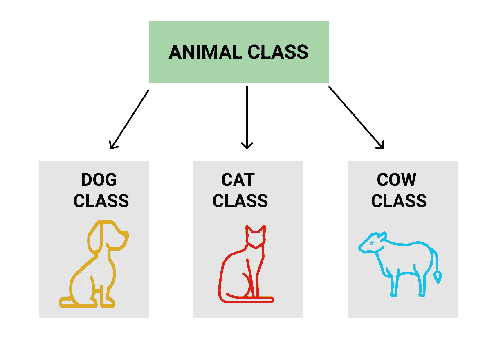

# Java 类和对象

> 原文：<https://levelup.gitconnected.com/java-classes-and-objects-a312db4bc785>


一个类可以被认为是一组描述某些东西的蓝图。从这组蓝图中，可以做出个别的例子。这些例子通常称为实例，是单个对象。

如果以宠物为例，我们可以用一个类来概括描述宠物。这门课将会告诉我们，一只宠物应该有一个名字，一个年龄，一个种类，以及其他一些信息。只有在创建一个类的实例时，我们才能获得这些信息的细节。举个例子，我们从知道并期望一只宠物有名字、年龄和种类，到知道我们在谈论一只 7 岁的狗，名叫 Baby。

使用以下格式定义类。

```
public class ClassName {
   public static void main(String[] args) {
      //class information
   }
}
```

public 关键字是一个访问级别修饰符。它决定了其他类将如何与这个类交互。void 关键字告诉系统我们不希望返回一个值。如果我们想返回一个结果，那么我们使用其中一个数据类型关键字。代码的 main()部分是一个方法。程序执行的任务在 main 方法中列出。这段代码在编译类文件时执行。

创建类时，使用构造函数。构造函数是一组关于如何创建类实例的特定指令。每次创建类的实例时都会调用它。

```
public class Pet {
   public Pet() { }
   public static void main(String[] args) { }
}
```

为了启动一个新实例，我们在代码中添加了以下内容。

```
public class Pet {
   public Pet() { }
   public static void main(String[] args) {
      Pet pet1 = new Pet();
   }
}
```

现在我们已经有了宠物类的基本知识，我们可以开始填充更具体的信息了。这些信息被称为属性。为此，在类中和构造函数之前，我们声明我们将使用哪些属性。在构造函数内部，我们可以使用参数来帮助给这些属性赋值。在构造函数中，参数必须指定将分配给实例属性的名称和数据类型。

```
public class Pet {
   String name;
   String species;
   int age; public Pet(String petName, String petSpecies, int petAge) {
      name = petName;
      species = petSpecies;
      age = petAge;
   } public static void main(String[] args) {
      Pet pet1 = new Pet(“Baby”, “Dog”, 7);
   }
}
```

我们现在有一个名为 pet1 的对象，这个对象是一只名为 Baby 的 7 岁狗。有关婴儿的信息可以通过以下方式获取。

```
pet1.name
//Baby
pet1.age
//7
```

# 方法

上一节介绍了将信息分配给类及其产生的对象的方式。方法赋予类和对象行为。它们允许对象及其包含的信息被使用和修改。方法是在类内部创建的。

以我们之前的宠物为例，如果我们想和一只宠物玩，方法可能是这样的。

```
public void play(){
   System.out.println(“Playing with “ + name + “!”);
}
```

一旦定义了一个方法，就可以在 main 方法中调用它。使用以下格式调用方法。

```
instanceName.methodName();pet1.play();
//Playing with Baby!
```

# 遗产

在我们深入研究继承之前，有几个术语很重要，父类和子类。父类也称为超类，是其他类继承的类。子类，也称为子类，是从另一个类继承而来的类。父类为对象创建一个更通用、更全面的模型，而子类可以在这个基本模型上扩展，以包括更具体的信息，这些信息可能不适用于可以用父类创建的其他对象。

例如，可能有一个名为 animal 的父类。有许多关于动物的信息可以应用于许多不同的动物对象。然而，不同类型的动物可能彼此有很大的不同。狗和鸟非常不同。虽然它们确实有可以在动物父类中表示的相似性，但是这些动物类型中的每一个的例子都是非常不同的，因此有不同的子类来捕获并允许更详细地表示这些不同类型的动物可能是有帮助的。



为了使子类从父类继承，使用了 extends 关键字。

```
class Animal {
   //Animal class information
}class Dog extends Animal {
   // Dog class information
}
```

当子类从父类继承时，父类的所有变量和方法都传递给子类。尽管父类可以为子类绘制一个非常有用的蓝图，但有时这个蓝图并不完全匹配。因此，子类中的信息可能会被覆盖。super 方法内置于子类中，允许子类访问父类的构造函数。super 是类信息被覆盖的地方。

若要重写方法，可以在子类中编写与父类中的方法同名的方法，方法中包含不同的可执行代码。当子类重写其父类的方法时，在该方法的代码之前，必须编写以下代码。

```
@Override
```

另一方面，有时我们不希望信息被覆盖。解决这个问题的一个方法是在方法的访问修饰符前添加关键字 final。对父方法这样做意味着该方法被应用到子类，并且使用与父类中相同的功能和信息来完成。

# 结论

类是生成模块化可重复代码的一种很好的方式。Java 中的类和对象的使用允许开发人员容易地创建对象的蓝图，并从该蓝图制作可定制的对象。这些对象是用允许使用和修改这些对象的方法完整创建的。