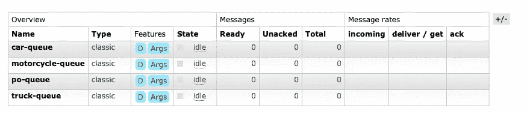

# Docker 的 Java 配置

> 原文：<https://levelup.gitconnected.com/java-configuration-for-docker-779392774caa>

## 环境变量是如何胜出的


图片由[史蒂夫·比辛尼](https://pixabay.com/users/stevepb-282134/?utm_source=link-attribution&utm_medium=referral&utm_campaign=image&utm_content=880735)从[皮克斯拜](https://pixabay.com/?utm_source=link-attribution&utm_medium=referral&utm_campaign=image&utm_content=880735)拍摄

Docker 做了不可思议的事情:它让每个人都同意一个平台。即使你在 Mac 或 Windows 机器上运行 Docker，后台也潜伏着一个 Linux 虚拟机。当我还是一个非常年轻的程序员时，我的经理问我们两个人，公司应该专注于哪个平台作为服务器。我说了一些 Un*x 的变体，比如当时非常流行的 BSD，而我的同事说是 Windows NT。我想我们都错了，但我是最接近的，因为 Linux 是 Un*x 的一个变种，可以说它像病毒一样传播开来。

当我刚开始做 Java 开发人员时，有人警告我不要使用环境变量，因为它们会降低程序的可移植性，并且更加依赖于环境。所以对我来说，我 Java 生涯的大部分都是关于属性文件的。我花了一段时间来适应这个想法，我可以，事实上，应该再次为 Docker 下运行的任何东西使用环境变量。

虽然您仍然可以通过将外部配置文件映射到您的容器中来使用它们，但这看起来相当混乱，并且更适合于我们不想更改的现有应用程序。对于新的应用程序，为什么不利用 Linux 和 Docker 统一支持的环境变量呢？

这对于 Kubernetes 尤其方便，在 Kubernetes 中，秘密属性可以包含在秘密实体中，并在 pod 启动时映射到环境变量。秘密实体可以在各种部署之间共享，这样包含数据库用户名和密码的相同秘密可以被数据库(如果它在 Kubernetes 下运行)和应用程序使用，确保每个人都有相同的信息。非秘密环境变量可以类似地存储在`ConfigMap`实体中。此外，这些实体中的每一个都可以为需要不同环境变量的不同环境命名。

在我正在进行的演示现代 [Java 微服务](/how-to-move-from-monolith-to-microservices-74f2f996964b)的系列文章中，我的上一篇文章停止了，因为我们没有将所使用的服务、数据库和消息队列结合在一起的配置。我们启动了服务，但它们很快就失败了，因为它们不知道如何从不同的 docker 容器与 RabbitMQ 和 Couchbase 对话。这是一个相对简单的问题，但我想正确地解决它，着眼于在 Kubernetes 下运行它。

我喜欢 Spring 配置的一点是它对属性的分层解析。因此，您可以拥有一个带有任何默认值或很少更改的配置的`application.properties`文件，但是它们会被环境变量覆盖。不仅被覆盖，而且被映射，这样你的属性看起来像 Java 属性，你的环境变量看起来像环境变量。你的最终属性都是小写的，用点分隔成一个层次结构。但是您的环境变量被映射，因此`SOME_VALUE`成为属性`some.value`。

到目前为止，我已经能够在我的一套微服务中避免 Spring 及其所有的膨胀，我希望保持这种方式。快速浏览一下 Java 配置库并没有给我想要的东西。我不希望配置试图解析字符串或验证值，这是微不足道的，可以在您的应用程序中。我不想填充配置对象，因为它们把不相关的值放在一个对象中，违反了单一责任原则。在大多数情况下，需要复杂配置的东西已经有了某种类型的配置对象，我可以简单地将解析的属性直接读入这些对象。我想要的只是一种简单的方法来读取属性文件并覆盖环境中的值。

因此，我将创建一个简单的配置解析器，它将尝试从属性文件中读取数据，然后在这些数据之上映射环境变量。它还应该对任何前缀为“$”的内容进行变量替换。它不会解析任何类型，只会返回一个`Optional<String>`。这是我想到的:

```
public final class DefaultEnvironmentProperties 
        implements EnvironmentProperties {
  private final Map<String, String> map;
  private final static Pattern REPLACEMENT_PATTERN 
         = Pattern.compile("([$][$])|([$][{].*[}])|([$]\\w+)");

  public DefaultEnvironmentProperties() {
        Map<String, String> tempMap;
    try(InputStream is = DefaultEnvironmentProperties
                .class
                .getResourceAsStream("/application.properties")) {
      Properties properties = new Properties();
      properties.load(is);
      tempMap = properties
                    .entrySet()
                    .stream()
                    .collect(Collectors
                            .toUnmodifiableMap(
                                    e -> (String)e.getKey(), 
                                    e -> (String)e.getValue())); } catch(IOException ex3) {
      tempMap = new HashMap<>();
    }
    map = resolvePlaceHolders(addEnvironment(tempMap));
  } public Optional<String> getEnvironmentProperties(String key) {
    return Optional.ofNullable(map.get(key));
  } private static Map<String, String> resolvePlaceHolders(
            final Map<String, String> mapin) {
    return mapin.entrySet()
          .stream()
          .collect(Collectors
              .toUnmodifiableMap(
                        Map.Entry::getKey, 
                        e -> replaceValue(e.getValue(), mapin)));
  }

  private static String replaceValue(
        final String value, 
        final Map<String, String> mapin) {
    return REPLACEMENT_PATTERN.matcher(value).replaceAll(mr -> {
      String ret = null;
      String item = mr.group();
      if("$$".equals(item)) {
        ret = "\\$";
      } else if(item.startsWith("${") && item.endsWith("}")) {
        ret = mapin.get(item.substring(2, item.length()-1));
      } else if(item.length() > 1) {
        ret = mapin.get(item.substring(1));
      }
      if(ret == null) {
        throw new RuntimeException(
                   "Unable to find replacement value for mr "
                   + mr.group());
      }
      ret = replaceValue(ret, mapin);
      return ret;
     });
   }

  private static Map<String, String> addEnvironment(
            final Map<String, String> mapin) {
    Map<String, String> temp = new HashMap<>(mapin);
    System.getenv().entrySet().forEach(e -> {
        String mappedKey = e.getKey()
           .toLowerCase()
           .replace('_', '.');
        temp.put(mappedKey, e.getValue());
    });
    return Map.ofEntries(temp.entrySet()
                .toArray(new Map.Entry[temp.entrySet().size()]));
  }

}
```

为了 KISS 原则的利益，我只尝试从类路径中读取一个文件‘application . properties’。然后我把所有的环境变量都映射到上面。我允许用' $ '或' ${} '替换，用' $$ '转义' $ '。属性的最终映射是不可修改的。

## 设置服务以使用配置

对于每个服务，我在每个服务类的顶部添加了一个部分:

```
private static final EnvironmentProperties env = 
          new DefaultEnvironmentProperties();
private static final String DATABASE_USER_NAME = 
            env.getEnvironmentProperties("database.user.name")
               .orElseThrow();
private static final String DATABASE_HOST_NAME = 
            env.getEnvironmentProperties("database.host.name")
               .orElseThrow();
private static final String DATABASE_PASSWORD  = 
            env.getEnvironmentProperties("database.password")
               .orElseThrow();
private static final String DATABASE_BUCKET_NAME_PO = 
            env.getEnvironmentProperties("database.bucket.name.po")
               .orElseThrow();
private static final String QUEUE_HOST_NAME  = 
            env.getEnvironmentProperties("queue.host.name")
               .orElseThrow();
private static final String QUEUE_PORT = 
            env.getEnvironmentProperties("queue.port")
               .orElseThrow();
private static final String QUEUE_USER_NAME = 
            env.getEnvironmentProperties("queue.user.name")
               .orElseThrow();
    private static final String QUEUE_PASSWORD = 
            env.getEnvironmentProperties("queue.password")
               .orElseThrow();
private static final String QUEUE_TOPIC_PO = 
            env.getEnvironmentProperties("queue.topic.po")
               .orElseThrow();
private static final String QUEUE_TOPIC_CAR = 
            env.getEnvironmentProperties("queue.topic.car")
               .orElseThrow();
    private static final String QUEUE_TOPIC_TRUCK = 
            env.getEnvironmentProperties("queue.topic.truck")
               .orElseThrow();
private static final String QUEUE_TOPIC_MOTORCYCLE = 
            env.getEnvironmentProperties("queue.topic.motorcycle")
               .orElseThrow();
```

我觉得这只是比春天的`Value`注解略显冗长。您可以通过用`orElse(“default value”)`替换`orElseThrow()`来设置这个级别的默认值，但是我喜欢将配置保存在配置文件中。所以我创建了一个文件`application.properties`，并用适用于测试的默认值填充它:

```
queue.host.name=localhost
queue.port=5672
queue.user.name=guest
queue.password=guest
queue.topic.po=po-queue
queue.topic.car=car-queue
queue.topic.motorcycle=motorcycle-queue
queue.topic.truck=truck-queuedatabase.host.name=localhost
database.user.name=admin
database.password=admin123
database.bucket.name.po=po
database.bucket.name.car=car
```

其中许多预期会被配置到`docker-compose.yaml`或 Kubernetes 描述符文件中的环境变量覆盖。我们可以从 docker compose 开始进行本地测试。下面是我的`docker-compose.yaml`:

```
version: '3'
services:
  couchbase:
    image: couchbase
    restart: always
    ports:
      - 11210:11210
      - 8091-8094:8091-8094
  myrabbit:
    image: rabbitmq:3-management
    restart: always
    ports:
      - 5672:5672
      - 8080:15672
  purchase-order-consumer:
    image: rlkamradt/purchaseorderconsumer:1.0-SNAPSHOT
    environment:
      DATABASE_HOST_NAME: couchbase
      QUEUE_HOST_NAME: myrabbit
    depends_on:
      - "couchbase"
      - "myrabbit"
  car-consumer:
    image: rlkamradt/carconsumer:1.0-SNAPSHOT
    environment:
      DATABASE_HOST_NAME: couchbase
      QUEUE_HOST_NAME: myrabbit
    depends_on:
      - "couchbase"
      - "myrabbit"
  truck-consumer:
    image: rlkamradt/truckconsumer:1.0-SNAPSHOT
    environment:
      DATABASE_HOST_NAME: couchbase
      QUEUE_HOST_NAME: myrabbit
    depends_on:
      - "couchbase"
      - "myrabbit"
  motorcycle-consumer:
    image: rlkamradt/motorcycleconsumer:1.0-SNAPSHOT
    environment:
      DATABASE_HOST_NAME: couchbase
      QUEUE_HOST_NAME: myrabbit
    depends_on:
      - "couchbase"
      - "myrabbit"
```

这应该可以启动一切，但是我们应该按照特定的顺序启动。首次运行`docker-compose up -d myrabbit`。等待几秒钟启动，然后管理控制台应该位于 [http://localhost:8080/](http://localhost:8080/)


我们需要创建队列，因为它们不再是由代码创建的。因此，在标题“添加一个新队列”下，键入名称，其他一切保持默认，然后按“添加队列”按钮。

添加`po-queue`、`car-queue`、`truck-queue`、`motorcycle-queue`，您应该有一个列表，如下所示:



注意，只要不移除`myrabbit`容器，这些队列就会持续存在。如果删除容器，您将必须重新创建它们。

接下来，我们可以用这个命令`docker-compose up -d couchbase`启动 Couchbase。然后，您可以在这里浏览到它的管理控制台 [http://localhost:8091/](http://localhost:8091/) 使用 admin/admin123 的用户名/密码创建一个名为“cluster”的新集群，其他都是默认值，并接受服务条款。转到“桶”并按下“添加桶”按钮。创建一个名为`po`和`car`的桶(记住，我们从来没有更新过摩托车和卡车消费者来保存他们的实体)，有 1024 兆字节的空间。您的屏幕应该是这样的:


就像 myrabbit 服务一样，除非您移除`couchbase`容器，否则这些都将被保存。

接下来创建并提取图像。因为我们使用 Google Jib 来创建图像，所以它们在本地不可用，直到它们被从您使用的任何容器存储库中取出(在我的例子中是 Docker Hub)。运行以下命令:

```
mvn clean package jib:build
docker-compose pull purchase-order-consumer
docker-compose pull car-consumer
docker-compose pull truck-consumer
docker-compose pull motorcycle-consumer
```

现在，我们应该能够像这样启动其余的消费者服务:

```
docker-compose up -d purchase-order-consumer
docker-compose up -d car-consumer
docker-compose up -d truck-consumer
docker-compose up -d motorcycle-consumer
```

您可以使用以下命令检查其中一个使用者的日志

```
docker-compose logs purchase-order-consumer
```

注意，我们没有为测试生成器创建图像。我们可以直接运行它，然后查看不同的用户日志以确保它全部运行。回到 NetBeans 内部，我可以运行 TestGenerator 模块，然后与来自所有不同服务的日志进行比较。

与上一篇文章唯一真正的不同是，我们更改了 Couchbase 和 RabbitMQ 服务的主机，以便从 Docker Compose 生成的子网内部引用它们。我们没有更改用户名或密码；我们仍在使用测试版本。在我的下一篇文章中，我们将把所有这些都转移到 Kubernetes，并充分利用 Secret 和 ConfigMap 描述符，使整个事情更适合生产。

GitHub 上这篇文章的代码:

[](https://github.com/rkamradt/usedvehicles/tree/v0.7) [## rkamradt/二手车辆

### Permalink 无法加载最新的提交信息。整个第一阶段使用电抗组件的微服务系统示例…

github.com](https://github.com/rkamradt/usedvehicles/tree/v0.7) 

本系列的前一篇文章:

[](/how-to-move-from-monolith-to-microservices-74f2f996964b) [## 如何从整体服务转向微服务

### 分解岩石。

levelup.gitconnected.com](/how-to-move-from-monolith-to-microservices-74f2f996964b)