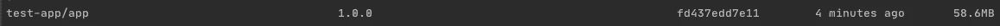

# Java:用 jdeps 和 jlink 开发更小的 Docker 图像

> 原文：<https://levelup.gitconnected.com/java-developing-smaller-docker-images-with-jdeps-and-jlink-d4278718c550>

> *技术栈:Java 17，Docker，Gradle*


图 1:用 Java 构建较小的 Docker 映像时创建定制 JRE 的管道。

随着容器和不可变基础设施的兴起，拥有大型动态虚拟机的一些好处已经丧失。不再需要有一个可以运行任何 Java 应用程序的扩展的运行时，因为您现在可以使用自己的环境测试和发布您的应用程序，从 JVM 一直到 OS。您也倾向于确切地知道您的应用程序将使用运行时的哪些部分；当我们运行一个服务器端应用程序时，为什么我们要包含(甚至要考虑)Java Swing 库呢？

所有这些都意味着，与一些更具云原生特性的替代方案相比，Java 可能会显得有些臃肿和困难。那么，我们如何才能运送更小、更轻量级的容器，只包含我们运行应用程序明确需要的东西，同时仍然从 Java 生态系统中受益呢？

这是 2 个新工具被创建并随 JDK 一起发布的地方: **jdeps** 和 **jlink** 。

> Jdeps 负责分析 JAR 及其依赖项，并识别运行应用程序所需的 JVM 部分。它可以将其输出到一个文本文件，然后由 **jlink** 使用。
> 
> Jlink 获取一个 JVM 模块列表，并构建一个定制的 JVM，只包含那些存在的部分。根据您的应用程序，这显然可以削减运行时的大部分，减少您的总体 Docker 图像大小。

在本指南的其余部分，我们将执行以下操作:

1.  设置一个 Gradle 项目，其中我们构建并打包了一个 Java 应用程序。
2.  将 Docker 与 Gradle 集成，这样我们就可以使用 Gradle 工具来构建我们的应用程序。
3.  构建一个多阶段 Docker 文件，利用 jdeps 和 jlink 来显著减小我们最终的 Docker 图像大小。

## 步骤 1:创建起始 Gradle 项目

> 确保您已经安装了 gradle，或者已经有了 gradle 项目设置。

首先，我们将创建一个空的 Gradle 项目，然后构建 docker 文件来打包并运行一个简单的命令行应用程序。

为要存储的应用程序创建一个文件夹，然后从文件夹位置的终端运行以下命令:

```
gradle init --type java-application
```

这将为您提供几个选项。对本指南来说，没有什么太重要的，但这里是我选择的参考。


图 2:创建一个空的 gradle 项目。选择 Groovy、JUnit Jupiter 和一个项目名 test-app。

以此为起点，转到 **build.gradle** 文件，并将此起始代码复制到:

```
plugins **{** id 'java-library'
**}** sourceCompatibility = '11'
version = '1.0.0'repositories **{** mavenCentral()
    mavenLocal()
**}** dependencies **{** implementation 'org.slf4j:slf4j-api:1.7.30'
    implementation 'org.apache.logging.log4j:log4j-api:2.11.1'
    implementation 'org.apache.logging.log4j:log4j-core:2.11.1'
    implementation 'org.apache.logging.log4j:log4j-slf4j-impl:2.11.1'

    testImplementation 'org.junit.jupiter:junit-jupiter-api:5.6.2'
    testRuntimeOnly 'org.junit.jupiter:junit-jupiter-engine'
**}** tasks.named('test') **{** // Use junit platform for unit tests.
    useJUnitPlatform()
**}**
```

上述代码执行以下操作:

*   提供与 Gradle 的基本 Java 兼容性。
*   添加 log4j 依赖项，这样当我们在以后的步骤中运行 jdeps 时，我们就有了要分析的依赖项。

要在我们的应用程序中使用 log4j，请转到 **app/src/main/resources** 并添加以下 **log4j2.xml** 文件:

```
<?xml version="1.0" encoding="UTF-8"?>
<Configuration status="WARN">
    <Appenders>
        <Console name="Console" target="SYSTEM_OUT">
            <PatternLayout pattern="%d{HH:mm:ss.SSS} [%t] %-5level %logger{36} - %msg%n"/>
        </Console>
    </Appenders>
    <Loggers>
        <Root level="INFO">
            <AppenderRef ref="Console"/>
        </Root>
    </Loggers>
</Configuration>
```

这意味着当我们添加任何信息级别的日志时，它们都会出现在控制台中。

最后，进入 **src/main/java/…/App.java** ，添加以下内容:

```
package test.app;

import org.slf4j.Logger;
import org.slf4j.LoggerFactory;

public class App {

    private static final Logger *LOG* = LoggerFactory.*getLogger*(App.class);

    public String getGreeting() {
        return "Hello World!";
    }

    public static void main(String[] args) {
        *LOG*.info("hello, the application has started");

        *LOG*.error(new App().getGreeting());

        *LOG*.info("the application is now complete");
    }
}
```

这意味着当我们运行我们的应用程序时，结合我们的 log4j 配置，我们将在退出之前向控制台打印一些消息。

实施这些更改后，您应该能够运行以下命令:

```
./gradlew clean check
```

您应该会看到一个不错的“BUILD SUCCESSFUL”消息，这意味着您已经正确地初始化了起始项目，我们已经准备好继续构建一个可执行的 JAR 了。

## 步骤 2:创建可执行的 JAR

为了使用 jdeps，对于本指南，我们需要将我们的应用程序打包成一个可执行的 JAR。然后，我们需要将它的所有依赖项复制到一个单独的文件夹中。

为此，将以下任务添加到您的 **build.gradle** 文件中:

```
// copies all the jar dependencies your app needs to the lib folder
task copyDependencies(type: Copy) **{** from configurations.runtimeClasspath
    into "$buildDir/lib"
**}** // creates your manifest file within the JAR
jar **{** manifest **{** attributes["Main-Class"] = "test.app.App"
        attributes["Class-Path"] = configurations.runtimeClasspath.collect **{** 'lib/' + it.getName() **}**.join(' ')
    **}
}**
```

这将执行以下操作:

*   将所有应用程序依赖项复制到 **app/build/lib** 目录。这意味着当我们想要运行 jdeps 时，我们可以告诉它在解析依赖项时要使用的文件夹。
*   将 jar 中的主类设置为保存主方法的类。如果您创建了不同的包结构，请确保将其更新以匹配。
*   设置 jar 的类路径，因此当这个 JAR 运行时，它将在 **lib/** 文件夹中寻找依赖项。这意味着我们不构建一个胖 jar，而是设置可以找到所有外部 jar 的位置，然后在运行时和运行 jdeps 工具时使用这个位置。

有了这个设置，我们就可以开始集成 Docker 了。

## 步骤 3:集成 Docker

将 Docker 集成到我们的应用程序中的第一步是提供一种将 docker build 命令作为 Gradle 任务运行的方法。这意味着我们可以使用 Gradle 来确保依赖步骤在 docker 被调用之前被执行(例如，确保 JAR 和依赖项被构建并复制到正确的位置，然后被复制到 Docker 映像中)。

为此，将以下任务添加到您的 **build.gradle** 文件中:

```
// builds the docker image, tagging it with the same group id, name, and version as the JAR
task buildDocker(type: Exec) **{** dependsOn copyDependencies, build
    workingDir "$projectDir"
    commandLine 'docker', 'build', '--rm', '.', '-t', "$project.group/$project.name:$project.version", "-f", "$projectDir/src/main/docker/Dockerfile"
**}**// runs the docker image
task runDocker(type: Exec) **{** dependsOn buildDocker
    workingDir "$projectDir"
    commandLine 'docker', 'run', "$project.group/$project.name:$project.version"
**}**
```

这些任务将完成以下任务:

*   buildDocker:确保应用程序已构建且 copyDependencies 已运行。然后它调用 docker build 命令，在**app/src/main/docker/Dockerfile 中查找 docker file。**
*   runDocker:简单地确保 buildDocker 已经运行，然后在新构建的映像上调用 docker run 命令。

接下来，在**app/src/main/docker/docker file**中创建 **Dockerfile** ，添加起始内容:

```
####
# This Dockerfile is used to package the yak-server application
#
# Build the image with:
#
# ./gradlew buildDocker
#
###

FROM openjdk:17-alpine AS *jre-build* WORKDIR /app

# copy the dependencies into the docker image
COPY build/lib/* build/lib/

# copy the executable jar into the docker image
COPY build/libs/app-*.jar build/app.jar

# tempoarily test our JAR works when we run the image
WORKDIR /app/build
ENTRYPOINT java -jar app.jar
```

至此，您应该能够从项目的根目录运行了:

```
./gradlew clean runDocker
```

您应该会看到以下情况:

*   这个 JAR 被编译并放在 **app/build/libs** 目录中。
*   JAR 依赖项被复制到 **app/build/lib** 目录。
*   构建 Docker 映像，将这两个目录复制到其中。
*   Docker 图像已运行，您可以看到我们的 Hello World！输出到控制台。


这意味着我们现在已经准备好开始使用 jdeps 和 jlink 优化 Dockerfile 了。

**重要提示:**在我们开始优化之前，最好知道我们从哪里开始。现在，我们拥有了正常运行该应用程序所需的一切，但是如果我们看看 docker 图像的大小:

```
docker images
```

您将看到类似于以下内容的内容:


这表明我们有大约一个 **330Mb** 的 docker 映像用于这个命令行应用程序。记住这一点，让我们看看通过使用新的工具，我们可以使它变得多小。

# 步骤 4:使用 jdeps 和 jlink 创建一个较小的 Docker 图像

## 使用 jdeps 找到您需要的 JVM 模块

因为我们现在在 Dockerfile 中有了一个起点，在这里我们可以访问我们想要运行的 JAR 及其依赖项，我们现在可以调用 jdeps 来分析这些并输出我们在运行时需要的 JVM 部分。

为此，请编辑 docker 文件，使其包含以下内容:

```
####
# This Dockerfile is used to package the yak-server application
#
# Build the image with:
#
# ./gradlew buildDocker
#
###

FROM openjdk:17-alpine AS *jre-build* WORKDIR /app

# copy the dependencies into the docker image
COPY build/lib/* build/lib/

# copy the executable jar into the docker image
COPY build/libs/app-*.jar build/app.jar

# find JDK dependencies dynamically from jar
RUN jdeps \
# dont worry about missing modules
--ignore-missing-deps \
# suppress any warnings printed to console
-q \
# java release version targeting
--multi-release 17 \
# output the dependencies at end of run
--print-module-deps \
# specify the the dependencies for the jar
--class-path build/lib/* \
# pipe the result of running jdeps on the app jar to file
build/app.jar > jre-deps.info

# temp print jdeps output
ENTRYPOINT cat /app/jre-deps.info
```

您现在可以看到我们用以下代码调用 jdeps:

*   我们的目标是哪个版本的 Java(在这个例子中是 17，它与我们正在构建的基本 docker 映像相匹配)。
*   在哪里可以找到 JAR 的依赖项。
*   最后，我们将命令的输出通过管道传输到一个文件 **jre-deps.info** ，现在我们只是在 docker 映像运行时将它打印到控制台。

这样，运行 docker 映像:

```
./gradlew clean runDocker
```

您将看到以下输出:


它以逗号分隔的列表显示了运行我们的应用程序时所需的 JVM 模块。这样，我们就确切地知道了我们的应用程序在运行时需要什么，现在我们可以考虑构建一个只包含这些部分的 JRE，从而显著减小最终 Docker 映像的大小。

## 使用 jlink 创建自定义 JRE

将 jdeps 的输出存储到文件中后，我们现在可以调用 jlink 来构建一个只包含所提供模块的定制 JRE。为此，请编辑您的 docker 文件，使其包含以下内容:

```
####
# This Dockerfile is used to package the yak-server application
#
# Build the image with:
#
# ./gradlew buildDocker
#
###

FROM openjdk:17-alpine AS *jre-build* WORKDIR /app

# copy the dependencies into the docker image
COPY build/lib/* build/lib/

# copy the executable jar into the docker image
COPY build/libs/app-*.jar build/app.jar

# find JDK dependencies dynamically from jar
RUN jdeps \
# dont worry about missing modules
--ignore-missing-deps \
# suppress any warnings printed to console
-q \
# java release version targeting
--multi-release 17 \
# output the dependencies at end of run
--print-module-deps \
# specify the the dependencies for the jar
--class-path build/lib/* \
# pipe the result of running jdeps on the app jar to file
build/app.jar > jre-deps.info# new since last time!
RUN jlink --verbose \
--compress 2 \
--strip-java-debug-attributes \
--no-header-files \
--no-man-pages \
--output jre \
--add-modules $(cat jre-deps.info)

# take a smaller runtime image for the final output
FROM alpine:latest
WORKDIR /deployment

# copy the custom JRE produced from jlink
COPY --from=*jre-build* /app/jre jre

# copy the app dependencies
COPY --from=*jre-build* /app/build/lib/* lib/

# copy the app
COPY --from=*jre-build* /app/build/app.jar app.jar

# run the app on startup
ENTRYPOINT jre/bin/java -jar app.jar
```

让我们分解我们的最终文档:

*   我们将应用程序和依赖项复制到 docker 映像中。
*   然后，我们运行 jdeps 来找出这个特定应用程序所需的 JRE 模块。
*   我们运行 jlink 为这个特定的应用程序构建一个定制的、精简的 JRE。
*   我们采用一个新的运行时映像，利用 dockers 的多阶段构建过程。这张图片来自阿尔卑斯山:最新的 so 非常小。
*   我们将自定义的 JRE、应用程序及其依赖项复制到这个最终的精简映像中。
*   我们设置入口点来使用 jlink 产生的 JRE 运行我们的应用程序。

如果您正确地复制了下面的代码，您将看到应用程序启动并打印“Hello World！”运行时记录消息:

```
./gradlew clean runDocker
```

因此，我们的应用程序成功地在 Docker 中运行，但大问题仍然存在…经过所有这些麻烦后，我们最终的 Docker 图像会小多少？

目前，在我的机器上，我最终的 docker 图像大小是: **58.6mb**

```
docker images
```



这超过了 **250mb** 比我们开始的原始图像小！

我希望本指南已经向您展示了如何用最少的工作创建一个最小化的 Docker 映像来运行一个标准的 Java 应用程序。

> 快速补充说明:有时候 jdeps 工作起来很痛苦，尤其是当你有一个复杂的类路径时。您总是可以手工设计出您需要的模块，并简单地将它传递给 jlink 命令。您可能得不到最佳的图像，但与运行完整的 JRE 相比，这是一个显著的改进。

如果您对这种方法有任何疑问，请随时联系我。

[](https://www.linkedin.com/in/joe-honour-8693029a/) [## Joe Honour -高级软件工程师-和数字| LinkedIn

### 查看 Joe Honour 在全球最大的职业社区 LinkedIn 上的个人资料。乔有 6 份工作列在他们的…

www.linkedin.com](https://www.linkedin.com/in/joe-honour-8693029a/)