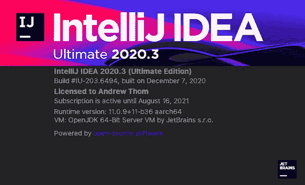

# 苹果芯片上的 Java 开发

> 原文：<https://levelup.gitconnected.com/java-development-on-apple-silicon-1a58e4d878a3>

关于 IntelliJ IDEA 的屏幕，显示它在 Apple Silicon 上自然运行

*文末 2020 年 12 月 18 日起用苹果硅原生节点更新。*

12 月 15 日，我注意到 [MacStadium](https://www.macstadium.com/) 的数据中心有苹果 M1 驱动的 Mac mini[。以每月 99 美元的价格，你可以租用一台 8 核、8GB 内存、256GB 固态硬盘的 Mac。作为一名好奇的 Java 工程师，我知道我必须试一试。下面是我的经验。](https://www.macstadium.com/m1-mini)

首先，我是一名单独的 Java 开发人员，为一家食品制造公司开发内部软件工具。我的主要开发环境是 IntelliJ IDEA，用的是 JDK8 和 Kotlin 1.4。我还为这个应用程序做前端开发，它使用 Webpack 做缩小和所有的事情。所有这些都是使用一个 Maven 脚本构建的，它将所有内容打包到一个易于部署到 AWS 的大容器中。我目前的主要开发机器是一台 27 英寸 iMac，配有英特尔酷睿 i9 (10 核)和 64GB 内存，是我在上次更新 iMac 后于 8 月份刚买的。

我知道在试图让这个东西建立在苹果硅 Mac 上的过程中会有一些颠簸。多亏了 Azul，他们的 OpenJDK 的 [Zulu 版本已经在 ARM](https://www.azul.com/downloads/zulu-community/?os=macos&architecture=arm-64-bit&package=jdk) 上运行了(Java 8、11 和 13 可用，还有 Java 16 的早期版本)。下载 DMG，安装程序将 JDK 放到正确的位置，Java 在一分钟内就可以在 ARM 上本地运行了。接下来是让构建运行起来。一切似乎进展顺利，直到我到了它试图下载节点二进制文件的部分。因为它正在检测 ARM CPU，所以它正在生成一个不存在的 Darwin ARM64 版本节点的下载链接。我找到了我使用的插件 [frontend-maven-plugin](https://github.com/eirslett/frontend-maven-plugin) ，对代码做了一些快速修改，以便在 Apple Silicon 上使用 x64 二进制文件(并添加了一个日历事件来提醒我每周检查 Apple Silicon 原生二进制文件，以便我们可以在它们可用时再次更新插件)，提交了一个 pull 请求，谢天谢地，开发者接受了它，并在几个小时内发布了新版本。谢谢， [Eirik](https://github.com/eirslett) ！

一旦我更新了我的 Maven 文件来使用新版本的插件，它就可以工作了。我运行了构建，它飞了起来。来自一台 64GB、10 核的 Mac，我预计 M1 的机器在速度上会落后一点。但我确实错了。在我的 iMac 上运行一个生产版本，包括完全缩小，通常需要 1:40 左右。所以我想在 M1 Mac 上大概需要 2-2.5 分钟。但是，令我惊讶的是，M1 Mac 实际上击败了 10 核 iMac，以 1:14 的速度运行了一个生产版本。现在，回过头来看，我们知道 M1 具有基于基准的荒谬的单核性能，我应该意识到这会有所不同。但我没想到 700 美元的 Mac mini 的性能会与我 4500 美元、内存是 Mac mini 8 倍的 iMac 相当。我印象深刻。然后我想起节点二进制文件是 x64 版本，这意味着这个过程的一部分是通过 Rosetta 转换层运行的。所以，我认为一旦有了 macOS 的 ARM 版本，这个速度会更快。我的反应:哇。

作为一个使用 IntelliJ 的人，我很好奇它将如何在苹果芯片上运行。我真的不确定。在摆弄了一些设置，试图让 x64 版本在祖鲁 JDK 上运行(没有成功，但我知道这是可以做到的)之后，我看了看 JetBrains 运行时的 [YouTrack 问题及其在苹果芯片上运行的进展](https://youtrack.jetbrains.com/issue/JBR-2526)。在过去的几个月里，我经常检查这一点，以了解进展情况，我注意到现在有 IntelliJ IDEA 2020.3(旗舰版和社区版)的版本可供测试。我下载了终极版，在第一次启动时，它给了我一个错误，说 JDK11 必须可用。所以，我回到祖鲁 JDK 下载页面，下载 JDK11，安装它，并启动 IntelliJ，它工作了。完全正确。我打开我的项目，点击运行按钮，它就工作了。我很震惊。不到一个小时的工作(不包括等待 GitHub pull 请求被接受的时间)，我的整个开发环境都在 Apple Silicon 上运行。总的来说，这是一个相当无痛的过程。

当然，现在每个人的经历都会不同。正如 Wolfram Research 的联合创始人西奥·格雷(Theo Grey)2005 年在 WWDC 的演讲台上谈到苹果向英特尔的转变时说的那样，“你的里程数可能会有所不同。”这是一个较小的项目，我不知道它如何运行有数百万行代码的项目。但是，Apple Silicon Macs 电脑上市还不到一个月，根据我对一台电脑的快速体验，我可以说，我可以用一台 700 美元的 Mac mini 取代我 4500 美元的 iMac，用于 Java 开发。当然，我需要做更多的测试来验证这一点。但如果这就是苹果第一代苹果硅 MAC 电脑所能做到的，我迫不及待地想看看接下来会发生什么。

更新:我发现苹果芯片的 Node native 在[家酿](https://brew.sh/)上有售。我安装了它，它将苹果芯片构建降低到了 1:03，轻松击败了我的 10 核 64GB iMac。

*注意:我没有得到 MacStadium 的赞助，也没有从他们(或其他任何人)那里得到任何报酬或免费服务。*