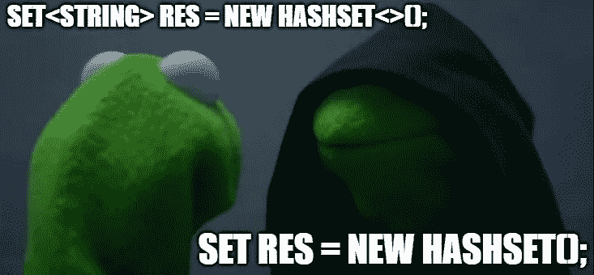
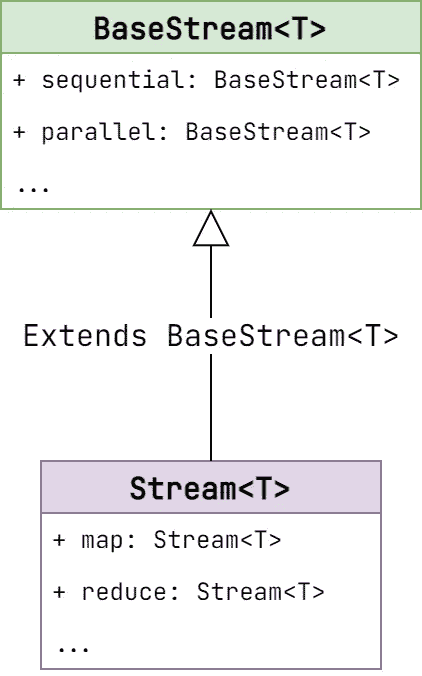
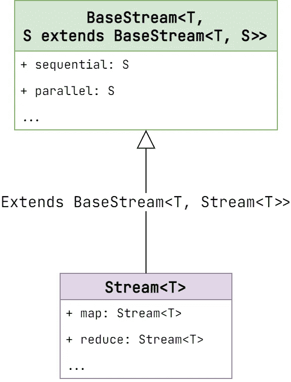

# Java 泛型—高级案例

> 原文：<https://levelup.gitconnected.com/java-generics-advanced-cases-d05db19b47d5>

今天我们将讨论如何以最有效的方式在你的代码中实现泛型。



# **不使用原始类型**

这种说法似乎显而易见。原始类型打破了泛型的整个概念。它的用法不允许编译器检测类型错误。但这不是唯一的问题。假设我们有这样的类。

通用容器

让我们假设我们不关心泛型类型本身。我们需要做的就是穿越`numbersList`。

遍历号码列表

令人惊讶的是，这段代码无法编译。

```
error: incompatible types: Object cannot be converted to int
        for (int num : container.getNumbers()) {
                                           ^
```

事情是，原始类型的使用不仅删除了关于类的泛型类型的信息，甚至还删除了预定义的信息。于是，`List<Integer>`就变成了刚刚的`List`。

我们能做些什么呢？答案很简单。如果您不关心泛型类型，请使用*通配符操作符*。

遍历号码列表。固定版本

这段代码运行得非常好。

# 首选基于通配符的输入

数组和泛型的主要区别在于，数组是 [*协变*](https://en.wikipedia.org/wiki/Covariance_and_contravariance_(computer_science)) 而泛型不是*。这意味着`Number[]`是`Integer[]`的超类型。而`Object[]`是任何数组的超类型(除了原始数组)。这似乎合乎逻辑，但它可能会导致运行时的错误。*

数组协方差的错误

这段代码可以编译，但是它抛出了一个意外的异常。泛型被用来解决这个问题。

泛型的不变性消除了可能的错误

`List<Long>`不能赋给`List<Number>`。虽然它帮助我们避免了`ArrayStoreException`，但它也给 API 设置了限制，使其不灵活且过于严格。

不灵活的 API

一切看起来都很好，不是吗？我们甚至将`Collection`作为输入参数。这使得我们可以通过`List`、`Set`、`Queue`等。但是别忘了`Employee`只是一个接口。如果我们使用特定实现的集合会怎么样？比如`List<Manager>`或者`Set<Accountant>`？我们不能直接超过他们。因此，每次都需要将元素转移到`Employee`的集合中。

或者我们可以使用通配符。

灵活的 API

正如您所看到的，正确的泛型用法使程序员的生活变得更加轻松。让我们看另一个例子。

假设我们需要为排序服务声明一个 API。这是第一次天真的尝试。

简单分类服务

现在我们有了一个不同的问题。我们必须确保`Comparator`完全是为`T`类型创建的。但事实并非总是如此。我们可以为`Employee`造一个通用的，在这种情况下，它对`Accountant`和`Manager`都不起作用。

让我们把 API 做得更好一点。

更好的分拣服务

你知道，这些限制有点令人困惑。所有这些`? extends T`和`? super T`似乎过于复杂。值得庆幸的是，有一个简单的规则可以帮助识别正确的用法— [PECS](https://howtodoinjava.com/java/generics/java-generics-what-is-pecs-producer-extends-consumer-super/) (生产者扩展，消费者超级)*。*这意味着生产者应该是`? extends T`类型，而消费者应该是`? super T`类型。

让我们来看看具体的例子。我们之前描述的方法`MoneyService.calculateAvgSalary`接受一个生产者。因为集合*产生了用于进一步计算的*元素。

另一个例子来自 JDK 标准图书馆。我说的是`Collection.addAll`。

Collection.addAll

定义上限泛型允许我们连接`Collection<Employee>`和`Collection<Manager>`或任何其他共享相同接口的类。

消费者呢？我们在`SortingService`中使用的`Comparator`就是一个完美的例子。这个接口有一个接受泛型类型并返回具体类型的方法。消费者的典型例子。其他的还有`Predicate`、`Consumer`、`Comparable`，还有很多来自`java.util`包的。大多数情况下，所有这些接口都应该与`? super T`一起使用。

还有一个独一无二的，同时是生产者和消费者。是`java.util.Function`。它将输入值从一种类型转换为另一种类型。所以，常见的`Function`用法是`Function<? super T, ? extends R>`。这可能看起来很可怕，但它确实有助于构建健壮的软件。你可以发现`Stream`界面中的所有映射函数都遵循这个规则。

流映射

> 你可能会注意到`SortingService.sort`接受`List<T>`而不是`List<? extends T>`。为什么会这样呢？这毕竟是个制作人。事实是，与预定义类型相比，上下限是有意义的。因为`SortingService.sort`方法参数化了自己，所以用界限来限制`List`是没有意义的。另一方面，如果`SortingService`有一个泛型类型，`? extends T`就会有它的值。

参数化排序服务

# 不要返回有界容器

## 上限

一些开发人员发现了有界泛型类型的强大功能，他们可能会认为这是一颗银弹。这可能会导致类似下一个代码片段。

员工信息库

这里怎么了？首先，`List<? extends Employee>`不经过造型就不能赋给`List<Employee>`。不仅如此，这个上限还设置了一些不明显的限制。

例如，我们可以将什么类型的值放入由`EmployeeRepository.findEmployeesByNameLike(String)`返回的集合中？你可能会建议是类似`Accountant`、`Manager`、`SoftwareEngineer`之类的东西。但这是一个错误的假设。

一般上限限制

这个代码片段看起来不太直观，但实际上，一切都很好。我们来解构一下这个案例。首先，我们需要确定哪些集合可以分配给`List<? extends Employee>`。

通用上限允许的集合

因此，基本上继承自`Employee`的任何类型的列表都可以分配给`List<? extends Employee>`。这使得添加新项目变得棘手。编译器无法知道列表的确切类型。这就是为什么它禁止添加任何项目，以消除潜在的堆污染。但是`null`是一个特例。该值没有自己的类型。它可以赋给任何东西(除了基本体)。这就是为什么`null`是唯一允许添加的值。

从列表中检索项目怎么样？

从上限列表中检索项目

`Emloyee`是列表可能包含的任何潜在元素的超类型。这里没有警告。

## 下限

我们可以给`List<? super Employee>`添加什么元素？逻辑告诉我们，它不是`Object`就是`Employee`。这又愚弄了我们。

一般下限限制

同样，为了解决这个问题，让我们看看哪些集合可以分配给`List<? super Employee>`。

通用下限允许的集合

编译器知道列表可以由`Object`类型或`Employee`类型组成。这就是为什么`Accountant`、`Manager`、`SoftwareEngineer`、`Employee`可以放心添加的原因。它们都实现了`Employee`接口并继承了`Object`类。同时，`Object`不能添加，因为它没有实现`Employee`。

相反，从`List<? super Employee>`开始读就没那么容易了。

从下限列表中检索项目

编译器无法确定返回的项目是否属于`Employee`类型。也许这是一个`Object`。这就是代码无法编译的原因。

## 上下界结论

我们可以恢复上限，使集合*为只读*，而下限使其*为只写。这是否意味着我们可以使用它们作为返回类型来限制客户端对数据操作的访问？我不建议这么做。*

上限集合并不完全是只读的，因为你仍然可以向它们添加。下限集合并不完全是只写的，因为你仍然可以作为一个 T1 来读取值。我认为使用特殊的容器会更好，这种容器可以提供对实例的访问。你可以使用像`Collections.unmodifiableList`这样的标准 JDK 工具，也可以使用能够完成这项工作的库(例如 [Vavr](https://docs.vavr.io/#_list) )。

上限和下限集合作为输入参数要好得多。您不应该将它们与返回类型混合在一起。

# 递归泛型

我们已经在本文中提到了递归泛型。是`Stream`接口。我们再来看看。

流映射

正如你所看到的，`Stream`从`BaseStream`扩展而来，而`BaseStream`是用`Stream`本身参数化的。它的原因是什么？让我们深入`BaseStream`一探究竟。

基本流

`BaseStream`是 [fluent API](https://en.wikipedia.org/wiki/Fluent_interface#:~:text=In%20software%20engineering%2C%20a%20fluent,Eric%20Evans%20and%20Martin%20Fowler.) 的典型例子，但不是返回类型本身，而是返回方法`S extends BaseStream<T, S>`。我们想象一下`BaseStream`的设计没有这个功能。

非递归基本流

它会如何影响整个流 API？

非递归流 API

`reduce`方法属于`Stream`但不属于`BaseStream`接口。因此`parallel`返回`BaseStream`。所以，`reduce`无法找到。这在下面的模式中变得更加清晰。



在这种情况下，递归泛型就派上了用场。



递归流 API

这种方法允许我们分离接口，从而带来更好的可维护性和可读性。

# 结论

我希望您已经学到了一些关于 Java 泛型的新知识。如果您有任何问题或建议，请在下面留下您的评论。感谢阅读！

# 资源

*   [协方差](https://en.wikipedia.org/wiki/Covariance_and_contravariance_(computer_science))
*   [胸肌](https://howtodoinjava.com/java/generics/java-generics-what-is-pecs-producer-extends-consumer-super/)
*   [Vavr 图书馆](https://docs.vavr.io/#_list)